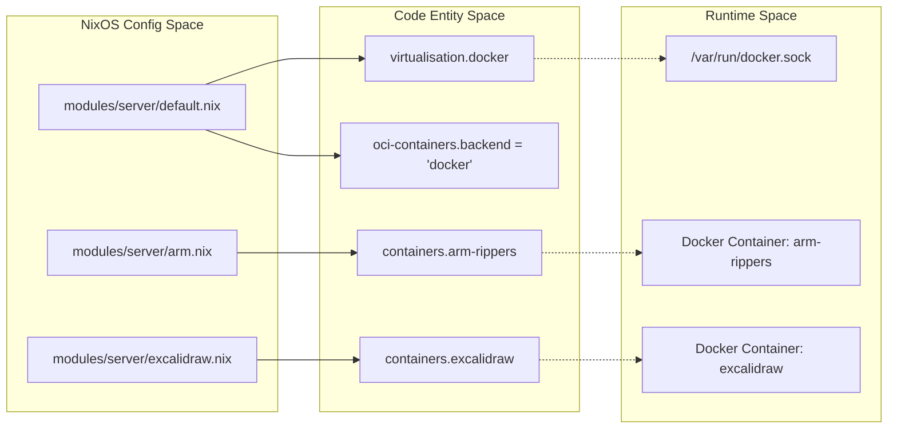
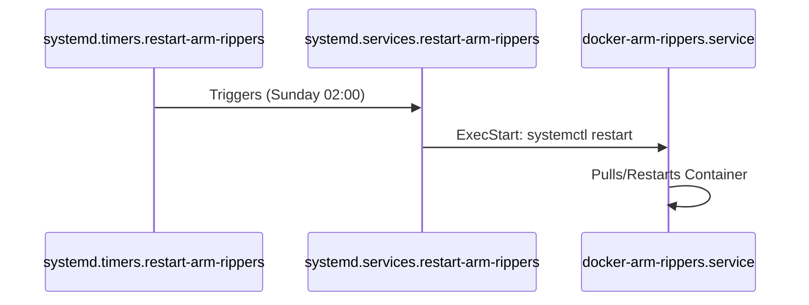

# ARM Ripper and Excalidraw
Relevant source files
- [modules/server/adguard.nix](https://github.com/Cody-W-Tucker/nix-config/blob/5a76c557/modules/server/adguard.nix)
- [modules/server/arm.nix](https://github.com/Cody-W-Tucker/nix-config/blob/5a76c557/modules/server/arm.nix)
- [modules/server/default.nix](https://github.com/Cody-W-Tucker/nix-config/blob/5a76c557/modules/server/default.nix)
- [modules/server/excalidraw.nix](https://github.com/Cody-W-Tucker/nix-config/blob/5a76c557/modules/server/excalidraw.nix)
- [modules/server/homepage-dashboard.nix](https://github.com/Cody-W-Tucker/nix-config/blob/5a76c557/modules/server/homepage-dashboard.nix)
- [modules/server/monitoring.nix](https://github.com/Cody-W-Tucker/nix-config/blob/5a76c557/modules/server/monitoring.nix)

This section covers the containerization strategy for services requiring upstream OCI images, specifically focusing on the **Automatic Ripping Machine (ARM)** for optical media processing and **Excalidraw** for collaborative whiteboarding. Both services are hosted on the `server` node and integrated into the `homehub.tv` domain via Nginx.

## Containerization Strategy

The system utilizes Docker as the backend for OCI containers, configured globally in the server module [modules/server/default.nix150-159](https://github.com/Cody-W-Tucker/nix-config/blob/5a76c557/modules/server/default.nix#L150-L159) This setup includes a `weekly` auto-pruning task to maintain disk health [modules/server/default.nix153-156](https://github.com/Cody-W-Tucker/nix-config/blob/5a76c557/modules/server/default.nix#L153-L156)

### Code-to-System Mapping: Container Infrastructure

The following diagram illustrates how NixOS declarations map to the running Docker environment on the server.

| NixOS Entity | System Identifier | Role |
| --- | --- | --- |
| `virtualisation.docker.enable` | `docker.service` | Container runtime daemon |
| `virtualisation.oci-containers.backend` | `"docker"` | NixOS OCI abstraction layer |
| `virtualisation.oci-containers.containers` | Container Name | Individual service definitions |

**Sources:**[modules/server/default.nix150-159](https://github.com/Cody-W-Tucker/nix-config/blob/5a76c557/modules/server/default.nix#L150-L159)[modules/server/arm.nix34-37](https://github.com/Cody-W-Tucker/nix-config/blob/5a76c557/modules/server/arm.nix#L34-L37)[modules/server/excalidraw.nix2-4](https://github.com/Cody-W-Tucker/nix-config/blob/5a76c557/modules/server/excalidraw.nix#L2-L4)

---

## Automatic Ripping Machine (ARM)

The ARM service automates the process of ripping DVDs, Blu-rays, and CDs. It requires specialized hardware passthrough for optical drives and GPU acceleration for transcoding.

### Hardware and Kernel Configuration

To enable optical drive access, the `sg` (SCSI Generic) kernel module is loaded [modules/server/arm.nix3](https://github.com/Cody-W-Tucker/nix-config/blob/5a76c557/modules/server/arm.nix#L3-L3) The container is granted `--privileged` status and direct access to `/dev/sr0` (optical drive) and `/dev/dri` (Intel QSV hardware acceleration) [modules/server/arm.nix51-55](https://github.com/Cody-W-Tucker/nix-config/blob/5a76c557/modules/server/arm.nix#L51-L55)

### Implementation Details

- **User Management**: A dedicated `arm` user and group are created with access to `cdrom`, `video`, and `render` groups [modules/server/arm.nix9-24](https://github.com/Cody-W-Tucker/nix-config/blob/5a76c557/modules/server/arm.nix#L9-L24)
- **Image**: Uses a `custom-arm` image, which is a committed version of the upstream ARM image with Handbrake built for Intel QSV support [modules/server/arm.nix36](https://github.com/Cody-W-Tucker/nix-config/blob/5a76c557/modules/server/arm.nix#L36-L36)
- **Persistence**: Multiple volumes are mounted for media storage, logs, and configuration [modules/server/arm.nix43-49](https://github.com/Cody-W-Tucker/nix-config/blob/5a76c557/modules/server/arm.nix#L43-L49)
- **Networking**: Proxied via Nginx at `arm.homehub.tv`[modules/server/arm.nix26-31](https://github.com/Cody-W-Tucker/nix-config/blob/5a76c557/modules/server/arm.nix#L26-L31)

### Maintenance Automation

A systemd timer is implemented to ensure the container remains stable by performing a weekly restart every Sunday at 02:00 AM [modules/server/arm.nix58-73](https://github.com/Cody-W-Tucker/nix-config/blob/5a76c557/modules/server/arm.nix#L58-L73)

**Sources:**[modules/server/arm.nix3-73](https://github.com/Cody-W-Tucker/nix-config/blob/5a76c557/modules/server/arm.nix#L3-L73)

---

## Excalidraw

Excalidraw provides a virtual whiteboard for the `homehub.tv` ecosystem. It is deployed as a lightweight OCI container.

### Service Configuration

- **Container**: Uses the `excalidraw/excalidraw:latest` image [modules/server/excalidraw.nix4](https://github.com/Cody-W-Tucker/nix-config/blob/5a76c557/modules/server/excalidraw.nix#L4-L4)
- **Environment**: Configured for the `America/Chicago` timezone [modules/server/excalidraw.nix6](https://github.com/Cody-W-Tucker/nix-config/blob/5a76c557/modules/server/excalidraw.nix#L6-L6)
- **Port Mapping**: Internal port `80` is mapped to host port `2919`[modules/server/excalidraw.nix9](https://github.com/Cody-W-Tucker/nix-config/blob/5a76c557/modules/server/excalidraw.nix#L9-L9)

### Reverse Proxy and SSL

The service is exposed via `draw.homehub.tv`[modules/server/excalidraw.nix14](https://github.com/Cody-W-Tucker/nix-config/blob/5a76c557/modules/server/excalidraw.nix#L14-L14) The Nginx configuration includes specific headers for real IP preservation and a `client_max_body_size` of `10M` to support whiteboard asset uploads [modules/server/excalidraw.nix18-24](https://github.com/Cody-W-Tucker/nix-config/blob/5a76c557/modules/server/excalidraw.nix#L18-L24)

**Sources:**[modules/server/excalidraw.nix1-28](https://github.com/Cody-W-Tucker/nix-config/blob/5a76c557/modules/server/excalidraw.nix#L1-L28)

---

## Integration with Homepage Dashboard

Both services are surfaced on the `homehub.tv` dashboard for easy access.

| Service | Category | Dashboard Icon | URL |
| --- | --- | --- | --- |
| **Excalidraw** | Business | `excalidraw` | `https://draw.homehub.tv` |
| **ARM** | Manage | `favicon.png` (ARM static) | `https://arm.homehub.tv` |

**Sources:**[modules/server/homepage-dashboard.nix94-99](https://github.com/Cody-W-Tucker/nix-config/blob/5a76c557/modules/server/homepage-dashboard.nix#L94-L99)[modules/server/homepage-dashboard.nix222-227](https://github.com/Cody-W-Tucker/nix-config/blob/5a76c557/modules/server/homepage-dashboard.nix#L222-L227)