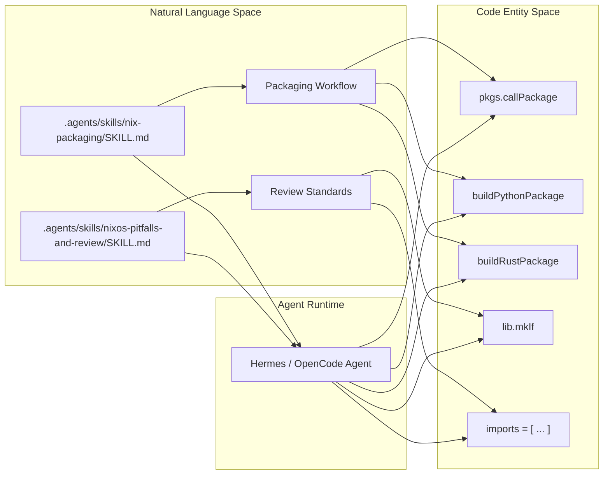
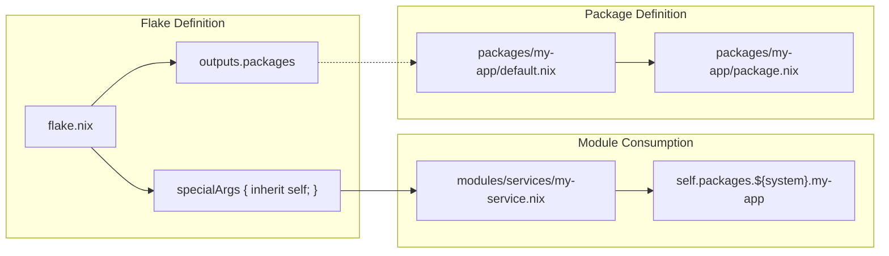

# Agent Skills Knowledge Base (.agents/)
Relevant source files
- [.agents/skills/nix-packaging/SKILL.md](https://github.com/Cody-W-Tucker/nix-config/blob/5a76c557/.agents/skills/nix-packaging/SKILL.md?plain=1)
- [.agents/skills/nix-packaging/js/claude-code/package-lock.json](https://github.com/Cody-W-Tucker/nix-config/blob/5a76c557/.agents/skills/nix-packaging/js/claude-code/package-lock.json)
- [.agents/skills/nix-packaging/js/claude-code/package.nix](https://github.com/Cody-W-Tucker/nix-config/blob/5a76c557/.agents/skills/nix-packaging/js/claude-code/package.nix)
- [.agents/skills/nix-packaging/js/js.md](https://github.com/Cody-W-Tucker/nix-config/blob/5a76c557/.agents/skills/nix-packaging/js/js.md?plain=1)
- [.agents/skills/nix-packaging/python/agno/package.nix](https://github.com/Cody-W-Tucker/nix-config/blob/5a76c557/.agents/skills/nix-packaging/python/agno/package.nix)
- [.agents/skills/nix-packaging/python/darts/package.nix](https://github.com/Cody-W-Tucker/nix-config/blob/5a76c557/.agents/skills/nix-packaging/python/darts/package.nix)
- [.agents/skills/nix-packaging/python/python.md](https://github.com/Cody-W-Tucker/nix-config/blob/5a76c557/.agents/skills/nix-packaging/python/python.md?plain=1)
- [.agents/skills/nix-packaging/python/swanboard/package.nix](https://github.com/Cody-W-Tucker/nix-config/blob/5a76c557/.agents/skills/nix-packaging/python/swanboard/package.nix)
- [.agents/skills/nix-packaging/python/tantivy/package.nix](https://github.com/Cody-W-Tucker/nix-config/blob/5a76c557/.agents/skills/nix-packaging/python/tantivy/package.nix)
- [.agents/skills/nix-packaging/python/tyro/package.nix](https://github.com/Cody-W-Tucker/nix-config/blob/5a76c557/.agents/skills/nix-packaging/python/tyro/package.nix)
- [.agents/skills/nix-packaging/rust/codex/package.nix](https://github.com/Cody-W-Tucker/nix-config/blob/5a76c557/.agents/skills/nix-packaging/rust/codex/package.nix)
- [.agents/skills/nix-packaging/rust/rust.md](https://github.com/Cody-W-Tucker/nix-config/blob/5a76c557/.agents/skills/nix-packaging/rust/rust.md?plain=1)
- [.agents/skills/nixos-pitfalls-and-review/SKILL.md](https://github.com/Cody-W-Tucker/nix-config/blob/5a76c557/.agents/skills/nixos-pitfalls-and-review/SKILL.md?plain=1)

The `.agents/` directory serves as a structured knowledge base and skill repository for AI agents (such as Hermes and OpenCode) operating within the CodyOS ecosystem. These skills provide the necessary context for agents to perform complex, domain-specific tasks like Nix packaging, system refactoring, and codebase reviews according to the repository's established conventions.

## 10.2.1 Skill Architecture and Discovery

Skills are defined as self-contained directories under `.agents/skills/`. Each skill directory contains a `SKILL.md` file that defines the skill's name, description, and detailed operational guidance.

### Skill Reference Mechanism

Agents reference these skills via `AGENTS.md` files scattered throughout the repository. This allows for localized guidance: a directory containing Python services will point the agent toward the `nix-packaging` skill with a focus on Python/uv2nix workflows.

### Data Flow: Skill to Agent Context

The following diagram illustrates how raw Nix packaging knowledge is transformed into active agent behavior.

**Knowledge to Action Pipeline**

**Sources:**[.agents/skills/nix-packaging/SKILL.md1-10](https://github.com/Cody-W-Tucker/nix-config/blob/5a76c557/.agents/skills/nix-packaging/SKILL.md?plain=1#L1-L10)[.agents/skills/nixos-pitfalls-and-review/SKILL.md1-10](https://github.com/Cody-W-Tucker/nix-config/blob/5a76c557/.agents/skills/nixos-pitfalls-and-review/SKILL.md?plain=1#L1-L10)

---

## 10.2.2 Nix Packaging Skill

The `nix-packaging` skill provides agents with the ability to create, update, and integrate software into the NixOS flake. It emphasizes a standardized repository structure where custom packages reside in `packages/<package-name>/`[.agents/skills/nix-packaging/SKILL.md19-28](https://github.com/Cody-W-Tucker/nix-config/blob/5a76c557/.agents/skills/nix-packaging/SKILL.md?plain=1#L19-L28)

### Standard Package Structure

| File | Role |
| --- | --- |
| `default.nix` | Entry point using `pkgs.callPackage ./package.nix { }`[.agents/skills/nix-packaging/SKILL.md32-36](https://github.com/Cody-W-Tucker/nix-config/blob/5a76c557/.agents/skills/nix-packaging/SKILL.md?plain=1#L32-L36) |
| `package.nix` | The actual derivation logic (e.g., `buildPythonPackage`, `stdenv.mkDerivation`) [.agents/skills/nix-packaging/SKILL.md27](https://github.com/Cody-W-Tucker/nix-config/blob/5a76c557/.agents/skills/nix-packaging/SKILL.md?plain=1#L27-L27) |

### Language-Specific Workflows

#### 1. Python Packaging

The agent uses `buildPythonPackage` and interprets `pyproject.toml` to populate `dependencies` and `build-system`[.agents/skills/nix-packaging/python/python.md1-5](https://github.com/Cody-W-Tucker/nix-config/blob/5a76c557/.agents/skills/nix-packaging/python/python.md?plain=1#L1-L5)

- **Dependency Management:** Uses `pythonRelaxDeps` to bypass strict version requirements and `pythonRemoveDeps` to strip non-essential missing dependencies [.agents/skills/nix-packaging/python/python.md26-33](https://github.com/Cody-W-Tucker/nix-config/blob/5a76c557/.agents/skills/nix-packaging/python/python.md?plain=1#L26-L33)
- **Rust Bindings:** For Python packages with Rust cores (e.g., `tantivy`), the skill directs the agent to use `rustPlatform.fetchCargoVendor` within the Python derivation [.agents/skills/nix-packaging/python/tantivy/package.nix20-23](https://github.com/Cody-W-Tucker/nix-config/blob/5a76c557/.agents/skills/nix-packaging/python/tantivy/package.nix#L20-L23)

#### 2. JavaScript/npm Packaging

Uses `buildNpmPackage` with a requirement for a `package-lock.json` file.

- **Sandboxing:** Agents are instructed to set `nodejs = nodejs_20` specifically for Darwin compatibility in sandboxed builds [.agents/skills/nix-packaging/js/claude-code/package.nix12](https://github.com/Cody-W-Tucker/nix-config/blob/5a76c557/.agents/skills/nix-packaging/js/claude-code/package.nix#L12-L12)
- **Lockfile Fix:** If a lockfile is missing, the agent is guided to generate one using `npm i --package-lock-only` and inject it via `postPatch`[.agents/skills/nix-packaging/js/js.md19-24](https://github.com/Cody-W-Tucker/nix-config/blob/5a76c557/.agents/skills/nix-packaging/js/js.md?plain=1#L19-L24)

#### 3. Rust Packaging

Uses `rustPlatform.buildRustPackage`.

- **Cargo Hashes:** The skill covers the `cargoHash` (or `cargoSha256`) requirement for vendoring dependencies [.agents/skills/nix-packaging/rust/codex/package.nix26](https://github.com/Cody-W-Tucker/nix-config/blob/5a76c557/.agents/skills/nix-packaging/rust/codex/package.nix#L26-L26)
- **Shell Completions:** Guidance includes using `installShellFiles` and `installShellCompletion` in `postInstall`[.agents/skills/nix-packaging/rust/codex/package.nix43-48](https://github.com/Cody-W-Tucker/nix-config/blob/5a76c557/.agents/skills/nix-packaging/rust/codex/package.nix#L43-L48)

**Sources:**[.agents/skills/nix-packaging/SKILL.md19-56](https://github.com/Cody-W-Tucker/nix-config/blob/5a76c557/.agents/skills/nix-packaging/SKILL.md?plain=1#L19-L56)[.agents/skills/nix-packaging/python/python.md1-48](https://github.com/Cody-W-Tucker/nix-config/blob/5a76c557/.agents/skills/nix-packaging/python/python.md?plain=1#L1-L48)[.agents/skills/nix-packaging/js/js.md1-50](https://github.com/Cody-W-Tucker/nix-config/blob/5a76c557/.agents/skills/nix-packaging/js/js.md?plain=1#L1-L50)[.agents/skills/nix-packaging/rust/codex/package.nix13-74](https://github.com/Cody-W-Tucker/nix-config/blob/5a76c557/.agents/skills/nix-packaging/rust/codex/package.nix#L13-L74)

---

## 10.2.3 NixOS Pitfalls and Review Skill

This skill acts as a linter and architectural guide for agents when modifying the system configuration. It focuses on the non-sequential nature of the NixOS module system.

### Key Architectural Principles

- **Module Primitives over Nix Language:** Agents must prefer `lib.mkIf` over top-level `if` statements and `imports = [ ... ]` over `import ./file.nix` to ensure correct merge semantics [.agents/skills/nixos-pitfalls-and-review/SKILL.md18-25](https://github.com/Cody-W-Tucker/nix-config/blob/5a76c557/.agents/skills/nixos-pitfalls-and-review/SKILL.md?plain=1#L18-L25)
- **Lazy Evaluation:** Guidance warns against reading `config` values in top-level `let` bindings to avoid infinite recursion [.agents/skills/nixos-pitfalls-and-review/SKILL.md26-40](https://github.com/Cody-W-Tucker/nix-config/blob/5a76c557/.agents/skills/nixos-pitfalls-and-review/SKILL.md?plain=1#L26-L40)
- **Single Responsibility:** Modules should be categorized strictly into `packages/` (derivations) or `modules/` (system behavior) [.agents/skills/nixos-pitfalls-and-review/SKILL.md83-89](https://github.com/Cody-W-Tucker/nix-config/blob/5a76c557/.agents/skills/nixos-pitfalls-and-review/SKILL.md?plain=1#L83-L89)

### Review Checklist for Agents

When an agent proposes a change, it is instructed to validate against this checklist:

1. Is `stateVersion` kept local to the host? [.agents/skills/nixos-pitfalls-and-review/SKILL.md70-73](https://github.com/Cody-W-Tucker/nix-config/blob/5a76c557/.agents/skills/nixos-pitfalls-and-review/SKILL.md?plain=1#L70-L73)
2. Are secrets declared near the consuming service? [.agents/skills/nixos-pitfalls-and-review/SKILL.md91-95](https://github.com/Cody-W-Tucker/nix-config/blob/5a76c557/.agents/skills/nixos-pitfalls-and-review/SKILL.md?plain=1#L91-L95)
3. Is the host file focused on machine identity rather than thick service config? [.agents/skills/nixos-pitfalls-and-review/SKILL.md66-69](https://github.com/Cody-W-Tucker/nix-config/blob/5a76c557/.agents/skills/nixos-pitfalls-and-review/SKILL.md?plain=1#L66-L69)

**Sources:**[.agents/skills/nixos-pitfalls-and-review/SKILL.md8-150](https://github.com/Cody-W-Tucker/nix-config/blob/5a76c557/.agents/skills/nixos-pitfalls-and-review/SKILL.md?plain=1#L8-L150)

---

## 10.2.4 Implementation Detail: Package Integration

The knowledge base provides specific code patterns for exposing new packages through the Flake and consuming them in modules.

**Package Injection Diagram**

### Integration Patterns

1. **Exposing:** In `flake.nix`, packages are added to the `packages.${system}` output using `pkgs.callPackage`[.agents/skills/nix-packaging/SKILL.md42-56](https://github.com/Cody-W-Tucker/nix-config/blob/5a76c557/.agents/skills/nix-packaging/SKILL.md?plain=1#L42-L56)
2. **Passing Context:** The `self` flake output is passed to NixOS and Home Manager via `specialArgs` and `extraSpecialArgs`[.agents/skills/nix-packaging/SKILL.md60-78](https://github.com/Cody-W-Tucker/nix-config/blob/5a76c557/.agents/skills/nix-packaging/SKILL.md?plain=1#L60-L78)
3. **Accessing:** Modules access custom packages via the `self` argument: `myPackage = self.packages.${pkgs.system}.my-package;`[.agents/skills/nix-packaging/SKILL.md83-91](https://github.com/Cody-W-Tucker/nix-config/blob/5a76c557/.agents/skills/nix-packaging/SKILL.md?plain=1#L83-L91)

**Sources:**[.agents/skills/nix-packaging/SKILL.md40-91](https://github.com/Cody-W-Tucker/nix-config/blob/5a76c557/.agents/skills/nix-packaging/SKILL.md?plain=1#L40-L91)