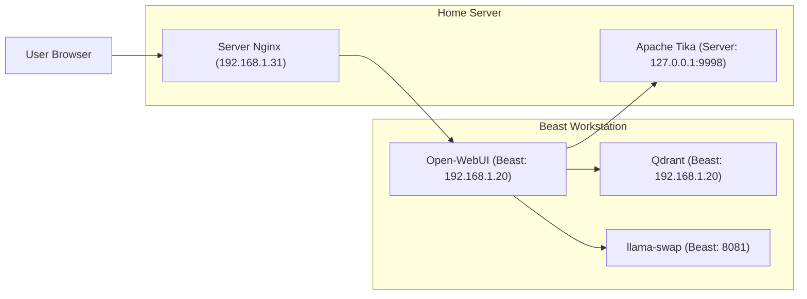
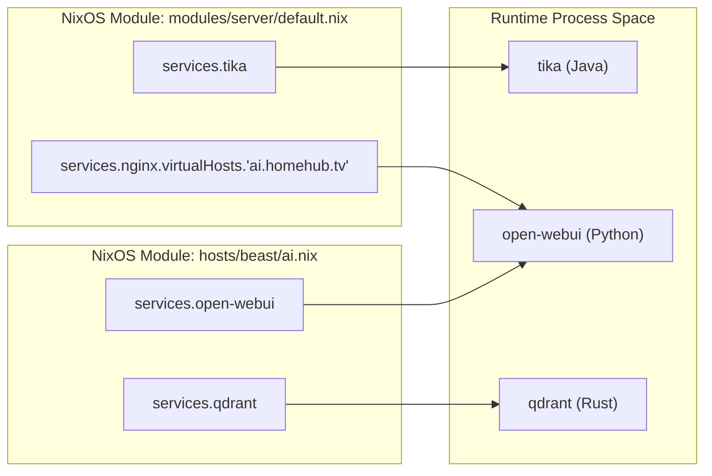

# Beast AI Stack: Open-WebUI and Qdrant
Relevant source files
- [hosts/beast/ai.nix](https://github.com/Cody-W-Tucker/nix-config/blob/5a76c557/hosts/beast/ai.nix)
- [hosts/beast/default.nix](https://github.com/Cody-W-Tucker/nix-config/blob/5a76c557/hosts/beast/default.nix)
- [hosts/beast/drives.nix](https://github.com/Cody-W-Tucker/nix-config/blob/5a76c557/hosts/beast/drives.nix)
- [hosts/beast/machine.nix](https://github.com/Cody-W-Tucker/nix-config/blob/5a76c557/hosts/beast/machine.nix)
- [modules/server/default.nix](https://github.com/Cody-W-Tucker/nix-config/blob/5a76c557/modules/server/default.nix)
- [modules/server/excalidraw.nix](https://github.com/Cody-W-Tucker/nix-config/blob/5a76c557/modules/server/excalidraw.nix)
- [modules/server/homepage-dashboard.nix](https://github.com/Cody-W-Tucker/nix-config/blob/5a76c557/modules/server/homepage-dashboard.nix)
- [modules/server/karakeep.nix](https://github.com/Cody-W-Tucker/nix-config/blob/5a76c557/modules/server/karakeep.nix)
- [modules/server/monitoring.nix](https://github.com/Cody-W-Tucker/nix-config/blob/5a76c557/modules/server/monitoring.nix)
- [modules/services/llama-swap/default.nix](https://github.com/Cody-W-Tucker/nix-config/blob/5a76c557/modules/services/llama-swap/default.nix)
- [modules/services/llama-swap/models.nix](https://github.com/Cody-W-Tucker/nix-config/blob/5a76c557/modules/services/llama-swap/models.nix)

This page details the local AI infrastructure hosted on the **beast** workstation. While the **server** host manages the public-facing Nginx proxy and SSL termination, the heavy lifting of vector search, document extraction, and the chat interface is performed on the beast's Intel i9-14900KF and NVIDIA 3070 hardware.

## Architecture Overview

The AI stack consists of three primary services working in concert to provide a Retrieval-Augmented Generation (RAG) capable chat environment:

1. **Open-WebUI**: The primary user interface, customized with a `qdrant-client` override to support external vector databases.
2. **Qdrant**: A high-performance vector database used for storing and querying document embeddings.
3. **Apache Tika**: A content extraction engine (running on the **server** host) that parses documents for Open-WebUI.

### Data Flow and Proxying

The system utilizes a split-host architecture where the **server** (192.168.1.31) acts as the gateway for the **beast** (192.168.1.20).

Title: Beast AI Service Proxy Flow

Sources: [modules/server/default.nix85-135](https://github.com/Cody-W-Tucker/nix-config/blob/5a76c557/modules/server/default.nix#L85-L135)[hosts/beast/ai.nix12-60](https://github.com/Cody-W-Tucker/nix-config/blob/5a76c557/hosts/beast/ai.nix#L12-L60)

## Open-WebUI Configuration

Open-WebUI is configured as the central hub for AI interaction. To support the specific vector database requirements of this stack, the NixOS package is modified at build time to include the `qdrant-client` Python library.

### Package Override

The standard `open-webui` package is extended using `overridePythonAttrs` to inject `pkgs.python313Packages.qdrant-client` into the runtime dependencies [hosts/beast/ai.nix4-7](https://github.com/Cody-W-Tucker/nix-config/blob/5a76c557/hosts/beast/ai.nix#L4-L7)

### Service Settings

The service is bound to `0.0.0.0:8080` to allow cross-host proxying [hosts/beast/ai.nix15-16](https://github.com/Cody-W-Tucker/nix-config/blob/5a76c557/hosts/beast/ai.nix#L15-L16) Key environment variables include:

- `VECTOR_DB`: Set to `"qdrant"` to bypass the default ChromaDB [hosts/beast/ai.nix29](https://github.com/Cody-W-Tucker/nix-config/blob/5a76c557/hosts/beast/ai.nix#L29-L29)
- `QDRANT_URI`: Pointed to the local instance at `http://localhost:6333`[hosts/beast/ai.nix30](https://github.com/Cody-W-Tucker/nix-config/blob/5a76c557/hosts/beast/ai.nix#L30-L30)
- `CONTENT_EXTRACTION_ENGINE`: Configured to use `"tika"` for robust document handling [hosts/beast/ai.nix35](https://github.com/Cody-W-Tucker/nix-config/blob/5a76c557/hosts/beast/ai.nix#L35-L35)
- `ENABLE_RAG_HYBRID_SEARCH`: Enabled for improved retrieval accuracy [hosts/beast/ai.nix39](https://github.com/Cody-W-Tucker/nix-config/blob/5a76c557/hosts/beast/ai.nix#L39-L39)

Sources: [hosts/beast/ai.nix12-41](https://github.com/Cody-W-Tucker/nix-config/blob/5a76c557/hosts/beast/ai.nix#L12-L41)

## Vector Database: Qdrant

Qdrant provides the storage backend for RAG. It is configured to prioritize disk persistence over memory to handle large document sets without exhausting the workstation's RAM.

### Implementation Details

- **Storage Path**: Data is persisted in `/var/lib/qdrant/storage`[hosts/beast/ai.nix47](https://github.com/Cody-W-Tucker/nix-config/blob/5a76c557/hosts/beast/ai.nix#L47-L47)
- **Optimization**: The `hsnw_index` is set to `on_disk = true` to minimize memory footprint during large-scale indexing [hosts/beast/ai.nix50-52](https://github.com/Cody-W-Tucker/nix-config/blob/5a76c557/hosts/beast/ai.nix#L50-L52)
- **Multitenancy**: Enabled via Open-WebUI environment variables to allow isolated document collections [hosts/beast/ai.nix31](https://github.com/Cody-W-Tucker/nix-config/blob/5a76c557/hosts/beast/ai.nix#L31-L31)

Sources: [hosts/beast/ai.nix43-60](https://github.com/Cody-W-Tucker/nix-config/blob/5a76c557/hosts/beast/ai.nix#L43-L60)

## Content Extraction: Apache Tika

While most AI services run on the beast, Apache Tika is hosted on the **server** to centralize document processing utilities (also used by Paperless-ngx).

- **Service**: Runs on port `9998`[modules/server/default.nix45-50](https://github.com/Cody-W-Tucker/nix-config/blob/5a76c557/modules/server/default.nix#L45-L50)
- **OCR Support**: The Nginx proxy for Tika injects the `X-Tika-OCRLanguage` header, supporting both Simplified Chinese and English (`chi_sim+eng`) [modules/server/default.nix131](https://github.com/Cody-W-Tucker/nix-config/blob/5a76c557/modules/server/default.nix#L131-L131)

Sources: [modules/server/default.nix45-50](https://github.com/Cody-W-Tucker/nix-config/blob/5a76c557/modules/server/default.nix#L45-L50)[modules/server/default.nix123-134](https://github.com/Cody-W-Tucker/nix-config/blob/5a76c557/modules/server/default.nix#L123-L134)

## Networking and Proxy Configuration

The communication between the server's Nginx and the beast's AI services requires specific firewall and proxy settings.

### Firewall Rules

The beast host explicitly opens ports for the proxy and vector database:

- `8080`: Open-WebUI Web Traffic.
- `6333`: Qdrant REST API.

Sources: [hosts/beast/ai.nix63-66](https://github.com/Cody-W-Tucker/nix-config/blob/5a76c557/hosts/beast/ai.nix#L63-L66)

### Nginx Virtual Hosts

The server manages three subdomains for the AI stack:

| Subdomain | Target | Purpose |
| --- | --- | --- |
| `ai.homehub.tv` | `beast:8080` | Main Chat UI with WebSocket support [modules/server/default.nix110-122](https://github.com/Cody-W-Tucker/nix-config/blob/5a76c557/modules/server/default.nix#L110-L122) |
| `qdrant.homehub.tv` | `beast:6333` | Vector DB REST API [modules/server/default.nix85-98](https://github.com/Cody-W-Tucker/nix-config/blob/5a76c557/modules/server/default.nix#L85-L98) |
| `qdrant.homehub.tv/grpc` | `beast:6334` | Vector DB gRPC API [modules/server/default.nix100-108](https://github.com/Cody-W-Tucker/nix-config/blob/5a76c557/modules/server/default.nix#L100-L108) |

Title: AI Stack Entity Mapping

Sources: [hosts/beast/ai.nix12-60](https://github.com/Cody-W-Tucker/nix-config/blob/5a76c557/hosts/beast/ai.nix#L12-L60)[modules/server/default.nix45-135](https://github.com/Cody-W-Tucker/nix-config/blob/5a76c557/modules/server/default.nix#L45-L135)

## Integration with Dashboard

The AI services are surfaced on the `homehub.tv` dashboard for easy access. The `homepage-dashboard` module defines entries for Open-WebUI and the Qdrant dashboard, categorizing them under "Business" and "Tools" respectively.

Sources: [modules/server/homepage-dashboard.nix80-85](https://github.com/Cody-W-Tucker/nix-config/blob/5a76c557/modules/server/homepage-dashboard.nix#L80-L85)[modules/server/homepage-dashboard.nix105-110](https://github.com/Cody-W-Tucker/nix-config/blob/5a76c557/modules/server/homepage-dashboard.nix#L105-L110)