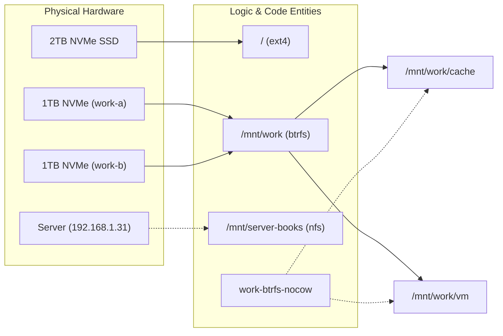
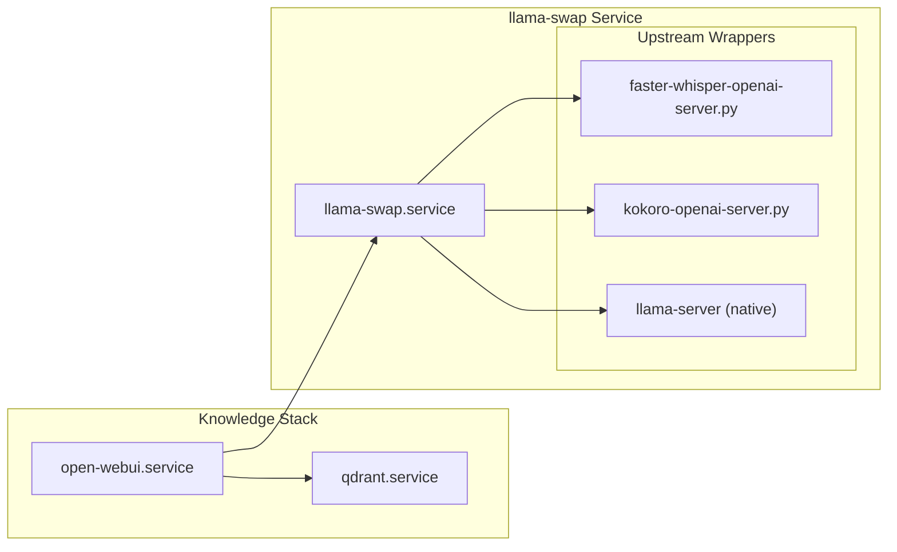

# Beast: Desktop Workstation
Relevant source files
- [hosts/beast/ai.nix](https://github.com/Cody-W-Tucker/nix-config/blob/5a76c557/hosts/beast/ai.nix)
- [hosts/beast/default.nix](https://github.com/Cody-W-Tucker/nix-config/blob/5a76c557/hosts/beast/default.nix)
- [hosts/beast/drives.nix](https://github.com/Cody-W-Tucker/nix-config/blob/5a76c557/hosts/beast/drives.nix)
- [hosts/beast/machine.nix](https://github.com/Cody-W-Tucker/nix-config/blob/5a76c557/hosts/beast/machine.nix)
- [hosts/beast/models.nix](https://github.com/Cody-W-Tucker/nix-config/blob/5a76c557/hosts/beast/models.nix)
- [modules/desktop/audio/default.nix](https://github.com/Cody-W-Tucker/nix-config/blob/5a76c557/modules/desktop/audio/default.nix)
- [modules/desktop/hardware/nvidia.nix](https://github.com/Cody-W-Tucker/nix-config/blob/5a76c557/modules/desktop/hardware/nvidia.nix)
- [modules/services/llama-swap/faster-whisper-openai-server.py](https://github.com/Cody-W-Tucker/nix-config/blob/5a76c557/modules/services/llama-swap/faster-whisper-openai-server.py)
- [modules/services/llama-swap/transformers-tts-openai-server.py](https://github.com/Cody-W-Tucker/nix-config/blob/5a76c557/modules/services/llama-swap/transformers-tts-openai-server.py)
- [modules/system/strix-hardware/default.nix](https://github.com/Cody-W-Tucker/nix-config/blob/5a76c557/modules/system/strix-hardware/default.nix)
- [modules/system/strix-hardware/ec-su-axb35.nix](https://github.com/Cody-W-Tucker/nix-config/blob/5a76c557/modules/system/strix-hardware/ec-su-axb35.nix)
- [modules/system/strix-hardware/ryzenadj.nix](https://github.com/Cody-W-Tucker/nix-config/blob/5a76c557/modules/system/strix-hardware/ryzenadj.nix)
- [modules/system/strix-hardware/tuning.nix](https://github.com/Cody-W-Tucker/nix-config/blob/5a76c557/modules/system/strix-hardware/tuning.nix)

The **beast** host serves as the primary high-performance desktop workstation within the CodyOS ecosystem. It is designed to handle heavy computational workloads, including local AI inference, 4K gaming, and software development. The configuration emphasizes high-bandwidth storage, low-latency AI services, and a highly responsive Hyprland-based desktop environment.

## Hardware Specification

The system is built around a high-end Intel/NVIDIA architecture, optimized for both single-core performance and parallel GPU workloads.

| Component | Specification |
| --- | --- |
| **CPU** | Intel Core i9-14900KF (24 cores / 32 threads) [hosts/beast/machine.nix10](https://github.com/Cody-W-Tucker/nix-config/blob/5a76c557/hosts/beast/machine.nix#L10-L10) |
| **GPU** | NVIDIA RTX 3070 (8GB VRAM) [hosts/beast/machine.nix10](https://github.com/Cody-W-Tucker/nix-config/blob/5a76c557/hosts/beast/machine.nix#L10-L10) |
| **RAM** | 64GB DDR5 [hosts/beast/machine.nix10](https://github.com/Cody-W-Tucker/nix-config/blob/5a76c557/hosts/beast/machine.nix#L10-L10) |
| **Storage** | 2TB NVMe (Root) + 2x 1TB NVMe (Work Pool) [hosts/beast/machine.nix10](https://github.com/Cody-W-Tucker/nix-config/blob/5a76c557/hosts/beast/machine.nix#L10-L10) |
| **Kernel** | Latest Linux Kernel (`pkgs.linuxPackages_latest`) [hosts/beast/machine.nix44](https://github.com/Cody-W-Tucker/nix-config/blob/5a76c557/hosts/beast/machine.nix#L44-L44) |

Sources: [hosts/beast/machine.nix10](https://github.com/Cody-W-Tucker/nix-config/blob/5a76c557/hosts/beast/machine.nix#L10-L10)[hosts/beast/machine.nix44](https://github.com/Cody-W-Tucker/nix-config/blob/5a76c557/hosts/beast/machine.nix#L44-L44)

## NVIDIA & Graphics Configuration

The NVIDIA stack is configured to support both high-refresh-rate Wayland compositing and CUDA-accelerated AI workloads.

### Driver and Kernel Integration

The system uses the NVIDIA production driver with the open-source kernel module enabled (`hardware.nvidia.open = true`) [modules/desktop/hardware/nvidia.nix14-17](https://github.com/Cody-W-Tucker/nix-config/blob/5a76c557/modules/desktop/hardware/nvidia.nix#L14-L17) The `nvidia-uvm` module is explicitly loaded to facilitate Unified Memory Management for CUDA applications [modules/desktop/hardware/nvidia.nix9](https://github.com/Cody-W-Tucker/nix-config/blob/5a76c557/modules/desktop/hardware/nvidia.nix#L9-L9)

### Wayland & Electron Compatibility

To resolve common issues with NVIDIA on Wayland, a specific set of environment variables and Electron flags are applied:

- **GBM Backend**: Set to `nvidia-drm` for proper buffer management [modules/desktop/hardware/nvidia.nix45](https://github.com/Cody-W-Tucker/nix-config/blob/5a76c557/modules/desktop/hardware/nvidia.nix#L45-L45)
- **Electron Flags**: System-wide configuration in `/etc/xdg/electron-flags.conf` enables `WaylandLinuxDrmSyncobj` and `VaapiVideoDecodeLinuxGL` to fix scrolling glitches and rendering artifacts [modules/desktop/hardware/nvidia.nix53-59](https://github.com/Cody-W-Tucker/nix-config/blob/5a76c557/modules/desktop/hardware/nvidia.nix#L53-L59)
- **Browser Acceleration**: `MOZ_DISABLE_RDD_SANDBOX` is set to "1" to allow Zen/Firefox to access hardware acceleration via NVIDIA VA-API [modules/desktop/hardware/nvidia.nix49-50](https://github.com/Cody-W-Tucker/nix-config/blob/5a76c557/modules/desktop/hardware/nvidia.nix#L49-L50)

### CUDA Support

The system is configured with global CUDA support [modules/desktop/hardware/nvidia.nix63](https://github.com/Cody-W-Tucker/nix-config/blob/5a76c557/modules/desktop/hardware/nvidia.nix#L63-L63) To avoid long build times, the configuration includes the `nixos-cuda` binary cache [modules/desktop/hardware/nvidia.nix80-87](https://github.com/Cody-W-Tucker/nix-config/blob/5a76c557/modules/desktop/hardware/nvidia.nix#L80-L87)

Sources: [modules/desktop/hardware/nvidia.nix9-88](https://github.com/Cody-W-Tucker/nix-config/blob/5a76c557/modules/desktop/hardware/nvidia.nix#L9-L88)

## Storage Topology

Beast utilizes a complex storage hierarchy combining standard partitions, a high-performance Btrfs pool, and network-attached storage.

### Filesystem Layout

- **Root (`/`)**: Ext4 on a 2TB NVMe drive [hosts/beast/drives.nix26-30](https://github.com/Cody-W-Tucker/nix-config/blob/5a76c557/hosts/beast/drives.nix#L26-L30)
- **Work Pool (`/mnt/work`)**: A Btrfs multi-device pool utilizing two NVMe drives (`work-a` and `work-b`) [hosts/beast/drives.nix7-16](https://github.com/Cody-W-Tucker/nix-config/blob/5a76c557/hosts/beast/drives.nix#L7-L16)
- **Optimization**: A custom `work-btrfs-nocow` service applies the `+C` (No Copy-on-Write) attribute to `/mnt/work/vm` and `/mnt/work/cache` to improve performance for VM images and AI model caches [hosts/beast/drives.nix113-133](https://github.com/Cody-W-Tucker/nix-config/blob/5a76c557/hosts/beast/drives.nix#L113-L133)
- **Maintenance**: Automated scrubbing is scheduled monthly via `services.btrfs.autoScrub`[hosts/beast/drives.nix88-92](https://github.com/Cody-W-Tucker/nix-config/blob/5a76c557/hosts/beast/drives.nix#L88-L92)
- **User Bind Mounts**: Standard XDG directories (`Documents`, `Music`, `Pictures`, `Videos`) are bind-mounted from a local backup share to ensure consistency with Syncthing operations [hosts/beast/drives.nix40-71](https://github.com/Cody-W-Tucker/nix-config/blob/5a76c557/hosts/beast/drives.nix#L40-L71)
- **NFS Mounts**: Remote media and books are accessed via NFS from the home server using `x-systemd.automount` for on-demand connectivity [hosts/beast/drives.nix72-80](https://github.com/Cody-W-Tucker/nix-config/blob/5a76c557/hosts/beast/drives.nix#L72-L80)

### Data Flow: Storage & Hardware

This diagram illustrates how hardware devices are mapped to the system's logical file structure.

Sources: [hosts/beast/drives.nix7-133](https://github.com/Cody-W-Tucker/nix-config/blob/5a76c557/hosts/beast/drives.nix#L7-L133)

## AI Infrastructure

Beast hosts the primary AI inference stack for the CodyOS ecosystem, utilizing `llama-swap` to manage GPU memory efficiently.

### llama-swap & Model Management

The `services.llama-swap` module orchestrates multiple AI models on the NVIDIA 3070.

- **Acceleration**: Forced to `cuda`[hosts/beast/models.nix51](https://github.com/Cody-W-Tucker/nix-config/blob/5a76c557/hosts/beast/models.nix#L51-L51)
- **Model Catalog**: Includes `qwen3.5` for reasoning/summarization, `glm-ocr` for vision tasks, and a specialized `audio-stack`[hosts/beast/models.nix65-84](https://github.com/Cody-W-Tucker/nix-config/blob/5a76c557/hosts/beast/models.nix#L65-L84)
- **Audio Stack**: The `whisper-medium` (STT) and `kokoro-82m` (TTS) models are kept warm (TTL = 0) to provide low-latency voice interaction [hosts/beast/models.nix129-161](https://github.com/Cody-W-Tucker/nix-config/blob/5a76c557/hosts/beast/models.nix#L129-L161)

### Open-WebUI & Qdrant

The system runs a local instance of Open-WebUI for interacting with models and managing RAG (Retrieval-Augmented Generation).

- **Vector Database**: `qdrant` is enabled with on-disk HNSW indexing for persistent knowledge storage [hosts/beast/ai.nix43-60](https://github.com/Cody-W-Tucker/nix-config/blob/5a76c557/hosts/beast/ai.nix#L43-L60)
- **Integration**: Open-WebUI is overridden to include the `qdrant-client` dependency and is configured to use an external Tika server for content extraction [hosts/beast/ai.nix4-6](https://github.com/Cody-W-Tucker/nix-config/blob/5a76c557/hosts/beast/ai.nix#L4-L6)[hosts/beast/ai.nix34-36](https://github.com/Cody-W-Tucker/nix-config/blob/5a76c557/hosts/beast/ai.nix#L34-L36)

### AI Service Mapping

This diagram maps the AI service architecture to the specific Python wrappers and systemd services defined in the Nix configuration.

Sources: [hosts/beast/models.nix49-163](https://github.com/Cody-W-Tucker/nix-config/blob/5a76c557/hosts/beast/models.nix#L49-L163)[hosts/beast/ai.nix12-61](https://github.com/Cody-W-Tucker/nix-config/blob/5a76c557/hosts/beast/ai.nix#L12-L61)[modules/services/llama-swap/faster-whisper-openai-server.py1-149](https://github.com/Cody-W-Tucker/nix-config/blob/5a76c557/modules/services/llama-swap/faster-whisper-openai-server.py#L1-L149)

## Desktop & Hardware Abstraction

The host configuration passes a `hardwareConfig` attribute to Home Manager, allowing the desktop environment to adapt to the specific hardware of the Beast workstation.

### Configuration Parameters

Defined in `hosts/beast/machine.nix`, this abstraction includes:

- **Monitor Layout**: Specifically targets `DP-1` at [2560x1440@239.97Hz](mailto:2560x1440@239.97Hz) with VRR and 10-bit color depth [hosts/beast/machine.nix16-19](https://github.com/Cody-W-Tucker/nix-config/blob/5a76c557/hosts/beast/machine.nix#L16-L19)
- **Hypridle**: Sets a `suspendTimeout` of 7200 seconds (2 hours) [hosts/beast/machine.nix21](https://github.com/Cody-W-Tucker/nix-config/blob/5a76c557/hosts/beast/machine.nix#L21-L21)
- **Workspaces**: Assigns workspace 1 to the primary DP-1 monitor [hosts/beast/machine.nix15](https://github.com/Cody-W-Tucker/nix-config/blob/5a76c557/hosts/beast/machine.nix#L15-L15)

### Audio and Bluetooth

- **PipeWire**: Configured with high-quality AAC support for Bluetooth and seat monitoring disabled to prevent connection drops [modules/desktop/audio/default.nix4-51](https://github.com/Cody-W-Tucker/nix-config/blob/5a76c557/modules/desktop/audio/default.nix#L4-L51)
- **Bluetooth**: Set to `bredr` mode with `JustWorksRepairing` enabled for seamless peripheral connectivity [modules/desktop/audio/default.nix55-69](https://github.com/Cody-W-Tucker/nix-config/blob/5a76c557/modules/desktop/audio/default.nix#L55-L69)
- **Kernel Parameters**: `btusb` is configured to disable autosuspend and enable resets to handle flaky hardware controllers [hosts/beast/drives.nix19-21](https://github.com/Cody-W-Tucker/nix-config/blob/5a76c557/hosts/beast/drives.nix#L19-L21)

Sources: [hosts/beast/machine.nix13-39](https://github.com/Cody-W-Tucker/nix-config/blob/5a76c557/hosts/beast/machine.nix#L13-L39)[modules/desktop/audio/default.nix1-76](https://github.com/Cody-W-Tucker/nix-config/blob/5a76c557/modules/desktop/audio/default.nix#L1-L76)[hosts/beast/drives.nix19-21](https://github.com/Cody-W-Tucker/nix-config/blob/5a76c557/hosts/beast/drives.nix#L19-L21)