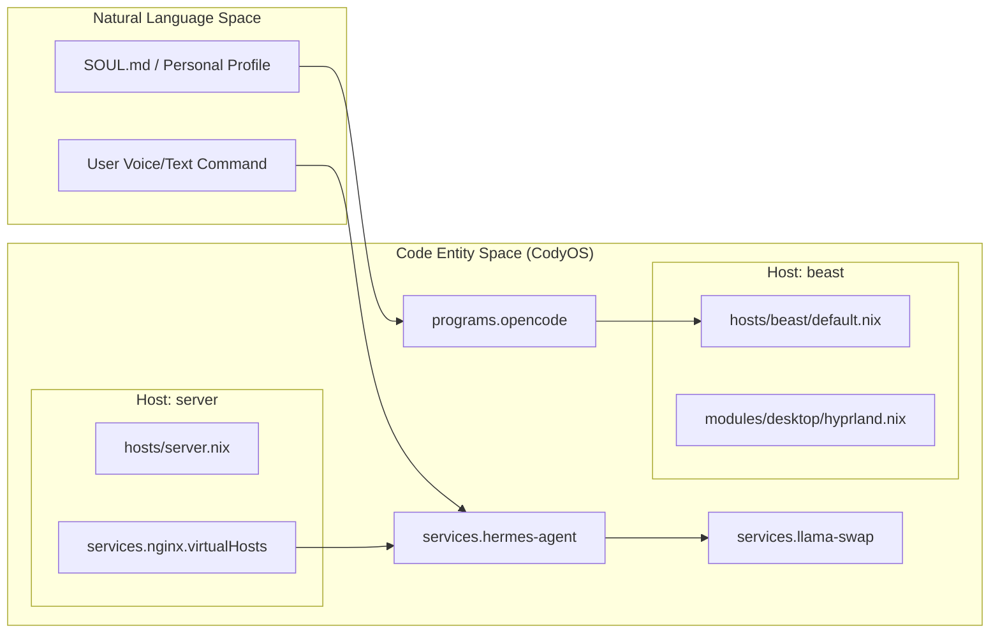
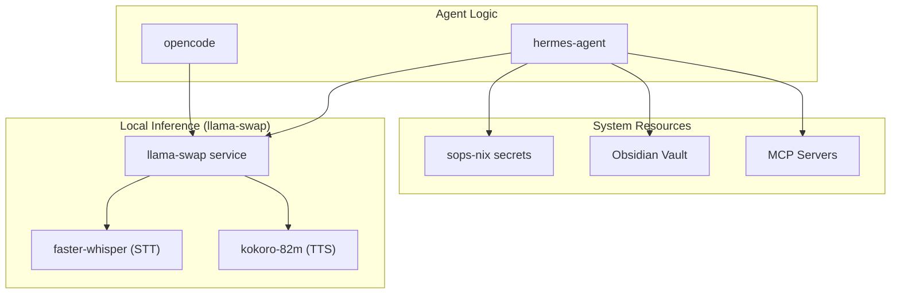

# CodyOS Overview
Relevant source files
- [AGENTS.md](https://github.com/Cody-W-Tucker/nix-config/blob/5a76c557/AGENTS.md?plain=1)
- [CONTRIBUTING.md](https://github.com/Cody-W-Tucker/nix-config/blob/5a76c557/CONTRIBUTING.md?plain=1)
- [README.md](https://github.com/Cody-W-Tucker/nix-config/blob/5a76c557/README.md?plain=1)
- [flake.lock](https://github.com/Cody-W-Tucker/nix-config/blob/5a76c557/flake.lock)
- [flake.nix](https://github.com/Cody-W-Tucker/nix-config/blob/5a76c557/flake.nix)
- [hosts/README.md](https://github.com/Cody-W-Tucker/nix-config/blob/5a76c557/hosts/README.md?plain=1)
- [modules/services/hermes-agent/default.nix](https://github.com/Cody-W-Tucker/nix-config/blob/5a76c557/modules/services/hermes-agent/default.nix)
- [modules/services/llama-swap/README.md](https://github.com/Cody-W-Tucker/nix-config/blob/5a76c557/modules/services/llama-swap/README.md?plain=1)

CodyOS is a self-improving, declarative operating system built on NixOS. It operates on the philosophy that a machine should be legible, reproducible, and reversible so that AI agents can safely help shape the environment around the user [README.md3-9](https://github.com/Cody-W-Tucker/nix-config/blob/5a76c557/README.md?plain=1#L3-L9)

By leveraging Nix flakes, CodyOS provides a stable foundation where agent tooling, local models, and workflow harnesses are treated as first-class system infrastructure rather than ephemeral user-space applications [README.md11-12](https://github.com/Cody-W-Tucker/nix-config/blob/5a76c557/README.md?plain=1#L11-L12)

## Core Philosophy: The Self-Improving OS

The central bet of CodyOS is that owning a declarative system allows it to grow with the user. Instead of a static sandbox, the OS is an evolving entity where:

- **Declarative Safety:** Nix provides inspectable configs and rollbacks, making AI-driven system modifications safe [README.md11](https://github.com/Cody-W-Tucker/nix-config/blob/5a76c557/README.md?plain=1#L11-L11)
- **Agent Integration:** AI agents like **Hermes** and **OpenCode** are defined as system services with direct access to system context, secrets, and tools [README.md21-29](https://github.com/Cody-W-Tucker/nix-config/blob/5a76c557/README.md?plain=1#L21-L29)
- **Personalization:** The system integrates with [Cognitive Assistant](https://github.com/Cody-W-Tucker/nix-config/blob/5a76c557/Cognitive Assistant) to inject user-specific "soul" artifacts and behavioral profiles directly into the agent runtimes [README.md31-36](https://github.com/Cody-W-Tucker/nix-config/blob/5a76c557/README.md?plain=1#L31-L36)

**Sources:**[README.md1-36](https://github.com/Cody-W-Tucker/nix-config/blob/5a76c557/README.md?plain=1#L1-L36)

## Two-Host Architecture

CodyOS is distributed across two primary hosts, each serving a distinct role in the ecosystem.

| Host | Role | Key Hardware/Features |
| --- | --- | --- |
| `beast` | High-performance workstation | Intel i9, NVIDIA GPU, local LLM inference, Hyprland desktop [flake.nix117-120](https://github.com/Cody-W-Tucker/nix-config/blob/5a76c557/flake.nix#L117-L120)[CONTRIBUTING.md27](https://github.com/Cody-W-Tucker/nix-config/blob/5a76c557/CONTRIBUTING.md?plain=1#L27-L27) |
| `server` | Media and homelab hub | Stable nixpkgs, Jellyfin, Nginx reverse proxy, central secrets hub [flake.nix121-127](https://github.com/Cody-W-Tucker/nix-config/blob/5a76c557/flake.nix#L121-L127)[CONTRIBUTING.md28](https://github.com/Cody-W-Tucker/nix-config/blob/5a76c557/CONTRIBUTING.md?plain=1#L28-L28) |

### System Connectivity and Flow

The following diagram illustrates how the natural language intent of the user flows through the code entities defined in the flake.

**Diagram: User Intent to Code Execution**

**Sources:**[flake.nix116-129](https://github.com/Cody-W-Tucker/nix-config/blob/5a76c557/flake.nix#L116-L129)[modules/services/hermes-agent/default.nix13-22](https://github.com/Cody-W-Tucker/nix-config/blob/5a76c557/modules/services/hermes-agent/default.nix#L13-L22)[README.md15-30](https://github.com/Cody-W-Tucker/nix-config/blob/5a76c557/README.md?plain=1#L15-L30)[CONTRIBUTING.md100-110](https://github.com/Cody-W-Tucker/nix-config/blob/5a76c557/CONTRIBUTING.md?plain=1#L100-L110)

## AI Infrastructure and Agents

CodyOS treats AI as a utility layer similar to networking or audio.

- **Local LLM Orchestration:**`llama-swap` manages local model lifecycles, supporting multimodal GGUFs and TTL-based swapping to optimize VRAM [README.md17-19](https://github.com/Cody-W-Tucker/nix-config/blob/5a76c557/README.md?plain=1#L17-L19)[modules/services/llama-swap/README.md1-6](https://github.com/Cody-W-Tucker/nix-config/blob/5a76c557/modules/services/llama-swap/README.md?plain=1#L1-L6)
- **Hermes Agent:** A persistent system service (`services.hermes-agent`) configured with declarative skills, MCP (Model Context Protocol) wiring, and a holographic memory store [modules/services/hermes-agent/default.nix25-149](https://github.com/Cody-W-Tucker/nix-config/blob/5a76c557/modules/services/hermes-agent/default.nix#L25-L149)
- **OpenCode:** A development-focused agent harness integrated into the user's desktop environment for repository-level tasks [README.md26-30](https://github.com/Cody-W-Tucker/nix-config/blob/5a76c557/README.md?plain=1#L26-L30)

**Diagram: Agent Infrastructure Integration**

**Sources:**[modules/services/hermes-agent/default.nix46-54](https://github.com/Cody-W-Tucker/nix-config/blob/5a76c557/modules/services/hermes-agent/default.nix#L46-L54)[modules/services/hermes-agent/default.nix93-113](https://github.com/Cody-W-Tucker/nix-config/blob/5a76c557/modules/services/hermes-agent/default.nix#L93-L113)[README.md15-25](https://github.com/Cody-W-Tucker/nix-config/blob/5a76c557/README.md?plain=1#L15-L25)

## Child Pages

For detailed technical specifications, refer to the following sections:

### [1.1 Repository Structure and Conventions](https://github.com/Cody-W-Tucker/nix-config/blob/5a76c557/1.1 Repository Structure and Conventions)

Explains the layout of `hosts/`, `modules/`, and `users/`, naming standards (kebab-case), and the use of `AGENTS.md` for LLM guidance. For details, see [Repository Structure and Conventions](/Cody-W-Tucker/nix-config/1.1-repository-structure-and-conventions).

### [1.2 Getting Started](https://github.com/Cody-W-Tucker/nix-config/blob/5a76c557/1.2 Getting Started#LNaN-LNaN)

A practical guide for bootstrapping new hosts, managing secrets with SOPS, and using the `update` script. For details, see [Getting Started: Building and Updating the System](/Cody-W-Tucker/nix-config/1.2-getting-started:-building-and-updating-the-system).

**Sources:**[AGENTS.md24-40](https://github.com/Cody-W-Tucker/nix-config/blob/5a76c557/AGENTS.md?plain=1#L24-L40)[CONTRIBUTING.md12-23](https://github.com/Cody-W-Tucker/nix-config/blob/5a76c557/CONTRIBUTING.md?plain=1#L12-L23)[hosts/README.md5-22](https://github.com/Cody-W-Tucker/nix-config/blob/5a76c557/hosts/README.md?plain=1#L5-L22)