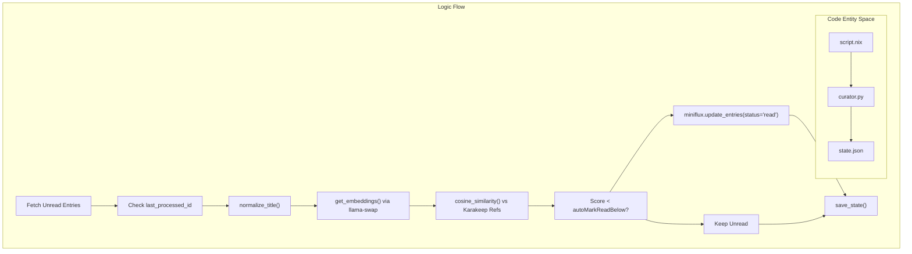

# Content, RSS, and Bookmarks

This section details the content consumption and financial management stack hosted on the server. The architecture integrates standard self-hosted services with a custom AI-driven automation layer for content curation, utilizing local LLM and embedding models.

## Miniflux RSS Reader

Miniflux serves as the primary RSS feed aggregator. It is configured to run on a local port and is exposed via an Nginx reverse proxy at `rss.homehub.tv`.

### Configuration

The service is configured with a cleanup frequency of 48 hours and allows private network integrations to facilitate communication with the `miniflux-curator`[modules/nas/content.nix30-37](../modules/nas/content.nix#L30-L37) Admin credentials are managed securely via SOPS templates [modules/nas/content.nix22-26](../modules/nas/content.nix#L22-L26)

## Karakeep Bookmark Manager

Karakeep is the central repository for bookmarks and serves as the "reference set" for the AI curation logic. It is tightly integrated with the local AI infrastructure running on the `NAS` host.

### AI Integration

Karakeep utilizes local models via `llama-swap` for several features:

- **Summarization**: Uses `qwen-3.5-4b` for text inference [modules/nas/karakeep.nix18](../modules/nas/karakeep.nix#L18-L18)
- **Embeddings**: Uses `qwen3-embedding-0.6b` for semantic representation [modules/nas/karakeep.nix17](../modules/nas/karakeep.nix#L17-L17)
- **OCR**: Uses the `glm-ocr-f16` multimodal model for extracting text from images [modules/nas/karakeep.nix16](../modules/nas/karakeep.nix#L16-L16)

The service connects to the OpenAI-compatible API provided by `llama-swap` at `http://nas:8081/v1`[modules/nas/karakeep.nix11](../modules/nas/karakeep.nix#L11-L11)

## Miniflux Curator Automation

The `miniflux-curator` is a custom Python-based service that automatically manages the volume of unread articles in Miniflux by scoring them against Karakeep bookmarks using vector similarity.

### Data Flow and Scoring Logic

The curator operates in a pipeline:

1. **Reference Selection**: Fetches recent bookmarks from Karakeep and selects a tag-balanced set [modules/services/automations/miniflux-curator/curator.py243](../modules/services/automations/miniflux-curator/curator.py#L243-L243)
2. **Embedding**: Generates embeddings for both the reference bookmarks and unread Miniflux entries using the `qwen3-embedding-0.6b` model [modules/nas/content.nix49](../modules/nas/content.nix#L49-L49)
3. **Similarity Calculation**: Calculates the `cosine_similarity` between entry vectors and reference vectors [modules/services/automations/miniflux-curator/curator.py57-59](../modules/services/automations/miniflux-curator/curator.py#L57-L59)
4. **Auto-Marking**: Articles with a similarity score below the `autoMarkReadBelow` threshold (default 4.5) are marked as read [modules/nas/content.nix50](../modules/nas/content.nix#L50-L50)

### Implementation Details

- **State Tracking**: Uses a `state.json` file to track the `last_processed_id`, ensuring it only processes new entries [modules/services/automations/miniflux-curator/curator.py35-56](../modules/services/automations/miniflux-curator/curator.py#L35-L56)
- **Title Normalization**: Implements complex regex logic in `normalize_title` to strip source chrome (e.g., " | The Verge") and extract quoted titles from attribution wrappers [modules/services/automations/miniflux-curator/curator.py94-179](../modules/services/automations/miniflux-curator/curator.py#L94-L179)
- **Systemd Integration**: Runs as a `oneshot` service on a systemd timer (7:15 AM and 11:15 PM) [modules/nas/content.nix56](../modules/nas/content.nix#L56-L56)

### Logic Flow Diagram

Title: Miniflux Curator Decision Pipeline

