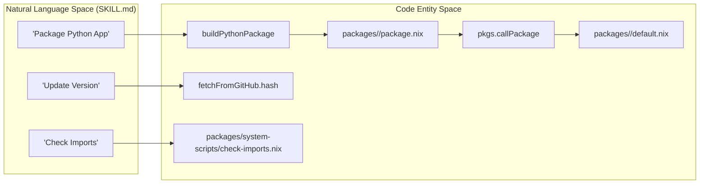
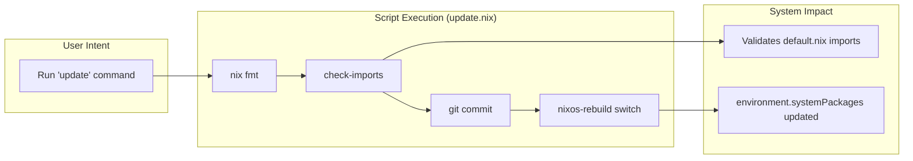

# Custom Packages and Agent Skills
Relevant source files
- [.agents/skills/nix-packaging/SKILL.md](https://github.com/Cody-W-Tucker/nix-config/blob/5a76c557/.agents/skills/nix-packaging/SKILL.md?plain=1)
- [.agents/skills/nix-packaging/python/agno/package.nix](https://github.com/Cody-W-Tucker/nix-config/blob/5a76c557/.agents/skills/nix-packaging/python/agno/package.nix)
- [.agents/skills/nix-packaging/python/darts/package.nix](https://github.com/Cody-W-Tucker/nix-config/blob/5a76c557/.agents/skills/nix-packaging/python/darts/package.nix)
- [.agents/skills/nix-packaging/python/swanboard/package.nix](https://github.com/Cody-W-Tucker/nix-config/blob/5a76c557/.agents/skills/nix-packaging/python/swanboard/package.nix)
- [.agents/skills/nix-packaging/python/tantivy/package.nix](https://github.com/Cody-W-Tucker/nix-config/blob/5a76c557/.agents/skills/nix-packaging/python/tantivy/package.nix)
- [.agents/skills/nix-packaging/python/tyro/package.nix](https://github.com/Cody-W-Tucker/nix-config/blob/5a76c557/.agents/skills/nix-packaging/python/tyro/package.nix)
- [modules/system/packages.nix](https://github.com/Cody-W-Tucker/nix-config/blob/5a76c557/modules/system/packages.nix)
- [packages/gh-star-search/default.nix](https://github.com/Cody-W-Tucker/nix-config/blob/5a76c557/packages/gh-star-search/default.nix)
- [packages/gh-star-search/package.nix](https://github.com/Cody-W-Tucker/nix-config/blob/5a76c557/packages/gh-star-search/package.nix)
- [packages/system-scripts/check-imports.nix](https://github.com/Cody-W-Tucker/nix-config/blob/5a76c557/packages/system-scripts/check-imports.nix)
- [packages/system-scripts/default.nix](https://github.com/Cody-W-Tucker/nix-config/blob/5a76c557/packages/system-scripts/default.nix)
- [packages/system-scripts/update.nix](https://github.com/Cody-W-Tucker/nix-config/blob/5a76c557/packages/system-scripts/update.nix)

This section provides an overview of the custom Nix packaging infrastructure and the specialized knowledge base used by AI agents within the CodyOS ecosystem. It bridges the gap between raw software binaries and the high-level intelligence that manages them.

CodyOS utilizes a standardized structure for internal packages, ensuring they are easily maintainable and discoverable by both the Nix build system and AI agents. Furthermore, the repository includes a dedicated `.agents/skills/` directory that provides structured context to LLM-based agents, enabling them to perform complex system administration and development tasks autonomously.

## Custom Packages

The `packages/` directory contains custom software definitions and system-wide scripts that are not available in upstream `nixpkgs` or require specific modifications for CodyOS.

### System Scripts

A collection of utility scripts is provided to manage the lifecycle of the OS. These are defined in `packages/system-scripts/` and installed into the system-wide environment [packages/system-scripts/default.nix16-18](https://github.com/Cody-W-Tucker/nix-config/blob/5a76c557/packages/system-scripts/default.nix#L16-L18)

- `update`: A wrapper that formats the codebase, checks for missing imports, commits changes to Git, and executes `nixos-rebuild switch`[packages/system-scripts/update.nix6-35](https://github.com/Cody-W-Tucker/nix-config/blob/5a76c557/packages/system-scripts/update.nix#L6-L35)
- `check-imports`: A validation utility that ensures all `.nix` files in directories containing a `default.nix` are explicitly imported, preventing "orphan" configuration files [packages/system-scripts/check-imports.nix11-75](https://github.com/Cody-W-Tucker/nix-config/blob/5a76c557/packages/system-scripts/check-imports.nix#L11-L75)

### Package Architecture

Custom packages follow a "default-to-package" pattern where `default.nix` acts as a thin wrapper [packages/gh-star-search/default.nix1-3](https://github.com/Cody-W-Tucker/nix-config/blob/5a76c557/packages/gh-star-search/default.nix#L1-L3) that calls `pkgs.callPackage` on a `package.nix` file containing the actual build logic [.agents/skills/nix-packaging/SKILL.md23-38](https://github.com/Cody-W-Tucker/nix-config/blob/5a76c557/.agents/skills/nix-packaging/SKILL.md?plain=1#L23-L38)

For details, see [Custom Packages](/Cody-W-Tucker/nix-config/10.1-custom-packages).

### Sources:

- [packages/system-scripts/default.nix1-19](https://github.com/Cody-W-Tucker/nix-config/blob/5a76c557/packages/system-scripts/default.nix#L1-L19)
- [packages/system-scripts/update.nix1-36](https://github.com/Cody-W-Tucker/nix-config/blob/5a76c557/packages/system-scripts/update.nix#L1-L36)
- [packages/system-scripts/check-imports.nix1-77](https://github.com/Cody-W-Tucker/nix-config/blob/5a76c557/packages/system-scripts/check-imports.nix#L1-L77)
- [.agents/skills/nix-packaging/SKILL.md19-38](https://github.com/Cody-W-Tucker/nix-config/blob/5a76c557/.agents/skills/nix-packaging/SKILL.md?plain=1#L19-L38)

## Agent Skills Knowledge Base

The `.agents/` directory serves as the "brain" for AI agents (like Hermes and OpenCode). It contains structured documentation and examples that agents use as context to understand repository-specific workflows.

### Nix Packaging Skill

The `nix-packaging` skill provides the agent with specific instructions for:

- **Python**: Using `buildPythonPackage` with various backends like `setuptools` or `hatchling`[.agents/skills/nix-packaging/python/agno/package.nix28-42](https://github.com/Cody-W-Tucker/nix-config/blob/5a76c557/.agents/skills/nix-packaging/python/agno/package.nix#L28-L42)
- **Rust**: Utilizing `rustPlatform` for Cargo-based builds [.agents/skills/nix-packaging/python/tantivy/package.nix20-28](https://github.com/Cody-W-Tucker/nix-config/blob/5a76c557/.agents/skills/nix-packaging/python/tantivy/package.nix#L20-L28)
- **Updates**: Standardized workflows for updating hashes using `nix-prefetch-url`[.agents/skills/nix-packaging/SKILL.md93-109](https://github.com/Cody-W-Tucker/nix-config/blob/5a76c557/.agents/skills/nix-packaging/SKILL.md?plain=1#L93-L109)

### Repository Alignment

Agents reference these skills via `AGENTS.md` files scattered throughout the repository. This allows an agent to "know" how to package a new Python library (e.g., `agno` or `darts`) by reading the provided templates and examples in the `.agents/skills/nix-packaging/` subdirectories [.agents/skills/nix-packaging/SKILL.md111-116](https://github.com/Cody-W-Tucker/nix-config/blob/5a76c557/.agents/skills/nix-packaging/SKILL.md?plain=1#L111-L116)

For details, see [Agent Skills Knowledge Base (.agents/)](/Cody-W-Tucker/nix-config/10.2-agent-skills-knowledge-base-(.agents)).

### Sources:

- [.agents/skills/nix-packaging/SKILL.md1-116](https://github.com/Cody-W-Tucker/nix-config/blob/5a76c557/.agents/skills/nix-packaging/SKILL.md?plain=1#L1-L116)
- [.agents/skills/nix-packaging/python/agno/package.nix1-84](https://github.com/Cody-W-Tucker/nix-config/blob/5a76c557/.agents/skills/nix-packaging/python/agno/package.nix#L1-L84)
- [.agents/skills/nix-packaging/python/tantivy/package.nix1-43](https://github.com/Cody-W-Tucker/nix-config/blob/5a76c557/.agents/skills/nix-packaging/python/tantivy/package.nix#L1-L43)

## Knowledge to Code Mapping

The following diagrams illustrate how natural language concepts in the Skills knowledge base map to concrete Nix code entities and file structures.

### Packaging Workflow Mapping

This diagram shows how the `nix-packaging` skill translates high-level software requirements into Nix build expressions.

Sources: [.agents/skills/nix-packaging/SKILL.md23-38](https://github.com/Cody-W-Tucker/nix-config/blob/5a76c557/.agents/skills/nix-packaging/SKILL.md?plain=1#L23-L38)[packages/system-scripts/check-imports.nix3-10](https://github.com/Cody-W-Tucker/nix-config/blob/5a76c557/packages/system-scripts/check-imports.nix#L3-L10)

### System Update Pipeline

This diagram traces the execution flow of the `update` script, bridging the user's intent to the system's declarative state.

Sources: [packages/system-scripts/update.nix14-35](https://github.com/Cody-W-Tucker/nix-config/blob/5a76c557/packages/system-scripts/update.nix#L14-L35)[packages/system-scripts/check-imports.nix11-15](https://github.com/Cody-W-Tucker/nix-config/blob/5a76c557/packages/system-scripts/check-imports.nix#L11-L15)