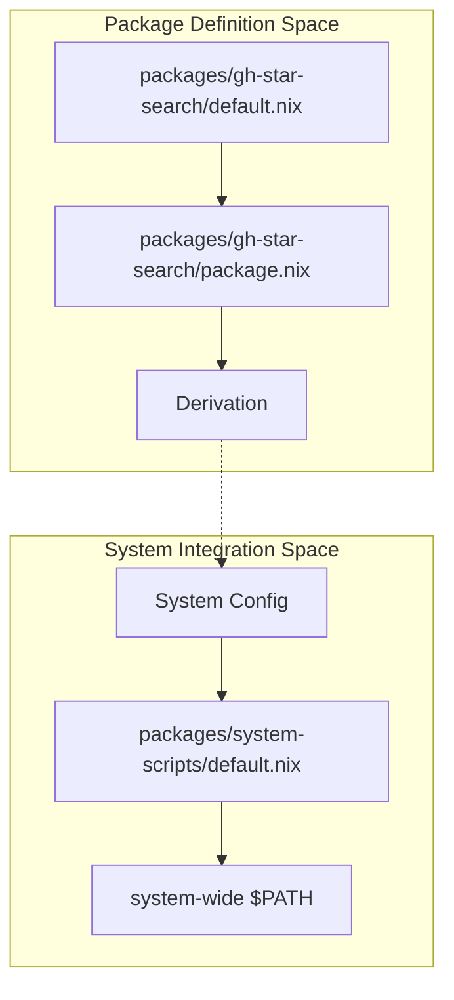
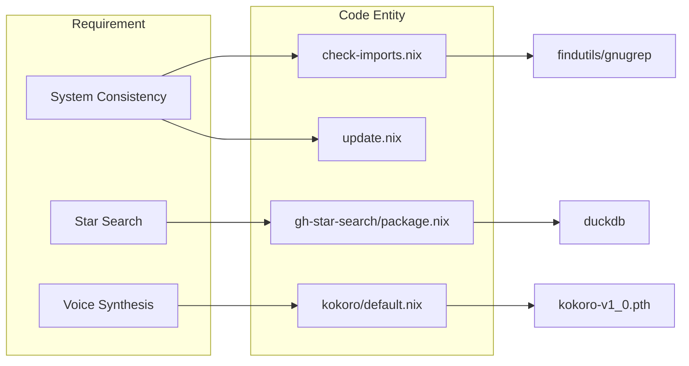

# Custom Packages
Relevant source files
- [modules/system/packages.nix](https://github.com/Cody-W-Tucker/nix-config/blob/5a76c557/modules/system/packages.nix)
- [packages/en-core-web-sm/default.nix](https://github.com/Cody-W-Tucker/nix-config/blob/5a76c557/packages/en-core-web-sm/default.nix)
- [packages/gh-star-search/default.nix](https://github.com/Cody-W-Tucker/nix-config/blob/5a76c557/packages/gh-star-search/default.nix)
- [packages/gh-star-search/package.nix](https://github.com/Cody-W-Tucker/nix-config/blob/5a76c557/packages/gh-star-search/package.nix)
- [packages/kokoro/default.nix](https://github.com/Cody-W-Tucker/nix-config/blob/5a76c557/packages/kokoro/default.nix)
- [packages/system-scripts/check-imports.nix](https://github.com/Cody-W-Tucker/nix-config/blob/5a76c557/packages/system-scripts/check-imports.nix)
- [packages/system-scripts/default.nix](https://github.com/Cody-W-Tucker/nix-config/blob/5a76c557/packages/system-scripts/default.nix)
- [packages/system-scripts/update.nix](https://github.com/Cody-W-Tucker/nix-config/blob/5a76c557/packages/system-scripts/update.nix)

The `packages/` directory contains custom Nix expressions for tools and models that are not available in upstream `nixpkgs` or require specific patches and configurations for the CodyOS ecosystem. These range from critical system maintenance scripts to specialized AI models used by the text-to-speech stack.

## Package Architecture and Conventions

CodyOS follows a standardized pattern for defining custom packages to ensure they are easily discoverable and maintainable. Most packages are organized into a directory containing a `default.nix` (the entry point) and a `package.nix` (the derivation logic) [packages/gh-star-search/default.nix1-3](https://github.com/Cody-W-Tucker/nix-config/blob/5a76c557/packages/gh-star-search/default.nix#L1-L3)

### Data Flow: Package Definition to System Inclusion

The following diagram illustrates how a custom package (using `gh-star-search` as an example) is defined and eventually included in the system environment.

**Package Exposure Pipeline**

**Sources:**[packages/gh-star-search/default.nix1-3](https://github.com/Cody-W-Tucker/nix-config/blob/5a76c557/packages/gh-star-search/default.nix#L1-L3)[packages/system-scripts/default.nix1-18](https://github.com/Cody-W-Tucker/nix-config/blob/5a76c557/packages/system-scripts/default.nix#L1-L18)[modules/system/packages.nix6-10](https://github.com/Cody-W-Tucker/nix-config/blob/5a76c557/modules/system/packages.nix#L6-L10)

## System Scripts

The `packages/system-scripts/` directory contains utilities for maintaining the integrity of the NixOS configuration and automating the update lifecycle.

### update.nix

The `update` script is a wrapped shell application that orchestrates the entire system update process [packages/system-scripts/update.nix6-7](https://github.com/Cody-W-Tucker/nix-config/blob/5a76c557/packages/system-scripts/update.nix#L6-L7) It performs the following sequence:

1. Formats the codebase using `nix fmt`[packages/system-scripts/update.nix18](https://github.com/Cody-W-Tucker/nix-config/blob/5a76c557/packages/system-scripts/update.nix#L18-L18)
2. Runs `check-imports` to ensure no orphaned `.nix` files exist [packages/system-scripts/update.nix21](https://github.com/Cody-W-Tucker/nix-config/blob/5a76c557/packages/system-scripts/update.nix#L21-L21)
3. Stages all changes and prompts for a commit message (defaulting to "Update NixOS configuration") [packages/system-scripts/update.nix23-32](https://github.com/Cody-W-Tucker/nix-config/blob/5a76c557/packages/system-scripts/update.nix#L23-L32)
4. Executes `sudo nixos-rebuild switch` to apply the new configuration [packages/system-scripts/update.nix33](https://github.com/Cody-W-Tucker/nix-config/blob/5a76c557/packages/system-scripts/update.nix#L33-L33)
5. Pushes the committed changes to the remote repository [packages/system-scripts/update.nix34](https://github.com/Cody-W-Tucker/nix-config/blob/5a76c557/packages/system-scripts/update.nix#L34-L34)

### check-imports.nix

This utility validates that every `.nix` file in a directory containing a `default.nix` is actually referenced within that `default.nix`[packages/system-scripts/check-imports.nix12-14](https://github.com/Cody-W-Tucker/nix-config/blob/5a76c557/packages/system-scripts/check-imports.nix#L12-L14) It prevents "silent failures" where a module is created but never activated.

**Implementation Details:**

- Uses `grep -oE` to extract relative imports starting with `./`[packages/system-scripts/check-imports.nix32-34](https://github.com/Cody-W-Tucker/nix-config/blob/5a76c557/packages/system-scripts/check-imports.nix#L32-L34)
- Compares the list of imported files against the actual `.nix` files found on disk via `find`[packages/system-scripts/check-imports.nix43-46](https://github.com/Cody-W-Tucker/nix-config/blob/5a76c557/packages/system-scripts/check-imports.nix#L43-L46)
- Identifies both missing imports (file exists but not imported) and bad imports (imported but file missing) [packages/system-scripts/check-imports.nix49-62](https://github.com/Cody-W-Tucker/nix-config/blob/5a76c557/packages/system-scripts/check-imports.nix#L49-L62)

**Sources:**[packages/system-scripts/update.nix1-36](https://github.com/Cody-W-Tucker/nix-config/blob/5a76c557/packages/system-scripts/update.nix#L1-L36)[packages/system-scripts/check-imports.nix1-76](https://github.com/Cody-W-Tucker/nix-config/blob/5a76c557/packages/system-scripts/check-imports.nix#L1-L76)

## GitHub Star Search (gh-star-search)

A GitHub CLI extension built with Go that provides full-text search over a user's starred repositories [packages/gh-star-search/package.nix56-60](https://github.com/Cody-W-Tucker/nix-config/blob/5a76c557/packages/gh-star-search/package.nix#L56-L60)

### Custom Patches

The CodyOS derivation includes a `postPatch` phase that uses `perl` to inject DuckDB FTS (Full Text Search) extension loading logic into `internal/storage/duckdb.go`[packages/gh-star-search/package.nix24-26](https://github.com/Cody-W-Tucker/nix-config/blob/5a76c557/packages/gh-star-search/package.nix#L24-L26) This ensures the extension is installed and loaded automatically during runtime.

### Wrapper and Runtime

The package is wrapped to include `uv` in its `PATH`, which is required for certain runtime operations [packages/gh-star-search/package.nix52-54](https://github.com/Cody-W-Tucker/nix-config/blob/5a76c557/packages/gh-star-search/package.nix#L52-L54) It also renames the binary from `gh-start-search` to the conventional `gh-star-search`[packages/gh-star-search/package.nix48-50](https://github.com/Cody-W-Tucker/nix-config/blob/5a76c557/packages/gh-star-search/package.nix#L48-L50)

**Sources:**[packages/gh-star-search/package.nix1-63](https://github.com/Cody-W-Tucker/nix-config/blob/5a76c557/packages/gh-star-search/package.nix#L1-L63)

## AI and Speech Models

Custom packages are used to manage large model weights and specific Python environments for the AI stack.

### en-core-web-sm

This package provides the spaCy "small" English model, used by the text-to-speech pipeline for linguistic processing [packages/en-core-web-sm/default.nix7-9](https://github.com/Cody-W-Tucker/nix-config/blob/5a76c557/packages/en-core-web-sm/default.nix#L7-L9)

- **Format:** It is fetched as a Python wheel directly from the spaCy models repository [packages/en-core-web-sm/default.nix15-20](https://github.com/Cody-W-Tucker/nix-config/blob/5a76c557/packages/en-core-web-sm/default.nix#L15-L20)
- **Integration:** Built using `buildPythonPackage` and linked to the `spacy` dependency [packages/en-core-web-sm/default.nix12-24](https://github.com/Cody-W-Tucker/nix-config/blob/5a76c557/packages/en-core-web-sm/default.nix#L12-L24)

### Kokoro TTS Package

The `kokoro` package is a `runCommand` derivation that aggregates the Kokoro-82M model weights, configuration, and a suite of voice profiles into a single Nix store path [packages/kokoro/default.nix45-56](https://github.com/Cody-W-Tucker/nix-config/blob/5a76c557/packages/kokoro/default.nix#L45-L56)

**Model Components:**

- **Weights:**`kokoro-v1_0.pth`[packages/kokoro/default.nix13-17](https://github.com/Cody-W-Tucker/nix-config/blob/5a76c557/packages/kokoro/default.nix#L13-L17)
- **Voices:** Includes multiple American (e.g., `af_heart`, `am_adam`) and British (e.g., `bf_emma`) voice profiles fetched from HuggingFace [packages/kokoro/default.nix27-43](https://github.com/Cody-W-Tucker/nix-config/blob/5a76c557/packages/kokoro/default.nix#L27-L43)

**Sources:**[packages/en-core-web-sm/default.nix1-27](https://github.com/Cody-W-Tucker/nix-config/blob/5a76c557/packages/en-core-web-sm/default.nix#L1-L27)[packages/kokoro/default.nix1-57](https://github.com/Cody-W-Tucker/nix-config/blob/5a76c557/packages/kokoro/default.nix#L1-L57)

## Implementation Mapping

The following diagram maps natural language requirements to specific code entities within the `packages/` tree.

**Requirements to Code Entity Map**

**Sources:**[packages/system-scripts/check-imports.nix5-10](https://github.com/Cody-W-Tucker/nix-config/blob/5a76c557/packages/system-scripts/check-imports.nix#L5-L10)[packages/gh-star-search/package.nix37-39](https://github.com/Cody-W-Tucker/nix-config/blob/5a76c557/packages/gh-star-search/package.nix#L37-L39)[packages/kokoro/default.nix13-17](https://github.com/Cody-W-Tucker/nix-config/blob/5a76c557/packages/kokoro/default.nix#L13-L17)