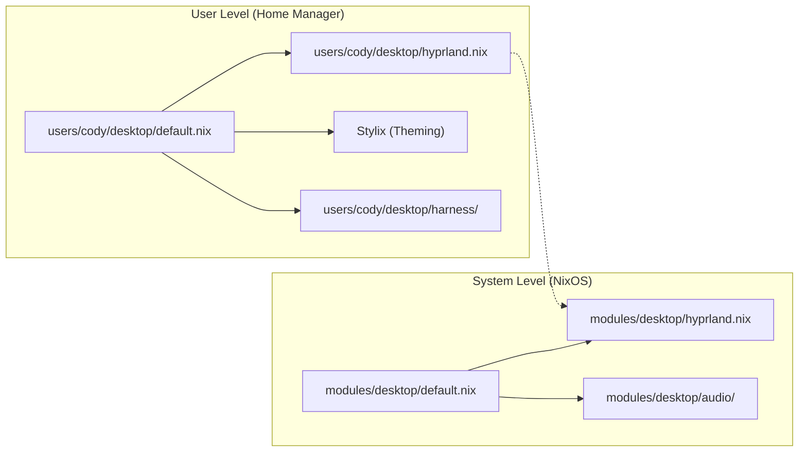
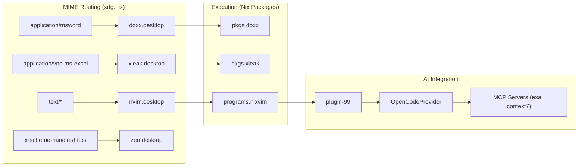

# Desktop Environment
Relevant source files
- [modules/desktop/default.nix](https://github.com/Cody-W-Tucker/nix-config/blob/5a76c557/modules/desktop/default.nix)
- [users/cody/desktop/default.nix](https://github.com/Cody-W-Tucker/nix-config/blob/5a76c557/users/cody/desktop/default.nix)
- [users/cody/desktop/editor/nixvim/plugins/99.nix](https://github.com/Cody-W-Tucker/nix-config/blob/5a76c557/users/cody/desktop/editor/nixvim/plugins/99.nix)
- [users/cody/desktop/harness/mcp.nix](https://github.com/Cody-W-Tucker/nix-config/blob/5a76c557/users/cody/desktop/harness/mcp.nix)
- [users/cody/desktop/hyprland.nix](https://github.com/Cody-W-Tucker/nix-config/blob/5a76c557/users/cody/desktop/hyprland.nix)
- [users/cody/desktop/xdg.nix](https://github.com/Cody-W-Tucker/nix-config/blob/5a76c557/users/cody/desktop/xdg.nix)

The CodyOS desktop environment is a highly integrated, Wayland-native stack centered around the **Hyprland** compositor. It bridges system-level hardware enablement with a declarative user-level configuration managed via **Home Manager**. The environment is characterized by its "AI-first" design, integrating LLM orchestration, voice interfaces, and automated knowledge management directly into the shell and editor.

## System and User Module Hierarchy

The desktop configuration is split between system-level modules (NixOS) and user-level modules (Home Manager). System modules handle hardware acceleration, display managers, and core services like Syncthing and Printing. User modules define the look-and-feel, application settings, and AI toolchains.

### Desktop Module Structure

| Level | Path | Responsibility |
| --- | --- | --- |
| **System** | `modules/desktop/default.nix` | Graphics drivers, GVFS, UDisks, global packages, and firewall rules for desktop services. |
| **User** | `users/cody/desktop/default.nix` | Window manager settings, status bars, terminal emulators, and AI-integrated programs. |

**Sources:**

- [modules/desktop/default.nix1-12](https://github.com/Cody-W-Tucker/nix-config/blob/5a76c557/modules/desktop/default.nix#L1-L12)
- [users/cody/desktop/default.nix8-22](https://github.com/Cody-W-Tucker/nix-config/blob/5a76c557/users/cody/desktop/default.nix#L8-L22)

---

## Component Overviews

### Hyprland Window Manager

The core compositor is Hyprland, managed via the Universal Wayland Session Manager (**UWSM**) for robust session lifecycle handling. It utilizes a custom `hardwareConfig` abstraction to handle monitor layouts and power management timeouts (e.g., `suspendTimeout`) across different physical hosts.

- **For details, see [Hyprland Window Manager](/Cody-W-Tucker/nix-config/4.1-hyprland-window-manager)**

**Sources:**

- [users/cody/desktop/hyprland.nix23-33](https://github.com/Cody-W-Tucker/nix-config/blob/5a76c557/users/cody/desktop/hyprland.nix#L23-L33)
- [users/cody/desktop/hyprland.nix67-71](https://github.com/Cody-W-Tucker/nix-config/blob/5a76c557/users/cody/desktop/hyprland.nix#L67-L71)

### Waybar and Desktop Utilities

The status bar (**Waybar**) acts as the primary HUD, featuring a custom `hermes-voice` module for voice-activated LLM interactions. The utility stack includes `cliphist` for clipboard management and a custom `screenshot-ocr` script that pipes text from images directly to the Wayland clipboard.

- **For details, see [Waybar and Desktop Utilities](/Cody-W-Tucker/nix-config/4.2-waybar-and-desktop-utilities)**

**Sources:**

- [users/cody/desktop/default.nix48-56](https://github.com/Cody-W-Tucker/nix-config/blob/5a76c557/users/cody/desktop/default.nix#L48-L56)
- [users/cody/desktop/default.nix85-96](https://github.com/Cody-W-Tucker/nix-config/blob/5a76c557/users/cody/desktop/default.nix#L85-L96)

### Audio, Printing, and Hardware

Audio is handled by **PipeWire**, with `pavucontrol` and `playerctl` provided for management. The system supports specialized hardware tuning for AMD Strix Halo platforms and integrates CUPS for printing and standard WiFi networking modules.

- **For details, see [Audio, Printing, and Hardware](/Cody-W-Tucker/nix-config/4.3-audio-printing-and-hardware)**

**Sources:**

- [modules/desktop/default.nix5-10](https://github.com/Cody-W-Tucker/nix-config/blob/5a76c557/modules/desktop/default.nix#L5-L10)
- [users/cody/desktop/default.nix25-27](https://github.com/Cody-W-Tucker/nix-config/blob/5a76c557/users/cody/desktop/default.nix#L25-L27)

### User Programs and Shell Environment

The environment defines a strict XDG MIME routing policy, ensuring that files open in preferred applications (e.g., `zen` for web, `nvim` for text, and specialized viewers like `xleak` for spreadsheets). It includes the `kitty` terminal and `zsh` as the primary shell.

- **For details, see [User Programs and Shell Environment](/Cody-W-Tucker/nix-config/4.4-user-programs-and-shell-environment)**

**Sources:**

- [users/cody/desktop/xdg.nix49-89](https://github.com/Cody-W-Tucker/nix-config/blob/5a76c557/users/cody/desktop/xdg.nix#L49-L89)
- [users/cody/desktop/default.nix24-26](https://github.com/Cody-W-Tucker/nix-config/blob/5a76c557/users/cody/desktop/default.nix#L24-L26)

### Neovim (NixVim) Editor

The editor is a declaratively configured NixVim instance. Its standout feature is the `99` AI plugin, which connects to the `OpenCodeProvider` to provide context-aware code completions and AI assistance using local or remote models.

- **For details, see [Neovim (NixVim) Editor](/Cody-W-Tucker/nix-config/4.5-neovim-(nixvim)-editor)**

**Sources:**

- [users/cody/desktop/editor/nixvim/plugins/99.nix10-25](https://github.com/Cody-W-Tucker/nix-config/blob/5a76c557/users/cody/desktop/editor/nixvim/plugins/99.nix#L10-L25)

### Obsidian Knowledge Base

Obsidian is treated as a first-class citizen, with its configuration and plugin data managed through Nix. It serves as the primary "Knowledge Vault" (`$HOME/Knowledge/Personal`) that AI agents reference to maintain context about the user's projects and thoughts.

- **For details, see [Obsidian Knowledge Base](/Cody-W-Tucker/nix-config/4.6-obsidian-knowledge-base)**

**Sources:**

- [users/cody/desktop/xdg.nix11-13](https://github.com/Cody-W-Tucker/nix-config/blob/5a76c557/users/cody/desktop/xdg.nix#L11-L13)

---

## Desktop Environment Integration Map

This diagram illustrates how user-level desktop entries and MIME types map to specific system packages and AI tools.

**Sources:**

- [users/cody/desktop/xdg.nix51-89](https://github.com/Cody-W-Tucker/nix-config/blob/5a76c557/users/cody/desktop/xdg.nix#L51-L89)
- [users/cody/desktop/editor/nixvim/plugins/99.nix13-15](https://github.com/Cody-W-Tucker/nix-config/blob/5a76c557/users/cody/desktop/editor/nixvim/plugins/99.nix#L13-L15)
- [users/cody/desktop/harness/mcp.nix5-30](https://github.com/Cody-W-Tucker/nix-config/blob/5a76c557/users/cody/desktop/harness/mcp.nix#L5-L30)