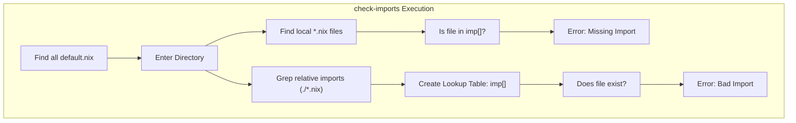
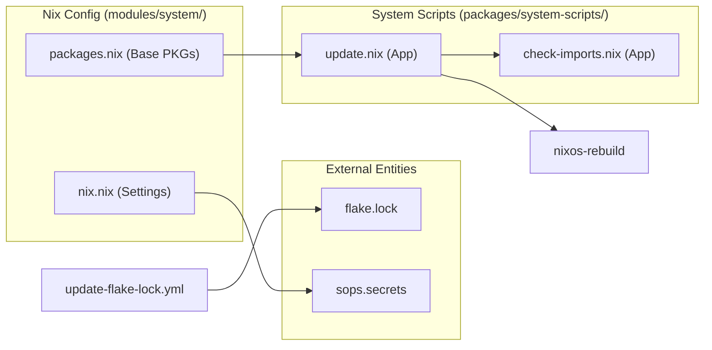

# Getting Started: Building and Updating the System
Relevant source files
- [.github/workflows/update-flake-lock.yml](https://github.com/Cody-W-Tucker/nix-config/blob/5a76c557/.github/workflows/update-flake-lock.yml)
- [modules/system/nix.nix](https://github.com/Cody-W-Tucker/nix-config/blob/5a76c557/modules/system/nix.nix)
- [modules/system/packages.nix](https://github.com/Cody-W-Tucker/nix-config/blob/5a76c557/modules/system/packages.nix)
- [packages/system-scripts/check-imports.nix](https://github.com/Cody-W-Tucker/nix-config/blob/5a76c557/packages/system-scripts/check-imports.nix)
- [packages/system-scripts/default.nix](https://github.com/Cody-W-Tucker/nix-config/blob/5a76c557/packages/system-scripts/default.nix)
- [packages/system-scripts/update.nix](https://github.com/Cody-W-Tucker/nix-config/blob/5a76c557/packages/system-scripts/update.nix)

This guide provides the practical procedures for managing the CodyOS lifecycle. It covers the validation of configuration changes, the automated update pipeline, secret management via SOPS, and the specialized scripts used to maintain repository integrity.

## System Build and Validation

The primary method for applying changes to a host is through `nixos-rebuild`. Before applying changes, engineers should validate the configuration to prevent broken states.

### Testing Changes

To test a configuration without applying it to the bootloader or the running system, use the `dry-run` or `build` operations:

- **Dry Run:**`sudo nixos-rebuild dry-run --flake .#<hostname>`
- **Build:**`nixos-rebuild build --flake .#<hostname>` (This creates a `result` link in the current directory containing the system closure).

### The Update Script

The repository provides a centralized `update` script to standardize the deployment workflow. This script automates formatting, integrity checks, and git synchronization.

**Implementation Detail:**
The `update` script is defined as a `pkgs.writeShellApplication` in [packages/system-scripts/update.nix6-36](https://github.com/Cody-W-Tucker/nix-config/blob/5a76c557/packages/system-scripts/update.nix#L6-L36) It is automatically included in the system path via the `environment.systemPackages` list in [packages/system-scripts/default.nix17](https://github.com/Cody-W-Tucker/nix-config/blob/5a76c557/packages/system-scripts/default.nix#L17-L17)

**Workflow Logic:**

1. **Format:** Runs `nix fmt` on the repository [packages/system-scripts/update.nix18](https://github.com/Cody-W-Tucker/nix-config/blob/5a76c557/packages/system-scripts/update.nix#L18-L18)
2. **Validate:** Executes `check-imports` to ensure no dangling `.nix` files exist [packages/system-scripts/update.nix21](https://github.com/Cody-W-Tucker/nix-config/blob/5a76c557/packages/system-scripts/update.nix#L21-L21)
3. **Commit:** Prompts for a commit message and commits all changes to the local git state [packages/system-scripts/update.nix23-32](https://github.com/Cody-W-Tucker/nix-config/blob/5a76c557/packages/system-scripts/update.nix#L23-L32)
4. **Rebuild:** Executes `sudo nixos-rebuild switch` to apply the new configuration [packages/system-scripts/update.nix33](https://github.com/Cody-W-Tucker/nix-config/blob/5a76c557/packages/system-scripts/update.nix#L33-L33)
5. **Push:** Synchronizes the local repository with the remote origin [packages/system-scripts/update.nix34](https://github.com/Cody-W-Tucker/nix-config/blob/5a76c557/packages/system-scripts/update.nix#L34-L34)

**Sources:**

- [packages/system-scripts/update.nix1-36](https://github.com/Cody-W-Tucker/nix-config/blob/5a76c557/packages/system-scripts/update.nix#L1-L36)
- [packages/system-scripts/default.nix1-19](https://github.com/Cody-W-Tucker/nix-config/blob/5a76c557/packages/system-scripts/default.nix#L1-L19)

---

## Repository Integrity: `check-imports`

A common failure mode in Nix flakes is adding a new `.nix` file to a directory but forgetting to add it to the `imports` list in the corresponding `default.nix`. The `check-imports` utility prevents this.

### Validation Logic

The script performs two primary checks:

1. **Orphaned Files:** It finds all `.nix` files in a directory containing a `default.nix` and verifies they are referenced in that `default.nix`[packages/system-scripts/check-imports.nix49-54](https://github.com/Cody-W-Tucker/nix-config/blob/5a76c557/packages/system-scripts/check-imports.nix#L49-L54)
2. **Broken Links:** It verifies that every relative import (e.g., `./module.nix`) in a `default.nix` actually points to an existing file [packages/system-scripts/check-imports.nix57-61](https://github.com/Cody-W-Tucker/nix-config/blob/5a76c557/packages/system-scripts/check-imports.nix#L57-L61)

### Technical Implementation

The script uses `findutils` and `grep` to parse the AST-lite of the Nix files.

**Data Flow: Import Validation**

**Sources:**

- [packages/system-scripts/check-imports.nix1-76](https://github.com/Cody-W-Tucker/nix-config/blob/5a76c557/packages/system-scripts/check-imports.nix#L1-L76)

---

## Secret Management with SOPS

CodyOS uses `sops-nix` for secret management. Secrets are encrypted with Age keys and decrypted at runtime.

### Private Flake Integration

To access private resources, such as the `nixos-secrets` repository, the system configures GitHub access tokens via SOPS templates.

**Implementation in `modules/system/nix.nix`:**

1. **Secret Declaration:** The system expects a secret named `github-nix-secrets-read`[modules/system/nix.nix8](https://github.com/Cody-W-Tucker/nix-config/blob/5a76c557/modules/system/nix.nix#L8-L8)
2. **Template Generation:** A configuration file `nix-access-tokens.conf` is generated, injecting the decrypted token into a format Nix understands: `access-tokens = github.com=${token}`[modules/system/nix.nix9-16](https://github.com/Cody-W-Tucker/nix-config/blob/5a76c557/modules/system/nix.nix#L9-L16)
3. **Nix Integration:** The system Nix configuration includes this generated file via `extraOptions`[modules/system/nix.nix19-21](https://github.com/Cody-W-Tucker/nix-config/blob/5a76c557/modules/system/nix.nix#L19-L21)

**Sources:**

- [modules/system/nix.nix8-21](https://github.com/Cody-W-Tucker/nix-config/blob/5a76c557/modules/system/nix.nix#L8-L21)

---

## Automated Maintenance (CI)

The repository uses GitHub Actions to ensure the `flake.lock` file remains current and that the configuration remains buildable.

### Flake Lock Update Workflow

A scheduled workflow runs every Sunday at 4:00 AM UTC [.github/workflows/update-flake-lock.yml5](https://github.com/Cody-W-Tucker/nix-config/blob/5a76c557/.github/workflows/update-flake-lock.yml#L5-L5)

**CI Pipeline Steps:**

1. **Update:** Runs `nix flake update` to pull the latest versions of all inputs [.github/workflows/update-flake-lock.yml25](https://github.com/Cody-W-Tucker/nix-config/blob/5a76c557/.github/workflows/update-flake-lock.yml#L25-L25)
2. **Check:** Executes `nix flake check` to ensure the new lockfile doesn't break the flake evaluation [.github/workflows/update-flake-lock.yml27](https://github.com/Cody-W-Tucker/nix-config/blob/5a76c557/.github/workflows/update-flake-lock.yml#L27-L27)
3. **PR Creation:** If changes are detected, it opens a Pull Request with the label `dependencies`[.github/workflows/update-flake-lock.yml31-42](https://github.com/Cody-W-Tucker/nix-config/blob/5a76c557/.github/workflows/update-flake-lock.yml#L31-L42)

### Garbage Collection

To prevent the Nix store from consuming excessive disk space, automatic garbage collection is configured at the system level in [modules/system/nix.nix37-41](https://github.com/Cody-W-Tucker/nix-config/blob/5a76c557/modules/system/nix.nix#L37-L41) It is set to run **weekly** and delete any generations older than **7 days**.

**Sources:**

- [.github/workflows/update-flake-lock.yml1-43](https://github.com/Cody-W-Tucker/nix-config/blob/5a76c557/.github/workflows/update-flake-lock.yml#L1-L43)
- [modules/system/nix.nix37-41](https://github.com/Cody-W-Tucker/nix-config/blob/5a76c557/modules/system/nix.nix#L37-L41)

---

## System Configuration Map

The following diagram maps the relationship between the management scripts and the system configuration entities.

**Entity Mapping: Build and Update Tools**

**Sources:**

- [packages/system-scripts/update.nix7-13](https://github.com/Cody-W-Tucker/nix-config/blob/5a76c557/packages/system-scripts/update.nix#L7-L13)
- [modules/system/nix.nix1-43](https://github.com/Cody-W-Tucker/nix-config/blob/5a76c557/modules/system/nix.nix#L1-L43)
- [modules/system/packages.nix1-11](https://github.com/Cody-W-Tucker/nix-config/blob/5a76c557/modules/system/packages.nix#L1-L11)
- [.github/workflows/update-flake-lock.yml1-43](https://github.com/Cody-W-Tucker/nix-config/blob/5a76c557/.github/workflows/update-flake-lock.yml#L1-L43)