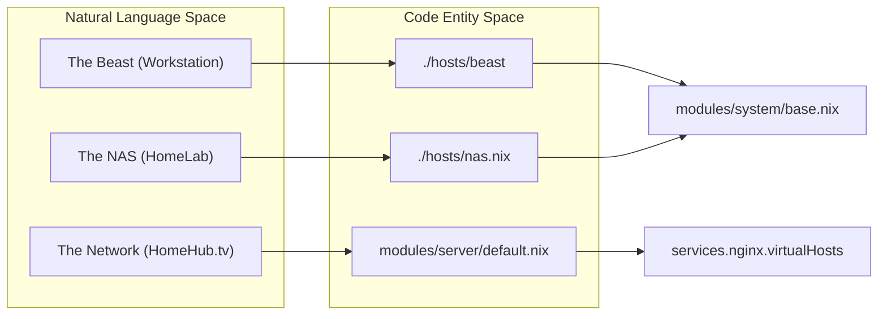
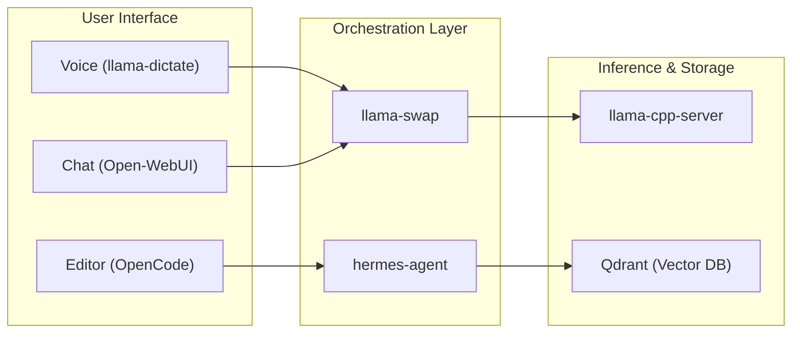

# Glossary

This page provides definitions for codebase-specific terms, jargon, and domain concepts used throughout CodyOS. It serves as a technical reference for onboarding engineers to understand how abstract names in the documentation map to concrete Nix expressions and system services.

## Core Infrastructure Terms

| Term        | Definition                                                                      | Implementation Pointer                                                                                                                          |
| ----------- | ------------------------------------------------------------------------------- | ----------------------------------------------------------------------------------------------------------------------------------------------- |
| **Beast**   | The high-performance desktop workstation host (Intel i9-14900KF / NVIDIA 3070). | [flake.nix117-120](../flake.nix#L117-L120)                                               |
| **NAS**     | The home lab / NAS host (Intel i5-14400F, NVIDIA GTX 1650) providing centralized services. | [flake.nix115-121](../flake.nix#L115-L121)                                              |
| **HomeHub** | The primary domain (`homehub.tv`) used for internal web services.               | [modules/server/homepage-dashboard.nix2](../modules/server/homepage-dashboard.nix#L2-L2) |
| **Stylix**  | The system-wide theming engine used to unify colors across CLI and GUI.         | [flake.nix42-46](../flake.nix#L42-L46)                                                   |
| **SOPS**    | Secrets Operations; used for encrypted secret management within the flake.      | [flake.nix11-15](../flake.nix#L11-L15)                                                   |

**Architecture Mapping: Infrastructure to Code**

Sources: [flake.nix110-122](../flake.nix#L110-L122)[hosts/nas.nix11-17](../hosts/nas.nix#L11-L17)[modules/server/default.nix52-135](../modules/server/default.nix#L52-L135)

## AI & Agent Domain Concepts

### Hermes Agent

The primary autonomous assistant. It is a complex service involving multiple sub-modules for skills, toolsets, and memory.

- **SkillPack**: A collection of tools/functions available to Hermes.
- **Holographic Memory**: The persistence layer for the agent's long-term context.
- **CRM_DB**: The database path for the CLI-first CRM used by the agent.

### llama-swap

A custom orchestration service that manages LLM (Large Language Model) lifecycles. It supports TTL-based (Time-To-Live) swapping of models to optimize VRAM usage.

- **Model Catalog**: Defined in `models.nix`, specifying parameters like `gpuLayers`, `contextSize`, and `ttl`.
- **Resident Model**: A model with `ttl = 0`, meaning it stays in VRAM indefinitely.

### OpenCode

The AI coding harness integrated into Neovim and the desktop environment. It provides specialized agents (e.g., `verify-alignment`, `business`) and sub-agents for development tasks.

**Logic Flow: AI Service Interaction**

Sources: [modules/services/hermes-agent/default.nix129-133](../modules/services/hermes-agent/default.nix#L129-L133)[modules/services/llama-swap/models.nix1-66](../modules/services/llama-swap/models.nix#L1-L66)[users/cody/desktop/hyprland/settings.nix82-86](../users/cody/desktop/hyprland/settings.nix#L82-L86)

## Server & Media Jargon

- **Arr Suite**: Refers to the collection of media management tools: `Sonarr` (TV), `Radarr` (Movies), `Readarr` (Books), `Lidarr` (Music), and `Prowlarr` (Indexers). [modules/server/media.nix69-97](../modules/server/media.nix#L69-L97)
- **VPN Confinement**: A mechanism using network namespaces to force specific services (like `transmission`) to only communicate via a Wireguard interface. [modules/server/media.nix161-183](../modules/server/media.nix#L161-L183)
- **Kobo Sync**: A specialized configuration for `calibre-web` to allow e-readers to synchronize libraries over the network. [modules/server/media.nix44-53](../modules/server/media.nix#L44-L53)
- **Miniflux Curator**: A Python-based automation script that uses LLM embeddings to score RSS articles and auto-read low-relevance content. [modules/server/content.nix42-57](../modules/server/content.nix#L42-L57)
- **ACME/Cloudflare**: The automated pipeline for generating wildcard SSL certificates for `*.homehub.tv` using DNS-01 challenges. [modules/server/default.nix27-43](../modules/server/default.nix#L27-L43)

## Desktop & Environment Terms

- **Special Workspaces**: Hyprland "scratchpads" used for persistent background tasks like `special:ai`, `special:dev`, and `special:chat`. [users/cody/desktop/hyprland/settings.nix23-30](../users/cody/desktop/hyprland/settings.nix#L23-L30)
- **MainMod**: The primary modifier key for desktop shortcuts, defined as `SUPER` (Windows key). [users/cody/desktop/hyprland/settings.nix9](../users/cody/desktop/hyprland/settings.nix#L9-L9)
- **Focus-or-Run**: A custom script logic that either switches focus to an existing window of a specific class or launches the application if not found. [users/cody/desktop/hyprland/settings.nix15](../users/cody/desktop/hyprland/settings.nix#L15-L15)
- **Hermes Voice**: The Waybar module providing visual feedback for the voice-activated LLM interface (VAD, STT, TTS).

