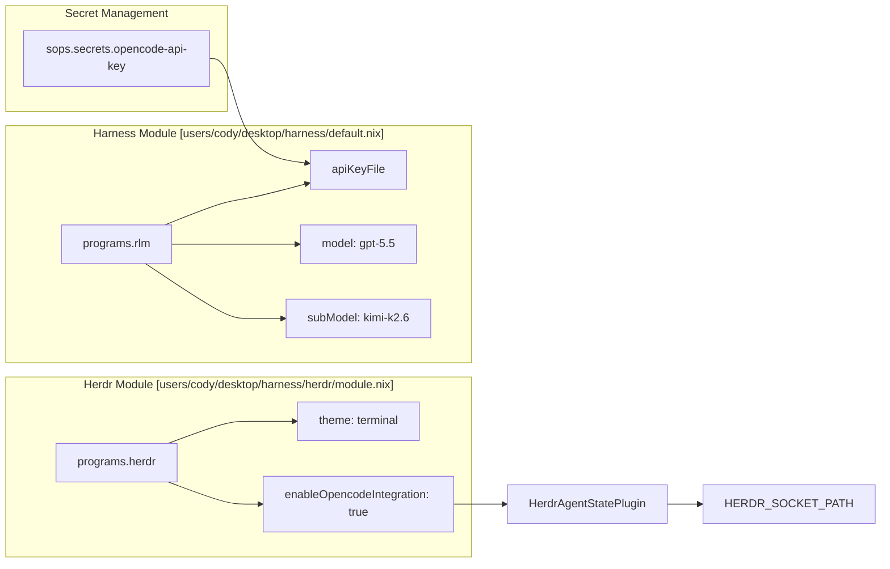
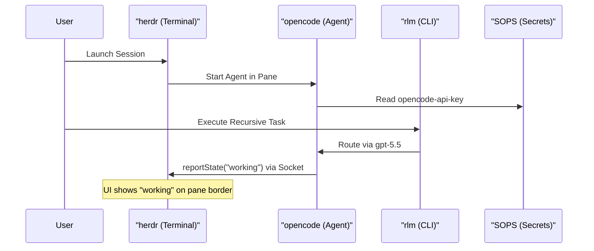

# Herdr and RLM Agent Multiplexers
Relevant source files
- [flake.lock](https://github.com/Cody-W-Tucker/nix-config/blob/5a76c557/flake.lock)
- [flake.nix](https://github.com/Cody-W-Tucker/nix-config/blob/5a76c557/flake.nix)
- [modules/services/hermes-agent/default.nix](https://github.com/Cody-W-Tucker/nix-config/blob/5a76c557/modules/services/hermes-agent/default.nix)
- [users/cody/desktop/harness/default.nix](https://github.com/Cody-W-Tucker/nix-config/blob/5a76c557/users/cody/desktop/harness/default.nix)
- [users/cody/desktop/harness/herdr/default.nix](https://github.com/Cody-W-Tucker/nix-config/blob/5a76c557/users/cody/desktop/harness/herdr/default.nix)
- [users/cody/desktop/harness/herdr/module.nix](https://github.com/Cody-W-Tucker/nix-config/blob/5a76c557/users/cody/desktop/harness/herdr/module.nix)
- [users/cody/desktop/harness/opencode/tools/rtk/default.nix](https://github.com/Cody-W-Tucker/nix-config/blob/5a76c557/users/cody/desktop/harness/opencode/tools/rtk/default.nix)

This section covers the configuration and integration of **herdr** and **rlm**, two specialized tools used for managing and interacting with AI agents within the CodyOS ecosystem. While `herdr` provides a terminal-native multiplexing environment for agents, `rlm` (Recursive Language Model) serves as a CLI for structured, model-routed interactions. Both are integrated into the desktop environment via Home Manager and utilize SOPS for secure API key management.

## 1. Herdr: Terminal-Native Agent Multiplexer

`herdr` is a terminal multiplexer designed specifically for AI agents. It allows for multiple agent sessions to run in parallel panes, providing status tracking and notification delivery. In CodyOS, `herdr` is configured via a custom Home Manager module that handles package installation, theme synchronization with Stylix, and deep integration with the `opencode` agent.

### 1.1 Configuration and Stylix Integration

The `herdr` configuration is managed in `users/cody/desktop/harness/herdr/default.nix`[users/cody/desktop/harness/herdr/default.nix10-41](https://github.com/Cody-W-Tucker/nix-config/blob/5a76c557/users/cody/desktop/harness/herdr/default.nix#L10-L41) It leverages the `config.lib.stylix.colors` attribute to map the system-wide Catppuccin-based palette to `herdr`'s custom theme fields, ensuring visual consistency across the terminal [users/cody/desktop/harness/herdr/default.nix18-40](https://github.com/Cody-W-Tucker/nix-config/blob/5a76c557/users/cody/desktop/harness/herdr/default.nix#L18-L40)

### 1.2 OpenCode Integration Plugin

A critical feature of the `herdr` setup is the `HerdrAgentStatePlugin`[users/cody/desktop/harness/herdr/module.nix106-167](https://github.com/Cody-W-Tucker/nix-config/blob/5a76c557/users/cody/desktop/harness/herdr/module.nix#L106-L167) This TypeScript plugin is injected into the OpenCode configuration to report agent states (working, idle, blocked) back to the `herdr` server via a Unix socket defined by `HERDR_SOCKET_PATH`[users/cody/desktop/harness/herdr/module.nix57-86](https://github.com/Cody-W-Tucker/nix-config/blob/5a76c557/users/cody/desktop/harness/herdr/module.nix#L57-L86)

**Data Flow: Agent State Reporting**

| Step | Component | Action | Code Reference |
| --- | --- | --- | --- |
| 1 | `opencode` | Detects event (e.g., `permission.asked`) | [users/cody/desktop/harness/herdr/module.nix125-128](https://github.com/Cody-W-Tucker/nix-config/blob/5a76c557/users/cody/desktop/harness/herdr/module.nix#L125-L128) |
| 2 | `HerdrAgentStatePlugin` | Calls `reportState("blocked", sessionID)` | [users/cody/desktop/harness/herdr/module.nix55-104](https://github.com/Cody-W-Tucker/nix-config/blob/5a76c557/users/cody/desktop/harness/herdr/module.nix#L55-L104) |
| 3 | Unix Socket | Sends JSON-RPC request to `HERDR_SOCKET_PATH` | [users/cody/desktop/harness/herdr/module.nix82-91](https://github.com/Cody-W-Tucker/nix-config/blob/5a76c557/users/cody/desktop/harness/herdr/module.nix#L82-L91) |
| 4 | `herdr` UI | Updates pane border with agent status | [users/cody/desktop/harness/herdr/module.nix217-221](https://github.com/Cody-W-Tucker/nix-config/blob/5a76c557/users/cody/desktop/harness/herdr/module.nix#L217-L221) |

**Sources:**

- [users/cody/desktop/harness/herdr/module.nix9-169](https://github.com/Cody-W-Tucker/nix-config/blob/5a76c557/users/cody/desktop/harness/herdr/module.nix#L9-L169)
- [users/cody/desktop/harness/herdr/default.nix1-43](https://github.com/Cody-W-Tucker/nix-config/blob/5a76c557/users/cody/desktop/harness/herdr/default.nix#L1-L43)

---

## 2. RLM: Recursive Language Model CLI

`rlm` is a local CLI tool used for recursive language model operations. In the CodyOS harness, it is configured to route requests through the OpenCode API gateway, utilizing high-performance models for complex reasoning.

### 2.1 Model Routing and API Management

The `rlm` configuration defines a primary model and a sub-model for fallback or specialized tasks.

- **Primary Model:**`gpt-5.5`[users/cody/desktop/harness/default.nix31](https://github.com/Cody-W-Tucker/nix-config/blob/5a76c557/users/cody/desktop/harness/default.nix#L31-L31)
- **Sub-Model:**`kimi-k2.6`[users/cody/desktop/harness/default.nix32](https://github.com/Cody-W-Tucker/nix-config/blob/5a76c557/users/cody/desktop/harness/default.nix#L32-L32)
- **Endpoint:**`https://opencode.ai/zen/v1`[users/cody/desktop/harness/default.nix33](https://github.com/Cody-W-Tucker/nix-config/blob/5a76c557/users/cody/desktop/harness/default.nix#L33-L33)

API keys are managed via SOPS. The `opencode-api-key` secret is declared in the harness and passed to `rlm` via the `apiKeyFile` option [users/cody/desktop/harness/default.nix26-30](https://github.com/Cody-W-Tucker/nix-config/blob/5a76c557/users/cody/desktop/harness/default.nix#L26-L30)

### 2.2 Workspace Integration

`rlm` and `herdr` are primarily utilized within the `special:dev` workspace in Hyprland. This workspace is dedicated to development and agent orchestration, allowing the user to toggle a terminal environment containing `herdr` panes where `rlm` or `opencode` sessions are active.

**Code Entity Space: Harness Configuration**

**Sources:**

- [users/cody/desktop/harness/default.nix26-35](https://github.com/Cody-W-Tucker/nix-config/blob/5a76c557/users/cody/desktop/harness/default.nix#L26-L35)
- [users/cody/desktop/harness/herdr/module.nix171-240](https://github.com/Cody-W-Tucker/nix-config/blob/5a76c557/users/cody/desktop/harness/herdr/module.nix#L171-L240)

---

## 3. Implementation Details

### 3.1 Herdr Module Logic

The `herdr` module generates a `config.toml` file from the `settings` Nix attribute set using `pkgs.formats.toml`[users/cody/desktop/harness/herdr/module.nix11-184](https://github.com/Cody-W-Tucker/nix-config/blob/5a76c557/users/cody/desktop/harness/herdr/module.nix#L11-L184) It also handles the installation of the `opencode` integration by writing the `HerdrAgentStatePlugin` source code to the `.config/opencode/plugins/` directory if `enableOpencodeIntegration` is true [users/cody/desktop/harness/herdr/module.nix235-239](https://github.com/Cody-W-Tucker/nix-config/blob/5a76c557/users/cody/desktop/harness/herdr/module.nix#L235-L239)

### 3.2 Agent State Mapping

The integration plugin maps internal OpenCode events to `herdr` states:

- `permission.asked` / `question.asked` $\rightarrow$ `blocked`[users/cody/desktop/harness/herdr/module.nix125-128](https://github.com/Cody-W-Tucker/nix-config/blob/5a76c557/users/cody/desktop/harness/herdr/module.nix#L125-L128)
- `session.status (busy/retry)` $\rightarrow$ `working`[users/cody/desktop/harness/herdr/module.nix152-154](https://github.com/Cody-W-Tucker/nix-config/blob/5a76c557/users/cody/desktop/harness/herdr/module.nix#L152-L154)
- `session.idle` $\rightarrow$ `idle`[users/cody/desktop/harness/herdr/module.nix159-161](https://github.com/Cody-W-Tucker/nix-config/blob/5a76c557/users/cody/desktop/harness/herdr/module.nix#L159-L161)

**System Component Interaction**

**Sources:**

- [users/cody/desktop/harness/herdr/module.nix124-165](https://github.com/Cody-W-Tucker/nix-config/blob/5a76c557/users/cody/desktop/harness/herdr/module.nix#L124-L165)
- [users/cody/desktop/harness/default.nix26-34](https://github.com/Cody-W-Tucker/nix-config/blob/5a76c557/users/cody/desktop/harness/default.nix#L26-L34)
- [flake.nix87-95](https://github.com/Cody-W-Tucker/nix-config/blob/5a76c557/flake.nix#L87-L95)