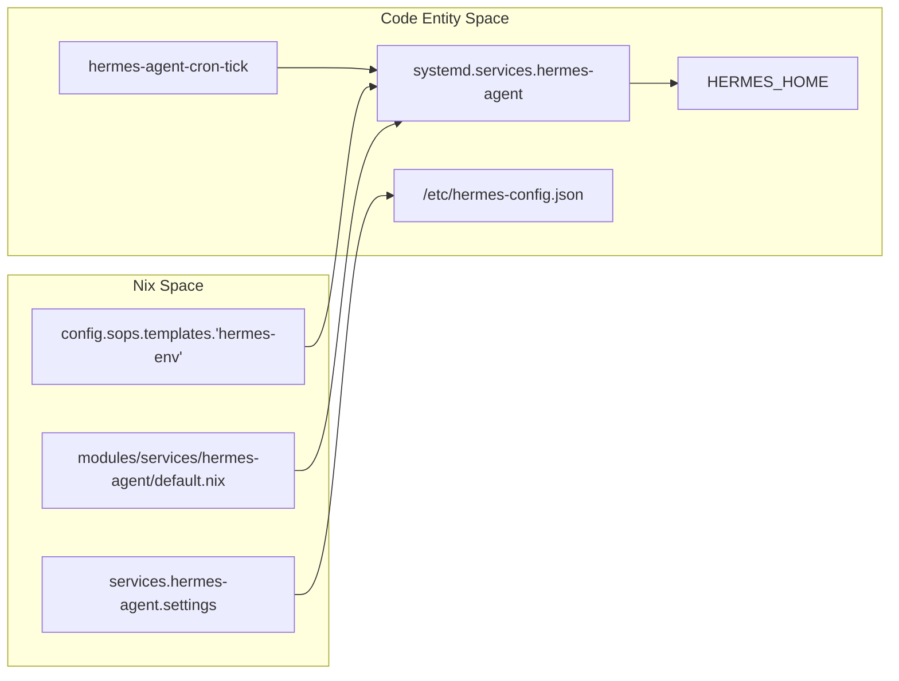
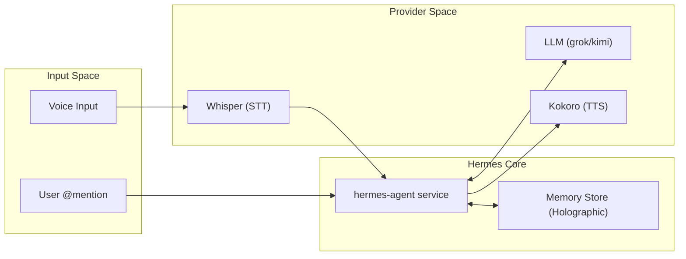

# Hermes Agent
Relevant source files
- [flake.lock](https://github.com/Cody-W-Tucker/nix-config/blob/5a76c557/flake.lock)
- [flake.nix](https://github.com/Cody-W-Tucker/nix-config/blob/5a76c557/flake.nix)
- [modules/services/hermes-agent/AGENTS.md](https://github.com/Cody-W-Tucker/nix-config/blob/5a76c557/modules/services/hermes-agent/AGENTS.md?plain=1)
- [modules/services/hermes-agent/default.nix](https://github.com/Cody-W-Tucker/nix-config/blob/5a76c557/modules/services/hermes-agent/default.nix)
- [modules/services/hermes-agent/mcp/default.nix](https://github.com/Cody-W-Tucker/nix-config/blob/5a76c557/modules/services/hermes-agent/mcp/default.nix)
- [modules/services/hermes-agent/package/default.nix](https://github.com/Cody-W-Tucker/nix-config/blob/5a76c557/modules/services/hermes-agent/package/default.nix)
- [modules/services/hermes-agent/package/patches/auth-store-group-access.patch](https://github.com/Cody-W-Tucker/nix-config/blob/5a76c557/modules/services/hermes-agent/package/patches/auth-store-group-access.patch)
- [modules/services/hermes-agent/package/patches/hermes-home-group-access.patch](https://github.com/Cody-W-Tucker/nix-config/blob/5a76c557/modules/services/hermes-agent/package/patches/hermes-home-group-access.patch)
- [modules/services/hermes-agent/runtime/cron-tick.nix](https://github.com/Cody-W-Tucker/nix-config/blob/5a76c557/modules/services/hermes-agent/runtime/cron-tick.nix)
- [modules/services/hermes-agent/runtime/default.nix](https://github.com/Cody-W-Tucker/nix-config/blob/5a76c557/modules/services/hermes-agent/runtime/default.nix)
- [modules/services/hermes-agent/secrets/default.nix](https://github.com/Cody-W-Tucker/nix-config/blob/5a76c557/modules/services/hermes-agent/secrets/default.nix)

The Hermes Agent is a sophisticated AI infrastructure layer integrated into CodyOS as a first-class NixOS service. It provides an autonomous agentic interface capable of interacting with the system, managing knowledge via Obsidian, and executing business logic through specialized toolsets. Unlike a standard application, Hermes is declared as a system-level service with strict environment isolation, secret injection, and a declarative configuration that prevents runtime state drift.

## System Integration Overview

Hermes is implemented as a NixOS wrapper around the `inputs.hermes-agent` flake [flake.nix82-86](https://github.com/Cody-W-Tucker/nix-config/blob/5a76c557/flake.nix#L82-L86) The service is orchestrated through a series of modules that handle the package build, runtime environment, MCP (Model Context Protocol) wiring, and declarative identity documents.

### Hermes Service Architecture

The following diagram illustrates how the Nix declaration transforms into the running `hermes-agent` system entity.

**Nix to Systemd Mapping**

Sources: [modules/services/hermes-agent/default.nix25-63](https://github.com/Cody-W-Tucker/nix-config/blob/5a76c557/modules/services/hermes-agent/default.nix#L25-L63)[modules/services/hermes-agent/runtime/cron-tick.nix13-15](https://github.com/Cody-W-Tucker/nix-config/blob/5a76c557/modules/services/hermes-agent/runtime/cron-tick.nix#L13-L15)

## Core Subsystems

The agent's functionality is partitioned into several distinct subsystems, each managed by specific Nix modules.

### Package, Runtime, and Secrets

The agent uses a customized build of `hermes-agent` that incorporates patches for Linux desktop compatibility and group-based filesystem access [modules/services/hermes-agent/package/default.nix11-32](https://github.com/Cody-W-Tucker/nix-config/blob/5a76c557/modules/services/hermes-agent/package/default.nix#L11-L32) It runs as a systemd service under the `codyt` user [modules/services/hermes-agent/default.nix27-29](https://github.com/Cody-W-Tucker/nix-config/blob/5a76c557/modules/services/hermes-agent/default.nix#L27-L29) with environment variables such as `CRM_DB` and `LD_LIBRARY_PATH` injected at runtime [modules/services/hermes-agent/runtime/default.nix30-33](https://github.com/Cody-W-Tucker/nix-config/blob/5a76c557/modules/services/hermes-agent/runtime/default.nix#L30-L33)

For details, see [Hermes Package, Runtime, and Secrets](/Cody-W-Tucker/nix-config/6.1-hermes-package-runtime-and-secrets).

### Skills and Toolsets

Hermes utilizes a "Skill" architecture to extend its capabilities. These range from "seeded" system skills to complex business skills like Google Workspace and CRM integration. The system supports both "managed" (declarative Nix-provided) and "mutable" (runtime-added) skill packs [modules/services/hermes-agent/AGENTS.md35-36](https://github.com/Cody-W-Tucker/nix-config/blob/5a76c557/modules/services/hermes-agent/AGENTS.md?plain=1#L35-L36) Toolsets define the trust boundaries for external interactions, such as web searching via Firecrawl [modules/services/hermes-agent/default.nix33-35](https://github.com/Cody-W-Tucker/nix-config/blob/5a76c557/modules/services/hermes-agent/default.nix#L33-L35)

For details, see [Hermes Skills and Toolsets](/Cody-W-Tucker/nix-config/6.2-hermes-skills-and-toolsets).

### MCP Integration and Identity

The Model Context Protocol (MCP) allows Hermes to connect to external data sources. A primary example is the `karakeep-mcp` bridge, which allows the agent to interact with the Karakeep bookmark manager using SOPS-backed API keys [modules/services/hermes-agent/mcp/default.nix8-18](https://github.com/Cody-W-Tucker/nix-config/blob/5a76c557/modules/services/hermes-agent/mcp/default.nix#L8-L18) The agent's persona is defined by a "SOUL" document and human profiles, which are provisioned into the agent's state directory [modules/services/hermes-agent/AGENTS.md41-42](https://github.com/Cody-W-Tucker/nix-config/blob/5a76c557/modules/services/hermes-agent/AGENTS.md?plain=1#L41-L42)

For details, see [Hermes MCP Integration and Documents](/Cody-W-Tucker/nix-config/6.3-hermes-mcp-integration-and-documents).

## Data Flow and Interaction

Hermes interacts with multiple providers for inference, transcription (STT), and speech (TTS). While it defaults to `grok-4.3` via xAI, it features a fallback mechanism to `kimi-k2.6` through an `opencode-go` provider [modules/services/hermes-agent/default.nix63-71](https://github.com/Cody-W-Tucker/nix-config/blob/5a76c557/modules/services/hermes-agent/default.nix#L63-L71)

**Hermes Multi-Modal Pipeline**

Sources: [modules/services/hermes-agent/default.nix96-117](https://github.com/Cody-W-Tucker/nix-config/blob/5a76c557/modules/services/hermes-agent/default.nix#L96-L117)[modules/services/hermes-agent/default.nix129-133](https://github.com/Cody-W-Tucker/nix-config/blob/5a76c557/modules/services/hermes-agent/default.nix#L129-L133)

## Key Configuration Files

| File Path | Role |
| --- | --- |
| `modules/services/hermes-agent/default.nix` | Main integration spine and service settings [modules/services/hermes-agent/default.nix1-6](https://github.com/Cody-W-Tucker/nix-config/blob/5a76c557/modules/services/hermes-agent/default.nix#L1-L6) |
| `modules/services/hermes-agent/package/default.nix` | Package build and binary wrappers (`hermes`, `hermes-desktop`) [modules/services/hermes-agent/package/default.nix33-49](https://github.com/Cody-W-Tucker/nix-config/blob/5a76c557/modules/services/hermes-agent/package/default.nix#L33-L49) |
| `modules/services/hermes-agent/runtime/default.nix` | Systemd service configuration and library paths [modules/services/hermes-agent/runtime/default.nix23-40](https://github.com/Cody-W-Tucker/nix-config/blob/5a76c557/modules/services/hermes-agent/runtime/default.nix#L23-L40) |
| `modules/services/hermes-agent/secrets/default.nix` | SOPS secret definitions for Discord, Telegram, and OpenCode [modules/services/hermes-agent/secrets/default.nix4-12](https://github.com/Cody-W-Tucker/nix-config/blob/5a76c557/modules/services/hermes-agent/secrets/default.nix#L4-L12) |
| `modules/services/hermes-agent/AGENTS.md` | Architectural guidance and failure mode documentation [modules/services/hermes-agent/AGENTS.md1-16](https://github.com/Cody-W-Tucker/nix-config/blob/5a76c557/modules/services/hermes-agent/AGENTS.md?plain=1#L1-L16) |

Sources: [modules/services/hermes-agent/default.nix13-22](https://github.com/Cody-W-Tucker/nix-config/blob/5a76c557/modules/services/hermes-agent/default.nix#L13-L22)[modules/services/hermes-agent/AGENTS.md23-36](https://github.com/Cody-W-Tucker/nix-config/blob/5a76c557/modules/services/hermes-agent/AGENTS.md?plain=1#L23-L36)