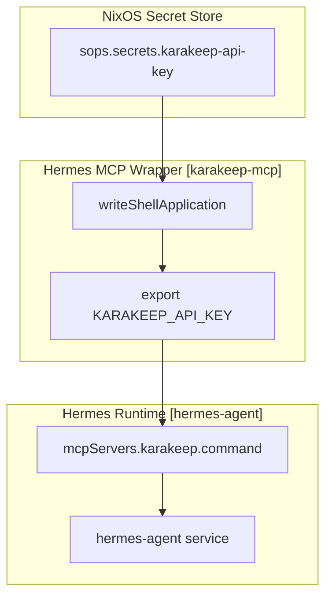
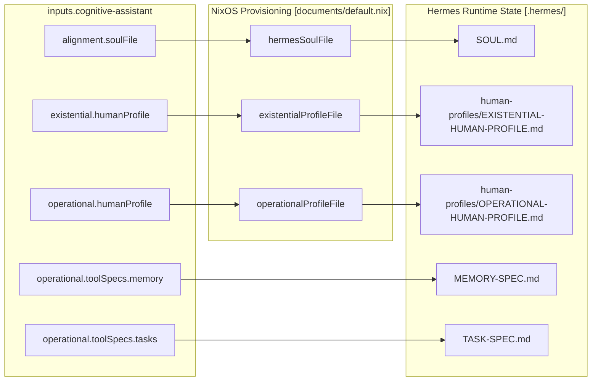

# Hermes MCP Integration and Documents
Relevant source files
- [modules/services/hermes-agent/documents/default.nix](https://github.com/Cody-W-Tucker/nix-config/blob/5a76c557/modules/services/hermes-agent/documents/default.nix)
- [modules/services/hermes-agent/mcp/default.nix](https://github.com/Cody-W-Tucker/nix-config/blob/5a76c557/modules/services/hermes-agent/mcp/default.nix)
- [modules/services/hermes-agent/package/default.nix](https://github.com/Cody-W-Tucker/nix-config/blob/5a76c557/modules/services/hermes-agent/package/default.nix)
- [modules/services/hermes-agent/runtime/default.nix](https://github.com/Cody-W-Tucker/nix-config/blob/5a76c557/modules/services/hermes-agent/runtime/default.nix)
- [modules/services/hermes-agent/skills/AGENTS.md](https://github.com/Cody-W-Tucker/nix-config/blob/5a76c557/modules/services/hermes-agent/skills/AGENTS.md?plain=1)
- [users/cody/desktop/harness/opencode/default.nix](https://github.com/Cody-W-Tucker/nix-config/blob/5a76c557/users/cody/desktop/harness/opencode/default.nix)

The Hermes Agent's intelligence is anchored by a sophisticated document provisioning system and the Model Context Protocol (MCP). This integration ensures that the agent possesses a consistent identity, adheres to specific operational protocols, and can interact with external services like Karakeep through secure, secret-injected bridges.

## Model Context Protocol (MCP) Integration

Hermes utilizes the Model Context Protocol to extend its capabilities via external servers. The integration pattern focuses on secure secret injection and runtime isolation.

### Karakeep MCP Bridge

The primary example of this integration is the `karakeep-mcp` bridge. This service allows Hermes to interact with the Karakeep bookmarking system. The implementation uses a shell wrapper to inject secrets from SOPS into the environment before execution.

- **Secret Injection**: The `karakeep-api-key` is managed via SOPS and assigned to the Hermes service user [modules/services/hermes-agent/mcp/default.nix22-28](https://github.com/Cody-W-Tucker/nix-config/blob/5a76c557/modules/services/hermes-agent/mcp/default.nix#L22-L28)
- **Wrapper Logic**: A `writeShellApplication` named `karakeep-mcp` exports the API address and key, then executes the upstream MCP server via `npx`[modules/services/hermes-agent/mcp/default.nix8-18](https://github.com/Cody-W-Tucker/nix-config/blob/5a76c557/modules/services/hermes-agent/mcp/default.nix#L8-L18)
- **Registration**: The command is registered under the `services.hermes-agent.mcpServers` option [modules/services/hermes-agent/mcp/default.nix29-31](https://github.com/Cody-W-Tucker/nix-config/blob/5a76c557/modules/services/hermes-agent/mcp/default.nix#L29-L31)

### MCP Data Flow and Secret Pattern

The following diagram illustrates how secrets flow from the NixOS encrypted store into the MCP runtime.

**MCP Secret Injection Flow**

Sources: [modules/services/hermes-agent/mcp/default.nix1-33](https://github.com/Cody-W-Tucker/nix-config/blob/5a76c557/modules/services/hermes-agent/mcp/default.nix#L1-L33)

## Document Provisioning Lifecycle

Hermes' identity and operational constraints are defined by a set of "Cognitive Assistant" artifacts. These are provisioned into the agent's state directory during system activation.

### Identity Construction (SOUL.md)

The agent's core identity is built from the `soulFile` artifact provided by the `cognitive-assistant` input [modules/services/hermes-agent/documents/default.nix13-21](https://github.com/Cody-W-Tucker/nix-config/blob/5a76c557/modules/services/hermes-agent/documents/default.nix#L13-L21) This is combined with system-specific context (the `agentsDocument`) to create the final `hermes-agent-soul.md`[modules/services/hermes-agent/documents/default.nix66-72](https://github.com/Cody-W-Tucker/nix-config/blob/5a76c557/modules/services/hermes-agent/documents/default.nix#L66-L72)

Key components of the identity:

- **Declarative Context**: Informs the agent it is in a NixOS environment and where its configuration lives [modules/services/hermes-agent/documents/default.nix30-32](https://github.com/Cody-W-Tucker/nix-config/blob/5a76c557/modules/services/hermes-agent/documents/default.nix#L30-L32)
- **Tooling Constraints**: Explicitly forbids `nix shell` for standard utilities while encouraging it for missing language runtimes [modules/services/hermes-agent/documents/default.nix34-50](https://github.com/Cody-W-Tucker/nix-config/blob/5a76c557/modules/services/hermes-agent/documents/default.nix#L34-L50)
- **Workspace Knowledge**: Defines paths for the Obsidian vault, Projects root, and CRM database [modules/services/hermes-agent/documents/default.nix40-49](https://github.com/Cody-W-Tucker/nix-config/blob/5a76c557/modules/services/hermes-agent/documents/default.nix#L40-L49)

### Activation Scripts

Documents are deployed using NixOS activation scripts to ensure they exist before the service starts:

1. **`hermes-agent-soul`**: Installs the combined soul file to `${stateDir}/.hermes/SOUL.md`[modules/services/hermes-agent/documents/default.nix88-90](https://github.com/Cody-W-Tucker/nix-config/blob/5a76c557/modules/services/hermes-agent/documents/default.nix#L88-L90)
2. **`hermes-agent-human-profiles`**: Provisions the `EXISTENTIAL-HUMAN-PROFILE.md` and `OPERATIONAL-HUMAN-PROFILE.md` into the `human-profiles` subdirectory [modules/services/hermes-agent/documents/default.nix92-96](https://github.com/Cody-W-Tucker/nix-config/blob/5a76c557/modules/services/hermes-agent/documents/default.nix#L92-L96)

### Document Layout

| Document | Source Artifact | Target Path | Purpose |
| --- | --- | --- | --- |
| `SOUL.md` | `alignment.soulFile` | `${stateDir}/.hermes/SOUL.md` | Core identity and system rules. |
| `MEMORY-SPEC.md` | `operational.toolSpecs.memory` | `${workingDirectory}/MEMORY-SPEC.md` | Protocol for managing long-term memory. |
| `TASK-SPEC.md` | `operational.toolSpecs.tasks` | `${workingDirectory}/TASK-SPEC.md` | Standards for task decomposition. |
| `EXISTENTIAL-HUMAN-PROFILE.md` | `existential.humanProfile` | `human-profiles/` | High-level user values and goals. |
| `OPERATIONAL-HUMAN-PROFILE.md` | `operational.humanProfile` | `human-profiles/` | Practical user preferences and habits. |

Sources: [modules/services/hermes-agent/documents/default.nix75-104](https://github.com/Cody-W-Tucker/nix-config/blob/5a76c557/modules/services/hermes-agent/documents/default.nix#L75-L104)

## Cognitive Assistant Integration

The identity of the agent is not static; it is derived from the `cognitive-assistant` library artifacts.

**Identity Artifact Mapping**

Sources: [modules/services/hermes-agent/documents/default.nix13-28](https://github.com/Cody-W-Tucker/nix-config/blob/5a76c557/modules/services/hermes-agent/documents/default.nix#L13-L28)[modules/services/hermes-agent/documents/default.nix77-80](https://github.com/Cody-W-Tucker/nix-config/blob/5a76c557/modules/services/hermes-agent/documents/default.nix#L77-L80)

## Runtime Configuration and Triggers

To ensure consistency, the `hermes-agent` service is automatically restarted whenever its identity or configuration changes.

- **Restart Triggers**: The systemd service monitors the soul file, human profiles, and the serialized `services.hermes-agent.settings` for changes [modules/services/hermes-agent/documents/default.nix98-102](https://github.com/Cody-W-Tucker/nix-config/blob/5a76c557/modules/services/hermes-agent/documents/default.nix#L98-L102)[modules/services/hermes-agent/runtime/default.nix23-28](https://github.com/Cody-W-Tucker/nix-config/blob/5a76c557/modules/services/hermes-agent/runtime/default.nix#L23-L28)
- **Environment Variables**: The service is injected with critical paths like `CRM_DB` and `LD_LIBRARY_PATH` for hardware-accelerated tasks [modules/services/hermes-agent/runtime/default.nix30-33](https://github.com/Cody-W-Tucker/nix-config/blob/5a76c557/modules/services/hermes-agent/runtime/default.nix#L30-L33)
- **Permissioning**: A `UMask` of `0007` is applied to the service to ensure group-writable state, facilitating interaction with other system tools [modules/services/hermes-agent/runtime/default.nix37](https://github.com/Cody-W-Tucker/nix-config/blob/5a76c557/modules/services/hermes-agent/runtime/default.nix#L37-L37)

Sources: [modules/services/hermes-agent/runtime/default.nix1-42](https://github.com/Cody-W-Tucker/nix-config/blob/5a76c557/modules/services/hermes-agent/runtime/default.nix#L1-L42)