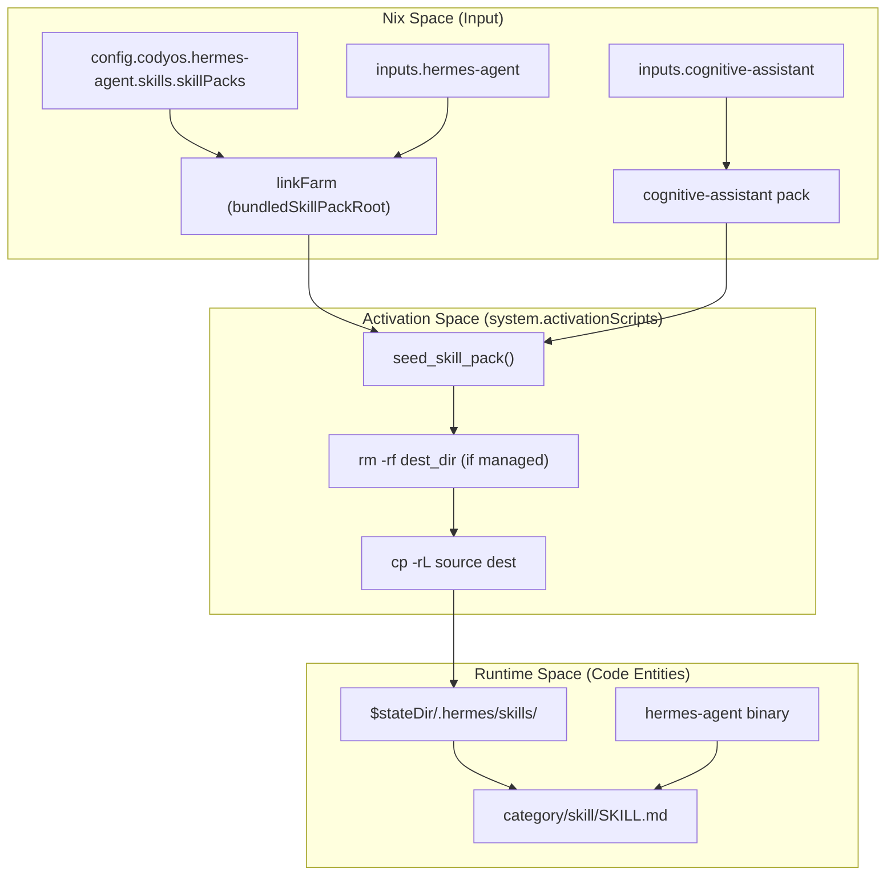
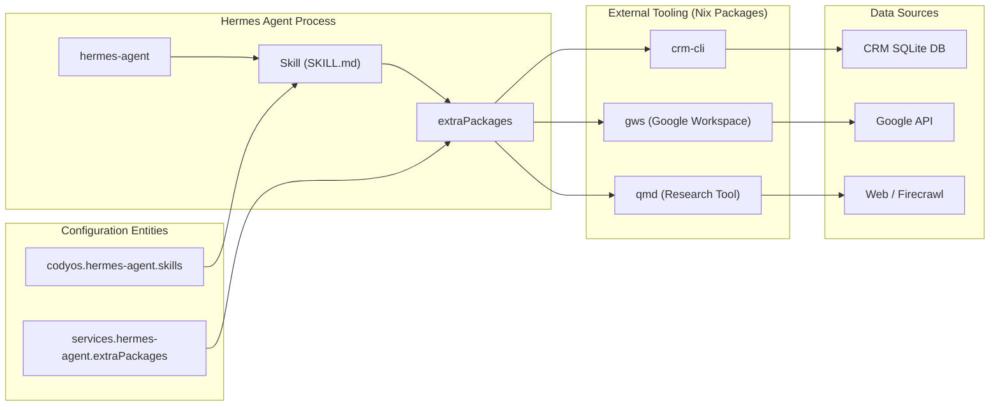

# Hermes Skills and Toolsets
Relevant source files
- [modules/services/hermes-agent/skills/business/crm/default.nix](https://github.com/Cody-W-Tucker/nix-config/blob/5a76c557/modules/services/hermes-agent/skills/business/crm/default.nix)
- [modules/services/hermes-agent/skills/business/default.nix](https://github.com/Cody-W-Tucker/nix-config/blob/5a76c557/modules/services/hermes-agent/skills/business/default.nix)
- [modules/services/hermes-agent/skills/business/google-workspace/default.nix](https://github.com/Cody-W-Tucker/nix-config/blob/5a76c557/modules/services/hermes-agent/skills/business/google-workspace/default.nix)
- [modules/services/hermes-agent/skills/default.nix](https://github.com/Cody-W-Tucker/nix-config/blob/5a76c557/modules/services/hermes-agent/skills/default.nix)
- [modules/services/hermes-agent/skills/knowledge/default.nix](https://github.com/Cody-W-Tucker/nix-config/blob/5a76c557/modules/services/hermes-agent/skills/knowledge/default.nix)
- [modules/services/hermes-agent/skills/knowledge/note-taking/obsidian-bases/SKILL.md](https://github.com/Cody-W-Tucker/nix-config/blob/5a76c557/modules/services/hermes-agent/skills/knowledge/note-taking/obsidian-bases/SKILL.md?plain=1)
- [modules/services/hermes-agent/skills/knowledge/note-taking/obsidian-cli/SKILL.md](https://github.com/Cody-W-Tucker/nix-config/blob/5a76c557/modules/services/hermes-agent/skills/knowledge/note-taking/obsidian-cli/SKILL.md?plain=1)
- [modules/services/hermes-agent/skills/module.nix](https://github.com/Cody-W-Tucker/nix-config/blob/5a76c557/modules/services/hermes-agent/skills/module.nix)
- [modules/services/hermes-agent/skills/seeded-skills.nix](https://github.com/Cody-W-Tucker/nix-config/blob/5a76c557/modules/services/hermes-agent/skills/seeded-skills.nix)
- [modules/services/hermes-agent/skills/upstream-bundled.nix](https://github.com/Cody-W-Tucker/nix-config/blob/5a76c557/modules/services/hermes-agent/skills/upstream-bundled.nix)
- [modules/services/hermes-agent/toolsets/default.nix](https://github.com/Cody-W-Tucker/nix-config/blob/5a76c557/modules/services/hermes-agent/toolsets/default.nix)
- [modules/services/hermes-agent/toolsets/platform-toolsets.nix](https://github.com/Cody-W-Tucker/nix-config/blob/5a76c557/modules/services/hermes-agent/toolsets/platform-toolsets.nix)
- [modules/services/hermes-agent/toolsets/web-search.nix](https://github.com/Cody-W-Tucker/nix-config/blob/5a76c557/modules/services/hermes-agent/toolsets/web-search.nix)
- [users/cody/desktop/harness/opencode/agents/business/default.nix](https://github.com/Cody-W-Tucker/nix-config/blob/5a76c557/users/cody/desktop/harness/opencode/agents/business/default.nix)

This page details the **Hermes Skills System**, a declarative framework for extending the `hermes-agent` with domain-specific capabilities. It covers the lifecycle of skills from Nix declaration to runtime activation, including specialized toolsets for business operations, knowledge management, and platform-level search.

## Skill Management System

The Hermes skill system uses a hybrid approach to manage agent capabilities, balancing declarative Nix-based configuration with the agent's need for a mutable local workspace. Skills are organized into `skillPacks` which are injected into the agent's home directory during system activation [modules/services/hermes-agent/skills/module.nix7-41](https://github.com/Cody-W-Tucker/nix-config/blob/5a76c557/modules/services/hermes-agent/skills/module.nix#L7-L41)

### Skill Pack Modes

The system supports two distinct synchronization modes defined in the `skillPacks` submodule [modules/services/hermes-agent/skills/module.nix22-34](https://github.com/Cody-W-Tucker/nix-config/blob/5a76c557/modules/services/hermes-agent/skills/module.nix#L22-L34):

| Mode | Description | Use Case |
| --- | --- | --- |
| `mutable` | Copied only if the local skill is absent or malformed. Local edits by the agent persist across system rebuilds. | User-pattern skills, agent self-improvement. |
| `managed` | The Nix store is the source of truth. The local skill is replaced on every system activation. | Core tools, CLI wrappers, upstream bundled skills. |

### Activation Lifecycle

The `hermes-agent-seeded-skills` activation script manages the transition from the Nix store to the `HERMES_HOME/skills` directory [modules/services/hermes-agent/skills/seeded-skills.nix26-88](https://github.com/Cody-W-Tucker/nix-config/blob/5a76c557/modules/services/hermes-agent/skills/seeded-skills.nix#L26-L88)

1. **Cleanup**: It identifies and removes "shadow" directories (partial directories without a `SKILL.md`) that might prevent proper skill loading [modules/services/hermes-agent/skills/seeded-skills.nix34-44](https://github.com/Cody-W-Tucker/nix-config/blob/5a76c557/modules/services/hermes-agent/skills/seeded-skills.nix#L34-L44)
2. **Reset Logic**: For `managed` packs or cases where legacy symlinks exist, the script purges the destination before copying [modules/services/hermes-agent/skills/seeded-skills.nix60-74](https://github.com/Cody-W-Tucker/nix-config/blob/5a76c557/modules/services/hermes-agent/skills/seeded-skills.nix#L60-L74)
3. **Seeding**: It recursively copies the skill directory and sets appropriate ownership for the `hermes-agent` user and group [modules/services/hermes-agent/skills/seeded-skills.nix76-83](https://github.com/Cody-W-Tucker/nix-config/blob/5a76c557/modules/services/hermes-agent/skills/seeded-skills.nix#L76-L83)

**Sources:**

- [modules/services/hermes-agent/skills/module.nix7-55](https://github.com/Cody-W-Tucker/nix-config/blob/5a76c557/modules/services/hermes-agent/skills/module.nix#L7-L55)
- [modules/services/hermes-agent/skills/seeded-skills.nix8-88](https://github.com/Cody-W-Tucker/nix-config/blob/5a76c557/modules/services/hermes-agent/skills/seeded-skills.nix#L8-L88)

## Code-to-System Mapping: Skill Deployment

The following diagram illustrates how Nix declarations in `module.nix` translate into the runtime filesystem structure consumed by the `hermes-agent` binary.

**Hermes Skill Ingestion Flow**

**Sources:**

- [modules/services/hermes-agent/skills/seeded-skills.nix20-87](https://github.com/Cody-W-Tucker/nix-config/blob/5a76c557/modules/services/hermes-agent/skills/seeded-skills.nix#L20-L87)
- [modules/services/hermes-agent/skills/upstream-bundled.nix56-61](https://github.com/Cody-W-Tucker/nix-config/blob/5a76c557/modules/services/hermes-agent/skills/upstream-bundled.nix#L56-L61)
- [modules/services/hermes-agent/skills/default.nix44-54](https://github.com/Cody-W-Tucker/nix-config/blob/5a76c557/modules/services/hermes-agent/skills/default.nix#L44-L54)

## Core Skill Categories

### Upstream Bundled Skills

Hermes includes a set of standard skills provided by the upstream `hermes-agent` repository. These are selectively enabled via `enabledUpstreamSkills`[modules/services/hermes-agent/skills/default.nix8-24](https://github.com/Cody-W-Tucker/nix-config/blob/5a76c557/modules/services/hermes-agent/skills/default.nix#L8-L24)

- **Workflow**: `github-pr-workflow`, `github-code-review`, `plan`.
- **Utilities**: `arxiv`, `youtube-content`, `xurl` (Twitter API integration).
- **Experimental**: `spike` (for throwaway validation experiments) [modules/services/hermes-agent/skills/default.nix22](https://github.com/Cody-W-Tucker/nix-config/blob/5a76c557/modules/services/hermes-agent/skills/default.nix#L22-L22)

### Business and CRM Skills

The business toolset integrates the agent with external productivity platforms and local financial data.

- **CRM**: Integrates `crm-cli` as a managed skill pack [modules/services/hermes-agent/skills/business/crm/default.nix13-20](https://github.com/Cody-W-Tucker/nix-config/blob/5a76c557/modules/services/hermes-agent/skills/business/crm/default.nix#L13-L20)
- **Google Workspace**: Provides a suite of `gws-*` tools. Notably, the `gws-gmail-triage` skill is patched during the build to default to `in:inbox` queries rather than just unread mail [modules/services/hermes-agent/skills/business/google-workspace/default.nix18-47](https://github.com/Cody-W-Tucker/nix-config/blob/5a76c557/modules/services/hermes-agent/skills/business/google-workspace/default.nix#L18-L47)
- **Accounting**: An MCP bridge for `actual-budget` allows the agent to interact with the local `budget.homehub.tv` instance using secrets managed by SOPS [users/cody/desktop/harness/opencode/agents/business/default.nix4-24](https://github.com/Cody-W-Tucker/nix-config/blob/5a76c557/users/cody/desktop/harness/opencode/agents/business/default.nix#L4-L24)

### Knowledge and Research Skills

These skills facilitate interaction with the Obsidian vault and web-based research.

- **Obsidian**: Three distinct skills (`obsidian-bases`, `obsidian-cli`, `obsidian-markdown`) provide the agent with tools to read, write, and structure notes [modules/services/hermes-agent/skills/knowledge/default.nix5-17](https://github.com/Cody-W-Tucker/nix-config/blob/5a76c557/modules/services/hermes-agent/skills/knowledge/default.nix#L5-L17)
- **Research**: The `qmd` (Query Markdown) tool is added to `extraPackages` to enable structured research workflows [modules/services/hermes-agent/skills/knowledge/default.nix25](https://github.com/Cody-W-Tucker/nix-config/blob/5a76c557/modules/services/hermes-agent/skills/knowledge/default.nix#L25-L25)

**Sources:**

- [modules/services/hermes-agent/skills/default.nix8-24](https://github.com/Cody-W-Tucker/nix-config/blob/5a76c557/modules/services/hermes-agent/skills/default.nix#L8-L24)
- [modules/services/hermes-agent/skills/business/google-workspace/default.nix1-73](https://github.com/Cody-W-Tucker/nix-config/blob/5a76c557/modules/services/hermes-agent/skills/business/google-workspace/default.nix#L1-L73)
- [modules/services/hermes-agent/skills/knowledge/default.nix1-35](https://github.com/Cody-W-Tucker/nix-config/blob/5a76c557/modules/services/hermes-agent/skills/knowledge/default.nix#L1-L35)
- [users/cody/desktop/harness/opencode/agents/business/default.nix1-57](https://github.com/Cody-W-Tucker/nix-config/blob/5a76c557/users/cody/desktop/harness/opencode/agents/business/default.nix#L1-L57)

## Platform Toolsets

While "Skills" are portable Markdown-based tool definitions, "Toolsets" represent internal capabilities of the Hermes platform. These are governed by `platform_toolsets` which defines which interfaces (CLI, Discord, Telegram, Cron) have access to which core capabilities [modules/services/hermes-agent/toolsets/platform-toolsets.nix18-47](https://github.com/Cody-W-Tucker/nix-config/blob/5a76c557/modules/services/hermes-agent/toolsets/platform-toolsets.nix#L18-L47)

### Access Control Matrix

The configuration distinguishes between high-trust (CLI) and ambient/background (Discord/Cron) interfaces:

| Interface | Access Level | Enabled Toolsets |
| --- | --- | --- |
| `cli` | Full | `all` |
| `api_server` | High | `web`, `search`, `skills`, `messaging`, `terminal`, etc. |
| `discord` | Restricted | `web`, `search`, `tts`, `vision`, `skills`, `terminal`. |
| `cron` | Automated | `web`, `search`, `skills`, `terminal`. |

### Web Search Configuration

The agent's web intelligence is backed by specific providers configured in `web-search.nix`[modules/services/hermes-agent/toolsets/web-search.nix3-7](https://github.com/Cody-W-Tucker/nix-config/blob/5a76c557/modules/services/hermes-agent/toolsets/web-search.nix#L3-L7):

- **Search Backend**: `xai`
- **Extraction/Crawl**: `firecrawl`

**Sources:**

- [modules/services/hermes-agent/toolsets/platform-toolsets.nix1-48](https://github.com/Cody-W-Tucker/nix-config/blob/5a76c557/modules/services/hermes-agent/toolsets/platform-toolsets.nix#L1-L48)
- [modules/services/hermes-agent/toolsets/web-search.nix1-10](https://github.com/Cody-W-Tucker/nix-config/blob/5a76c557/modules/services/hermes-agent/toolsets/web-search.nix#L1-L10)

## Skill Entity Relationship

The following diagram maps the relationship between the `hermes-agent` configuration and the external CLI tools it orchestrates through skills.

**Skill-to-CLI Mapping**

**Sources:**

- [modules/services/hermes-agent/skills/business/default.nix9-24](https://github.com/Cody-W-Tucker/nix-config/blob/5a76c557/modules/services/hermes-agent/skills/business/default.nix#L9-L24)
- [modules/services/hermes-agent/skills/knowledge/default.nix25-34](https://github.com/Cody-W-Tucker/nix-config/blob/5a76c557/modules/services/hermes-agent/skills/knowledge/default.nix#L25-L34)
- [modules/services/hermes-agent/toolsets/web-search.nix3-7](https://github.com/Cody-W-Tucker/nix-config/blob/5a76c557/modules/services/hermes-agent/toolsets/web-search.nix#L3-L7)