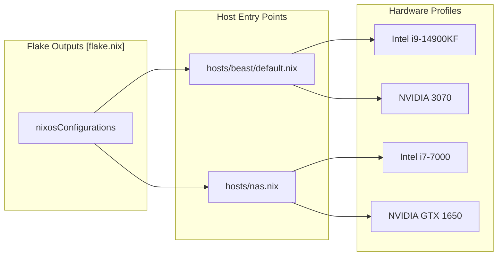

# Host Configurations

This section provides a high-level overview of the two NixOS hosts defined by the flake. The architecture distinguishes between a high-performance **Beast** workstation for local AI inference and desktop work, and a stable **NAS** for home laboratory services and media management.

Both hosts share a common foundation via `modules/system/base.nix`, which standardizes networking, security, and shell environments across the fleet [modules/system/base.nix1-23](../modules/system/base.nix#L1-L23)

At the flake level, there are exactly two exported systems: `nixosConfigurations.beast` and `nixosConfigurations.nas`. `beast` evaluates `./hosts/beast` with `nixpkgs-unstable`, while `nas` evaluates `./hosts/nas.nix` with stable `nixpkgs` and `home-manager-stable`. That split is the main reason package behavior and upgrade risk differ across the two hosts.

### Host Overview and Code Mapping

The following diagram illustrates how the logical host roles map to specific NixOS configuration entry points within the repository.

**System Architecture Mapping**

**Sources:**[flake.nix110-122](../flake.nix#L110-L122)[hosts/beast/default.nix1-23](../hosts/beast/default.nix#L1-L23)[hosts/nas.nix1-17](../hosts/nas.nix#L1-L17)

---

### [Beast: Desktop Workstation](/Cody-W-Tucker/nix-config/2.1-beast:-desktop-workstation)

The `beast` host is a high-end workstation designed for development, gaming, and local AI workloads. It runs on the `nixos-unstable` channel to provide the latest drivers and desktop features [flake.nix117-120](../flake.nix#L117-L120)

- **Hardware:** Powered by an Intel i9-14900KF and an NVIDIA 3070 GPU [hosts/beast/machine.nix10](../hosts/beast/machine.nix#L10-L10)
- **Composition Root:** `hosts/beast/default.nix` is a thin import spine. It selects host-local files (`ai.nix`, `drives.nix`, `machine.nix`, `models.nix`) and then composes shared desktop and AI modules from `modules/` [hosts/beast/default.nix4-23](../hosts/beast/default.nix#L4-L23)
- **Storage Topology:** Utilizes `ext4` for the root partition.
- **AI Stack:** Hosts the primary local AI interface via `open-webui`, integrated with a `qdrant` vector database for RAG (Retrieval-Augmented Generation) [hosts/beast/ai.nix12-61](../hosts/beast/ai.nix#L12-L61)
- **Desktop Integration:** Passes a `hardwareConfig` abstraction to Home Manager and imports Cody's desktop role via `users/cody/desktop.nix`, which in turn imports `users/cody/desktop/` for the detailed desktop modules [hosts/beast/machine.nix13-31](../hosts/beast/machine.nix#L13-L31) [users/cody/desktop.nix9-13](../users/cody/desktop.nix#L9-L13)

For detailed hardware tuning and AI service configuration, see [Beast: Desktop Workstation](/Cody-W-Tucker/nix-config/2.1-beast:-desktop-workstation).

---

### [NAS: Home Lab Server](/Cody-W-Tucker/nix-config/2.2-nas:-home-lab-server)

The `nas` host acts as the central hub for the `homehub.tv` infrastructure. It prioritizes stability by using the `nixos-25.11` stable channel [flake.nix9-10](../flake.nix#L9-L10)

- **Hardware:** Built on an Intel Kaby Lake i7-7000 with 64GB RAM and an NVIDIA GTX 1650 GPU for media transcoding [hosts/nas.nix10-11](../hosts/nas.nix#L10-L11)
- **Composition Root:** `hosts/nas.nix` directly imports `../modules/system/base.nix` and `../modules/server`, then attaches the server-specific Home Manager profile from `../users/cody/server.nix` [hosts/nas.nix11-17](../hosts/nas.nix#L11-L17)
- **Service Hub:** Manages the Nginx reverse proxy architecture, handling SSL via ACME/Cloudflare for all internal services [modules/server/media.nix191-247](../modules/server/media.nix#L191-L247)
- **Media & Storage:** Orchestrates the "Arr" suite (Sonarr, Radarr, etc.) and Jellyfin, with a dedicated `vpn-confinement` layer for Transmission to ensure all torrent traffic is routed through a Wireguard namespace [modules/server/media.nix30-183](../modules/server/media.nix#L30-L183)

---

### Comparison Summary

| Feature             | Beast (Workstation)                                                                                                                                          | NAS (Home Lab)                                                                                                                                     |
| ------------------- | ------------------------------------------------------------------------------------------------------------------------------------------------------------ | -------------------------------------------------------------------------------------------------------------------------------------------------- |
| **Nixpkgs Channel** | Unstable [flake.nix111](../flake.nix#L111-L111)                                                       | Stable (25.11) [flake.nix115](../flake.nix#L115-L115)                                 |
| **Primary GPU**     | NVIDIA RTX 3070 [hosts/beast/machine.nix10](../hosts/beast/machine.nix#L10-L10)                       | NVIDIA GTX 1650 [hosts/nas.nix13](../hosts/nas.nix#L13-L13)                         |
| **Root Filesystem** | ext4 (noatime) [hosts/beast/drives.nix29](../hosts/beast/drives.nix#L29-L29)                          | Btrfs [hosts/nas.nix42-43](../hosts/nas.nix#L42-L43)                                 |
| **Special Storage** | —                                                                                                    | 4TB HDD media pool + ZFS backup [hosts/nas.nix64-67](../hosts/nas.nix#L64-L67)       |
| **Networking**      | Tailscale Client [modules/system/base.nix19](../modules/system/base.nix#L19-L19)                      | Tailscale + Nginx Proxy [hosts/nas.nix84](../hosts/nas.nix#L84-L84)                  |
| **AI Role**         | Inference (llama-swap, Open-WebUI) [hosts/beast/default.nix16-17](../hosts/beast/default.nix#L16-L17) | Content Extraction (Tika) Proxy                                                                                                                    |
