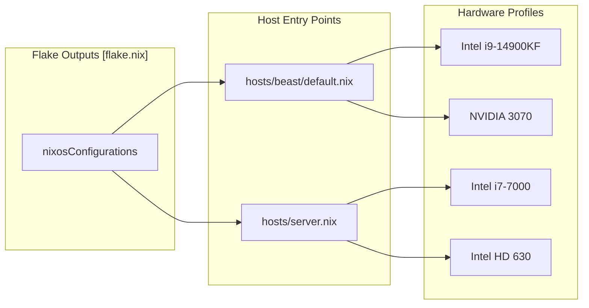

# Host Configurations
Relevant source files
- [flake.lock](https://github.com/Cody-W-Tucker/nix-config/blob/5a76c557/flake.lock)
- [flake.nix](https://github.com/Cody-W-Tucker/nix-config/blob/5a76c557/flake.nix)
- [hosts/beast/ai.nix](https://github.com/Cody-W-Tucker/nix-config/blob/5a76c557/hosts/beast/ai.nix)
- [hosts/beast/default.nix](https://github.com/Cody-W-Tucker/nix-config/blob/5a76c557/hosts/beast/default.nix)
- [hosts/beast/drives.nix](https://github.com/Cody-W-Tucker/nix-config/blob/5a76c557/hosts/beast/drives.nix)
- [hosts/beast/machine.nix](https://github.com/Cody-W-Tucker/nix-config/blob/5a76c557/hosts/beast/machine.nix)
- [hosts/server.nix](https://github.com/Cody-W-Tucker/nix-config/blob/5a76c557/hosts/server.nix)
- [modules/server/media.nix](https://github.com/Cody-W-Tucker/nix-config/blob/5a76c557/modules/server/media.nix)
- [modules/services/hermes-agent/default.nix](https://github.com/Cody-W-Tucker/nix-config/blob/5a76c557/modules/services/hermes-agent/default.nix)
- [modules/system/base.nix](https://github.com/Cody-W-Tucker/nix-config/blob/5a76c557/modules/system/base.nix)

This section provides a high-level overview of the two NixOS hosts defined by the flake. The architecture distinguishes between a high-performance **Beast** workstation for local AI inference and desktop work, and a stable **Server** for home laboratory services and media management.

Both hosts share a common foundation via `modules/system/base.nix`, which standardizes networking, security, and shell environments across the fleet [modules/system/base.nix1-23](https://github.com/Cody-W-Tucker/nix-config/blob/5a76c557/modules/system/base.nix#L1-L23)

At the flake level, there are exactly two exported systems: `nixosConfigurations.beast` and `nixosConfigurations.server`. `beast` evaluates `./hosts/beast` with `nixpkgs-unstable`, while `server` evaluates `./hosts/server.nix` with stable `nixpkgs` and `home-manager-stable`. That split is the main reason package behavior and upgrade risk differ across the two hosts.

### Host Overview and Code Mapping

The following diagram illustrates how the logical host roles map to specific NixOS configuration entry points within the repository.

**System Architecture Mapping**

**Sources:**[flake.nix116-128](https://github.com/Cody-W-Tucker/nix-config/blob/5a76c557/flake.nix#L116-L128)[hosts/beast/default.nix1-23](https://github.com/Cody-W-Tucker/nix-config/blob/5a76c557/hosts/beast/default.nix#L1-L23)[hosts/server.nix1-10](https://github.com/Cody-W-Tucker/nix-config/blob/5a76c557/hosts/server.nix#L1-L10)

---

### [Beast: Desktop Workstation](/Cody-W-Tucker/nix-config/2.1-beast:-desktop-workstation)

The `beast` host is a high-end workstation designed for development, gaming, and local AI workloads. It runs on the `nixos-unstable` channel to provide the latest drivers and desktop features [flake.nix117-120](https://github.com/Cody-W-Tucker/nix-config/blob/5a76c557/flake.nix#L117-L120)

- **Hardware:** Powered by an Intel i9-14900KF and an NVIDIA 3070 GPU [hosts/beast/machine.nix10](https://github.com/Cody-W-Tucker/nix-config/blob/5a76c557/hosts/beast/machine.nix#L10-L10)
- **Composition Root:** `hosts/beast/default.nix` is a thin import spine. It selects host-local files (`ai.nix`, `drives.nix`, `machine.nix`, `models.nix`) and then composes shared desktop and AI modules from `modules/` [hosts/beast/default.nix4-23](https://github.com/Cody-W-Tucker/nix-config/blob/5a76c557/hosts/beast/default.nix#L4-L23)
- **Storage Topology:** Utilizes a mix of `ext4` for the root partition and a specialized Btrfs pool for work directories at `/mnt/work`, featuring automated scrubbing and NOCOW attributes for VM performance [hosts/beast/drives.nix26-133](https://github.com/Cody-W-Tucker/nix-config/blob/5a76c557/hosts/beast/drives.nix#L26-L133)
- **AI Stack:** Hosts the primary local AI interface via `open-webui`, integrated with a `qdrant` vector database for RAG (Retrieval-Augmented Generation) [hosts/beast/ai.nix12-61](https://github.com/Cody-W-Tucker/nix-config/blob/5a76c557/hosts/beast/ai.nix#L12-L61)
- **Desktop Integration:** Passes a `hardwareConfig` abstraction to Home Manager to define monitor layouts (e.g., Samsung Odyssey G65B at 240Hz) and power management timeouts [hosts/beast/machine.nix13-31](https://github.com/Cody-W-Tucker/nix-config/blob/5a76c557/hosts/beast/machine.nix#L13-L31)

For detailed hardware tuning and AI service configuration, see [Beast: Desktop Workstation](/Cody-W-Tucker/nix-config/2.1-beast:-desktop-workstation).

**Sources:**[hosts/beast/default.nix1-23](https://github.com/Cody-W-Tucker/nix-config/blob/5a76c557/hosts/beast/default.nix#L1-L23)[hosts/beast/machine.nix10-40](https://github.com/Cody-W-Tucker/nix-config/blob/5a76c557/hosts/beast/machine.nix#L10-L40)[hosts/beast/drives.nix24-141](https://github.com/Cody-W-Tucker/nix-config/blob/5a76c557/hosts/beast/drives.nix#L24-L141)[hosts/beast/ai.nix1-67](https://github.com/Cody-W-Tucker/nix-config/blob/5a76c557/hosts/beast/ai.nix#L1-L67)

---

### [Server: Home Lab Server](/Cody-W-Tucker/nix-config/2.2-server:-home-lab-server)

The `server` host acts as the central hub for the `homehub.tv` infrastructure. It prioritizes stability by using the `nixos-25.11` stable channel [flake.nix10-127](https://github.com/Cody-W-Tucker/nix-config/blob/5a76c557/flake.nix#L10-L127)

- **Hardware:** Built on an Intel Kaby Lake i7-7000 with 64GB RAM, utilizing Intel QuickSync (QSV) for media transcoding [hosts/server.nix10-17](https://github.com/Cody-W-Tucker/nix-config/blob/5a76c557/hosts/server.nix#L10-L17)
- **Composition Root:** `hosts/server.nix` directly imports `../modules/system/base.nix` and `../modules/server`, then attaches the server-specific Home Manager profile from `../users/cody/server.nix` [hosts/server.nix13-35](https://github.com/Cody-W-Tucker/nix-config/blob/5a76c557/hosts/server.nix#L13-L35)
- **Service Hub:** Manages the Nginx reverse proxy architecture, handling SSL via ACME/Cloudflare for all internal services [modules/server/media.nix191-247](https://github.com/Cody-W-Tucker/nix-config/blob/5a76c557/modules/server/media.nix#L191-L247)
- **Media & Storage:** Orchestrates the "Arr" suite (Sonarr, Radarr, etc.) and Jellyfin, with a dedicated `vpn-confinement` layer for Transmission to ensure all torrent traffic is routed through a Wireguard namespace [modules/server/media.nix30-183](https://github.com/Cody-W-Tucker/nix-config/blob/5a76c557/modules/server/media.nix#L30-L183)
- **Network Role:** Provides NFS exports for the local network, allowing the `beast` workstation to mount media libraries [hosts/server.nix94-98](https://github.com/Cody-W-Tucker/nix-config/blob/5a76c557/hosts/server.nix#L94-L98)

For details on the reverse proxy setup, VPN isolation, and media stack, see [Server: Home Lab Server](/Cody-W-Tucker/nix-config/2.2-server:-home-lab-server).

**Sources:**[hosts/server.nix1-122](https://github.com/Cody-W-Tucker/nix-config/blob/5a76c557/hosts/server.nix#L1-L122)[modules/server/media.nix1-247](https://github.com/Cody-W-Tucker/nix-config/blob/5a76c557/modules/server/media.nix#L1-L247)[flake.nix121-127](https://github.com/Cody-W-Tucker/nix-config/blob/5a76c557/flake.nix#L121-L127)

---

### Comparison Summary

| Feature | Beast (Workstation) | Server (Home Lab) |
| --- | --- | --- |
| **Nixpkgs Channel** | Unstable [flake.nix117](https://github.com/Cody-W-Tucker/nix-config/blob/5a76c557/flake.nix#L117-L117) | Stable (25.11) [flake.nix121](https://github.com/Cody-W-Tucker/nix-config/blob/5a76c557/flake.nix#L121-L121) |
| **Primary GPU** | NVIDIA RTX 3070 [hosts/beast/machine.nix10](https://github.com/Cody-W-Tucker/nix-config/blob/5a76c557/hosts/beast/machine.nix#L10-L10) | Intel HD 630 (QSV) [hosts/server.nix10](https://github.com/Cody-W-Tucker/nix-config/blob/5a76c557/hosts/server.nix#L10-L10) |
| **Root Filesystem** | ext4 (noatime) [hosts/beast/drives.nix29](https://github.com/Cody-W-Tucker/nix-config/blob/5a76c557/hosts/beast/drives.nix#L29-L29) | ext4 [hosts/server.nix67](https://github.com/Cody-W-Tucker/nix-config/blob/5a76c557/hosts/server.nix#L67-L67) |
| **Special Storage** | Btrfs Work Pool (NOCOW) [hosts/beast/drives.nix81](https://github.com/Cody-W-Tucker/nix-config/blob/5a76c557/hosts/beast/drives.nix#L81-L81) | 4TB HDD Media Pool [hosts/server.nix10](https://github.com/Cody-W-Tucker/nix-config/blob/5a76c557/hosts/server.nix#L10-L10) |
| **Networking** | Tailscale Client [modules/system/base.nix19](https://github.com/Cody-W-Tucker/nix-config/blob/5a76c557/modules/system/base.nix#L19-L19) | Tailscale + Nginx Proxy + NFS Server [hosts/server.nix95-118](https://github.com/Cody-W-Tucker/nix-config/blob/5a76c557/hosts/server.nix#L95-L118) |
| **AI Role** | Inference (llama-swap, Open-WebUI) [hosts/beast/default.nix16-17](https://github.com/Cody-W-Tucker/nix-config/blob/5a76c557/hosts/beast/default.nix#L16-L17) | Content Extraction (Tika) Proxy |

**Sources:**[flake.nix116-128](https://github.com/Cody-W-Tucker/nix-config/blob/5a76c557/flake.nix#L116-L128)[hosts/beast/machine.nix10](https://github.com/Cody-W-Tucker/nix-config/blob/5a76c557/hosts/beast/machine.nix#L10-L10)[hosts/server.nix10-95](https://github.com/Cody-W-Tucker/nix-config/blob/5a76c557/hosts/server.nix#L10-L95)[hosts/beast/drives.nix29-81](https://github.com/Cody-W-Tucker/nix-config/blob/5a76c557/hosts/beast/drives.nix#L29-L81)

### Where Changes Usually Go

- Change `hosts/*` when the behavior is machine-specific: disks, hostname, hardware imports, or host role selection.
- Change `modules/*` when the behavior should be reusable across hosts: desktop plumbing, shared services, or server stacks.
- Change `users/*` when the behavior is Home Manager-owned user state, shell defaults, or role-specific user tooling.
