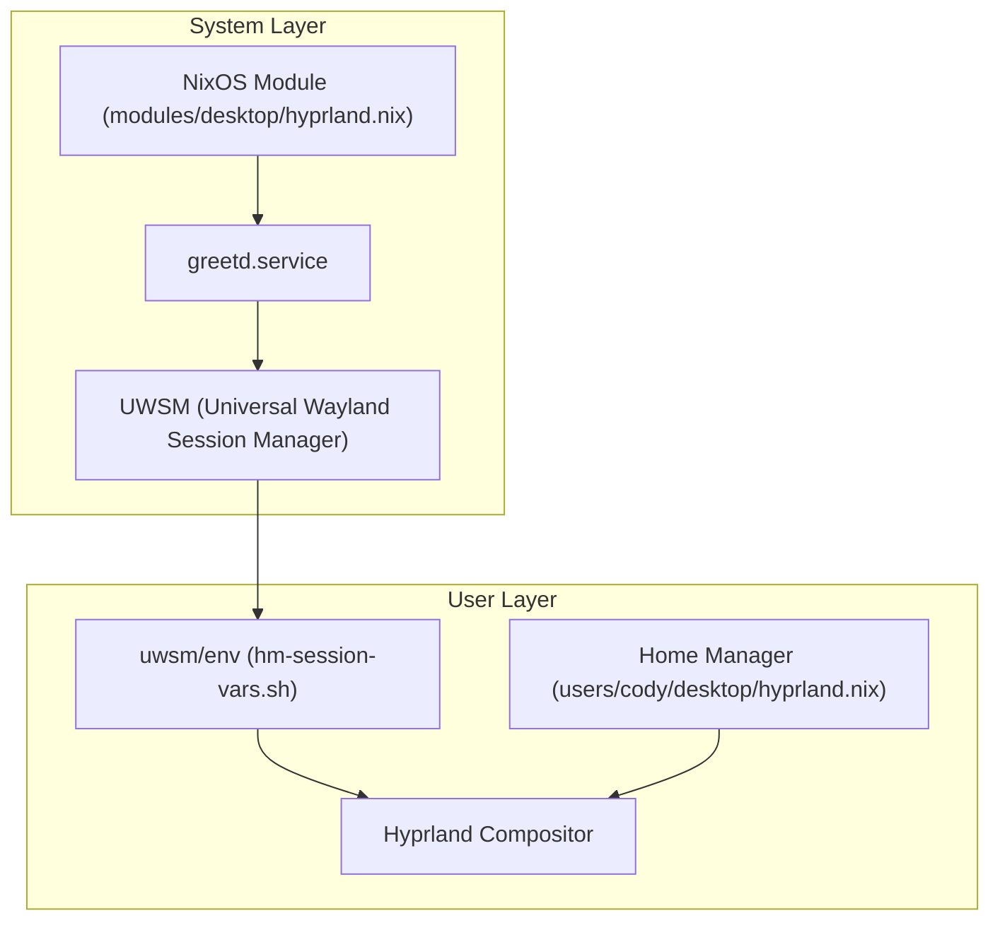
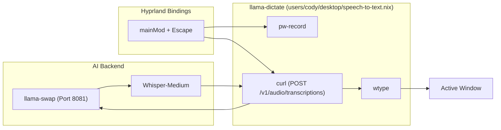

# Hyprland Window Manager
Relevant source files
- [modules/desktop/hyprland.nix](https://github.com/Cody-W-Tucker/nix-config/blob/5a76c557/modules/desktop/hyprland.nix)
- [users/cody/desktop/default.nix](https://github.com/Cody-W-Tucker/nix-config/blob/5a76c557/users/cody/desktop/default.nix)
- [users/cody/desktop/editor/nixvim/plugins/99.nix](https://github.com/Cody-W-Tucker/nix-config/blob/5a76c557/users/cody/desktop/editor/nixvim/plugins/99.nix)
- [users/cody/desktop/harness/mcp.nix](https://github.com/Cody-W-Tucker/nix-config/blob/5a76c557/users/cody/desktop/harness/mcp.nix)
- [users/cody/desktop/harness/opencode/agents/logging/default.nix](https://github.com/Cody-W-Tucker/nix-config/blob/5a76c557/users/cody/desktop/harness/opencode/agents/logging/default.nix)
- [users/cody/desktop/hyprland.nix](https://github.com/Cody-W-Tucker/nix-config/blob/5a76c557/users/cody/desktop/hyprland.nix)
- [users/cody/desktop/hyprland/settings.nix](https://github.com/Cody-W-Tucker/nix-config/blob/5a76c557/users/cody/desktop/hyprland/settings.nix)
- [users/cody/desktop/speech-to-text.nix](https://github.com/Cody-W-Tucker/nix-config/blob/5a76c557/users/cody/desktop/speech-to-text.nix)
- [users/cody/desktop/xdg.nix](https://github.com/Cody-W-Tucker/nix-config/blob/5a76c557/users/cody/desktop/xdg.nix)

The Hyprland Window Manager serves as the primary Wayland compositor for the CodyOS desktop environment. It is implemented through a multi-layered approach that combines system-level enablement, user-level declarative configuration, and tight integration with local AI services and hardware abstractions.

## System-Level Enablement

Hyprland is enabled at the NixOS system level to handle critical infrastructure like session management and security services.

- **UWSM (Universal Wayland Session Manager):** The system uses UWSM to manage the Hyprland session, providing a robust wrapper for session startup and environment variable synchronization [modules/desktop/hyprland.nix5-6](https://github.com/Cody-W-Tucker/nix-config/blob/5a76c557/modules/desktop/hyprland.nix#L5-L6)
- **Greetd Integration:** The system is configured to auto-launch Hyprland via `greetd` using the `uwsm start hyprland-uwsm.desktop` command [modules/desktop/hyprland.nix18-28](https://github.com/Cody-W-Tucker/nix-config/blob/5a76c557/modules/desktop/hyprland.nix#L18-L28)
- **Security & Auth:** PAM services are explicitly configured for `hyprlock` to ensure secure screen unlocking [modules/desktop/hyprland.nix8-10](https://github.com/Cody-W-Tucker/nix-config/blob/5a76c557/modules/desktop/hyprland.nix#L8-L10) Gnome Keyring is enabled and integrated with `greetd` for automatic unlocking of secrets upon login [modules/desktop/hyprland.nix11-15](https://github.com/Cody-W-Tucker/nix-config/blob/5a76c557/modules/desktop/hyprland.nix#L11-L15)

### Session Architecture

The following diagram illustrates the flow from boot to a functional Hyprland session.

**Hyprland Session Initialization**

Sources: [modules/desktop/hyprland.nix3-28](https://github.com/Cody-W-Tucker/nix-config/blob/5a76c557/modules/desktop/hyprland.nix#L3-L28)[users/cody/desktop/hyprland.nix23-33](https://github.com/Cody-W-Tucker/nix-config/blob/5a76c557/users/cody/desktop/hyprland.nix#L23-L33)

## User Configuration and Keybindings

The user-level configuration is managed via Home Manager and split into functional components. The core logic resides in `users/cody/desktop/hyprland/settings.nix`.

### Key Components

- **Main Modifier:**`SUPER` (Windows key) is defined as `mainMod`[users/cody/desktop/hyprland/settings.nix9](https://github.com/Cody-W-Tucker/nix-config/blob/5a76c557/users/cody/desktop/hyprland/settings.nix#L9-L9)
- **Layout:** The compositor uses the `master` layout by default [users/cody/desktop/hyprland/settings.nix188](https://github.com/Cody-W-Tucker/nix-config/blob/5a76c557/users/cody/desktop/hyprland/settings.nix#L188-L188)
- **Special Workspaces:** A variety of persistent "scratchpad" workspaces are defined for specific tasks like AI, development, and media [users/cody/desktop/hyprland/settings.nix23-30](https://github.com/Cody-W-Tucker/nix-config/blob/5a76c557/users/cody/desktop/hyprland/settings.nix#L23-L30)
- **Focus Management:** A custom `focusOrRun` helper function is used to either switch to an existing application window or launch a new instance [users/cody/desktop/hyprland/settings.nix15](https://github.com/Cody-W-Tucker/nix-config/blob/5a76c557/users/cody/desktop/hyprland/settings.nix#L15-L15)

### Hardware Abstraction (hardwareConfig)

The configuration consumes a `hardwareConfig` attribute set passed from the host definition. This allows host-specific monitor layouts and workspace assignments to be applied declaratively [users/cody/desktop/hyprland/settings.nix155-156](https://github.com/Cody-W-Tucker/nix-config/blob/5a76c557/users/cody/desktop/hyprland/settings.nix#L155-L156)

### Keybinding Table (Selected)

| Keybind | Action | Code Entity |
| --- | --- | --- |
| `mainMod + Q` | Launch Terminal | `kitty`[users/cody/desktop/hyprland/settings.nix34](https://github.com/Cody-W-Tucker/nix-config/blob/5a76c557/users/cody/desktop/hyprland/settings.nix#L34-L34) |
| `mainMod + 0` | Focus/Run Browser | `zen`[users/cody/desktop/hyprland/settings.nix35](https://github.com/Cody-W-Tucker/nix-config/blob/5a76c557/users/cody/desktop/hyprland/settings.nix#L35-L35) |
| `mainMod + RETURN` | Toggle AI Workspace | `special:ai`[users/cody/desktop/hyprland/settings.nix70](https://github.com/Cody-W-Tucker/nix-config/blob/5a76c557/users/cody/desktop/hyprland/settings.nix#L70-L70) |
| `mainMod + D` | Toggle Dev Workspace | `special:dev`[users/cody/desktop/hyprland/settings.nix73](https://github.com/Cody-W-Tucker/nix-config/blob/5a76c557/users/cody/desktop/hyprland/settings.nix#L73-L73) |
| `mainMod + SHIFT + D` | Launch Agent Runner | `herdr`[users/cody/desktop/hyprland/settings.nix74](https://github.com/Cody-W-Tucker/nix-config/blob/5a76c557/users/cody/desktop/hyprland/settings.nix#L74-L74) |
| `mainMod + S` | Screenshot to OCR | `screenshot-ocr`[users/cody/desktop/hyprland/settings.nix48](https://github.com/Cody-W-Tucker/nix-config/blob/5a76c557/users/cody/desktop/hyprland/settings.nix#L48-L48) |
| `mainMod + Escape` | Hold to Dictate | `llama-dictate`[users/cody/desktop/hyprland/settings.nix83-135](https://github.com/Cody-W-Tucker/nix-config/blob/5a76c557/users/cody/desktop/hyprland/settings.nix#L83-L135) |

Sources: [users/cody/desktop/hyprland/settings.nix8-136](https://github.com/Cody-W-Tucker/nix-config/blob/5a76c557/users/cody/desktop/hyprland/settings.nix#L8-L136)[users/cody/desktop/hyprland.nix1-6](https://github.com/Cody-W-Tucker/nix-config/blob/5a76c557/users/cody/desktop/hyprland.nix#L1-L6)

## AI and Voice Integration

Hyprland serves as the interface for the local AI infrastructure, specifically through the `llama-dictate` utility.

### Whisper Dictation Workflow

The dictation system uses a "Hold-to-Talk" pattern bound to the `Escape` key [users/cody/desktop/hyprland/settings.nix83-135](https://github.com/Cody-W-Tucker/nix-config/blob/5a76c557/users/cody/desktop/hyprland/settings.nix#L83-L135)

1. **Press (`start`):** Triggers `llama-dictate start`, which warms the `whisper-medium` model via `llama-swap` and begins recording using `pw-record`[users/cody/desktop/speech-to-text.nix201-211](https://github.com/Cody-W-Tucker/nix-config/blob/5a76c557/users/cody/desktop/speech-to-text.nix#L201-L211)
2. **Release (`stop`):** Triggers `llama-dictate stop`, which terminates the recording, sends the WAV file to the local STT API, and uses `wtype` to inject the resulting text into the active window [users/cody/desktop/speech-to-text.nix168-230](https://github.com/Cody-W-Tucker/nix-config/blob/5a76c557/users/cody/desktop/speech-to-text.nix#L168-L230)

**Voice Input Data Flow**

Sources: [users/cody/desktop/speech-to-text.nix18-240](https://github.com/Cody-W-Tucker/nix-config/blob/5a76c557/users/cody/desktop/speech-to-text.nix#L18-L240)[users/cody/desktop/hyprland/settings.nix83-135](https://github.com/Cody-W-Tucker/nix-config/blob/5a76c557/users/cody/desktop/hyprland/settings.nix#L83-L135)

## Power and Idle Management

Idle behavior is managed by `hypridle` and `hyprlock`, with parameters optionally overridden by `hardwareConfig`.

- **Hyprlock:** Provides the lock screen interface. It uses a blurred screenshot of the current desktop as a background [users/cody/desktop/hyprland.nix83-96](https://github.com/Cody-W-Tucker/nix-config/blob/5a76c557/users/cody/desktop/hyprland.nix#L83-L96)
- **Hypridle:**
- **15 Minutes:** Automatically triggers `hyprlock`[users/cody/desktop/hyprland.nix58-60](https://github.com/Cody-W-Tucker/nix-config/blob/5a76c557/users/cody/desktop/hyprland.nix#L58-L60)
- **30 Minutes:** Turns off displays via DPMS [users/cody/desktop/hyprland.nix61-65](https://github.com/Cody-W-Tucker/nix-config/blob/5a76c557/users/cody/desktop/hyprland.nix#L61-L65)
- **Host-Specific Suspend:** If `hardwareConfig.hypridle.suspendTimeout` is defined, the system will trigger `systemctl suspend`[users/cody/desktop/hyprland.nix67-71](https://github.com/Cody-W-Tucker/nix-config/blob/5a76c557/users/cody/desktop/hyprland.nix#L67-L71)

Sources: [users/cody/desktop/hyprland.nix47-125](https://github.com/Cody-W-Tucker/nix-config/blob/5a76c557/users/cody/desktop/hyprland.nix#L47-L125)

## Window Rules and Styling

Window behavior and aesthetics are declaratively defined to maintain environment consistency.

- **Window Rules:** Specific rules prevent blurring on the `kitty` terminal for performance and ensure web applications (Chromium) are tiled rather than floating [users/cody/desktop/hyprland/settings.nix137-144](https://github.com/Cody-W-Tucker/nix-config/blob/5a76c557/users/cody/desktop/hyprland/settings.nix#L137-L144) Sharing indicators from Firefox/Zen are automatically moved to a silent special workspace to prevent UI clutter [users/cody/desktop/hyprland/settings.nix149-152](https://github.com/Cody-W-Tucker/nix-config/blob/5a76c557/users/cody/desktop/hyprland/settings.nix#L149-L152)
- **Stylix Integration:** Hyprland borders are styled using the system-wide Stylix theme. The active border uses a 45-degree gradient composed of `base0C`, `base0D`, `base0B`, and `base0E` colors from the Catppuccin Mocha palette [users/cody/desktop/hyprland/settings.nix189-192](https://github.com/Cody-W-Tucker/nix-config/blob/5a76c557/users/cody/desktop/hyprland/settings.nix#L189-L192)
- **Animations:** Custom Bezier curves (`easeInExpo`, `easeOutExpo`) are applied to window transitions and sliding effects [users/cody/desktop/hyprland/settings.nix157-172](https://github.com/Cody-W-Tucker/nix-config/blob/5a76c557/users/cody/desktop/hyprland/settings.nix#L157-L172)

Sources: [users/cody/desktop/hyprland/settings.nix137-193](https://github.com/Cody-W-Tucker/nix-config/blob/5a76c557/users/cody/desktop/hyprland/settings.nix#L137-L193)[users/cody/desktop/default.nix29](https://github.com/Cody-W-Tucker/nix-config/blob/5a76c557/users/cody/desktop/default.nix#L29-L29)