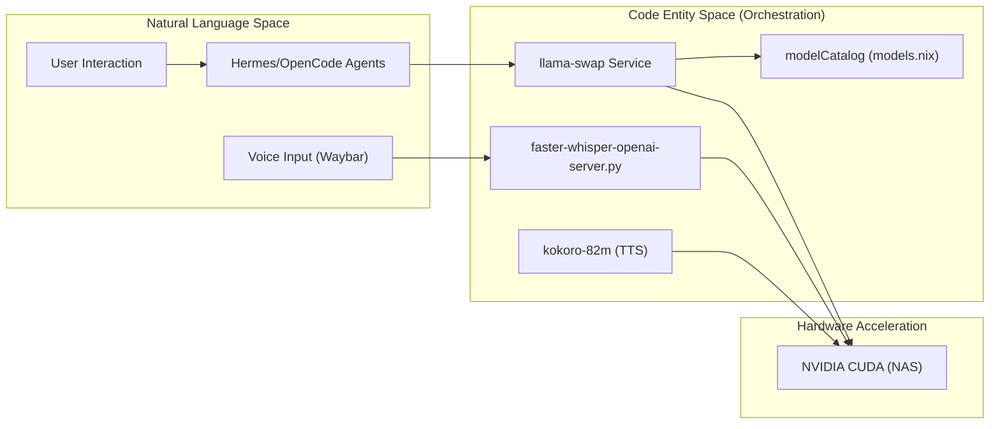
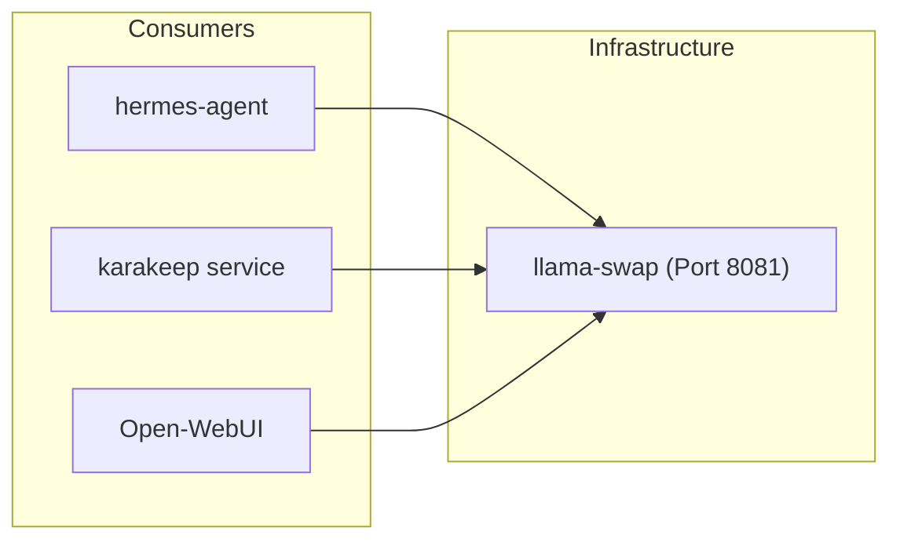

# Local AI Infrastructure

The CodyOS AI stack provides a unified, local-first interface for Large Language Models (LLMs), Speech-to-Text (STT), and Text-to-Speech (TTS) services. It is designed to run primarily on the **NAS** server, utilizing NVIDIA hardware acceleration to serve low-latency inference to local agents, desktop tools, and remote services via an OpenAI-compatible API.

## High-Level Architecture

The infrastructure is built around a "model swapping" pattern where large models are loaded into VRAM on-demand and evicted after a period of inactivity. This allows a single GPU (NVIDIA RTX 5060 on NAS) to serve multiple specialized models (chat, embedding, vision, OCR) without exceeding memory limits.

### AI Infrastructure Flow

This diagram illustrates how user input moves from desktop interactions through the orchestration layer to the hardware backends.

---

## [llama-swap: LLM Orchestration Service](/Cody-W-Tucker/nix-config/5.1-llama-swap:-llm-orchestration-service)

`llama-swap` is the central orchestration service that manages the lifecycle of LLM processes. It exposes an OpenAI-compatible endpoint that dynamically launches `llama-server` instances based on the requested model.

- **Model Management:** Models are defined in a central catalog [modules/services/llama-swap/models.nix14-66](../modules/services/llama-swap/models.nix#L14-L66) Each entry specifies `gpuLayers`, `contextSize`, and `ttl` (Time-To-Live).
- **TTL-Based Swapping:** The service keeps a model resident in VRAM for a specified `ttl` duration [modules/services/llama-swap/default.nix33-37](../modules/services/llama-swap/default.nix#L33-L37) Once the idle timer expires, the process is killed to free resources.
- **Acceleration Backends:** Supports `cuda` (default for NAS)
- **Vision/OCR Support:** Multimodal models like `glm-ocr-f16` utilize a `mmprojFile` to handle image inputs [modules/services/llama-swap/models.nix56-65](../modules/services/llama-swap/models.nix#L56-L65)

For details, see [llama-swap: LLM Orchestration Service](/Cody-W-Tucker/nix-config/5.1-llama-swap:-llm-orchestration-service).

---

## [Speech-to-Text and Text-to-Speech Services](/Cody-W-Tucker/nix-config/5.2-speech-to-text-and-text-to-speech-services)

The system provides a low-latency voice pipeline for desktop interaction, primarily consumed by the `hermes-waybar-voice` assistant and the `llama-dictate` script.

- **STT Pipeline:** Uses `faster-whisper` wrapped in an OpenAI-compatible FastAPI server [modules/services/llama-swap/faster-whisper-openai-server.py34-139](../modules/services/llama-swap/faster-whisper-openai-server.py#L34-L139) It supports VAD (Voice Activity Detection) filtering to improve transcription accuracy [modules/services/llama-swap/faster-whisper-openai-server.py30](../modules/services/llama-swap/faster-whisper-openai-server.py#L30-L30)
- **TTS Pipeline:** Supports Kokoro-82M for high-quality speech synthesis via an OpenAI-compatible API [modules/services/llama-swap/kokoro-openai-server.py38-105](../modules/services/llama-swap/kokoro-openai-server.py#L38-L105)
- **Integration:** These services are configured as the primary STT/TTS providers for the `hermes-agent`[modules/services/hermes-agent/default.nix96-113](../modules/services/hermes-agent/default.nix#L96-L113)

For details, see [Speech-to-Text and Text-to-Speech Services](/Cody-W-Tucker/nix-config/5.2-speech-to-text-and-text-to-speech-services).

---

## [Beast AI Stack: Open-WebUI and Qdrant](/Cody-W-Tucker/nix-config/5.3-beast-ai-stack:-open-webui-and-qdrant)

On the **beast** host, a suite of higher-level AI tools provides user-facing interfaces and Retrieval-Augmented Generation (RAG) capabilities.

- **Open-WebUI:** The primary graphical interface for interacting with local and remote LLMs. It is configured to use the local `llama-swap` endpoint.
- **Qdrant:** A vector database used for storing and searching document embeddings, enabling RAG for local knowledge bases like Obsidian.
- **Content Extraction:** Integrated with Apache Tika for extracting text from various file formats for ingestion into the vector store.

For details, see [Beast AI Stack: Open-WebUI and Qdrant](/Cody-W-Tucker/nix-config/5.3-beast-ai-stack:-open-webui-and-qdrant).

---

## Code Entity Mapping

The following table maps conceptual infrastructure components to their implementation in the codebase.

| System Name        | Implementation File                                                                                                                                                                      | Key Function/Attribute                                                                               |
| ------------------ | ---------------------------------------------------------------------------------------------------------------------------------------------------------------------------------------- | ---------------------------------------------------------------------------------------------------- |
| **Model Catalog**  | [modules/services/llama-swap/models.nix](../modules/services/llama-swap/models.nix)                                               | Attribute set of model configs                                                                       |
| **Orchestrator**   | [modules/services/llama-swap/default.nix](../modules/services/llama-swap/default.nix)                                             | `mkModelCommand`[128-162](../128-162)         |
| **Whisper Server** | [modules/services/llama-swap/faster-whisper-openai-server.py](../modules/services/llama-swap/faster-whisper-openai-server.py)     | `transcriptions` endpoint [98-134](../98-134) |
| **Kokoro TTS**     | [modules/services/llama-swap/kokoro-openai-server.py](../modules/services/llama-swap/kokoro-openai-server.py) | `speech` endpoint, voice mapping [17-26](../17-26)       |
| **NVIDIA Config**  | [modules/desktop/hardware/nvidia.nix](../modules/desktop/hardware/nvidia.nix)                                                     | `hardware.nvidia.open`[15-15](../15-15)       |

### Service Consumption Diagram

This diagram shows how various system services consume the AI infrastructure via the `http://nas:8081/v1` API.

