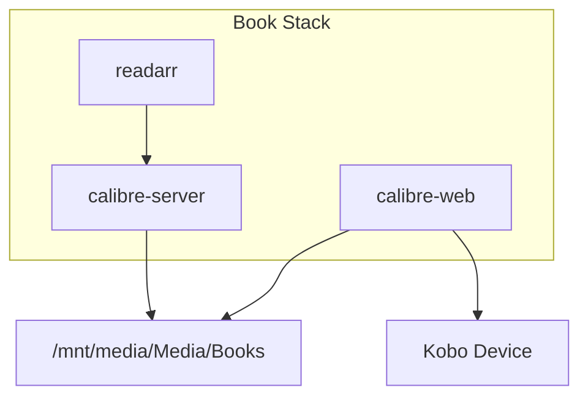
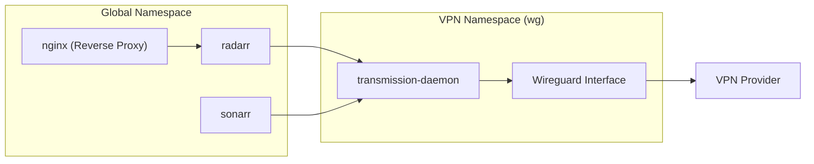

# Media Stack: Jellyfin, Arr Suite, and Transmission
Relevant source files
- [hosts/server.nix](https://github.com/Cody-W-Tucker/nix-config/blob/5a76c557/hosts/server.nix)
- [modules/server/default.nix](https://github.com/Cody-W-Tucker/nix-config/blob/5a76c557/modules/server/default.nix)
- [modules/server/excalidraw.nix](https://github.com/Cody-W-Tucker/nix-config/blob/5a76c557/modules/server/excalidraw.nix)
- [modules/server/homepage-dashboard.nix](https://github.com/Cody-W-Tucker/nix-config/blob/5a76c557/modules/server/homepage-dashboard.nix)
- [modules/server/media.nix](https://github.com/Cody-W-Tucker/nix-config/blob/5a76c557/modules/server/media.nix)
- [modules/server/monitoring.nix](https://github.com/Cody-W-Tucker/nix-config/blob/5a76c557/modules/server/monitoring.nix)
- [modules/system/base.nix](https://github.com/Cody-W-Tucker/nix-config/blob/5a76c557/modules/system/base.nix)

This section covers the media management and consumption stack deployed on the `server` host. The architecture emphasizes automated content acquisition, hardware-accelerated transcoding, secure remote access via Nginx, and network-isolated downloading using Wireguard namespaces.

## Storage Topology and Permissions

The media stack relies on a centralized storage mount at `/mnt/media`, which is a 4TB HDD formatted with `ext4`[hosts/server.nix73-76](https://github.com/Cody-W-Tucker/nix-config/blob/5a76c557/hosts/server.nix#L73-L76) To ensure interoperability between various services (Jellyfin, Sonarr, Transmission, etc.), a specific directory structure and permission model is enforced via `systemd.tmpfiles`.

### Directory Structure

The base directory `/mnt/media/Media` uses the `setgid` bit (`2775`) and is owned by the `media` group [modules/server/media.nix14](https://github.com/Cody-W-Tucker/nix-config/blob/5a76c557/modules/server/media.nix#L14-L14) This ensures that any file created by one service (e.g., Transmission) is writable by another (e.g., Radarr) for post-processing and moving.

| Path | Purpose | Group |
| --- | --- | --- |
| `/mnt/media/Media/Books` | E-books and Audiobooks | `media` |
| `/mnt/media/Media/Downloads` | Incomplete and completed torrents | `media` |
| `/mnt/media/Media/Movies` | Movie library | `media` |
| `/mnt/media/Media/Music` | Music library | `media` |
| `/mnt/media/Media/TV Shows` | Television series | `media` |

**Sources:**[modules/server/media.nix9-24](https://github.com/Cody-W-Tucker/nix-config/blob/5a76c557/modules/server/media.nix#L9-L24)[hosts/server.nix73-76](https://github.com/Cody-W-Tucker/nix-config/blob/5a76c557/hosts/server.nix#L73-L76)

## Consumption Layer: Jellyfin and Navidrome

The consumption layer provides web and mobile interfaces for streaming media.

### Jellyfin (Video)

Jellyfin is the primary video streaming server. It is configured to run under the `media` group to access the library [modules/server/media.nix31-34](https://github.com/Cody-W-Tucker/nix-config/blob/5a76c557/modules/server/media.nix#L31-L34)

- **Hardware Acceleration:** The `server` host utilizes an Intel i7-7000 with HD 630 Graphics [hosts/server.nix10](https://github.com/Cody-W-Tucker/nix-config/blob/5a76c557/hosts/server.nix#L10-L10) Hardware transcoding (QSV) is enabled by adding the `jellyfin` user to the `render` and `video` groups [modules/server/media.nix185-188](https://github.com/Cody-W-Tucker/nix-config/blob/5a76c557/modules/server/media.nix#L185-L188) and loading the `i915` kernel module with GuC submission enabled [hosts/server.nix50-54](https://github.com/Cody-W-Tucker/nix-config/blob/5a76c557/hosts/server.nix#L50-L54)
- **Reverse Proxy:** Accessed via `media.homehub.tv` with kTLS enabled for performance [modules/server/media.nix191-201](https://github.com/Cody-W-Tucker/nix-config/blob/5a76c557/modules/server/media.nix#L191-L201)

### Navidrome (Audio)

Navidrome provides a lightweight Subsonic-compatible API for music. It points specifically to the `/mnt/media/Media/Music` directory [modules/server/media.nix36-42](https://github.com/Cody-W-Tucker/nix-config/blob/5a76c557/modules/server/media.nix#L36-L42)

**Sources:**[modules/server/media.nix31-42](https://github.com/Cody-W-Tucker/nix-config/blob/5a76c557/modules/server/media.nix#L31-L42)[modules/server/media.nix185-188](https://github.com/Cody-W-Tucker/nix-config/blob/5a76c557/modules/server/media.nix#L185-L188)[hosts/server.nix50-54](https://github.com/Cody-W-Tucker/nix-config/blob/5a76c557/hosts/server.nix#L50-L54)

## Book Stack: Calibre and Kobo Sync

The book management system consists of three integrated components:

1. **Calibre-Server:** The backend database manager for Readarr [modules/server/media.nix56-63](https://github.com/Cody-W-Tucker/nix-config/blob/5a76c557/modules/server/media.nix#L56-L63)
2. **Calibre-Web:** The frontend reader interface, customized with Kobo sync support [modules/server/media.nix45-53](https://github.com/Cody-W-Tucker/nix-config/blob/5a76c557/modules/server/media.nix#L45-L53)
3. **Nginx Integration:** Calibre-Web requires specific buffer adjustments for Kobo sync synchronization [modules/server/media.nix211-226](https://github.com/Cody-W-Tucker/nix-config/blob/5a76c557/modules/server/media.nix#L211-L226)

**Sources:**[modules/server/media.nix44-63](https://github.com/Cody-W-Tucker/nix-config/blob/5a76c557/modules/server/media.nix#L44-L63)[modules/server/media.nix211-226](https://github.com/Cody-W-Tucker/nix-config/blob/5a76c557/modules/server/media.nix#L211-L226)

## Automation: The Arr Suite and Prowlarr

The "Arr" suite automates the lifecycle of media: monitoring, indexing, and downloading. All services are unified under the `media` group [modules/server/media.nix69-92](https://github.com/Cody-W-Tucker/nix-config/blob/5a76c557/modules/server/media.nix#L69-L92)

- **Prowlarr:** Centralized indexer management [modules/server/media.nix95-97](https://github.com/Cody-W-Tucker/nix-config/blob/5a76c557/modules/server/media.nix#L95-L97)
- **Radarr/Sonarr/Lidarr/Readarr:** Handle Movies, TV, Music, and Books respectively.
- **Bazarr:** Manages subtitle acquisition [modules/server/media.nix84-87](https://github.com/Cody-W-Tucker/nix-config/blob/5a76c557/modules/server/media.nix#L84-L87)
- **Jellyseerr:** User-friendly request interface for discovering new content [modules/server/media.nix65-67](https://github.com/Cody-W-Tucker/nix-config/blob/5a76c557/modules/server/media.nix#L65-L67)

**Sources:**[modules/server/media.nix65-97](https://github.com/Cody-W-Tucker/nix-config/blob/5a76c557/modules/server/media.nix#L65-L97)

## Transmission and VPN Confinement

Transmission is isolated within a Wireguard network namespace to ensure all torrent traffic is routed through a VPN. This is implemented using the `vpn-confinement` module [hosts/server.nix20](https://github.com/Cody-W-Tucker/nix-config/blob/5a76c557/hosts/server.nix#L20-L20)

### VPN Implementation

- **Namespace:** The `wg` namespace is defined using an encrypted Wireguard configuration from SOPS [modules/server/media.nix161-177](https://github.com/Cody-W-Tucker/nix-config/blob/5a76c557/modules/server/media.nix#L161-L177)
- **Confinement:** The `systemd.services.transmission.vpnConfinement` attribute binds the service to the `wg` namespace [modules/server/media.nix180-183](https://github.com/Cody-W-Tucker/nix-config/blob/5a76c557/modules/server/media.nix#L180-L183)
- **RPC Binding:** To allow Radarr/Sonarr to communicate with Transmission across the namespace boundary, the RPC interface is bound to the VPN internal address `192.168.15.1`[modules/server/media.nix150](https://github.com/Cody-W-Tucker/nix-config/blob/5a76c557/modules/server/media.nix#L150-L150)

### Transmission Configuration

Transmission uses a `umask` of `2` to ensure that files created by the `transmission` user remain writable by other members of the `media` group [modules/server/media.nix109](https://github.com/Cody-W-Tucker/nix-config/blob/5a76c557/modules/server/media.nix#L109-L109)

**Sources:**[modules/server/media.nix99-152](https://github.com/Cody-W-Tucker/nix-config/blob/5a76c557/modules/server/media.nix#L99-L152)[modules/server/media.nix161-183](https://github.com/Cody-W-Tucker/nix-config/blob/5a76c557/modules/server/media.nix#L161-L183)[hosts/server.nix19-21](https://github.com/Cody-W-Tucker/nix-config/blob/5a76c557/hosts/server.nix#L19-L21)

## Monitoring and Dashboard Integration

The media stack is integrated into the `homepage-dashboard` for status visibility and the Prometheus/Grafana stack for performance metrics.

### Dashboard Categories

Services are organized into functional groups on `homehub.tv`:

- **Consume:** Jellyfin, Navidrome, CalibreWeb [modules/server/homepage-dashboard.nix135-165](https://github.com/Cody-W-Tucker/nix-config/blob/5a76c557/modules/server/homepage-dashboard.nix#L135-L165)
- **Collect:** Jellyseerr [modules/server/homepage-dashboard.nix167-174](https://github.com/Cody-W-Tucker/nix-config/blob/5a76c557/modules/server/homepage-dashboard.nix#L167-L174)
- **Manage:** Sonarr, Radarr, Readarr, Lidarr, Bazarr [modules/server/homepage-dashboard.nix185-220](https://github.com/Cody-W-Tucker/nix-config/blob/5a76c557/modules/server/homepage-dashboard.nix#L185-L220)

### Observability

Prometheus scrapes metrics from the server, including Nginx status and system resource usage, which are then visualized in Grafana [modules/server/monitoring.nix41-145](https://github.com/Cody-W-Tucker/nix-config/blob/5a76c557/modules/server/monitoring.nix#L41-L145)

**Sources:**[modules/server/homepage-dashboard.nix135-228](https://github.com/Cody-W-Tucker/nix-config/blob/5a76c557/modules/server/homepage-dashboard.nix#L135-L228)[modules/server/monitoring.nix8-40](https://github.com/Cody-W-Tucker/nix-config/blob/5a76c557/modules/server/monitoring.nix#L8-L40)