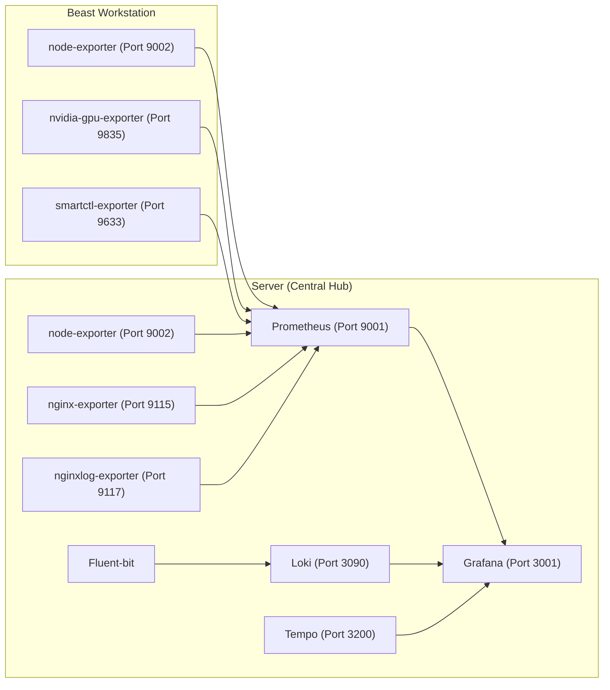
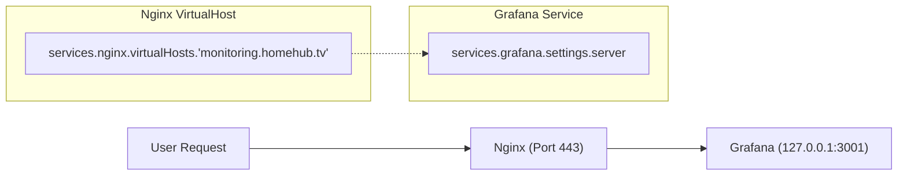

# Monitoring Stack: Prometheus, Grafana, Loki, and Tempo
Relevant source files
- [modules/server/default.nix](https://github.com/Cody-W-Tucker/nix-config/blob/5a76c557/modules/server/default.nix)
- [modules/server/excalidraw.nix](https://github.com/Cody-W-Tucker/nix-config/blob/5a76c557/modules/server/excalidraw.nix)
- [modules/server/homepage-dashboard.nix](https://github.com/Cody-W-Tucker/nix-config/blob/5a76c557/modules/server/homepage-dashboard.nix)
- [modules/server/monitoring.nix](https://github.com/Cody-W-Tucker/nix-config/blob/5a76c557/modules/server/monitoring.nix)
- [modules/server/security.nix](https://github.com/Cody-W-Tucker/nix-config/blob/5a76c557/modules/server/security.nix)

This section covers the centralized observability pipeline hosted on the server. The stack provides a unified view of system health, application performance, and security across the entire infrastructure, including the high-performance `beast` workstation and the primary `server`.

## Observability Architecture

The monitoring infrastructure is built on the LGTM stack (Loki, Grafana, Tempo, Prometheus). It aggregates metrics, logs, and traces into a single pane of glass provided by Grafana.

### System Data Flow

The following diagram illustrates how telemetry data flows from exporters and services into the central monitoring components.

**Telemetry Pipeline Architecture**

**Sources:**`<FileRef file-url="https://github.com/Cody-W-Tucker/nix-config/blob/5a76c557/modules/server/monitoring.nix#L8-L145" min=8 max=145 file-path="modules/server/monitoring.nix">Hii</FileRef>`, `<FileRef file-url="https://github.com/Cody-W-Tucker/nix-config/blob/5a76c557/modules/server/default.nix#L52-L84" min=52 max=84 file-path="modules/server/default.nix">Hii</FileRef>`

---

## Metrics Aggregation (Prometheus)

Prometheus acts as the primary time-series database. It is configured to scrape both local exporters on the server and remote exporters on the `beast` host.

### Key Exporters and Scrape Jobs

- **Node Exporter:** Collects hardware and OS metrics. The server instance specifically enables the `systemd` collector to monitor service states `<FileRef file-url="https://github.com/Cody-W-Tucker/nix-config/blob/5a76c557/modules/server/monitoring.nix#L46-L50" min=46 max=50 file-path="modules/server/monitoring.nix">Hii</FileRef>`.
- **Nginx Exporter:** Scrapes the `stub_status` endpoint configured at `localhost:9114/nginx_status``<FileRef file-url="https://github.com/Cody-W-Tucker/nix-config/blob/5a76c557/modules/server/monitoring.nix#L51-L55" min=51 max=55 file-path="modules/server/monitoring.nix">Hii</FileRef>`, `<FileRef file-url="https://github.com/Cody-W-Tucker/nix-config/blob/5a76c557/modules/server/default.nix#L70-L84" min=70 max=84 file-path="modules/server/default.nix">Hii</FileRef>`.
- **Nvidia GPU Exporter:** Targets the `beast` workstation at port `9835` to monitor VRAM usage and GPU utilization for AI workloads `<FileRef file-url="https://github.com/Cody-W-Tucker/nix-config/blob/5a76c557/modules/server/monitoring.nix#L112-L121" min=112 max=121 file-path="modules/server/monitoring.nix">Hii</FileRef>`.
- **Smartctl Exporter:** Aggregates drive health data from both hosts (`beast:9633` and `server:9002`) `<FileRef file-url="https://github.com/Cody-W-Tucker/nix-config/blob/5a76c557/modules/server/monitoring.nix#L95-L110" min=95 max=110 file-path="modules/server/monitoring.nix">Hii</FileRef>`.

Prometheus is also configured with `--web.enable-remote-write-receiver`, allowing it to accept metrics pushed from external sources if needed `<FileRef file-url="https://github.com/Cody-W-Tucker/nix-config/blob/5a76c557/modules/server/monitoring.nix#L43-L43" min=43  file-path="modules/server/monitoring.nix">Hii</FileRef>`.

**Sources:**`<FileRef file-url="https://github.com/Cody-W-Tucker/nix-config/blob/5a76c557/modules/server/monitoring.nix#L41-L145" min=41 max=145 file-path="modules/server/monitoring.nix">Hii</FileRef>`

---

## Log Aggregation (Loki)

Loki provides log storage and querying capabilities. It is configured for a single-binary deployment with filesystem storage.

### Configuration and Retention

- **Storage:** Uses the `tsdb` shipping engine with a 24h index period `<FileRef file-url="https://github.com/Cody-W-Tucker/nix-config/blob/5a76c557/modules/server/monitoring.nix#L198-L209" min=198 max=209 file-path="modules/server/monitoring.nix">Hii</FileRef>`.
- **Retention:** A global retention period of 120 hours (5 days) is enforced via the `table_manager` and `compactor``<FileRef file-url="https://github.com/Cody-W-Tucker/nix-config/blob/5a76c557/modules/server/monitoring.nix#L175-L196" min=175 max=196 file-path="modules/server/monitoring.nix">Hii</FileRef>`.
- **Nginx Ingestion:** Nginx access logs are explicitly routed to `/var/log/nginx/access.log` for ingestion `<FileRef file-url="https://github.com/Cody-W-Tucker/nix-config/blob/5a76c557/modules/server/default.nix#L60-L66" min=60 max=66 file-path="modules/server/default.nix">Hii</FileRef>`. The `nginxlog` exporter parses these logs into metrics at port `9117``<FileRef file-url="https://github.com/Cody-W-Tucker/nix-config/blob/5a76c557/modules/server/monitoring.nix#L56-L69" min=56 max=69 file-path="modules/server/monitoring.nix">Hii</FileRef>`.

**Sources:**`<FileRef file-url="https://github.com/Cody-W-Tucker/nix-config/blob/5a76c557/modules/server/monitoring.nix#L146-L213" min=146 max=213 file-path="modules/server/monitoring.nix">Hii</FileRef>`, `<FileRef file-url="https://github.com/Cody-W-Tucker/nix-config/blob/5a76c557/modules/server/default.nix#L60-L66" min=60 max=66 file-path="modules/server/default.nix">Hii</FileRef>`

---

## Distributed Tracing (Tempo)

Tempo handles distributed tracing using the OTLP (OpenTelemetry Protocol). It is integrated with Grafana to allow jumping from logs (Loki) to specific traces (Tempo).

### Trace Receivers

Tempo listens for traces via OTLP on the following endpoints:

- **gRPC:**`127.0.0.1:4327``<FileRef file-url="https://github.com/Cody-W-Tucker/nix-config/blob/5a76c557/modules/server/monitoring.nix#L226-L226" min=226  file-path="modules/server/monitoring.nix">Hii</FileRef>`
- **HTTP:**`127.0.0.1:4328``<FileRef file-url="https://github.com/Cody-W-Tucker/nix-config/blob/5a76c557/modules/server/monitoring.nix#L227-L227" min=227  file-path="modules/server/monitoring.nix">Hii</FileRef>`

The `metrics_generator` is enabled to derive Prometheus-style metrics from spans, allowing for "Service Graph" visualizations in Grafana `<FileRef file-url="https://github.com/Cody-W-Tucker/nix-config/blob/5a76c557/modules/server/monitoring.nix#L248-L257" min=248 max=257 file-path="modules/server/monitoring.nix">Hii</FileRef>`.

**Sources:**`<FileRef file-url="https://github.com/Cody-W-Tucker/nix-config/blob/5a76c557/modules/server/monitoring.nix#L215-L260" min=215 max=260 file-path="modules/server/monitoring.nix">Hii</FileRef>`

---

## Visualization and Provisioning (Grafana)

Grafana is the frontend for the entire stack, served at `monitoring.homehub.tv`.

### Automated Provisioning

The configuration uses Nix to declaratively provision data sources, ensuring the environment is reproducible without manual UI setup.

| Data Source | Type | URL |
| --- | --- | --- |
| **Prometheus** | `prometheus` | `http://localhost:9001` |
| **Tempo** | `tempo` | `http://localhost:3200` |

**Sources:**`<FileRef file-url="https://github.com/Cody-W-Tucker/nix-config/blob/5a76c557/modules/server/monitoring.nix#L9-L40" min=9 max=40 file-path="modules/server/monitoring.nix">Hii</FileRef>`

### Nginx Reverse Proxy

Grafana is proxied through Nginx with SSL provided by ACME/Cloudflare.

**Proxy Configuration Mapping**

**Sources:**`<FileRef file-url="https://github.com/Cody-W-Tucker/nix-config/blob/5a76c557/modules/server/monitoring.nix#L14-L23" min=14 max=23 file-path="modules/server/monitoring.nix">Hii</FileRef>`, `<FileRef file-url="https://github.com/Cody-W-Tucker/nix-config/blob/5a76c557/modules/server/homepage-dashboard.nix#L112-L117" min=112 max=117 file-path="modules/server/homepage-dashboard.nix">Hii</FileRef>`

---

## Implementation Details

### Security and Access

The monitoring services are generally bound to `127.0.0.1` to prevent external exposure, with Nginx acting as the secure gateway. Security is further hardened by `fail2ban`, which monitors logs for brute-force attempts and enforces a 24h ban (incrementing up to 1 week) `<FileRef file-url="https://github.com/Cody-W-Tucker/nix-config/blob/5a76c557/modules/server/security.nix#L3-L18" min=3 max=18 file-path="modules/server/security.nix">Hii</FileRef>`.

### Dashboard Integration

The monitoring stack is integrated into the `homepage-dashboard`, providing quick links to Grafana for "Logging & Dashboard" needs `<FileRef file-url="https://github.com/Cody-W-Tucker/nix-config/blob/5a76c557/modules/server/homepage-dashboard.nix#L112-L117" min=112 max=117 file-path="modules/server/homepage-dashboard.nix">Hii</FileRef>`.

**Sources:**`<FileRef file-url="https://github.com/Cody-W-Tucker/nix-config/blob/5a76c557/modules/server/security.nix#L1-L19" min=1 max=19 file-path="modules/server/security.nix">Hii</FileRef>`, `<FileRef file-url="https://github.com/Cody-W-Tucker/nix-config/blob/5a76c557/modules/server/homepage-dashboard.nix#L112-L117" min=112 max=117 file-path="modules/server/homepage-dashboard.nix">Hii</FileRef>`