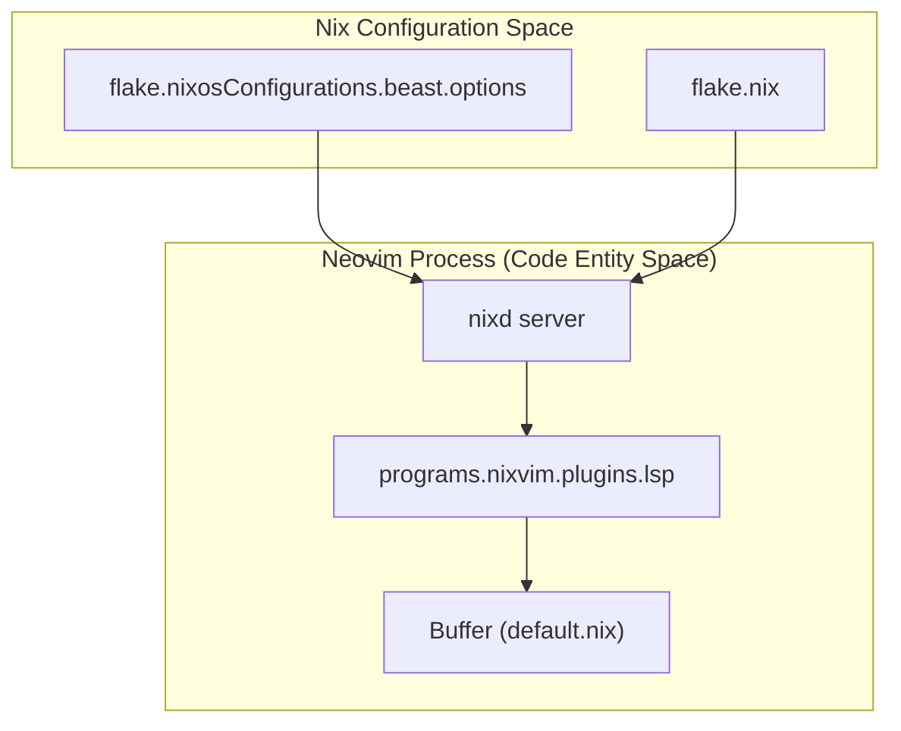
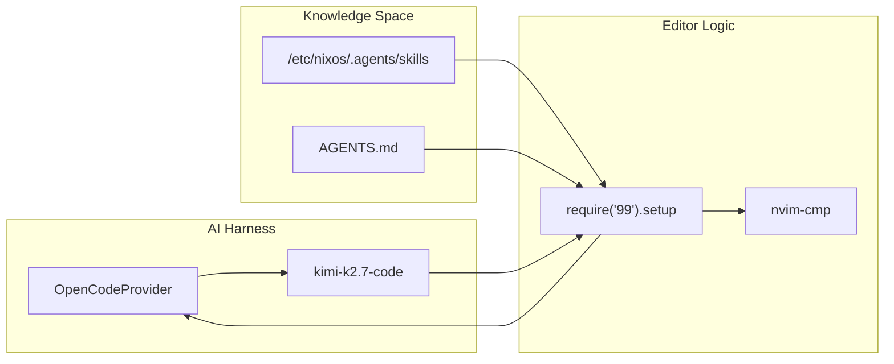

# Neovim (NixVim) Editor
Relevant source files
- [users/cody/desktop/default.nix](https://github.com/Cody-W-Tucker/nix-config/blob/5a76c557/users/cody/desktop/default.nix)
- [users/cody/desktop/editor/nixvim/default.nix](https://github.com/Cody-W-Tucker/nix-config/blob/5a76c557/users/cody/desktop/editor/nixvim/default.nix)
- [users/cody/desktop/editor/nixvim/plugins/99.nix](https://github.com/Cody-W-Tucker/nix-config/blob/5a76c557/users/cody/desktop/editor/nixvim/plugins/99.nix)
- [users/cody/desktop/editor/nixvim/plugins/cmp.nix](https://github.com/Cody-W-Tucker/nix-config/blob/5a76c557/users/cody/desktop/editor/nixvim/plugins/cmp.nix)
- [users/cody/desktop/editor/nixvim/plugins/lsp.nix](https://github.com/Cody-W-Tucker/nix-config/blob/5a76c557/users/cody/desktop/editor/nixvim/plugins/lsp.nix)
- [users/cody/desktop/harness/mcp.nix](https://github.com/Cody-W-Tucker/nix-config/blob/5a76c557/users/cody/desktop/harness/mcp.nix)
- [users/cody/desktop/hyprland.nix](https://github.com/Cody-W-Tucker/nix-config/blob/5a76c557/users/cody/desktop/hyprland.nix)
- [users/cody/desktop/xdg.nix](https://github.com/Cody-W-Tucker/nix-config/blob/5a76c557/users/cody/desktop/xdg.nix)

The Neovim configuration in CodyOS is built using **NixVim**, a NixOS module that allows for the declarative configuration of Neovim plugins and settings within the Flake ecosystem. It serves as the primary IDE for system development, featuring deep integration with the Nix language server and local AI coding assistants.

### Core Configuration and Theming

The editor is enabled via `programs.nixvim.enable` and configured to act as the system's default editor [users/cody/desktop/editor/nixvim/default.nix28-33](https://github.com/Cody-W-Tucker/nix-config/blob/5a76c557/users/cody/desktop/editor/nixvim/default.nix#L28-L33) It uses the **Catppuccin Mocha** flavor with transparent background support to match the system-wide Stylix theme [users/cody/desktop/editor/nixvim/default.nix34-40](https://github.com/Cody-W-Tucker/nix-config/blob/5a76c557/users/cody/desktop/editor/nixvim/default.nix#L34-L40)

Key system integrations include:

- **Clipboard**: Wired to `wl-copy` for Wayland compatibility, using the `unnamedplus` register [users/cody/desktop/editor/nixvim/default.nix41-45](https://github.com/Cody-W-Tucker/nix-config/blob/5a76c557/users/cody/desktop/editor/nixvim/default.nix#L41-L45)
- **Keymaps**: The leader key is set to `<Space>`[users/cody/desktop/editor/nixvim/default.nix79](https://github.com/Cody-W-Tucker/nix-config/blob/5a76c557/users/cody/desktop/editor/nixvim/default.nix#L79-L79)
- **XDG Integration**: Neovim is registered as the default handler for `text/*`, `application/json`, and `application/javascript` MIME types [users/cody/desktop/xdg.nix79-85](https://github.com/Cody-W-Tucker/nix-config/blob/5a76c557/users/cody/desktop/xdg.nix#L79-L85)

**Sources:**

- [users/cody/desktop/editor/nixvim/default.nix28-45](https://github.com/Cody-W-Tucker/nix-config/blob/5a76c557/users/cody/desktop/editor/nixvim/default.nix#L28-L45)
- [users/cody/desktop/xdg.nix79-85](https://github.com/Cody-W-Tucker/nix-config/blob/5a76c557/users/cody/desktop/xdg.nix#L79-L85)

---

### Language Server Protocol (LSP)

The LSP configuration is centered around `nixd`, providing specialized support for Nix development by evaluating flake outputs directly for autocompletion and documentation.

#### LSP Architecture

The `nixd` server is configured to pull options directly from the `beast` host configuration, enabling precise completion for system options [users/cody/desktop/editor/nixvim/plugins/lsp.nix9-26](https://github.com/Cody-W-Tucker/nix-config/blob/5a76c557/users/cody/desktop/editor/nixvim/plugins/lsp.nix#L9-L26)

| Server | Purpose |
| --- | --- |
| `nixd` | Nix language support with `nixfmt` formatting [users/cody/desktop/editor/nixvim/plugins/lsp.nix9-26](https://github.com/Cody-W-Tucker/nix-config/blob/5a76c557/users/cody/desktop/editor/nixvim/plugins/lsp.nix#L9-L26) |
| `pyright` | Python static analysis [users/cody/desktop/editor/nixvim/plugins/lsp.nix30](https://github.com/Cody-W-Tucker/nix-config/blob/5a76c557/users/cody/desktop/editor/nixvim/plugins/lsp.nix#L30-L30) |
| `ts_ls` | TypeScript/JS (filtered to exclude `.astro`) [users/cody/desktop/editor/nixvim/plugins/lsp.nix103-114](https://github.com/Cody-W-Tucker/nix-config/blob/5a76c557/users/cody/desktop/editor/nixvim/plugins/lsp.nix#L103-L114) |
| `zls` | Zig language support [users/cody/desktop/editor/nixvim/plugins/lsp.nix34](https://github.com/Cody-W-Tucker/nix-config/blob/5a76c557/users/cody/desktop/editor/nixvim/plugins/lsp.nix#L34-L34) |
| `copilot` | GitHub Copilot integration with custom sign-in logic [users/cody/desktop/editor/nixvim/plugins/lsp.nix35-101](https://github.com/Cody-W-Tucker/nix-config/blob/5a76c557/users/cody/desktop/editor/nixvim/plugins/lsp.nix#L35-L101) |

#### NixVim LSP Data Flow

This diagram illustrates how NixVim bridges the Nix Flake environment to the running Neovim LSP client.

**Sources:**

- [users/cody/desktop/editor/nixvim/plugins/lsp.nix9-26](https://github.com/Cody-W-Tucker/nix-config/blob/5a76c557/users/cody/desktop/editor/nixvim/plugins/lsp.nix#L9-L26)
- [users/cody/desktop/editor/nixvim/plugins/lsp.nix103-114](https://github.com/Cody-W-Tucker/nix-config/blob/5a76c557/users/cody/desktop/editor/nixvim/plugins/lsp.nix#L103-L114)

---

### AI Coding Integration (99 & OpenCode)

A standout feature of this configuration is the integration of the `99` AI coding plugin, which connects Neovim to the `OpenCode` provider. This allows the editor to utilize local or remote LLMs for code completion and generation, informed by system-specific "skills".

- **Provider**: Uses `OpenCodeProvider` with the `kimi-k2.7-code` model [users/cody/desktop/editor/nixvim/plugins/99.nix14-15](https://github.com/Cody-W-Tucker/nix-config/blob/5a76c557/users/cody/desktop/editor/nixvim/plugins/99.nix#L14-L15)
- **Context Injection**: The plugin is configured to read "skills" (markdown-based knowledge) from both the user's home directory and the system `/etc/nixos/.agents/skills` directory [users/cody/desktop/editor/nixvim/plugins/99.nix18-22](https://github.com/Cody-W-Tucker/nix-config/blob/5a76c557/users/cody/desktop/editor/nixvim/plugins/99.nix#L18-L22)
- **Completion Source**: Integrated with `cmp` for seamless UI delivery [users/cody/desktop/editor/nixvim/plugins/99.nix17](https://github.com/Cody-W-Tucker/nix-config/blob/5a76c557/users/cody/desktop/editor/nixvim/plugins/99.nix#L17-L17)

**Sources:**

- [users/cody/desktop/editor/nixvim/plugins/99.nix10-33](https://github.com/Cody-W-Tucker/nix-config/blob/5a76c557/users/cody/desktop/editor/nixvim/plugins/99.nix#L10-L33)
- [users/cody/desktop/editor/nixvim/plugins/cmp.nix15-20](https://github.com/Cody-W-Tucker/nix-config/blob/5a76c557/users/cody/desktop/editor/nixvim/plugins/cmp.nix#L15-L20)

---

### Plugin Ecosystem

The editor includes a curated set of plugins for navigation, UI, and syntax:

#### Completion & Formatting

- **cmp**: Provides the completion engine with sources for LSP, paths, and buffers [users/cody/desktop/editor/nixvim/plugins/cmp.nix3-21](https://github.com/Cody-W-Tucker/nix-config/blob/5a76c557/users/cody/desktop/editor/nixvim/plugins/cmp.nix#L3-L21)
- **conform**: Handles code formatting (configuration imported via `conform.nix`) [users/cody/desktop/editor/nixvim/default.nix18](https://github.com/Cody-W-Tucker/nix-config/blob/5a76c557/users/cody/desktop/editor/nixvim/default.nix#L18-L18)
- **ts-autotag**: Automatically closes HTML/XML tags [users/cody/desktop/editor/nixvim/default.nix25](https://github.com/Cody-W-Tucker/nix-config/blob/5a76c557/users/cody/desktop/editor/nixvim/default.nix#L25-L25)

#### UI and Navigation

- **Telescope**: Fuzzy finder for files and grep [users/cody/desktop/editor/nixvim/default.nix22](https://github.com/Cody-W-Tucker/nix-config/blob/5a76c557/users/cody/desktop/editor/nixvim/default.nix#L22-L22)
- **Lualine**: A stylized status line [users/cody/desktop/editor/nixvim/default.nix21](https://github.com/Cody-W-Tucker/nix-config/blob/5a76c557/users/cody/desktop/editor/nixvim/default.nix#L21-L21)
- **Yazi**: Integrated terminal file manager [users/cody/desktop/editor/nixvim/default.nix73](https://github.com/Cody-W-Tucker/nix-config/blob/5a76c557/users/cody/desktop/editor/nixvim/default.nix#L73-L73)
- **Treesitter**: Advanced syntax highlighting and code parsing [users/cody/desktop/editor/nixvim/default.nix23](https://github.com/Cody-W-Tucker/nix-config/blob/5a76c557/users/cody/desktop/editor/nixvim/default.nix#L23-L23)
- **Which-key**: Popup for keybinding discovery [users/cody/desktop/editor/nixvim/default.nix70](https://github.com/Cody-W-Tucker/nix-config/blob/5a76c557/users/cody/desktop/editor/nixvim/default.nix#L70-L70)

#### Utilities

- **Gitsigns & Lazygit**: Git integration within the editor [users/cody/desktop/editor/nixvim/default.nix66-67](https://github.com/Cody-W-Tucker/nix-config/blob/5a76c557/users/cody/desktop/editor/nixvim/default.nix#L66-L67)
- **Markdown Preview**: Live preview for documentation [users/cody/desktop/editor/nixvim/default.nix68](https://github.com/Cody-W-Tucker/nix-config/blob/5a76c557/users/cody/desktop/editor/nixvim/default.nix#L68-L68)
- **Direnv**: Automatically loads environment variables when entering directories [users/cody/desktop/editor/nixvim/default.nix75](https://github.com/Cody-W-Tucker/nix-config/blob/5a76c557/users/cody/desktop/editor/nixvim/default.nix#L75-L75)

**Sources:**

- [users/cody/desktop/editor/nixvim/default.nix14-26](https://github.com/Cody-W-Tucker/nix-config/blob/5a76c557/users/cody/desktop/editor/nixvim/default.nix#L14-L26)
- [users/cody/desktop/editor/nixvim/default.nix63-77](https://github.com/Cody-W-Tucker/nix-config/blob/5a76c557/users/cody/desktop/editor/nixvim/default.nix#L63-L77)
- [users/cody/desktop/editor/nixvim/plugins/cmp.nix1-22](https://github.com/Cody-W-Tucker/nix-config/blob/5a76c557/users/cody/desktop/editor/nixvim/plugins/cmp.nix#L1-L22)