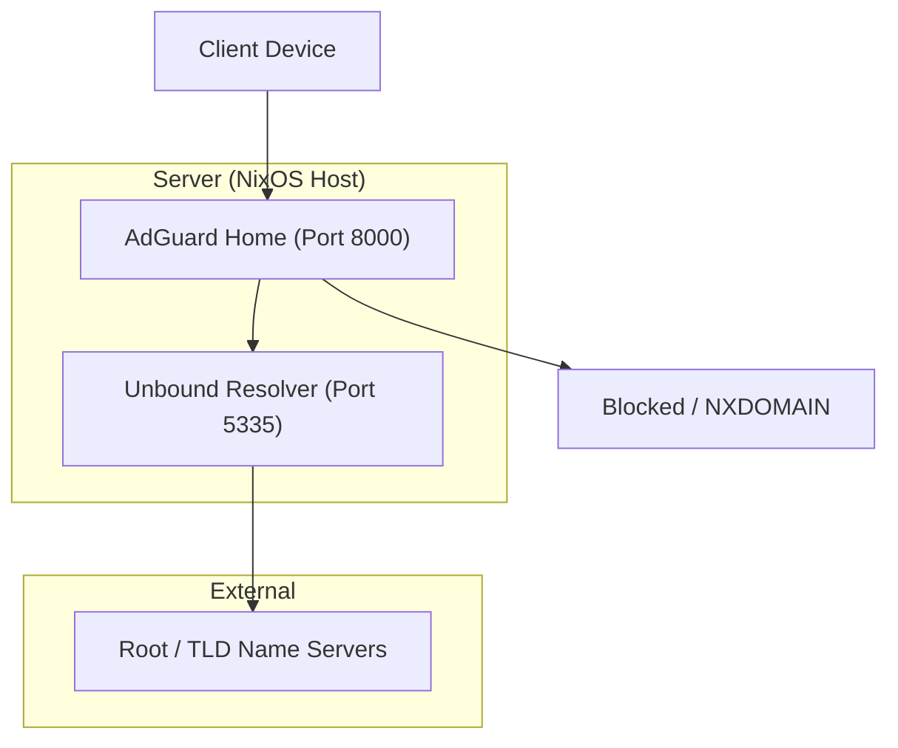
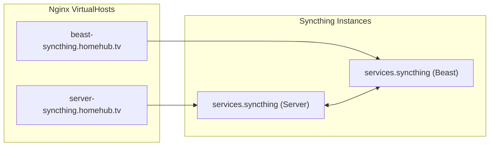

# Network Services: DNS, AdGuard, and Syncthing
Relevant source files
- [modules/server/adguard.nix](https://github.com/Cody-W-Tucker/nix-config/blob/5a76c557/modules/server/adguard.nix)
- [modules/server/arm.nix](https://github.com/Cody-W-Tucker/nix-config/blob/5a76c557/modules/server/arm.nix)
- [modules/server/default.nix](https://github.com/Cody-W-Tucker/nix-config/blob/5a76c557/modules/server/default.nix)
- [modules/server/excalidraw.nix](https://github.com/Cody-W-Tucker/nix-config/blob/5a76c557/modules/server/excalidraw.nix)
- [modules/server/homepage-dashboard.nix](https://github.com/Cody-W-Tucker/nix-config/blob/5a76c557/modules/server/homepage-dashboard.nix)
- [modules/server/monitoring.nix](https://github.com/Cody-W-Tucker/nix-config/blob/5a76c557/modules/server/monitoring.nix)
- [modules/server/nginx-syncthing.nix](https://github.com/Cody-W-Tucker/nix-config/blob/5a76c557/modules/server/nginx-syncthing.nix)
- [modules/services/syncthing.nix](https://github.com/Cody-W-Tucker/nix-config/blob/5a76c557/modules/services/syncthing.nix)
- [modules/system/users.nix](https://github.com/Cody-W-Tucker/nix-config/blob/5a76c557/modules/system/users.nix)

This section details the core networking infrastructure and synchronization services managed by CodyOS. It covers the multi-layered DNS resolution strategy combining AdGuard Home and Unbound, the Syncthing synchronization mesh, and the centralized dashboard that aggregates all `homehub.tv` services.

## DNS Resolution Pipeline

CodyOS implements a recursive DNS pipeline designed for privacy, speed, and network-wide ad-blocking. The system utilizes `services.adguardhome` as the primary filter and `services.unbound` as the upstream recursive resolver.

### Implementation Details

- **AdGuard Home**: Acts as the entry point for DNS queries on the network. It listens on port `8000` for its web interface and handles filtering logic [modules/server/adguard.nix2-6](https://github.com/Cody-W-Tucker/nix-config/blob/5a76c557/modules/server/adguard.nix#L2-L6)
- **Unbound**: Configured as a full recursive resolver listening on `127.0.0.1:5335`[modules/server/adguard.nix16-26](https://github.com/Cody-W-Tucker/nix-config/blob/5a76c557/modules/server/adguard.nix#L16-L26) It is hardened against DNSSEC stripping and glue records [modules/server/adguard.nix32-33](https://github.com/Cody-W-Tucker/nix-config/blob/5a76c557/modules/server/adguard.nix#L32-L33)
- **Fallback Mechanism**: The system includes a fallback to `1.1.1.1` to ensure the server remains reachable during bootstrap or local resolver failure [modules/server/adguard.nix64-68](https://github.com/Cody-W-Tucker/nix-config/blob/5a76c557/modules/server/adguard.nix#L64-L68)

### DNS Data Flow

The following diagram illustrates how a DNS query is resolved within the `homehub.tv` infrastructure.

**DNS Resolution Logic**

**Sources:**

- [modules/server/adguard.nix1-70](https://github.com/Cody-W-Tucker/nix-config/blob/5a76c557/modules/server/adguard.nix#L1-L70)

## Syncthing Mesh and Proxying

Syncthing provides continuous file synchronization between the `server` and `beast` hosts. The configuration is declaratively defined to ensure both nodes recognize each other and share specific directory paths.

### Device and Folder Configuration

The service is unified in `modules/services/syncthing.nix`, using `lib.mkIf` to apply host-specific paths while sharing device IDs [modules/services/syncthing.nix15-22](https://github.com/Cody-W-Tucker/nix-config/blob/5a76c557/modules/services/syncthing.nix#L15-L22)

| Feature | Server Configuration | Beast Configuration |
| --- | --- | --- |
| **User** | `codyt`[modules/services/syncthing.nix8](https://github.com/Cody-W-Tucker/nix-config/blob/5a76c557/modules/services/syncthing.nix#L8-L8) | `codyt` |
| **Path** | `/mnt/media/Share`[modules/services/syncthing.nix37](https://github.com/Cody-W-Tucker/nix-config/blob/5a76c557/modules/services/syncthing.nix#L37-L37) | `/mnt/backup/Share`[modules/services/syncthing.nix48](https://github.com/Cody-W-Tucker/nix-config/blob/5a76c557/modules/services/syncthing.nix#L48-L48) |
| **GUI Port** | `8384` | `8384` |

### Nginx Reverse Proxy

To allow remote management, the server host proxies both its local Syncthing instance and the desktop instance via Tailscale IPs [modules/server/nginx-syncthing.nix3-14](https://github.com/Cody-W-Tucker/nix-config/blob/5a76c557/modules/server/nginx-syncthing.nix#L3-L14)

- **Server GUI**: `server-syncthing.homehub.tv` -> `127.0.0.1:8384`[modules/server/nginx-syncthing.nix18-25](https://github.com/Cody-W-Tucker/nix-config/blob/5a76c557/modules/server/nginx-syncthing.nix#L18-L25)
- **Beast GUI**: `beast-syncthing.homehub.tv` -> `100.108.143.19:8384`[modules/server/nginx-syncthing.nix26-33](https://github.com/Cody-W-Tucker/nix-config/blob/5a76c557/modules/server/nginx-syncthing.nix#L26-L33)

**Syncthing Entity Mapping**

**Sources:**

- [modules/services/syncthing.nix1-57](https://github.com/Cody-W-Tucker/nix-config/blob/5a76c557/modules/services/syncthing.nix#L1-L57)
- [modules/server/nginx-syncthing.nix1-36](https://github.com/Cody-W-Tucker/nix-config/blob/5a76c557/modules/server/nginx-syncthing.nix#L1-L36)

## Homepage Dashboard

The `homepage-dashboard` service serves as the central navigation hub for the `homehub.tv` domain. It is organized into functional categories to streamline access to various system services.

### Dashboard Structure

The dashboard is configured in `modules/server/homepage-dashboard.nix` and is proxied through Nginx with ACME SSL [modules/server/homepage-dashboard.nix7-14](https://github.com/Cody-W-Tucker/nix-config/blob/5a76c557/modules/server/homepage-dashboard.nix#L7-L14)

| Category | Key Services Included |
| --- | --- |
| **Business** | Open-WebUI, Paperless, Excalidraw [modules/server/homepage-dashboard.nix78-100](https://github.com/Cody-W-Tucker/nix-config/blob/5a76c557/modules/server/homepage-dashboard.nix#L78-L100) |
| **Tools** | Qdrant, Grafana, ActualBudget, Karakeep [modules/server/homepage-dashboard.nix103-132](https://github.com/Cody-W-Tucker/nix-config/blob/5a76c557/modules/server/homepage-dashboard.nix#L103-L132) |
| **Consume** | Jellyfin, Navidrome, CalibreWeb, Miniflux [modules/server/homepage-dashboard.nix135-164](https://github.com/Cody-W-Tucker/nix-config/blob/5a76c557/modules/server/homepage-dashboard.nix#L135-L164) |
| **Network** | AdGuard, ServerSyncthing, BeastSyncthing [modules/server/homepage-dashboard.nix231-251](https://github.com/Cody-W-Tucker/nix-config/blob/5a76c557/modules/server/homepage-dashboard.nix#L231-L251) |

### System Widgets

The dashboard also provides real-time monitoring via widgets:

- **System**: CPU, Memory, and Disk usage for the root partition [modules/server/homepage-dashboard.nix44-56](https://github.com/Cody-W-Tucker/nix-config/blob/5a76c557/modules/server/homepage-dashboard.nix#L44-L56)
- **Storage**: Dedicated monitoring for the `/mnt/media` mount point [modules/server/homepage-dashboard.nix57-62](https://github.com/Cody-W-Tucker/nix-config/blob/5a76c557/modules/server/homepage-dashboard.nix#L57-L62)
- **Weather**: Localized weather for Kearney, NE using `openmeteo`[modules/server/homepage-dashboard.nix64-74](https://github.com/Cody-W-Tucker/nix-config/blob/5a76c557/modules/server/homepage-dashboard.nix#L64-L74)

**Sources:**

- [modules/server/homepage-dashboard.nix1-251](https://github.com/Cody-W-Tucker/nix-config/blob/5a76c557/modules/server/homepage-dashboard.nix#L1-L251)
- [modules/server/default.nix10](https://github.com/Cody-W-Tucker/nix-config/blob/5a76c557/modules/server/default.nix#L10-L10)

## Auxiliary Network Services

### Samba and WSDD

File sharing is facilitated through Samba, with `wsdd` (Web Services Dynamic Discovery) typically used to ensure shares are discoverable by Windows clients on the local network. (Implementation details are handled in `modules/server/samba.nix`, imported by the server [modules/server/default.nix16](https://github.com/Cody-W-Tucker/nix-config/blob/5a76c557/modules/server/default.nix#L16-L16)).

### Automatic Ripping Machine (ARM)

The system includes an OCI container for automated media ripping, configured with Intel QSV support for hardware transcoding [modules/server/arm.nix34-56](https://github.com/Cody-W-Tucker/nix-config/blob/5a76c557/modules/server/arm.nix#L34-L56) It includes a `systemd.timers` entry to restart the service weekly on Sundays at 02:00 [modules/server/arm.nix65-73](https://github.com/Cody-W-Tucker/nix-config/blob/5a76c557/modules/server/arm.nix#L65-L73)

**Sources:**

- [modules/server/arm.nix1-75](https://github.com/Cody-W-Tucker/nix-config/blob/5a76c557/modules/server/arm.nix#L1-L75)
- [modules/server/default.nix7](https://github.com/Cody-W-Tucker/nix-config/blob/5a76c557/modules/server/default.nix#L7-L7)