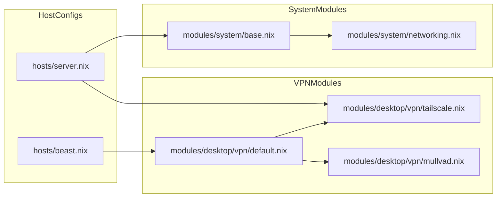
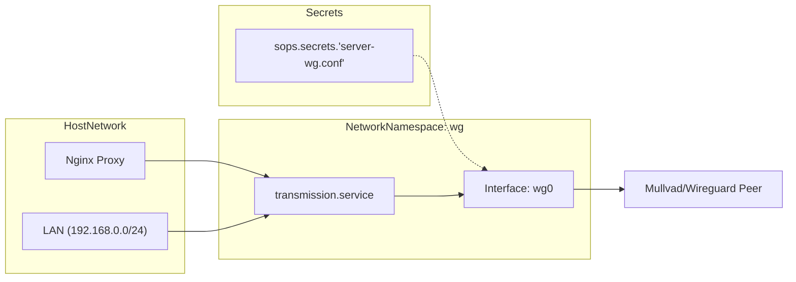

# Networking and VPN
Relevant source files
- [hosts/server.nix](https://github.com/Cody-W-Tucker/nix-config/blob/5a76c557/hosts/server.nix)
- [modules/desktop/vpn/default.nix](https://github.com/Cody-W-Tucker/nix-config/blob/5a76c557/modules/desktop/vpn/default.nix)
- [modules/desktop/vpn/mullvad.nix](https://github.com/Cody-W-Tucker/nix-config/blob/5a76c557/modules/desktop/vpn/mullvad.nix)
- [modules/desktop/vpn/tailscale.nix](https://github.com/Cody-W-Tucker/nix-config/blob/5a76c557/modules/desktop/vpn/tailscale.nix)
- [modules/server/media.nix](https://github.com/Cody-W-Tucker/nix-config/blob/5a76c557/modules/server/media.nix)
- [modules/system/base.nix](https://github.com/Cody-W-Tucker/nix-config/blob/5a76c557/modules/system/base.nix)
- [modules/system/networking.nix](https://github.com/Cody-W-Tucker/nix-config/blob/5a76c557/modules/system/networking.nix)

This page details the networking architecture of CodyOS, covering system-level security, the Tailscale mesh VPN, Mullvad VPN integration, and the advanced `vpn-confinement` mechanism used to isolate specific services into dedicated network namespaces.

## System Networking and Security

CodyOS utilizes a hardened networking stack by default. Base networking configuration is defined in `modules/system/networking.nix` and imported into the base system profile [modules/system/base.nix19](https://github.com/Cody-W-Tucker/nix-config/blob/5a76c557/modules/system/base.nix#L19-L19)

### Hardening and Firewall

The system employs `nftables` as the primary firewall backend [modules/system/networking.nix28](https://github.com/Cody-W-Tucker/nix-config/blob/5a76c557/modules/system/networking.nix#L28-L28) SSH access is strictly controlled via `services.openssh`:

- **Authentication**: Password authentication is disabled in favor of SSH keys [modules/system/networking.nix13](https://github.com/Cody-W-Tucker/nix-config/blob/5a76c557/modules/system/networking.nix#L13-L13)
- **Root Access**: Root login is completely prohibited [modules/system/networking.nix15](https://github.com/Cody-W-Tucker/nix-config/blob/5a76c557/modules/system/networking.nix#L15-L15)
- **Brute Force Protection**: `fail2ban` is enabled to monitor and block malicious authentication attempts [modules/system/networking.nix25](https://github.com/Cody-W-Tucker/nix-config/blob/5a76c557/modules/system/networking.nix#L25-L25)

### Host-Specific Configuration

Individual hosts manage their own interface logic. For example, the `server` host uses `networkmanager` and enables DHCP by default [hosts/server.nix61-62](https://github.com/Cody-W-Tucker/nix-config/blob/5a76c557/hosts/server.nix#L61-L62)[hosts/server.nix111](https://github.com/Cody-W-Tucker/nix-config/blob/5a76c557/hosts/server.nix#L111-L111) It also exports specific directories via NFS to the local network (e.g., `192.168.1.20`), opening ports `2049` and `111`[hosts/server.nix94-108](https://github.com/Cody-W-Tucker/nix-config/blob/5a76c557/hosts/server.nix#L94-L108)

**Sources:**

- [modules/system/networking.nix1-29](https://github.com/Cody-W-Tucker/nix-config/blob/5a76c557/modules/system/networking.nix#L1-L29)
- [modules/system/base.nix19](https://github.com/Cody-W-Tucker/nix-config/blob/5a76c557/modules/system/base.nix#L19-L19)
- [hosts/server.nix59-62](https://github.com/Cody-W-Tucker/nix-config/blob/5a76c557/hosts/server.nix#L59-L62)
- [hosts/server.nix94-108](https://github.com/Cody-W-Tucker/nix-config/blob/5a76c557/hosts/server.nix#L94-L108)

---

## VPN Infrastructure

The repository supports multiple VPN technologies tailored for different use cases: mesh networking (Tailscale), privacy-focused browsing (Mullvad), and service-level isolation (Wireguard via vpn-confinement).

### Tailscale Mesh VPN

Tailscale is used for secure, zero-config point-to-point connectivity between hosts.

- **Implementation**: Enabled via `services.tailscale.enable`[modules/desktop/vpn/tailscale.nix5](https://github.com/Cody-W-Tucker/nix-config/blob/5a76c557/modules/desktop/vpn/tailscale.nix#L5-L5)
- **Usage**: Applied to both the `server`[hosts/server.nix118](https://github.com/Cody-W-Tucker/nix-config/blob/5a76c557/hosts/server.nix#L118-L118) and desktop environments.

### Mullvad VPN

Mullvad is provided as a system service for general-purpose desktop privacy.

- **Implementation**: Defined in `modules/desktop/vpn/mullvad.nix` using the `mullvad-vpn` package [modules/desktop/vpn/mullvad.nix3-6](https://github.com/Cody-W-Tucker/nix-config/blob/5a76c557/modules/desktop/vpn/mullvad.nix#L3-L6)

### Data Flow: VPN Services

The following diagram illustrates how different VPN modules are integrated into the system.

**VPN Integration Architecture**

**Sources:**

- [modules/desktop/vpn/tailscale.nix1-7](https://github.com/Cody-W-Tucker/nix-config/blob/5a76c557/modules/desktop/vpn/tailscale.nix#L1-L7)
- [modules/desktop/vpn/mullvad.nix1-8](https://github.com/Cody-W-Tucker/nix-config/blob/5a76c557/modules/desktop/vpn/mullvad.nix#L1-L8)
- [modules/desktop/vpn/default.nix1-7](https://github.com/Cody-W-Tucker/nix-config/blob/5a76c557/modules/desktop/vpn/default.nix#L1-L7)
- [hosts/server.nix118](https://github.com/Cody-W-Tucker/nix-config/blob/5a76c557/hosts/server.nix#L118-L118)

---

## VPN Confinement (Wireguard Namespaces)

A critical feature of the `server` host is the isolation of the `transmission` bittorrent client. This is achieved using the `vpn-confinement` NixOS module, which forces a systemd service to run inside a dedicated Wireguard network namespace.

### Namespace Configuration

The namespace, named `wg`, is configured with a Wireguard configuration file managed by SOPS [modules/server/media.nix161-163](https://github.com/Cody-W-Tucker/nix-config/blob/5a76c557/modules/server/media.nix#L161-L163)

| Attribute | Configuration | Purpose |
| --- | --- | --- |
| **Namespace Name** | `wg` | Identifier for the network namespace |
| **Config File** | `server-wg.conf` | Wireguard keys and peer info (from SOPS) |
| **Accessibility** | `192.168.0.0/24` | LAN range allowed to access the namespace |
| **Port Mapping** | `9091 -> 9091` | Maps Transmission Web UI to the host |
| **Wireguard Port** | `60729` | Port used for peer-to-peer traffic |

### Service Isolation: Transmission

The `transmission` service is confined to the `wg` namespace, ensuring its traffic only exits via the Wireguard tunnel.

1. **Namespace Assignment**: The `vpnConfinement` option is applied to the `transmission` systemd service [modules/server/media.nix180-183](https://github.com/Cody-W-Tucker/nix-config/blob/5a76c557/modules/server/media.nix#L180-L183)
2. **RPC Binding**: Transmission is configured to bind its RPC/WebUI to `192.168.15.1`, which is the internal address within the namespace [modules/server/media.nix150](https://github.com/Cody-W-Tucker/nix-config/blob/5a76c557/modules/server/media.nix#L150-L150)
3. **Local Whitelisting**: To allow other services (like Sonarr/Radarr) to communicate with Transmission, the RPC whitelist includes the namespace gateway [modules/server/media.nix148](https://github.com/Cody-W-Tucker/nix-config/blob/5a76c557/modules/server/media.nix#L148-L148)

### Data Flow: Confined Service

The diagram below shows the relationship between the host network, the namespace, and the SOPS-managed secrets.

**Transmission VPN Confinement Flow**

**Sources:**

- [modules/server/media.nix155-183](https://github.com/Cody-W-Tucker/nix-config/blob/5a76c557/modules/server/media.nix#L155-L183)
- [modules/server/media.nix147-151](https://github.com/Cody-W-Tucker/nix-config/blob/5a76c557/modules/server/media.nix#L147-L151)
- [hosts/server.nix20](https://github.com/Cody-W-Tucker/nix-config/blob/5a76c557/hosts/server.nix#L20-L20)

---

## Nginx Reverse Proxy and SSL

The `server` host acts as a gateway for various services, routing traffic via Nginx and securing it with ACME-provisioned SSL certificates.

### ACME and Cloudflare

SSL certificates for `*.homehub.tv` are managed via the `homehub.tv` ACME host [modules/server/media.nix195](https://github.com/Cody-W-Tucker/nix-config/blob/5a76c557/modules/server/media.nix#L195-L195) Nginx is configured with `kTLS` (Kernel TLS) for performance [modules/server/media.nix200](https://github.com/Cody-W-Tucker/nix-config/blob/5a76c557/modules/server/media.nix#L200-L200)

### Proxy Configuration

Services are exposed via subdomains. For example:

- **Jellyfin**: `media.homehub.tv` proxies to `127.0.0.1:8096`[modules/server/media.nix193-197](https://github.com/Cody-W-Tucker/nix-config/blob/5a76c557/modules/server/media.nix#L193-L197)
- **Calibre-Web**: `books.homehub.tv` proxies to `localhost:8083` with specific buffer tuning for Kobo synchronization [modules/server/media.nix211-223](https://github.com/Cody-W-Tucker/nix-config/blob/5a76c557/modules/server/media.nix#L211-L223)
- **Prowlarr**: `prowlarr.homehub.tv` proxies to `127.0.0.1:9696`[modules/server/media.nix237-242](https://github.com/Cody-W-Tucker/nix-config/blob/5a76c557/modules/server/media.nix#L237-L242)

**Sources:**

- [modules/server/media.nix191-247](https://github.com/Cody-W-Tucker/nix-config/blob/5a76c557/modules/server/media.nix#L191-L247)