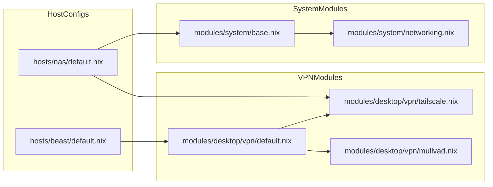
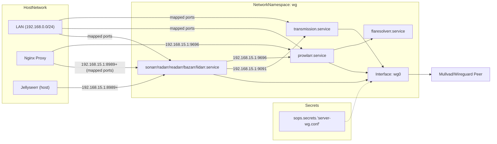

# Networking and VPN

This page details the networking architecture of CodyOS, covering system-level security, the Tailscale mesh VPN, Mullvad VPN integration, and the advanced `vpn-confinement` mechanism used to isolate specific services into dedicated network namespaces.

## System Networking and Security

CodyOS utilizes a hardened networking stack by default. Base networking configuration is defined in `modules/system/networking.nix` and imported into the base system profile [modules/system/base.nix19](../modules/system/base.nix#L19-L19)

### Hardening and Firewall

The system employs `nftables` as the primary firewall backend [modules/system/networking.nix28](../modules/system/networking.nix#L28-L28) SSH access is strictly controlled via `services.openssh`:

- **Authentication**: Password authentication is disabled in favor of SSH keys [modules/system/networking.nix13](../modules/system/networking.nix#L13-L13)
- **Root Access**: Root login is completely prohibited [modules/system/networking.nix15](../modules/system/networking.nix#L15-L15)
- **Brute Force Protection**: `fail2ban` is enabled to monitor and block malicious authentication attempts [modules/system/networking.nix25](../modules/system/networking.nix#L25-L25)

### Host-Specific Configuration

Individual hosts manage their own interface logic. For example, the `nas` host uses `networkmanager` with a declarative static LAN profile (`Wired connection 1` on `enp6s0` → `192.168.1.2/24`, gateway `192.168.1.1`) instead of DHCP [hosts/nas/default.nix172-205](../hosts/nas/default.nix#L172-L205).

---

## VPN Infrastructure

The repository supports multiple VPN technologies tailored for different use cases: mesh networking (Tailscale), privacy-focused browsing (Mullvad), and service-level isolation (Wireguard via vpn-confinement).

### Tailscale Mesh VPN

Tailscale is used for secure, zero-config point-to-point connectivity between hosts.

- **Implementation**: Enabled via `services.tailscale.enable`[modules/desktop/vpn/tailscale.nix5](../modules/desktop/vpn/tailscale.nix#L5-L5)
- **Usage**: Applied to both the `nas`[hosts/nas/default.nix84](../hosts/nas/default.nix#L84-L84) and desktop environments.

### Mullvad VPN

Mullvad is provided as a system service for general-purpose desktop privacy.

- **Implementation**: Defined in `modules/desktop/vpn/mullvad.nix` using the `mullvad-vpn` package [modules/desktop/vpn/mullvad.nix3-6](../modules/desktop/vpn/mullvad.nix#L3-L6)

### Data Flow: VPN Services

The following diagram illustrates how different VPN modules are integrated into the system.

**VPN Integration Architecture**

---

## VPN Confinement (Wireguard Namespaces)

A critical feature of the `nas` host is the isolation of the `transmission` bittorrent client. This is achieved using the `vpn-confinement` NixOS module, which forces a systemd service to run inside a dedicated Wireguard network namespace.

### Namespace Configuration

The namespace, named `wg`, is configured with a Wireguard configuration file managed by SOPS [modules/nas/media/transmission.nix](../modules/nas/media/transmission.nix)

| Attribute          | Configuration    | Purpose                                   |
| ------------------ | ---------------- | ----------------------------------------- |
| **Namespace Name** | `wg`             | Identifier for the network namespace      |
| **Config File**    | `server-wg.conf` | Wireguard keys and peer info (from SOPS)  |
| **Accessibility**  | `192.168.0.0/24` | LAN range allowed to access the namespace |
| **Port Mapping**   | `9091 -> 9091`   | Maps Transmission Web UI to the host      |
| **Port Mapping**   | `9696 -> 9696`   | Maps Prowlarr to the host (LAN clients)   |
| **Port Mapping**   | `8989 -> 8989`   | Maps Sonarr to the host (LAN clients)     |
| **Port Mapping**   | `7878 -> 7878`   | Maps Radarr to the host (LAN clients)     |
| **Port Mapping**   | `8787 -> 8787`   | Maps Readarr to the host (LAN clients)    |
| **Port Mapping**   | `6767 -> 6767`   | Maps Bazarr to the host (LAN clients)     |
| **Port Mapping**   | `8686 -> 8686`   | Maps Lidarr to the host (LAN clients)     |
| **Wireguard Port** | `60729`          | Port used for peer-to-peer traffic        |

### Service Isolation: Transmission

The `transmission` service is confined to the `wg` namespace, ensuring its traffic only exits via the Wireguard tunnel.

1. **Namespace Assignment**: The `vpnConfinement` option is applied to the `transmission` systemd service [modules/nas/media/transmission.nix](../modules/nas/media/transmission.nix)
2. **RPC Binding**: Transmission is configured to bind its RPC/WebUI to `192.168.15.1`, which is the internal address within the namespace [modules/nas/media/transmission.nix](../modules/nas/media/transmission.nix)
3. **Local Whitelisting**: To allow other services (like Sonarr/Radarr) to communicate with Transmission, the RPC whitelist includes the namespace gateway [modules/nas/media/transmission.nix](../modules/nas/media/transmission.nix)

### Service Isolation: Prowlarr and FlareSolverr

The whole Arr stack — Prowlarr, FlareSolverr, Sonarr, Radarr, Readarr, Bazarr, and Lidarr — is confined to the `wg` namespace [modules/nas/media/arr-stack.nix](../modules/nas/media/arr-stack.nix), so indexer, Cloudflare-bypass, and download-automation traffic exits through the VPN tunnel.

- **Host-side access**: Services on the host reach a confined app at the namespace address `192.168.15.1:<port>` — the access path VPN-Confinement provides from the default namespace. Every Arr nginx vhost sets `proxyHost` to this address; ports are derived from each service's NixOS module option (`settings.server.port`, or `services.bazarr.listenPort` for Bazarr; Prowlarr's module has no dedicated `port` option and uses the servarr settings default).
- **LAN access**: The mapped host ports (see table above) forward LAN clients into the namespace.
- **FlareSolverr**: Prowlarr reaches it inside the namespace at `http://localhost:8191` (`services.flaresolverr.port`); it needs no port mapping or vhost.
- **Inter-app traffic**: With Prowlarr and the Arr apps in the same namespace, indexer sync (Prowlarr → Arr apps) and download handoff (Arr apps → Transmission) resolve over the namespace network without extra routing.

### Service Isolation: Sonarr, Radarr, Readarr, Bazarr, Lidarr

The five Arr applications are confined the same way as Prowlarr, with two consequences for host-side consumers:

- **Host-side consumers** that talk to an Arr app directly (e.g. Jellyseerr → Sonarr/Radarr, Readarr → Calibre content server) must target the namespace address `192.168.15.1:<port>` instead of `127.0.0.1`. Where these addresses are runtime settings stored in the app's database, they must be updated through each app's web UI — they are not managed in this repo.
- **Nginx vhosts** (`sonarr.homehub.tv`, `radarr.homehub.tv`, `readarr.homehub.tv`, `bazarr.homehub.tv`, `lidarr.homehub.tv`) keep working because each sets `proxyHost = "192.168.15.1"` [modules/nas/media/arr-stack.nix](../modules/nas/media/arr-stack.nix).

### Data Flow: Confined Service

The diagram below shows the relationship between the host network, the namespace, and the SOPS-managed secrets.

**Transmission VPN Confinement Flow**

---

## Nginx Reverse Proxy and SSL

The `nas` host acts as a gateway for various services, routing traffic via Nginx and securing it with ACME-provisioned SSL certificates.

### ACME and Cloudflare

SSL certificates for `*.homehub.tv` are managed via the `homehub.tv` ACME host [modules/nas/media/default.nix195](../modules/nas/media/default.nix#L195-L195) Nginx is configured with `kTLS` (Kernel TLS) for performance [modules/nas/media/default.nix200](../modules/nas/media/default.nix#L200-L200)

### Proxy Configuration

Services are exposed via subdomains. For example:

- **Jellyfin**: `media.homehub.tv` proxies to `127.0.0.1:8096`[modules/nas/media/default.nix193-197](../modules/nas/media/default.nix#L193-L197)
- **Calibre-Web**: `books.homehub.tv` proxies to `localhost:8083` with specific buffer tuning for Kobo synchronization [modules/nas/media/default.nix211-223](../modules/nas/media/default.nix#L211-L223)
- **Prowlarr**: `prowlarr.homehub.tv` proxies to `192.168.15.1:9696` (Prowlarr runs in the wg namespace) [modules/nas/media/arr-stack.nix](../modules/nas/media/arr-stack.nix)
- **Arr apps**: `sonarr.homehub.tv`, `radarr.homehub.tv`, `readarr.homehub.tv`, `bazarr.homehub.tv`, and `lidarr.homehub.tv` likewise proxy to `192.168.15.1:<port>` — the whole Arr stack is VPN-confined [modules/nas/media/arr-stack.nix](../modules/nas/media/arr-stack.nix)
