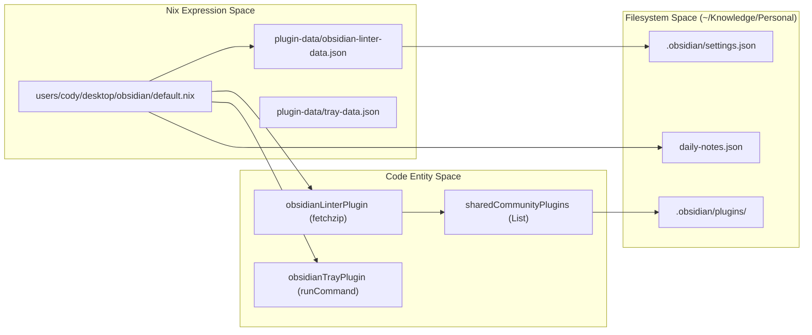
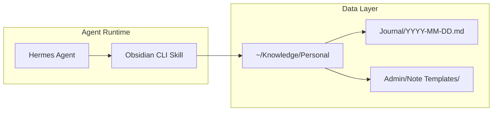

# Obsidian Knowledge Base
Relevant source files
- [users/cody/desktop/obsidian/default.nix](https://github.com/Cody-W-Tucker/nix-config/blob/5a76c557/users/cody/desktop/obsidian/default.nix)
- [users/cody/desktop/obsidian/plugin-data/obsidian-linter-data.json](https://github.com/Cody-W-Tucker/nix-config/blob/5a76c557/users/cody/desktop/obsidian/plugin-data/obsidian-linter-data.json)
- [users/cody/desktop/obsidian/plugin-data/rollover-daily-todos-data.json](https://github.com/Cody-W-Tucker/nix-config/blob/5a76c557/users/cody/desktop/obsidian/plugin-data/rollover-daily-todos-data.json)
- [users/cody/desktop/obsidian/plugin-data/tray-data.json](https://github.com/Cody-W-Tucker/nix-config/blob/5a76c557/users/cody/desktop/obsidian/plugin-data/tray-data.json)
- [users/cody/desktop/obsidian/snippets/hide-inactive-comments.css](https://github.com/Cody-W-Tucker/nix-config/blob/5a76c557/users/cody/desktop/obsidian/snippets/hide-inactive-comments.css)

The Obsidian configuration in CodyOS is a declarative knowledge management system managed via Home Manager. It defines two primary vaults—`Personal` and `Base`—and enforces a consistent environment across hosts through Nix-managed plugins, settings, and custom CSS snippets. The configuration specifically integrates with AI agents by providing a structured, programmatic interface to the vault data located at `~/Knowledge/Personal`.

## System Integration and Architecture

Obsidian is wrapped using `nixGL` to ensure compatibility with Wayland and NVIDIA hardware on the `beast` host [users/cody/desktop/obsidian/default.nix119](https://github.com/Cody-W-Tucker/nix-config/blob/5a76c557/users/cody/desktop/obsidian/default.nix#L119-L119) The configuration defines a custom XDG desktop entry that forces the application to open the `Personal` vault by default using the `obsidian://` URI scheme [users/cody/desktop/obsidian/default.nix176-183](https://github.com/Cody-W-Tucker/nix-config/blob/5a76c557/users/cody/desktop/obsidian/default.nix#L176-L183)

### Data Flow and Management

The configuration separates plugin binaries (fetched via Nix) from their respective data/settings (stored as JSON files in the repository).

| Component | Implementation Mechanism | Source |
| --- | --- | --- |
| **Plugins** | `pkgs.fetchzip` or `pkgs.runCommand` | [users/cody/desktop/obsidian/default.nix16-73](https://github.com/Cody-W-Tucker/nix-config/blob/5a76c557/users/cody/desktop/obsidian/default.nix#L16-L73) |
| **Plugin Settings** | `builtins.fromJSON` from local files | [users/cody/desktop/obsidian/default.nix78](https://github.com/Cody-W-Tucker/nix-config/blob/5a76c557/users/cody/desktop/obsidian/default.nix#L78-L78) |
| **Vault Targets** | Declarative paths in `~/Knowledge` | [users/cody/desktop/obsidian/default.nix137-173](https://github.com/Cody-W-Tucker/nix-config/blob/5a76c557/users/cody/desktop/obsidian/default.nix#L137-L173) |
| **Hotkeys** | Externalized Nix expression | [users/cody/desktop/obsidian/default.nix134](https://github.com/Cody-W-Tucker/nix-config/blob/5a76c557/users/cody/desktop/obsidian/default.nix#L134-L134) |

**Sources:**[users/cody/desktop/obsidian/default.nix1-184](https://github.com/Cody-W-Tucker/nix-config/blob/5a76c557/users/cody/desktop/obsidian/default.nix#L1-L184)[users/cody/desktop/obsidian/plugin-data/obsidian-linter-data.json1-76](https://github.com/Cody-W-Tucker/nix-config/blob/5a76c557/users/cody/desktop/obsidian/plugin-data/obsidian-linter-data.json#L1-L76)

## Vault Configuration

The system manages two distinct vaults with different feature sets.

### 1. Personal Vault (`~/Knowledge/Personal`)

This is the primary workspace for active development and journaling. It includes:

- **Daily Notes:** Automated creation with a specific path format `YYYY/MM-MMMM/YYYY-MM-DD-dddd`[users/cody/desktop/obsidian/default.nix156-160](https://github.com/Cody-W-Tucker/nix-config/blob/5a76c557/users/cody/desktop/obsidian/default.nix#L156-L160)
- **Task Management:** The `obsidian-rollover-daily-todos` plugin is configured to move outstanding tasks to the next day's note under the `## Outstanding Tasks` heading [users/cody/desktop/obsidian/plugin-data/rollover-daily-todos-data.json2-6](https://github.com/Cody-W-Tucker/nix-config/blob/5a76c557/users/cody/desktop/obsidian/plugin-data/rollover-daily-todos-data.json#L2-L6)
- **System Tray:** Integration via `obsidian-tray` allowing the vault to run in the background with a custom base64-encoded icon [users/cody/desktop/obsidian/plugin-data/tray-data.json4-7](https://github.com/Cody-W-Tucker/nix-config/blob/5a76c557/users/cody/desktop/obsidian/plugin-data/tray-data.json#L4-L7)

### 2. Base Vault (`~/Knowledge/Base`)

A simplified vault for reference material, sharing only the core plugins and base CSS snippets without the daily note or task automation logic [users/cody/desktop/obsidian/default.nix169-172](https://github.com/Cody-W-Tucker/nix-config/blob/5a76c557/users/cody/desktop/obsidian/default.nix#L169-L172)

**Sources:**[users/cody/desktop/obsidian/default.nix137-173](https://github.com/Cody-W-Tucker/nix-config/blob/5a76c557/users/cody/desktop/obsidian/default.nix#L137-L173)[users/cody/desktop/obsidian/plugin-data/rollover-daily-todos-data.json1-8](https://github.com/Cody-W-Tucker/nix-config/blob/5a76c557/users/cody/desktop/obsidian/plugin-data/rollover-daily-todos-data.json#L1-L8)

## Plugins and Linter Logic

Obsidian's behavior is strictly controlled via the `obsidian-linter` plugin, which ensures that all markdown files follow a standardized format compatible with both human reading and AI parsing.

### Linter Configuration

Key rules enforced in `plugin-data/obsidian-linter-data.json`:

- **YAML Frontmatter:** Automatically adds `dateCreated` and `dateModified` keys [users/cody/desktop/obsidian/plugin-data/obsidian-linter-data.json60-71](https://github.com/Cody-W-Tucker/nix-config/blob/5a76c557/users/cody/desktop/obsidian/plugin-data/obsidian-linter-data.json#L60-L71)
- **Header Management:** Enforces Title Case for headings and ensures the filename is used as the H1 if one is missing [users/cody/desktop/obsidian/plugin-data/obsidian-linter-data.json72-76](https://github.com/Cody-W-Tucker/nix-config/blob/5a76c557/users/cody/desktop/obsidian/plugin-data/obsidian-linter-data.json#L72-L76)[users/cody/desktop/obsidian/plugin-data/obsidian-linter-data.json84-86](https://github.com/Cody-W-Tucker/nix-config/blob/5a76c557/users/cody/desktop/obsidian/plugin-data/obsidian-linter-data.json#L84-L86)
- **Cleanup:** Removes redundant metadata keys like `createdDate` or `modifiedDate` in favor of the standardized `dateCreated`/`dateModified`[users/cody/desktop/obsidian/plugin-data/obsidian-linter-data.json42-45](https://github.com/Cody-W-Tucker/nix-config/blob/5a76c557/users/cody/desktop/obsidian/plugin-data/obsidian-linter-data.json#L42-L45)

**Sources:**[users/cody/desktop/obsidian/plugin-data/obsidian-linter-data.json1-114](https://github.com/Cody-W-Tucker/nix-config/blob/5a76c557/users/cody/desktop/obsidian/plugin-data/obsidian-linter-data.json#L1-L114)

## UI and Styling (CSS Snippets)

The configuration includes several custom CSS snippets to enhance the Live Preview and Print experiences.

- **`mermaid.css`**: Customizes the rendering of Mermaid diagrams within notes [users/cody/desktop/obsidian/default.nix10](https://github.com/Cody-W-Tucker/nix-config/blob/5a76c557/users/cody/desktop/obsidian/default.nix#L10-L10)
- **`hide-inactive-comments.css`**: Collapses HTML/Markdown comment blocks (`%%` or `<!-- -->`) in Live Preview unless the line is actively being edited [users/cody/desktop/obsidian/snippets/hide-inactive-comments.css2-7](https://github.com/Cody-W-Tucker/nix-config/blob/5a76c557/users/cody/desktop/obsidian/snippets/hide-inactive-comments.css#L2-L7)
- **`print.css`**: Optimizes note layout for PDF export [users/cody/desktop/obsidian/default.nix13](https://github.com/Cody-W-Tucker/nix-config/blob/5a76c557/users/cody/desktop/obsidian/default.nix#L13-L13)
- **Stylix Integration**: The system-wide `stylix` engine sets the application font size to 16pt for both the `Personal` and `Base` vaults [users/cody/desktop/obsidian/default.nix108-115](https://github.com/Cody-W-Tucker/nix-config/blob/5a76c557/users/cody/desktop/obsidian/default.nix#L108-L115)

**Sources:**[users/cody/desktop/obsidian/default.nix8-14](https://github.com/Cody-W-Tucker/nix-config/blob/5a76c557/users/cody/desktop/obsidian/default.nix#L8-L14)[users/cody/desktop/obsidian/snippets/hide-inactive-comments.css1-12](https://github.com/Cody-W-Tucker/nix-config/blob/5a76c557/users/cody/desktop/obsidian/snippets/hide-inactive-comments.css#L1-L12)

## AI Agent Integration

The Obsidian vault serves as the primary "Long Term Memory" for AI agents (e.g., Hermes).

Agents interact with the vault through:

1. **Journaling:** Agents append status updates or "thoughts" to the daily note, following the path defined in `daily-notes.json`[users/cody/desktop/obsidian/default.nix156-160](https://github.com/Cody-W-Tucker/nix-config/blob/5a76c557/users/cody/desktop/obsidian/default.nix#L156-L160)
2. **Context Retrieval:** The `obsidian-linter` ensures that frontmatter (tags, titles, dates) is consistent, allowing agents to perform structured queries over the markdown files.
3. **Vim Mode:** The `vimMode = true` setting ensures that the environment is familiar for power users when manually intervening in agent-generated notes [users/cody/desktop/obsidian/default.nix128](https://github.com/Cody-W-Tucker/nix-config/blob/5a76c557/users/cody/desktop/obsidian/default.nix#L128-L128)

**Sources:**[users/cody/desktop/obsidian/default.nix122-135](https://github.com/Cody-W-Tucker/nix-config/blob/5a76c557/users/cody/desktop/obsidian/default.nix#L122-L135)[users/cody/desktop/obsidian/default.nix155-166](https://github.com/Cody-W-Tucker/nix-config/blob/5a76c557/users/cody/desktop/obsidian/default.nix#L155-L166)