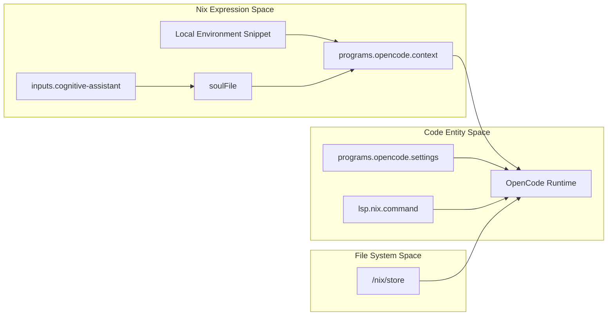
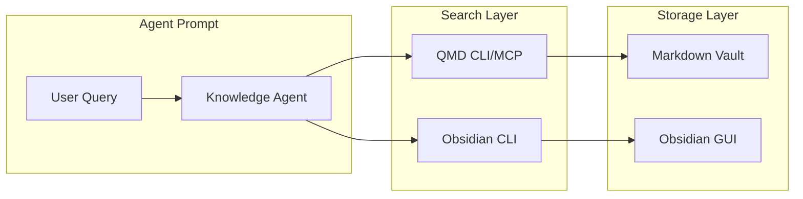

# OpenCode Configuration and Agents
Relevant source files
- [modules/services/hermes-agent/documents/default.nix](https://github.com/Cody-W-Tucker/nix-config/blob/5a76c557/modules/services/hermes-agent/documents/default.nix)
- [modules/services/hermes-agent/skills/business/default.nix](https://github.com/Cody-W-Tucker/nix-config/blob/5a76c557/modules/services/hermes-agent/skills/business/default.nix)
- [modules/services/hermes-agent/skills/knowledge/note-taking/obsidian-bases/SKILL.md](https://github.com/Cody-W-Tucker/nix-config/blob/5a76c557/modules/services/hermes-agent/skills/knowledge/note-taking/obsidian-bases/SKILL.md?plain=1)
- [modules/services/hermes-agent/skills/knowledge/note-taking/obsidian-cli/SKILL.md](https://github.com/Cody-W-Tucker/nix-config/blob/5a76c557/modules/services/hermes-agent/skills/knowledge/note-taking/obsidian-cli/SKILL.md?plain=1)
- [users/cody/desktop/harness/opencode/agents/business/default.nix](https://github.com/Cody-W-Tucker/nix-config/blob/5a76c557/users/cody/desktop/harness/opencode/agents/business/default.nix)
- [users/cody/desktop/harness/opencode/agents/business/skills/tasks/default.nix](https://github.com/Cody-W-Tucker/nix-config/blob/5a76c557/users/cody/desktop/harness/opencode/agents/business/skills/tasks/default.nix)
- [users/cody/desktop/harness/opencode/agents/knowledge/default.nix](https://github.com/Cody-W-Tucker/nix-config/blob/5a76c557/users/cody/desktop/harness/opencode/agents/knowledge/default.nix)
- [users/cody/desktop/harness/opencode/agents/knowledge/skills/obsidian/default.nix](https://github.com/Cody-W-Tucker/nix-config/blob/5a76c557/users/cody/desktop/harness/opencode/agents/knowledge/skills/obsidian/default.nix)
- [users/cody/desktop/harness/opencode/agents/knowledge/skills/qmd/default.nix](https://github.com/Cody-W-Tucker/nix-config/blob/5a76c557/users/cody/desktop/harness/opencode/agents/knowledge/skills/qmd/default.nix)
- [users/cody/desktop/harness/opencode/agents/logging/default.nix](https://github.com/Cody-W-Tucker/nix-config/blob/5a76c557/users/cody/desktop/harness/opencode/agents/logging/default.nix)
- [users/cody/desktop/harness/opencode/agents/verify-alignment/default.nix](https://github.com/Cody-W-Tucker/nix-config/blob/5a76c557/users/cody/desktop/harness/opencode/agents/verify-alignment/default.nix)
- [users/cody/desktop/harness/opencode/default.nix](https://github.com/Cody-W-Tucker/nix-config/blob/5a76c557/users/cody/desktop/harness/opencode/default.nix)
- [users/cody/desktop/harness/opencode/skills/cognitive/default.nix](https://github.com/Cody-W-Tucker/nix-config/blob/5a76c557/users/cody/desktop/harness/opencode/skills/cognitive/default.nix)

The OpenCode configuration represents the primary AI-assisted development environment within CodyOS. It is implemented as a Home Manager module that integrates the `opencode` binary with specialized agents, Model Context Protocol (MCP) servers, and a declarative "Soul" to provide context-aware assistance.

## System Architecture and Context Injection

OpenCode's behavior is driven by a "Soul" file—a core identity document injected during the build process. This document defines the agent's persona, environmental constraints (such as operating within a minimal NixOS environment), and operational guidelines.

### Data Flow: Identity and Environment

The following diagram illustrates how the `cognitive-assistant` artifacts and local system paths are combined to form the agent's runtime context.

**OpenCode Context Injection Pipeline**

Sources: [users/cody/desktop/harness/opencode/default.nix1-79](https://github.com/Cody-W-Tucker/nix-config/blob/5a76c557/users/cody/desktop/harness/opencode/default.nix#L1-L79)[modules/services/hermes-agent/documents/default.nix9-72](https://github.com/Cody-W-Tucker/nix-config/blob/5a76c557/modules/services/hermes-agent/documents/default.nix#L9-L72)

## Core Configuration and LSP

The module configures the `nil` Language Server Protocol (LSP) and `nixfmt` to ensure the agent can interact with and format Nix code correctly.

| Setting | Value | Description |
| --- | --- | --- |
| `enableMcpIntegration` | `true` | Enables Model Context Protocol support [users/cody/desktop/harness/opencode/default.nix31](https://github.com/Cody-W-Tucker/nix-config/blob/5a76c557/users/cody/desktop/harness/opencode/default.nix#L31-L31) |
| `default_agent` | `"build"` | Sets the default operational mode to "build" [users/cody/desktop/harness/opencode/default.nix61](https://github.com/Cody-W-Tucker/nix-config/blob/5a76c557/users/cody/desktop/harness/opencode/default.nix#L61-L61) |
| `lsp.nix.command` | `nil` | Primary Nix language server [users/cody/desktop/harness/opencode/default.nix68](https://github.com/Cody-W-Tucker/nix-config/blob/5a76c557/users/cody/desktop/harness/opencode/default.nix#L68-L68) |
| `lsp.nix.formatting` | `nixfmt` | Formatter used by the LSP [users/cody/desktop/harness/opencode/default.nix73](https://github.com/Cody-W-Tucker/nix-config/blob/5a76c557/users/cody/desktop/harness/opencode/default.nix#L73-L73) |

Sources: [users/cody/desktop/harness/opencode/default.nix29-79](https://github.com/Cody-W-Tucker/nix-config/blob/5a76c557/users/cody/desktop/harness/opencode/default.nix#L29-L79)

## Specialized Agents

OpenCode utilizes a "sub-agent" architecture where specific domains are handled by specialized personas with restricted toolsets and permissions.

### 1. Business Agent

Focused on CRM, accounting, and Google Workspace workflows. It utilizes the `actual-budget-mcp` to interact with the self-hosted Actual Budget service at `https://budget.homehub.tv`[users/cody/desktop/harness/opencode/agents/business/default.nix19](https://github.com/Cody-W-Tucker/nix-config/blob/5a76c557/users/cody/desktop/harness/opencode/agents/business/default.nix#L19-L19)

- **Tools**: `actualBudget_*`, `crm`, `google-workspace`, `tasks`.
- **Secrets**: `actual-budget-mcp-password`, `actual-budget-mcp-sync-id`.

Sources: [users/cody/desktop/harness/opencode/agents/business/default.nix1-57](https://github.com/Cody-W-Tucker/nix-config/blob/5a76c557/users/cody/desktop/harness/opencode/agents/business/default.nix#L1-L57)[users/cody/desktop/harness/opencode/agents/business/skills/tasks/default.nix1-26](https://github.com/Cody-W-Tucker/nix-config/blob/5a76c557/users/cody/desktop/harness/opencode/agents/business/skills/tasks/default.nix#L1-L26)

### 2. Knowledge Agent

Handles research, note-taking, and bookmark management. It bridges the gap between the agent and the Obsidian vault [users/cody/desktop/harness/opencode/agents/knowledge/default.nix49](https://github.com/Cody-W-Tucker/nix-config/blob/5a76c557/users/cody/desktop/harness/opencode/agents/knowledge/default.nix#L49-L49)

- **MCP Servers**: `karakeep-mcp` (bookmarks) [users/cody/desktop/harness/opencode/agents/knowledge/default.nix4-14](https://github.com/Cody-W-Tucker/nix-config/blob/5a76c557/users/cody/desktop/harness/opencode/agents/knowledge/default.nix#L4-L14)
- **Skills**: `qmd` (Quick Markdown Search), `obsidian-cli`, `obsidian-markdown`.
- **Permissions**: Explicitly denies `context7_*` and `nixos-option-search_*` to maintain focus [users/cody/desktop/harness/opencode/agents/knowledge/default.nix39-41](https://github.com/Cody-W-Tucker/nix-config/blob/5a76c557/users/cody/desktop/harness/opencode/agents/knowledge/default.nix#L39-L41)

Sources: [users/cody/desktop/harness/opencode/agents/knowledge/default.nix1-53](https://github.com/Cody-W-Tucker/nix-config/blob/5a76c557/users/cody/desktop/harness/opencode/agents/knowledge/default.nix#L1-L53)[users/cody/desktop/harness/opencode/agents/knowledge/skills/qmd/default.nix1-148](https://github.com/Cody-W-Tucker/nix-config/blob/5a76c557/users/cody/desktop/harness/opencode/agents/knowledge/skills/qmd/default.nix#L1-L148)

### 3. Logging (Grafana) Agent

A specialized sub-agent for monitoring and observability.

- **MCP Server**: `mcp-grafana`[users/cody/desktop/harness/opencode/agents/logging/default.nix11](https://github.com/Cody-W-Tucker/nix-config/blob/5a76c557/users/cody/desktop/harness/opencode/agents/logging/default.nix#L11-L11)
- **Endpoint**: `https://monitoring.homehub.tv`[users/cody/desktop/harness/opencode/agents/logging/default.nix7](https://github.com/Cody-W-Tucker/nix-config/blob/5a76c557/users/cody/desktop/harness/opencode/agents/logging/default.nix#L7-L7)
- **Restrictions**: Denies `edit` and NixOS system search tools to prevent accidental configuration changes [users/cody/desktop/harness/opencode/agents/logging/default.nix34-37](https://github.com/Cody-W-Tucker/nix-config/blob/5a76c557/users/cody/desktop/harness/opencode/agents/logging/default.nix#L34-L37)

Sources: [users/cody/desktop/harness/opencode/agents/logging/default.nix1-40](https://github.com/Cody-W-Tucker/nix-config/blob/5a76c557/users/cody/desktop/harness/opencode/agents/logging/default.nix#L1-L40)

### 4. Alignment Verification Agent

This agent runs the `verify-alignment` package against code artifacts to ensure they comply with the system's "Soul" and operational specs.

- **Primary Command**: `verify-alignment`[users/cody/desktop/harness/opencode/agents/verify-alignment/default.nix25](https://github.com/Cody-W-Tucker/nix-config/blob/5a76c557/users/cody/desktop/harness/opencode/agents/verify-alignment/default.nix#L25-L25)
- **Mode**: `subagent` with strictly read-only permissions (`edit: deny`) [users/cody/desktop/harness/opencode/agents/verify-alignment/default.nix10-14](https://github.com/Cody-W-Tucker/nix-config/blob/5a76c557/users/cody/desktop/harness/opencode/agents/verify-alignment/default.nix#L10-L14)

Sources: [users/cody/desktop/harness/opencode/agents/verify-alignment/default.nix1-35](https://github.com/Cody-W-Tucker/nix-config/blob/5a76c557/users/cody/desktop/harness/opencode/agents/verify-alignment/default.nix#L1-L35)

## Skills and Tool Integration

Skills are discrete blocks of logic or documentation that provide agents with the capability to use specific tools or understand specific formats.

### Obsidian and QMD Integration

OpenCode integrates deeply with the local markdown knowledge base through two primary mechanisms:

1. **Obsidian CLI**: Used when an Obsidian GUI instance is running to trigger internal app events [users/cody/desktop/harness/opencode/agents/knowledge/skills/obsidian/default.nix11](https://github.com/Cody-W-Tucker/nix-config/blob/5a76c557/users/cody/desktop/harness/opencode/agents/knowledge/skills/obsidian/default.nix#L11-L11)
2. **QMD (Quick Markdown Search)**: A local search engine supporting lexical (`lex`), semantic (`vec`), and hypothetical document (`hyde`) queries [users/cody/desktop/harness/opencode/agents/knowledge/skills/qmd/default.nix38-43](https://github.com/Cody-W-Tucker/nix-config/blob/5a76c557/users/cody/desktop/harness/opencode/agents/knowledge/skills/qmd/default.nix#L38-L43)

**Knowledge Retrieval Flow**

Sources: [users/cody/desktop/harness/opencode/agents/knowledge/skills/qmd/default.nix15-148](https://github.com/Cody-W-Tucker/nix-config/blob/5a76c557/users/cody/desktop/harness/opencode/agents/knowledge/skills/qmd/default.nix#L15-L148)[users/cody/desktop/harness/opencode/agents/knowledge/skills/obsidian/default.nix1-70](https://github.com/Cody-W-Tucker/nix-config/blob/5a76c557/users/cody/desktop/harness/opencode/agents/knowledge/skills/obsidian/default.nix#L1-L70)[modules/services/hermes-agent/skills/knowledge/note-taking/obsidian-cli/SKILL.md1-62](https://github.com/Cody-W-Tucker/nix-config/blob/5a76c557/modules/services/hermes-agent/skills/knowledge/note-taking/obsidian-cli/SKILL.md?plain=1#L1-L62)

### Cognitive Assistant Skills

General-purpose skills (e.g., `nix-packaging`, `humanizer`) are imported from the `cognitive-assistant` flake and exposed via `programs.opencode.skills`.

Sources: [users/cody/desktop/harness/opencode/skills/cognitive/default.nix1-12](https://github.com/Cody-W-Tucker/nix-config/blob/5a76c557/users/cody/desktop/harness/opencode/skills/cognitive/default.nix#L1-L12)[users/cody/desktop/harness/opencode/default.nix17-19](https://github.com/Cody-W-Tucker/nix-config/blob/5a76c557/users/cody/desktop/harness/opencode/default.nix#L17-L19)