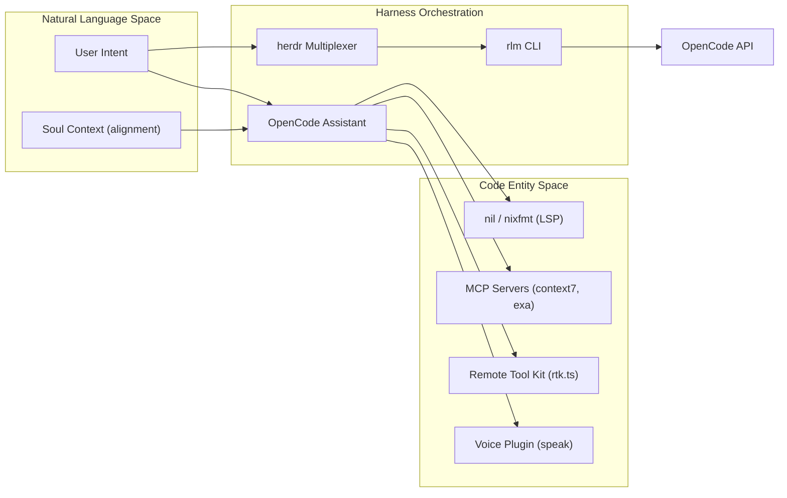
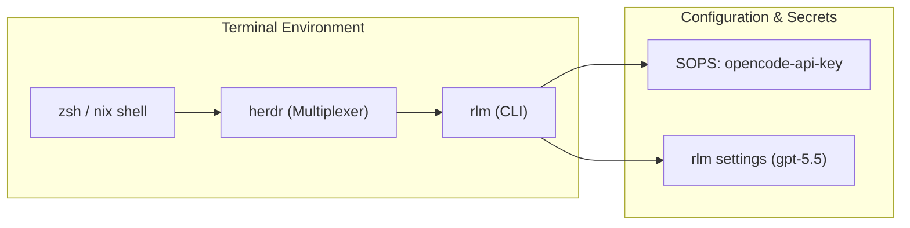

# OpenCode and AI Harness
Relevant source files
- [modules/services/hermes-agent/documents/default.nix](https://github.com/Cody-W-Tucker/nix-config/blob/5a76c557/modules/services/hermes-agent/documents/default.nix)
- [users/cody/desktop/harness/default.nix](https://github.com/Cody-W-Tucker/nix-config/blob/5a76c557/users/cody/desktop/harness/default.nix)
- [users/cody/desktop/harness/opencode/default.nix](https://github.com/Cody-W-Tucker/nix-config/blob/5a76c557/users/cody/desktop/harness/opencode/default.nix)
- [users/cody/desktop/harness/opencode/tools/rtk/default.nix](https://github.com/Cody-W-Tucker/nix-config/blob/5a76c557/users/cody/desktop/harness/opencode/tools/rtk/default.nix)

The **OpenCode and AI Harness** represents the primary interface between the declarative NixOS system and the AI agents that assist in its maintenance and evolution. It provides a structured environment where language models (LLMs) can interact with the codebase through specialized tools, Model Context Protocol (MCP) servers, and terminal-native multiplexers.

The harness bridges the gap between natural language intent and code execution by providing agents with a "Soul" (alignment and identity) and a "Body" (tools, LSPs, and filesystem access).

## Architecture Overview

The harness is orchestrated through a combination of Home Manager modules and specialized packages. It integrates the **OpenCode** coding assistant with **herdr** and **rlm** for multiplexed model access.

### Agent-to-Code Mapping

The following diagram illustrates how natural language agents are mapped to specific system entities and toolsets.

**Diagram: Agent-to-Entity Mapping**

Sources: [users/cody/desktop/harness/opencode/default.nix29-79](https://github.com/Cody-W-Tucker/nix-config/blob/5a76c557/users/cody/desktop/harness/opencode/default.nix#L29-L79)[users/cody/desktop/harness/default.nix12-35](https://github.com/Cody-W-Tucker/nix-config/blob/5a76c557/users/cody/desktop/harness/default.nix#L12-L35)

---

## OpenCode Configuration and Agents

OpenCode serves as the primary AI coding assistant. It is configured via the `programs.opencode` Home Manager module, which injects the system "Soul" and environment context into the agent's runtime.

- **Soul Injection**: The agent's identity is derived from `inputs.cognitive-assistant.lib.artifacts.alignment.soulFile`, ensuring consistent behavior across different interfaces [users/cody/desktop/harness/opencode/default.nix9-32](https://github.com/Cody-W-Tucker/nix-config/blob/5a76c557/users/cody/desktop/harness/opencode/default.nix#L9-L32)
- **Build Mode**: The `default_agent` is set to `build`, optimizing the assistant for system construction tasks [users/cody/desktop/harness/opencode/default.nix61](https://github.com/Cody-W-Tucker/nix-config/blob/5a76c557/users/cody/desktop/harness/opencode/default.nix#L61-L61)
- **LSP Integration**: OpenCode is wired to the `nil` Language Server and `nixfmt` for real-time Nix code intelligence and formatting [users/cody/desktop/harness/opencode/default.nix66-77](https://github.com/Cody-W-Tucker/nix-config/blob/5a76c557/users/cody/desktop/harness/opencode/default.nix#L66-L77)
- **Specialized Agents**: The system defines sub-agents for `logging`, `knowledge`, `verify-alignment`, and `business` logic [users/cody/desktop/harness/opencode/default.nix13-16](https://github.com/Cody-W-Tucker/nix-config/blob/5a76c557/users/cody/desktop/harness/opencode/default.nix#L13-L16)

For details on agent specialization and LSP settings, see [OpenCode Configuration and Agents](/Cody-W-Tucker/nix-config/7.1-opencode-configuration-and-agents).

---

## OpenCode Tools and Skills

Tools and skills extend the capabilities of OpenCode, allowing it to interact with the physical and digital world.

| Tool/Skill | File Path | Function |
| --- | --- | --- |
| **Voice Tool** | `opencode/tools/voice` | Provides `speak` tool for audible status updates [users/cody/desktop/harness/opencode/default.nix22](https://github.com/Cody-W-Tucker/nix-config/blob/5a76c557/users/cody/desktop/harness/opencode/default.nix#L22-L22) |
| **RTK** | `opencode/tools/rtk` | Remote Tool Kit for token-efficient context retrieval [users/cody/desktop/harness/opencode/tools/rtk/default.nix12-18](https://github.com/Cody-W-Tucker/nix-config/blob/5a76c557/users/cody/desktop/harness/opencode/tools/rtk/default.nix#L12-L18) |
| **Humanizer** | `opencode/skills/humanizer` | Refines agent communication style [users/cody/desktop/harness/opencode/default.nix18](https://github.com/Cody-W-Tucker/nix-config/blob/5a76c557/users/cody/desktop/harness/opencode/default.nix#L18-L18) |
| **MCP Servers** | `harness/mcp.nix` | Integration with `context7`, `exa`, and `gh_grep` via Model Context Protocol [users/cody/desktop/harness/default.nix17](https://github.com/Cody-W-Tucker/nix-config/blob/5a76c557/users/cody/desktop/harness/default.nix#L17-L17) |

For details on the TypeScript plugin system and tool implementations, see [OpenCode Tools and Skills](/Cody-W-Tucker/nix-config/7.2-opencode-tools-and-skills).

---

## Herdr and RLM Agent Multiplexers

For terminal-based workflows, the system utilizes `herdr` and `rlm` (Recursive Language Model). These tools allow for complex, nested LLM calls and multiplexing between different models.

**Diagram: Terminal Agent Workflow**

- **API Management**: API keys for `opencode.ai` are managed securely via SOPS [users/cody/desktop/harness/default.nix26-30](https://github.com/Cody-W-Tucker/nix-config/blob/5a76c557/users/cody/desktop/harness/default.nix#L26-L30)
- **Model Routing**: `rlm` is configured to use `gpt-5.5` as the primary model and `kimi-k2.6` as a sub-model [users/cody/desktop/harness/default.nix31-32](https://github.com/Cody-W-Tucker/nix-config/blob/5a76c557/users/cody/desktop/harness/default.nix#L31-L32)
- **Environment**: Agents are instructed to use `nix shell` only when specific runtimes like Python or Node are missing, preserving the minimal host environment [users/cody/desktop/harness/opencode/default.nix34-50](https://github.com/Cody-W-Tucker/nix-config/blob/5a76c557/users/cody/desktop/harness/opencode/default.nix#L34-L50)

For details on terminal multiplexing and API routing, see [Herdr and RLM Agent Multiplexers](/Cody-W-Tucker/nix-config/7.3-herdr-and-rlm-agent-multiplexers).

---

### Sources:

- [users/cody/desktop/harness/opencode/default.nix1-80](https://github.com/Cody-W-Tucker/nix-config/blob/5a76c557/users/cody/desktop/harness/opencode/default.nix#L1-L80)
- [users/cody/desktop/harness/default.nix1-35](https://github.com/Cody-W-Tucker/nix-config/blob/5a76c557/users/cody/desktop/harness/default.nix#L1-L35)
- [users/cody/desktop/harness/opencode/tools/rtk/default.nix1-19](https://github.com/Cody-W-Tucker/nix-config/blob/5a76c557/users/cody/desktop/harness/opencode/tools/rtk/default.nix#L1-L19)
- [modules/services/hermes-agent/documents/default.nix29-72](https://github.com/Cody-W-Tucker/nix-config/blob/5a76c557/modules/services/hermes-agent/documents/default.nix#L29-L72)