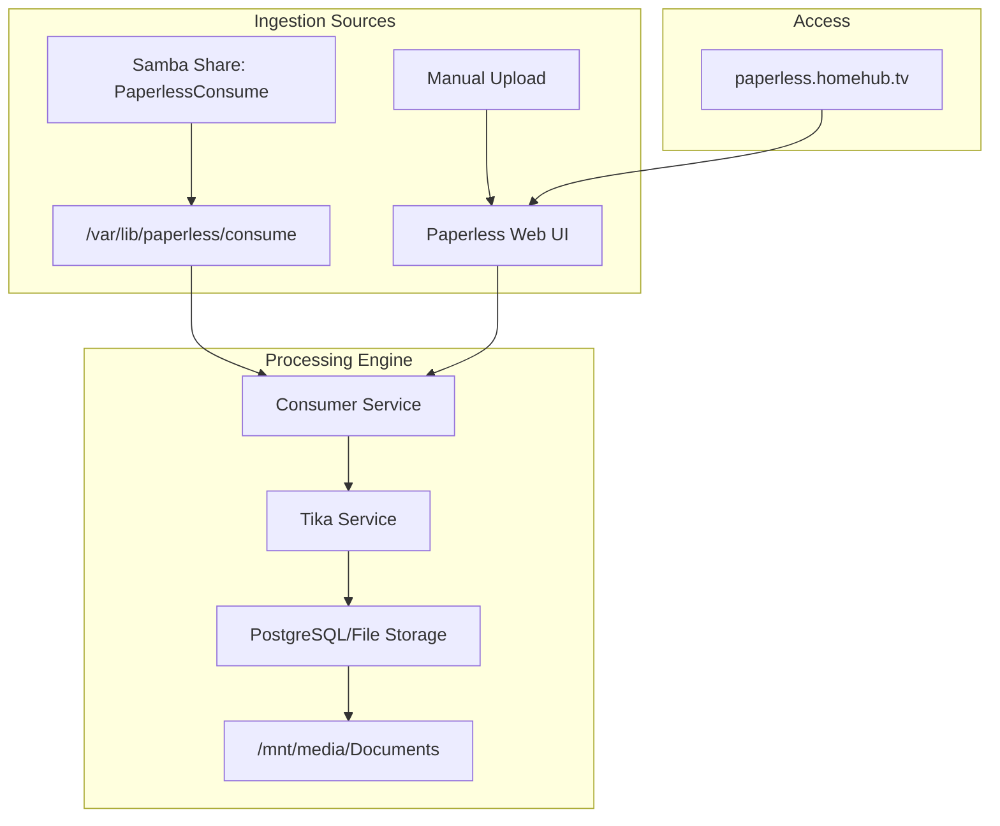
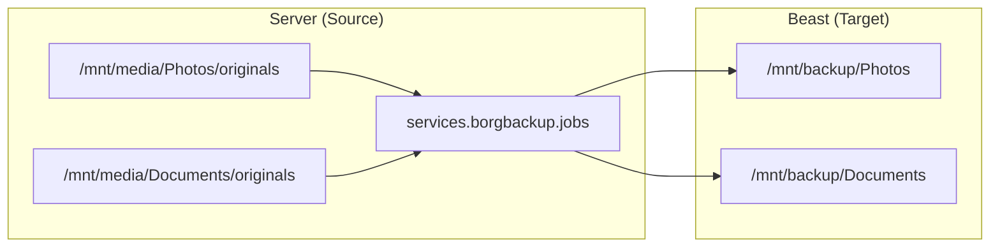

# Photos, Documents, and File Sharing
Relevant source files
- [modules/server/default.nix](https://github.com/Cody-W-Tucker/nix-config/blob/5a76c557/modules/server/default.nix)
- [modules/server/excalidraw.nix](https://github.com/Cody-W-Tucker/nix-config/blob/5a76c557/modules/server/excalidraw.nix)
- [modules/server/homepage-dashboard.nix](https://github.com/Cody-W-Tucker/nix-config/blob/5a76c557/modules/server/homepage-dashboard.nix)
- [modules/server/monitoring.nix](https://github.com/Cody-W-Tucker/nix-config/blob/5a76c557/modules/server/monitoring.nix)
- [modules/server/paperless.nix](https://github.com/Cody-W-Tucker/nix-config/blob/5a76c557/modules/server/paperless.nix)
- [modules/server/photos.nix](https://github.com/Cody-W-Tucker/nix-config/blob/5a76c557/modules/server/photos.nix)
- [modules/server/samba.nix](https://github.com/Cody-W-Tucker/nix-config/blob/5a76c557/modules/server/samba.nix)

This section details the personal information management and file-sharing infrastructure hosted on the CodyOS server. The architecture emphasizes high-performance photo management, automated document processing with OCR, and cross-platform file accessibility via Samba.

## Immich: Photo Management

Immich serves as the primary photo and video management solution. It is configured to utilize hardware acceleration and is integrated into the system's media group for shared storage access.

### Implementation and Acceleration

The service is configured in [modules/server/photos.nix2-8](https://github.com/Cody-W-Tucker/nix-config/blob/5a76c557/modules/server/photos.nix#L2-L8) It listens on port `2283` and stores data at `/mnt/media/Photos`[modules/server/photos.nix4-6](https://github.com/Cody-W-Tucker/nix-config/blob/5a76c557/modules/server/photos.nix#L4-L6) To enable hardware-accelerated transcoding and machine learning tasks, the `immich` user is assigned to the `video` and `render` groups [modules/server/photos.nix10-14](https://github.com/Cody-W-Tucker/nix-config/blob/5a76c557/modules/server/photos.nix#L10-L14)

### Nginx Reverse Proxy

The `photos.homehub.tv` virtual host handles external traffic with specific tuning for large media uploads:

- **Max Body Size**: Increased to `50000M` to accommodate large 4K video uploads [modules/server/photos.nix25](https://github.com/Cody-W-Tucker/nix-config/blob/5a76c557/modules/server/photos.nix#L25-L25)
- **Timeouts**: Proxy read, send, and general timeouts are extended to `600s` to prevent connection drops during long transfers [modules/server/photos.nix26-28](https://github.com/Cody-W-Tucker/nix-config/blob/5a76c557/modules/server/photos.nix#L26-L28)

**Sources:**

- [modules/server/photos.nix1-45](https://github.com/Cody-W-Tucker/nix-config/blob/5a76c557/modules/server/photos.nix#L1-L45)
- [modules/server/homepage-dashboard.nix176-182](https://github.com/Cody-W-Tucker/nix-config/blob/5a76c557/modules/server/homepage-dashboard.nix#L176-L182)

---

## Paperless-ngx: Document OCR

Paperless-ngx provides a centralized system for indexing and searching physical documents. It leverages Apache Tika for robust content extraction and OCR.

### Data Flow and Tika Integration

Paperless is integrated with a standalone Apache Tika service [modules/server/default.nix45-50](https://github.com/Cody-W-Tucker/nix-config/blob/5a76c557/modules/server/default.nix#L45-L50) This enables processing of complex file formats (PDF, DOCX) beyond simple image OCR.

| Setting | Value | Purpose |
| --- | --- | --- |
| `PAPERLESS_TIKA_ENABLED` | `true` | Enables the Tika integration [modules/server/paperless.nix16](https://github.com/Cody-W-Tucker/nix-config/blob/5a76c557/modules/server/paperless.nix#L16-L16) |
| `PAPERLESS_TIKA_URL` | `http://localhost:9998` | Points to the local Tika instance [modules/server/paperless.nix17](https://github.com/Cody-W-Tucker/nix-config/blob/5a76c557/modules/server/paperless.nix#L17-L17) |
| `PAPERLESS_CONSUMER_RECURSIVE` | `true` | Monitors subfolders in the consume directory [modules/server/paperless.nix19](https://github.com/Cody-W-Tucker/nix-config/blob/5a76c557/modules/server/paperless.nix#L19-L19) |
| `PAPERLESS_CONSUMER_SUBDIRS_AS_TAGS` | `true` | Automatically tags documents based on their folder name [modules/server/paperless.nix20](https://github.com/Cody-W-Tucker/nix-config/blob/5a76c557/modules/server/paperless.nix#L20-L20) |

### Technical Architecture: Document Ingestion

The ingestion pipeline supports rapid processing through a high polling frequency (`PAPERLESS_CONSUMER_POLLING = "1"`) [modules/server/paperless.nix21](https://github.com/Cody-W-Tucker/nix-config/blob/5a76c557/modules/server/paperless.nix#L21-L21)

**Document Consumption Logic**

**Sources:**

- [modules/server/paperless.nix1-68](https://github.com/Cody-W-Tucker/nix-config/blob/5a76c557/modules/server/paperless.nix#L1-L68)
- [modules/server/default.nix45-50](https://github.com/Cody-W-Tucker/nix-config/blob/5a76c557/modules/server/default.nix#L45-L50)
- [modules/server/samba.nix39-48](https://github.com/Cody-W-Tucker/nix-config/blob/5a76c557/modules/server/samba.nix#L39-L48)

---

## Samba: Network File Sharing

Samba provides high-performance file access for Windows, macOS, and Linux clients within the local network. It is supplemented by `samba-wsdd` (Web Services Dynamic Discovery) to ensure the server appears in network browsers [modules/server/samba.nix52-55](https://github.com/Cody-W-Tucker/nix-config/blob/5a76c557/modules/server/samba.nix#L52-L55)

### Share Configuration

Shares are restricted to the local subnet `192.168.1.0/24` and `localhost`[modules/server/samba.nix14](https://github.com/Cody-W-Tucker/nix-config/blob/5a76c557/modules/server/samba.nix#L14-L14)

| Share Name | Path | Permissions | Purpose |
| --- | --- | --- | --- |
| `codytHome` | `/mnt/media/Share` | `codyt:users` | General purpose personal storage [modules/server/samba.nix19-28](https://github.com/Cody-W-Tucker/nix-config/blob/5a76c557/modules/server/samba.nix#L19-L28) |
| `Music` | `/mnt/media/Media/Music` | `codyt:media` | Music library management for Navidrome [modules/server/samba.nix29-38](https://github.com/Cody-W-Tucker/nix-config/blob/5a76c557/modules/server/samba.nix#L29-L38) |
| `PaperlessConsume` | `/var/lib/paperless/consume` | `paperless:paperless` | Drop zone for document OCR [modules/server/samba.nix39-48](https://github.com/Cody-W-Tucker/nix-config/blob/5a76c557/modules/server/samba.nix#L39-L48) |

**Sources:**

- [modules/server/samba.nix1-57](https://github.com/Cody-W-Tucker/nix-config/blob/5a76c557/modules/server/samba.nix#L1-L57)

---

## Backup Strategy (Planned)

The system includes placeholders for a `BorgBackup` strategy to secure photos and documents. This strategy involves daily backups to the `beast` workstation's storage pool.

### BorgBackup Logic

The configuration defines two primary jobs: `photos` and `documents`.

- **Target**: `codyt@192.168.1.238` (Beast IP) [modules/server/photos.nix41](https://github.com/Cody-W-Tucker/nix-config/blob/5a76c557/modules/server/photos.nix#L41-L41)
- **Compression**: `lz4` for high-speed archival [modules/server/paperless.nix37](https://github.com/Cody-W-Tucker/nix-config/blob/5a76c557/modules/server/paperless.nix#L37-L37)
- **Schedule**: `daily`[modules/server/photos.nix43](https://github.com/Cody-W-Tucker/nix-config/blob/5a76c557/modules/server/photos.nix#L43-L43)

**System Integration Diagram**

**Sources:**

- [modules/server/photos.nix34-44](https://github.com/Cody-W-Tucker/nix-config/blob/5a76c557/modules/server/photos.nix#L34-L44)
- [modules/server/paperless.nix29-39](https://github.com/Cody-W-Tucker/nix-config/blob/5a76c557/modules/server/paperless.nix#L29-L39)