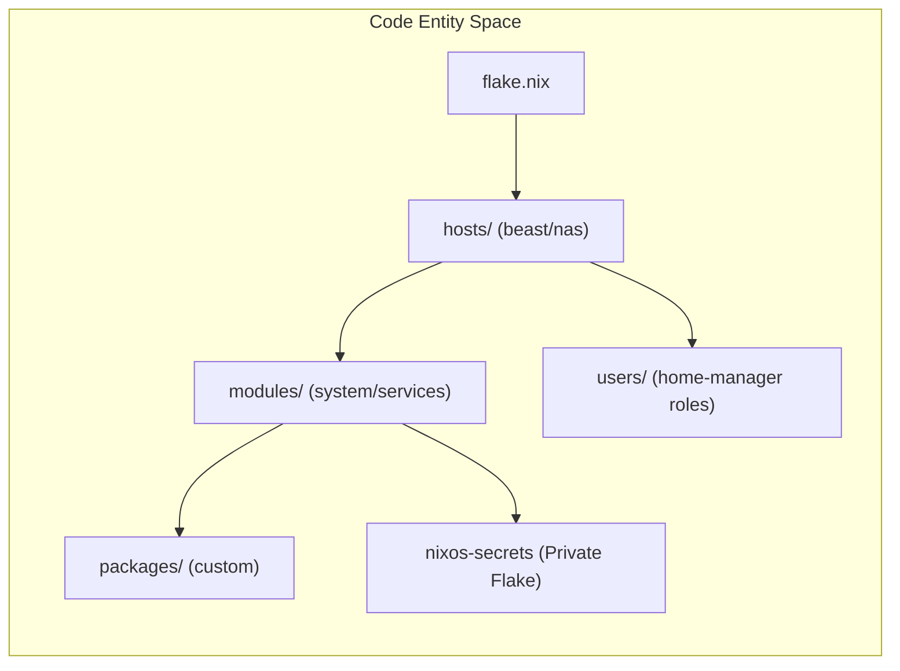
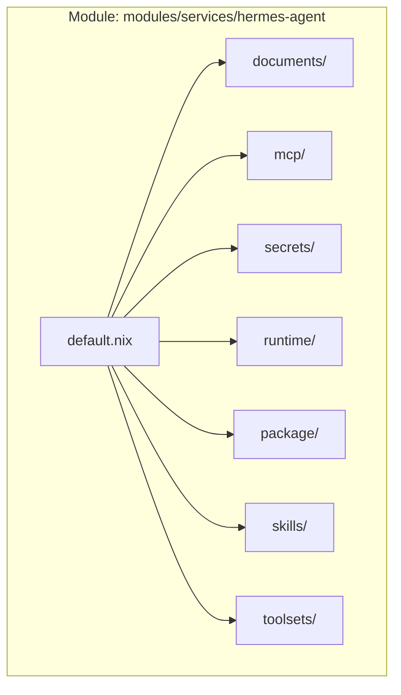

# Repository Structure and Conventions

This page details the organizational standards, directory layout, and naming conventions of the CodyOS repository. The structure is designed to maintain a clear separation between system-level NixOS configuration, user-level Home Manager settings, and reusable service modules while facilitating AI-assisted maintenance.

## Top-Level Directory Layout

The repository follows a functional decomposition strategy, ensuring that machine-specific facts are isolated from reusable logic.

| Directory     | Purpose                                                            | Key Contents                                  |
| ------------- | ------------------------------------------------------------------ | --------------------------------------------- |
| `hosts/`      | Machine-specific entry points and hardware facts.                  | `beast/`, `nas.nix`                            |
| `modules/`    | Reusable NixOS system-level modules and services.                  | `system/`, `services/`, `desktop/`, `server/` |
| `users/`      | Home Manager configurations.                                       | `cody/core.nix`, `cody/desktop.nix`, `cody/desktop/` |
| `packages/`   | Custom derivations and system scripts.                             | `system-scripts/`, `kokoro/`, `en-core-web-sm/`      |
| `.agents/`    | Knowledge base and guidance for AI agents.                         | `skills/`, `AGENTS.md`                        |
| `wallpapers/` | Wallpaper assets referenced by desktop configuration.              | Static image assets                           |

### System Architecture Data Flow

The following diagram illustrates how `flake.nix` wires these directories into a functional NixOS configuration.

**CodyOS Configuration Data Flow**



---

## Naming and File Conventions

To ensure consistency across the codebase, the following rules are enforced:

### 1. Case and Format

- **kebab-case:** All file and directory names must use lowercase kebab-case (e.g., `hardware-configuration.nix`, `homepage-dashboard.nix`) [CONTRIBUTING.md77-84](../CONTRIBUTING.md#L77-L84)
- **Secret Keys:** Use quoted attribute names for secret keys containing dashes, such as `sops.secrets."paperless-password"`[AGENTS.md28-30](../AGENTS.md#L28-L30)

### 2. The `default.nix` Pattern

Importable directories should use a `default.nix` file as a "simple import aggregator" [CONTRIBUTING.md146-150](../CONTRIBUTING.md#L146-L150)

For Cody's Home Manager profile, `users/cody/desktop.nix` is the desktop role entrypoint and it imports the `users/cody/desktop/` directory for the detailed module surface [users/cody/desktop.nix9-13](../users/cody/desktop.nix#L9-L13)

- Keep `default.nix` short.
- Move implementation details to sibling files like `package.nix`, `service.nix`, or `module.nix`[AGENTS.md34-37](../AGENTS.md#L34-L37)
- **Example Structure:**

```
modules/services/hermes-agent/
├── default.nix   # The "spine" that imports other files
├── documents/    # Workspace documents and SOUL installation
├── mcp/          # MCP server wiring
├── package/      # Derivation logic
├── runtime/      # Systemd and environment setup
├── secrets/      # SOPS wiring
├── skills/       # Managed and mutable skills
└── toolsets/     # Tool exposure and trust boundaries
```

---

## Flake Inputs and Categories

The `flake.nix` file categorizes inputs to balance system stability with the need for cutting-edge desktop features.

### Input Tiers

- **Stable (`nixpkgs`):** Tracks `nixos-25.11`. Primarily used for the `nas` host to ensure uptime and service reliability [flake.nix9-10](../flake.nix#L9-L10)
- **Unstable (`nixpkgs-unstable`):** Tracks `nixos-unstable`. Used for the `beast` workstation to provide the latest Hyprland, AI tools, and kernel updates [flake.nix30-31](../flake.nix#L30-L31)

### Key AI & Agent Inputs

The repo integrates several specialized flakes for the local AI stack:

- `hermes-agent`: The primary cognitive assistant runtime [flake.nix82-86](../flake.nix#L82-L86)
- `rlm`: Recursive Language Model CLI [flake.nix87-90](../flake.nix#L87-L90)
- `llm-agents`: A collection of AI tool pack derivations [flake.nix62-66](../flake.nix#L62-L66)

---

## Agent Guidance (AGENTS.md)

The repository contains `AGENTS.md` files scattered throughout the tree. These files serve as "in-situ" documentation for LLMs (like Claude or GPT-4) when they are operating within the codebase.

### Global Rules [AGENTS.md24-46](../AGENTS.md#L24-L46)

- **Git Tracking:** New files must be `git add`-ed before Nix flakes can see them.
- **No Raw Secrets:** Never commit unencrypted secrets; use `sops-nix`.
- **Sudo:** Agents are informed they do not have `sudo` access and cannot trigger a full system rebuild independently.

### Directory-Specific Guidance

- **`hosts/AGENTS.md`**: Directs agents to keep host files thin, focusing only on hardware facts and role selection [hosts/AGENTS.md7-14](../hosts/AGENTS.md#L7-L14)
- **`modules/AGENTS.md`**: Instructs agents to keep reusable services here and to declare secrets close to the consuming service [modules/AGENTS.md7-15](../modules/AGENTS.md#L7-L15)

---

## Module Logic and Implementation

Modules are designed to be single-purpose and self-contained. `default.nix` acts as the assembly spine, while runtime wiring, secrets, package overrides, MCP integrations, and related support surfaces live in sibling paths when the module grows.

### Service Implementation Pattern



### Nginx and Secrets Wiring

For services like `hermes-agent`, the configuration is made fully declarative by writing the settings to a JSON file and forcing the activation script to overwrite the upstream `config.yaml`[modules/services/hermes-agent/default.nix56-62](../modules/services/hermes-agent/default.nix#L56-L62) Secrets are injected via `sops.templates`, allowing dynamic environment variables to be populated at runtime [modules/services/hermes-agent/default.nix55](../modules/services/hermes-agent/default.nix#L55-L55)
