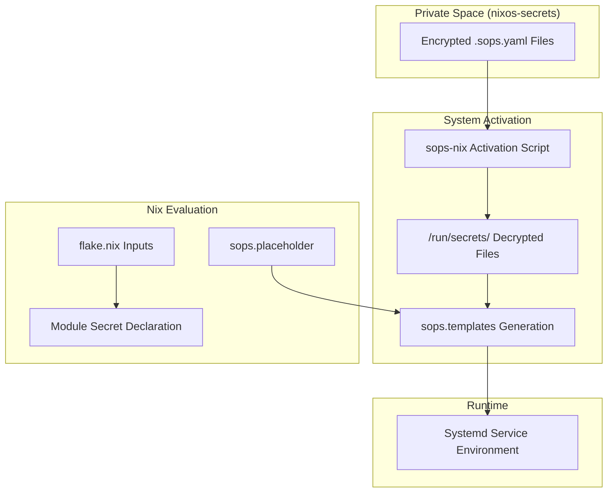
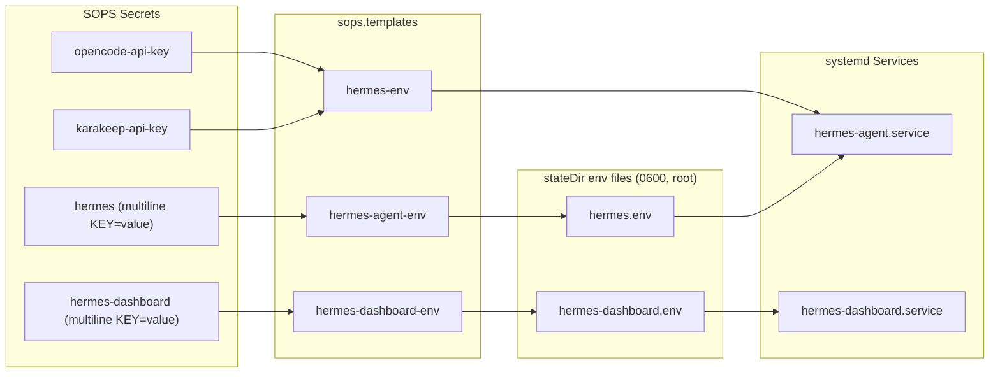

# Secret Management with SOPS

CodyOS utilizes **SOPS (Secrets Operations)** via the `sops-nix` module to manage sensitive data across the infrastructure. The system is designed to keep secret declarations close to the services that consume them while ensuring that raw secrets are never committed to the public repository.

## Architecture and Data Flow

The secret management pipeline relies on a private Nix flake, `nixos-secrets`, which acts as the source of truth for encrypted SOPS files and their paths.

### Core Components

- **`sops-nix`**: The NixOS module that integrates SOPS into the system activation lifecycle [flake.nix11-15](../flake.nix#L11-L15)
- **`nixos-secrets`**: A private GitHub repository/flake containing the actual `.sops.yaml` configuration and encrypted files [flake.nix16-19](../flake.nix#L16-L19)
- **GPG/SSH Keys**: Used to decrypt the SOPS files during system rebuilds.

### Secret Resolution Diagram

The following diagram illustrates how a secret moves from the private flake into a running system service.

**Secret Injection Flow**



## Implementation Patterns

### 1. Declaration Close to Consumer

Secrets are declared within the specific service module that requires them. This maintains modularity and ensures that if a service is disabled, its secret requirements are also removed from evaluation.

| Service          | Secret File Source              | Consumer                                                                                                                                                                            |
| ---------------- | ------------------------------- | ----------------------------------------------------------------------------------------------------------------------------------------------------------------------------------- |
| **Wireguard**    | `serverWireguardSopsFile`       | `transmission` VPN namespace [modules/nas/media/default.nix155-158](../modules/nas/media/default.nix#L155-L158)                        |
| **Hermes Agent** | `hermes` + `hermes-dashboard` secrets, `hermes-agent-env`/`hermes-dashboard-env`/`hermes-env` templates | `hermes-agent.service`, `hermes-dashboard.service`[modules/services/hermes-agent/secrets/default.nix](../modules/services/hermes-agent/secrets/default.nix) |
| **Miniflux**     | `miniflux-credentials` template | `miniflux.service`[modules/nas/content.nix38-39](../modules/nas/content.nix#L38-L39)                                   |

### 2. Dynamic Config via `sops.templates`

The `sops.templates` feature is used to generate configuration files or environment files that mix static text with decrypted secrets. This is the primary pattern for passing API keys to services.

```
# Example from Miniflux Curator
sops.templates."miniflux-credentials".content = ''
  ADMIN_USERNAME=${config.sops.placeholder."miniflux/ADMIN_USERNAME"}
  ADMIN_PASSWORD=${config.sops.placeholder."miniflux/ADMIN_PASSWORD"}
'';
```

### 3. Environment File Pattern

For complex services like the `hermes-agent`, related secrets travel as multiline SOPS secrets whose plaintext is plain `KEY=value` env lines. sops-nix renders them verbatim into the per-service environment files via `sops.templates` — nothing parses or renames at activation. Because rendering is a verbatim substitution, the plaintext keys must already be the env var names the services consume (`TELEGRAM_BOT_TOKEN`, `API_SERVER_KEY`, `HERMES_DASHBOARD_BASIC_AUTH_PASSWORD`, ...), with one trailing newline. Values stay out of the Nix store and out of eval-time substitution.

- `hermes` → `sops.templates."hermes-agent-env"` → `${stateDir}/hermes.env` (agent variables, root 0600)
- `hermes-dashboard` → `sops.templates."hermes-dashboard-env"` → `${stateDir}/hermes-dashboard.env` (dashboard basic-auth variables, root 0600)

Keeping dashboard credentials in their own secret keeps them out of the agent process environment and vice versa.

**Hermes Secret Aggregation**



Single-value secrets that are only consumed as env vars (`opencode-api-key`, `karakeep-api-key`) still use the `sops.templates` placeholder pattern above. The multiline pattern applies when several values travel together, e.g. the waybar voice widget extracts `API_SERVER_KEY` from the raw decrypted `hermes` secret [users/cody/desktop/waybar.nix22](../../users/cody/desktop/waybar.nix#L22-L22)

## Integration with Private Flake

The `nixos-secrets` flake provides a standardized interface for accessing secret paths across different hosts.

- **NixOS Module**: Imported in `base.nix` to provide system-level SOPS configuration [modules/system/base.nix20](../modules/system/base.nix#L20-L20)
- **Home Manager Module**: Imported in host-specific user configs (e.g., `hosts/nas/default.nix`) to handle user-level secrets [hosts/nas/default.nix117](../hosts/nas/default.nix#L117-L117)
- **Path Abstraction**: Modules reference paths like `inputs.nixos-secrets.paths.serverWireguardSopsFile` rather than hardcoding file strings [modules/nas/media/default.nix156](../modules/nas/media/default.nix#L156-L156)

## Security Rules

1. **Never Commit Raw Secrets**: No unencrypted sensitive data (API keys, passwords, private keys) may exist in the `nix-config` repository.
2. **Permission Hardening**: Secrets are restricted to the minimum necessary users. For example, the `miniflux-curator` API key is owned specifically by the `miniflux-curator` user and group [modules/nas/content.nix12-15](../modules/nas/content.nix#L12-L15)
3. **Restricted Mode**: Sensitive files like Wireguard configs are set to `mode = "0400"` to ensure only root can read the decrypted output in `/run/secrets/`[modules/nas/media/default.nix157](../modules/nas/media/default.nix#L157-L157)

