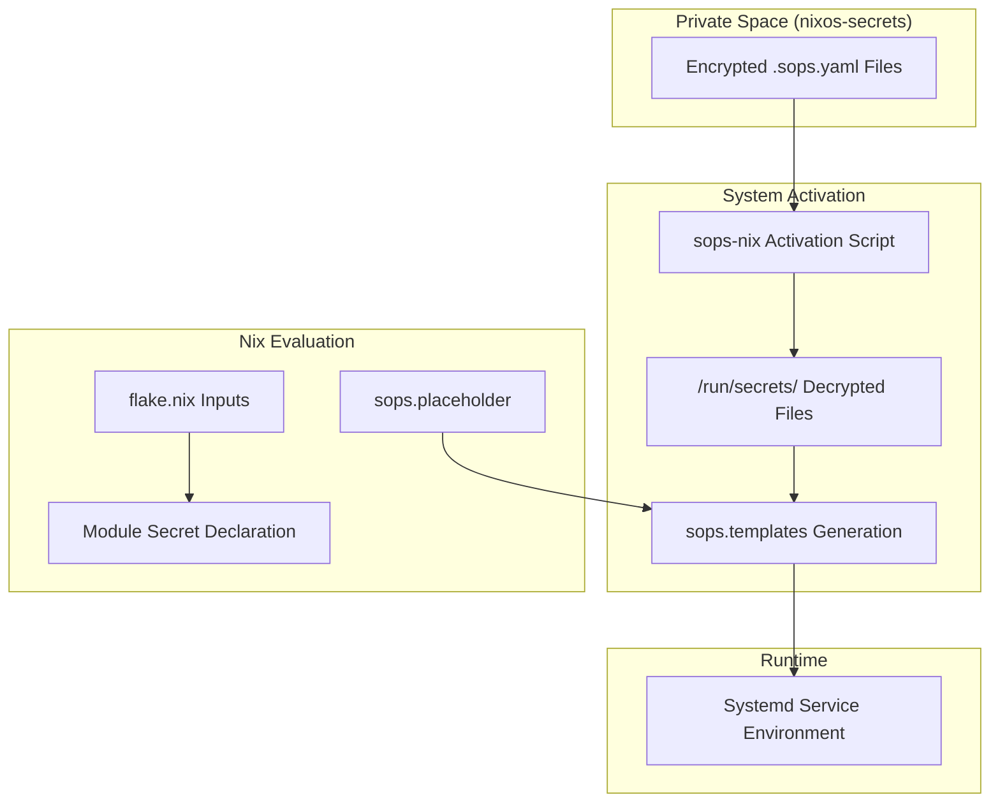
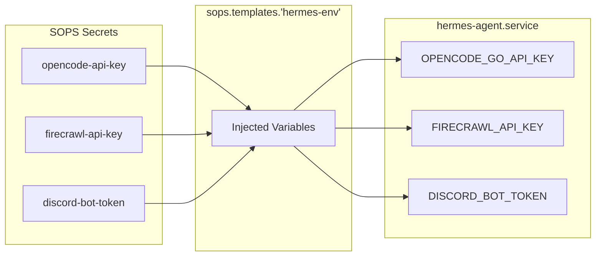

# Secret Management with SOPS
Relevant source files
- [flake.lock](https://github.com/Cody-W-Tucker/nix-config/blob/5a76c557/flake.lock)
- [flake.nix](https://github.com/Cody-W-Tucker/nix-config/blob/5a76c557/flake.nix)
- [hosts/server.nix](https://github.com/Cody-W-Tucker/nix-config/blob/5a76c557/hosts/server.nix)
- [modules/server/content.nix](https://github.com/Cody-W-Tucker/nix-config/blob/5a76c557/modules/server/content.nix)
- [modules/server/media.nix](https://github.com/Cody-W-Tucker/nix-config/blob/5a76c557/modules/server/media.nix)
- [modules/services/automations/miniflux-curator/curator.py](https://github.com/Cody-W-Tucker/nix-config/blob/5a76c557/modules/services/automations/miniflux-curator/curator.py)
- [modules/services/automations/miniflux-curator/default.nix](https://github.com/Cody-W-Tucker/nix-config/blob/5a76c557/modules/services/automations/miniflux-curator/default.nix)
- [modules/services/automations/miniflux-curator/script.nix](https://github.com/Cody-W-Tucker/nix-config/blob/5a76c557/modules/services/automations/miniflux-curator/script.nix)
- [modules/services/hermes-agent/AGENTS.md](https://github.com/Cody-W-Tucker/nix-config/blob/5a76c557/modules/services/hermes-agent/AGENTS.md?plain=1)
- [modules/services/hermes-agent/default.nix](https://github.com/Cody-W-Tucker/nix-config/blob/5a76c557/modules/services/hermes-agent/default.nix)
- [modules/services/hermes-agent/package/patches/auth-store-group-access.patch](https://github.com/Cody-W-Tucker/nix-config/blob/5a76c557/modules/services/hermes-agent/package/patches/auth-store-group-access.patch)
- [modules/services/hermes-agent/package/patches/hermes-home-group-access.patch](https://github.com/Cody-W-Tucker/nix-config/blob/5a76c557/modules/services/hermes-agent/package/patches/hermes-home-group-access.patch)
- [modules/services/hermes-agent/runtime/cron-tick.nix](https://github.com/Cody-W-Tucker/nix-config/blob/5a76c557/modules/services/hermes-agent/runtime/cron-tick.nix)
- [modules/services/hermes-agent/secrets/default.nix](https://github.com/Cody-W-Tucker/nix-config/blob/5a76c557/modules/services/hermes-agent/secrets/default.nix)
- [modules/system/base.nix](https://github.com/Cody-W-Tucker/nix-config/blob/5a76c557/modules/system/base.nix)

CodyOS utilizes **SOPS (Secrets Operations)** via the `sops-nix` module to manage sensitive data across the infrastructure. The system is designed to keep secret declarations close to the services that consume them while ensuring that raw secrets are never committed to the public repository.

## Architecture and Data Flow

The secret management pipeline relies on a private Nix flake, `nixos-secrets`, which acts as the source of truth for encrypted SOPS files and their paths.

### Core Components

- **`sops-nix`**: The NixOS module that integrates SOPS into the system activation lifecycle [flake.nix11-15](https://github.com/Cody-W-Tucker/nix-config/blob/5a76c557/flake.nix#L11-L15)
- **`nixos-secrets`**: A private GitHub repository/flake containing the actual `.sops.yaml` configuration and encrypted files [flake.nix16-19](https://github.com/Cody-W-Tucker/nix-config/blob/5a76c557/flake.nix#L16-L19)
- **GPG/SSH Keys**: Used to decrypt the SOPS files during system rebuilds.

### Secret Resolution Diagram

The following diagram illustrates how a secret moves from the private flake into a running system service.

**Secret Injection Flow**



Sources: [flake.nix11-19](https://github.com/Cody-W-Tucker/nix-config/blob/5a76c557/flake.nix#L11-L19)[modules/system/base.nix8-22](https://github.com/Cody-W-Tucker/nix-config/blob/5a76c557/modules/system/base.nix#L8-L22)[modules/services/hermes-agent/secrets/default.nix1-25](https://github.com/Cody-W-Tucker/nix-config/blob/5a76c557/modules/services/hermes-agent/secrets/default.nix#L1-L25)

## Implementation Patterns

### 1. Declaration Close to Consumer

Secrets are declared within the specific service module that requires them. This maintains modularity and ensures that if a service is disabled, its secret requirements are also removed from evaluation.

| Service | Secret File Source | Consumer |
| --- | --- | --- |
| **Wireguard** | `serverWireguardSopsFile` | `transmission` VPN namespace [modules/server/media.nix155-158](https://github.com/Cody-W-Tucker/nix-config/blob/5a76c557/modules/server/media.nix#L155-L158) |
| **Hermes Agent** | `hermes-env` template | `hermes-agent.service`[modules/services/hermes-agent/default.nix55-56](https://github.com/Cody-W-Tucker/nix-config/blob/5a76c557/modules/services/hermes-agent/default.nix#L55-L56) |
| **Miniflux** | `miniflux-credentials` template | `miniflux.service`[modules/server/content.nix38-39](https://github.com/Cody-W-Tucker/nix-config/blob/5a76c557/modules/server/content.nix#L38-L39) |

### 2. Dynamic Config via `sops.templates`

The `sops.templates` feature is used to generate configuration files or environment files that mix static text with decrypted secrets. This is the primary pattern for passing API keys to services.

```
# Example from Miniflux Curator
sops.templates."miniflux-credentials".content = ''
  ADMIN_USERNAME=${config.sops.placeholder."miniflux/ADMIN_USERNAME"}
  ADMIN_PASSWORD=${config.sops.placeholder."miniflux/ADMIN_PASSWORD"}
'';
```

Sources: [modules/server/content.nix22-26](https://github.com/Cody-W-Tucker/nix-config/blob/5a76c557/modules/server/content.nix#L22-L26)[modules/services/hermes-agent/secrets/default.nix14-23](https://github.com/Cody-W-Tucker/nix-config/blob/5a76c557/modules/services/hermes-agent/secrets/default.nix#L14-L23)

### 3. Environment File Pattern

For complex services like the `hermes-agent`, multiple secrets are aggregated into a single environment file. This file is then passed to the systemd service via `environmentFiles`.

**Hermes Secret Aggregation**



Sources: [modules/services/hermes-agent/secrets/default.nix14-23](https://github.com/Cody-W-Tucker/nix-config/blob/5a76c557/modules/services/hermes-agent/secrets/default.nix#L14-L23)[modules/services/hermes-agent/default.nix55-56](https://github.com/Cody-W-Tucker/nix-config/blob/5a76c557/modules/services/hermes-agent/default.nix#L55-L56)

## Integration with Private Flake

The `nixos-secrets` flake provides a standardized interface for accessing secret paths across different hosts.

- **NixOS Module**: Imported in `base.nix` to provide system-level SOPS configuration [modules/system/base.nix20](https://github.com/Cody-W-Tucker/nix-config/blob/5a76c557/modules/system/base.nix#L20-L20)
- **Home Manager Module**: Imported in host-specific user configs (e.g., `server.nix`) to handle user-level secrets [hosts/server.nix32](https://github.com/Cody-W-Tucker/nix-config/blob/5a76c557/hosts/server.nix#L32-L32)
- **Path Abstraction**: Modules reference paths like `inputs.nixos-secrets.paths.serverWireguardSopsFile` rather than hardcoding file strings [modules/server/media.nix156](https://github.com/Cody-W-Tucker/nix-config/blob/5a76c557/modules/server/media.nix#L156-L156)

## Security Rules

1. **Never Commit Raw Secrets**: No unencrypted sensitive data (API keys, passwords, private keys) may exist in the `nix-config` repository.
2. **Permission Hardening**: Secrets are restricted to the minimum necessary users. For example, the `miniflux-curator` API key is owned specifically by the `miniflux-curator` user and group [modules/server/content.nix12-15](https://github.com/Cody-W-Tucker/nix-config/blob/5a76c557/modules/server/content.nix#L12-L15)
3. **Restricted Mode**: Sensitive files like Wireguard configs are set to `mode = "0400"` to ensure only root can read the decrypted output in `/run/secrets/`[modules/server/media.nix157](https://github.com/Cody-W-Tucker/nix-config/blob/5a76c557/modules/server/media.nix#L157-L157)

Sources: [modules/server/media.nix155-158](https://github.com/Cody-W-Tucker/nix-config/blob/5a76c557/modules/server/media.nix#L155-L158)[modules/server/content.nix8-20](https://github.com/Cody-W-Tucker/nix-config/blob/5a76c557/modules/server/content.nix#L8-L20)[modules/services/hermes-agent/AGENTS.md31](https://github.com/Cody-W-Tucker/nix-config/blob/5a76c557/modules/services/hermes-agent/AGENTS.md?plain=1#L31-L31)