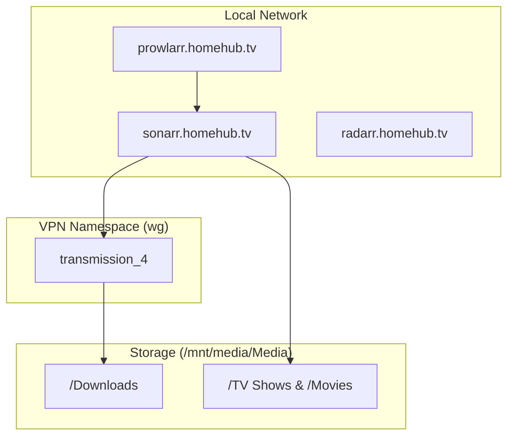
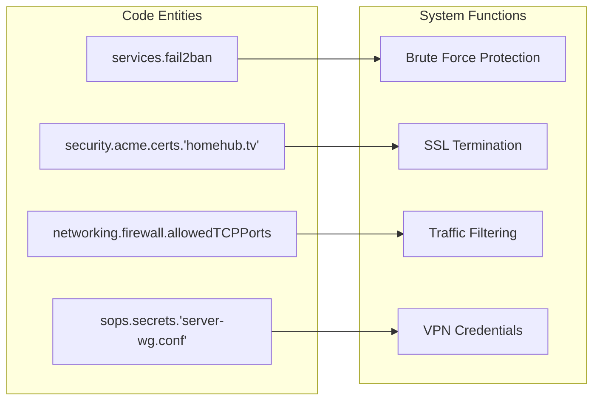

# Server: Home Lab Server
Relevant source files
- [hosts/server.nix](https://github.com/Cody-W-Tucker/nix-config/blob/5a76c557/hosts/server.nix)
- [modules/server/default.nix](https://github.com/Cody-W-Tucker/nix-config/blob/5a76c557/modules/server/default.nix)
- [modules/server/excalidraw.nix](https://github.com/Cody-W-Tucker/nix-config/blob/5a76c557/modules/server/excalidraw.nix)
- [modules/server/homepage-dashboard.nix](https://github.com/Cody-W-Tucker/nix-config/blob/5a76c557/modules/server/homepage-dashboard.nix)
- [modules/server/media.nix](https://github.com/Cody-W-Tucker/nix-config/blob/5a76c557/modules/server/media.nix)
- [modules/server/monitoring.nix](https://github.com/Cody-W-Tucker/nix-config/blob/5a76c557/modules/server/monitoring.nix)
- [modules/server/nginx-syncthing.nix](https://github.com/Cody-W-Tucker/nix-config/blob/5a76c557/modules/server/nginx-syncthing.nix)
- [modules/server/security.nix](https://github.com/Cody-W-Tucker/nix-config/blob/5a76c557/modules/server/security.nix)
- [modules/services/syncthing.nix](https://github.com/Cody-W-Tucker/nix-config/blob/5a76c557/modules/services/syncthing.nix)
- [modules/system/base.nix](https://github.com/Cody-W-Tucker/nix-config/blob/5a76c557/modules/system/base.nix)
- [modules/system/users.nix](https://github.com/Cody-W-Tucker/nix-config/blob/5a76c557/modules/system/users.nix)

The `server` host functions as the central service hub for the `homehub.tv` ecosystem. It is built on an Intel Kaby Lake architecture and manages media distribution, network security, document management, and reverse proxying for both local and remote services.

## Hardware and Host Configuration

The server runs on an Intel i7-7000 CPU with 64GB of RAM and utilizes Intel HD 630 integrated graphics for hardware-accelerated tasks like media transcoding [hosts/server.nix10](https://github.com/Cody-W-Tucker/nix-config/blob/5a76c557/hosts/server.nix#L10-L10)

### Storage Topology

The system utilizes a mix of NVMe for the OS and a large HDD for media storage:

- **Root (`/`)**: Ext4 on NVMe [hosts/server.nix65-68](https://github.com/Cody-W-Tucker/nix-config/blob/5a76c557/hosts/server.nix#L65-L68)
- **Media (`/mnt/media`)**: Ext4 on a 4TB HDD [hosts/server.nix73-76](https://github.com/Cody-W-Tucker/nix-config/blob/5a76c557/hosts/server.nix#L73-L76)
- **Optical (`/mnt/dev/sr0`)**: UDF/ISO9660 for the Automatic Ripping Machine [hosts/server.nix77-86](https://github.com/Cody-W-Tucker/nix-config/blob/5a76c557/hosts/server.nix#L77-L86)

### Network & VPN

The server is integrated into the Tailscale mesh network for secure remote access [hosts/server.nix118](https://github.com/Cody-W-Tucker/nix-config/blob/5a76c557/hosts/server.nix#L118-L118) It also acts as an NFS server, exporting `/mnt/media` to the `beast` workstation [hosts/server.nix95-98](https://github.com/Cody-W-Tucker/nix-config/blob/5a76c557/hosts/server.nix#L95-L98)

## Reverse Proxy and SSL Architecture

Nginx acts as the primary ingress point, utilizing `security.acme` for automated SSL certificate management via the Cloudflare DNS-01 challenge [modules/server/default.nix27-43](https://github.com/Cody-W-Tucker/nix-config/blob/5a76c557/modules/server/default.nix#L27-L43)

### Global Nginx Settings

The configuration enables `kTLS` for performance and standardized proxy settings [modules/server/default.nix52-58](https://github.com/Cody-W-Tucker/nix-config/blob/5a76c557/modules/server/default.nix#L52-L58) It also exposes a `stub_status` endpoint on `localhost:9114` for Prometheus metrics scraping [modules/server/default.nix70-84](https://github.com/Cody-W-Tucker/nix-config/blob/5a76c557/modules/server/default.nix#L70-L84)

### Cross-Host Proxying

The server proxies requests to services running on the `beast` workstation (IP `192.168.1.20`), effectively making them part of the `homehub.tv` domain:

- **AI Interface**: Proxies to Open-WebUI on `beast:8080`[modules/server/default.nix110-122](https://github.com/Cody-W-Tucker/nix-config/blob/5a76c557/modules/server/default.nix#L110-L122)
- **Vector Database**: Proxies REST and gRPC traffic to Qdrant on `beast:6333` and `6334`[modules/server/default.nix85-109](https://github.com/Cody-W-Tucker/nix-config/blob/5a76c557/modules/server/default.nix#L85-L109)

### Service Mapping (Code to Domain)

| Service Name | Code Identifier | Domain | Target Port |
| --- | --- | --- | --- |
| Jellyfin | `services.jellyfin` | `media.homehub.tv` | 8096 |
| Navidrome | `services.navidrome` | `music.homehub.tv` | 4533 |
| Calibre-Web | `services.calibre-web` | `books.homehub.tv` | 8083 |
| Homepage | `services.homepage-dashboard` | `homehub.tv` | 8082 |
| Syncthing (Server) | `services.nginx.upstreams.server_syncthing` | `server-syncthing.homehub.tv` | 8384 |

**Sources:**[modules/server/default.nix52-136](https://github.com/Cody-W-Tucker/nix-config/blob/5a76c557/modules/server/default.nix#L52-L136)[modules/server/media.nix191-236](https://github.com/Cody-W-Tucker/nix-config/blob/5a76c557/modules/server/media.nix#L191-L236)[modules/server/homepage-dashboard.nix7-14](https://github.com/Cody-W-Tucker/nix-config/blob/5a76c557/modules/server/homepage-dashboard.nix#L7-L14)[modules/server/nginx-syncthing.nix17-34](https://github.com/Cody-W-Tucker/nix-config/blob/5a76c557/modules/server/nginx-syncthing.nix#L17-L34)

## Media Stack and VPN Confinement

The media stack is heavily customized for automation and privacy. A critical security feature is **VPN Confinement**, which isolates the `transmission` daemon within a dedicated Wireguard network namespace [modules/server/media.nix161-183](https://github.com/Cody-W-Tucker/nix-config/blob/5a76c557/modules/server/media.nix#L161-L183)

### Permission Logic

Media services operate under a shared `media` group [modules/system/users.nix33](https://github.com/Cody-W-Tucker/nix-config/blob/5a76c557/modules/system/users.nix#L33-L33)`systemd.tmpfiles` rules enforce a `2775` permission bit (setgid) on the `/mnt/media/Media` subdirectories, ensuring that files downloaded by Transmission or moved by Sonarr inherit group ownership [modules/server/media.nix9-24](https://github.com/Cody-W-Tucker/nix-config/blob/5a76c557/modules/server/media.nix#L9-L24)

### Data Flow: Media Ingestion

"Ingestion Workflow"

**Sources:**[modules/server/media.nix9-152](https://github.com/Cody-W-Tucker/nix-config/blob/5a76c557/modules/server/media.nix#L9-L152)[modules/server/media.nix180-183](https://github.com/Cody-W-Tucker/nix-config/blob/5a76c557/modules/server/media.nix#L180-L183)

## Monitoring and Observability

The server hosts a full LGTM (Loki, Grafana, Tempo, Mimir/Prometheus) stack to monitor both itself and the `beast` workstation [modules/server/monitoring.nix1-40](https://github.com/Cody-W-Tucker/nix-config/blob/5a76c557/modules/server/monitoring.nix#L1-L40)

### Metrics Collection

- **Prometheus**: Scrapes local `node_exporter` (port 9002), `nginx_exporter` (port 9115), and remote `beast` metrics [modules/server/monitoring.nix41-145](https://github.com/Cody-W-Tucker/nix-config/blob/5a76c557/modules/server/monitoring.nix#L41-L145)
- **Loki**: Ingests Nginx access logs via a specific log format defined in `services.prometheus.exporters.nginxlog`[modules/server/monitoring.nix56-69](https://github.com/Cody-W-Tucker/nix-config/blob/5a76c557/modules/server/monitoring.nix#L56-L69)
- **Tempo**: Provides distributed tracing, listening for OTLP traffic on ports 4327 (gRPC) and 4328 (HTTP) [modules/server/monitoring.nix215-228](https://github.com/Cody-W-Tucker/nix-config/blob/5a76c557/modules/server/monitoring.nix#L215-L228)

### Dashboarding

Grafana is provisioned with two primary datasources: Prometheus and Tempo [modules/server/monitoring.nix24-40](https://github.com/Cody-W-Tucker/nix-config/blob/5a76c557/modules/server/monitoring.nix#L24-L40) It is served via `monitoring.homehub.tv`[modules/server/monitoring.nix20-21](https://github.com/Cody-W-Tucker/nix-config/blob/5a76c557/modules/server/monitoring.nix#L20-L21)

## Security and Network Hardening

The server implements multi-layered security:

1. **Firewall**: Only ports 80 (HTTP), 443 (HTTPS), 2049 (NFS), and 111 (RPCBind) are open to the LAN [hosts/server.nix101-108](https://github.com/Cody-W-Tucker/nix-config/blob/5a76c557/hosts/server.nix#L101-L108)[modules/server/default.nix140-147](https://github.com/Cody-W-Tucker/nix-config/blob/5a76c557/modules/server/default.nix#L140-L147)
2. **Fail2Ban**: Configured to ban IPs for 24 hours after 5 failed attempts, with an exponential increment up to one week [modules/server/security.nix3-18](https://github.com/Cody-W-Tucker/nix-config/blob/5a76c557/modules/server/security.nix#L3-L18)
3. **ACME**: Certificates are restricted to the `acme` group, and the Nginx user is a member [modules/server/default.nix138](https://github.com/Cody-W-Tucker/nix-config/blob/5a76c557/modules/server/default.nix#L138-L138)

### System-to-Code Mapping

"Security and Access Control"

**Sources:**[modules/server/security.nix3-18](https://github.com/Cody-W-Tucker/nix-config/blob/5a76c557/modules/server/security.nix#L3-L18)[modules/server/default.nix27-43](https://github.com/Cody-W-Tucker/nix-config/blob/5a76c557/modules/server/default.nix#L27-L43)[hosts/server.nix101-108](https://github.com/Cody-W-Tucker/nix-config/blob/5a76c557/hosts/server.nix#L101-L108)[modules/server/media.nix155-158](https://github.com/Cody-W-Tucker/nix-config/blob/5a76c557/modules/server/media.nix#L155-L158)