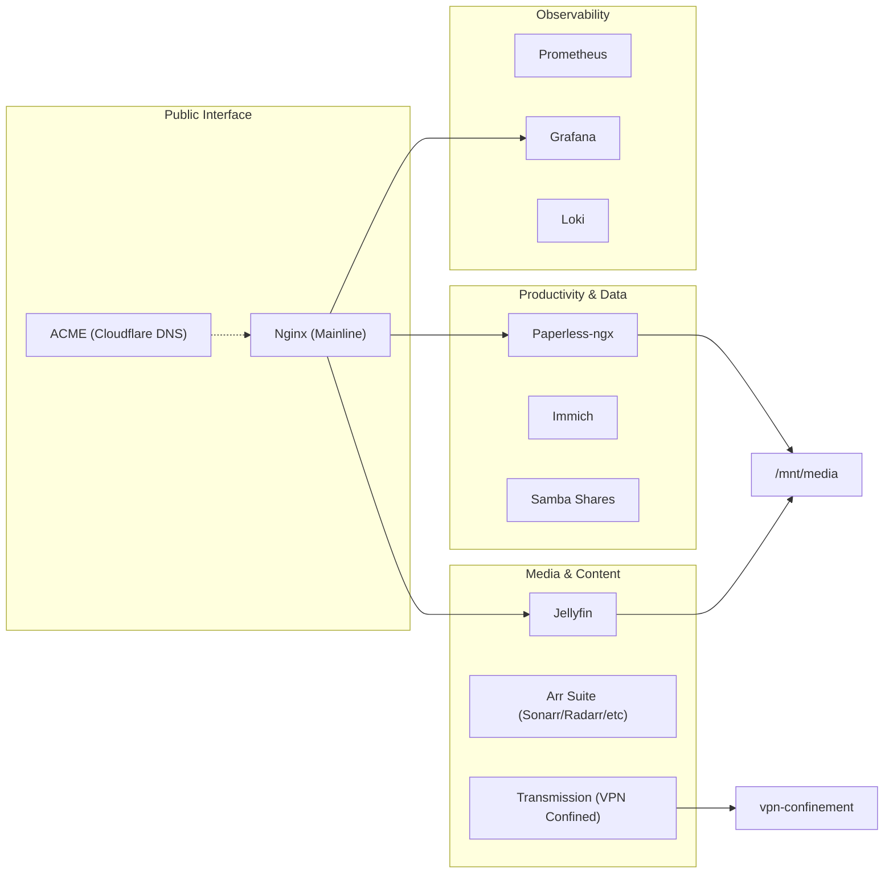
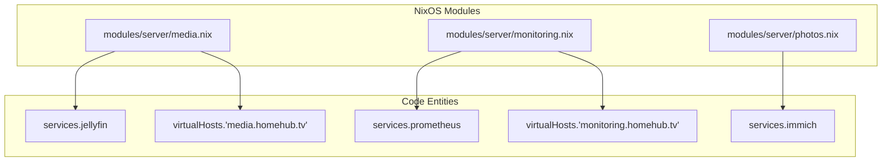

# Server Services
Relevant source files
- [hosts/server.nix](https://github.com/Cody-W-Tucker/nix-config/blob/5a76c557/hosts/server.nix)
- [modules/server/default.nix](https://github.com/Cody-W-Tucker/nix-config/blob/5a76c557/modules/server/default.nix)
- [modules/server/excalidraw.nix](https://github.com/Cody-W-Tucker/nix-config/blob/5a76c557/modules/server/excalidraw.nix)
- [modules/server/homepage-dashboard.nix](https://github.com/Cody-W-Tucker/nix-config/blob/5a76c557/modules/server/homepage-dashboard.nix)
- [modules/server/media.nix](https://github.com/Cody-W-Tucker/nix-config/blob/5a76c557/modules/server/media.nix)
- [modules/server/monitoring.nix](https://github.com/Cody-W-Tucker/nix-config/blob/5a76c557/modules/server/monitoring.nix)
- [modules/server/paperless.nix](https://github.com/Cody-W-Tucker/nix-config/blob/5a76c557/modules/server/paperless.nix)
- [modules/server/photos.nix](https://github.com/Cody-W-Tucker/nix-config/blob/5a76c557/modules/server/photos.nix)
- [modules/server/samba.nix](https://github.com/Cody-W-Tucker/nix-config/blob/5a76c557/modules/server/samba.nix)
- [modules/system/base.nix](https://github.com/Cody-W-Tucker/nix-config/blob/5a76c557/modules/system/base.nix)

The `server` host ([hosts/server.nix](https://github.com/Cody-W-Tucker/nix-config/blob/5a76c557/hosts/server.nix)) acts as the central hub for the `homehub.tv` domain, orchestrating a wide array of self-hosted applications ranging from media management and document archival to network-wide monitoring and local AI proxying. These services are defined as modular NixOS components within [modules/server/](https://github.com/Cody-W-Tucker/nix-config/blob/5a76c557/modules/server/)

The server architecture leverages a central Nginx reverse proxy with wildcard SSL certificates managed via ACME and Cloudflare [modules/server/default.nix27-43](https://github.com/Cody-W-Tucker/nix-config/blob/5a76c557/modules/server/default.nix#L27-L43) providing a unified entry point for all subdomains.

## Service Architecture Overview

The following diagram illustrates the relationship between the Nginx entry point, the service categories, and their underlying storage/network dependencies.

### Server Service Topology

**Sources:**[modules/server/default.nix52-136](https://github.com/Cody-W-Tucker/nix-config/blob/5a76c557/modules/server/default.nix#L52-L136)[modules/server/media.nix180-183](https://github.com/Cody-W-Tucker/nix-config/blob/5a76c557/modules/server/media.nix#L180-L183)[hosts/server.nix73-76](https://github.com/Cody-W-Tucker/nix-config/blob/5a76c557/hosts/server.nix#L73-L76)

---

## Service Categories

### Media Stack: Jellyfin, Arr Suite, and Transmission

The media stack is built around a shared storage topology at `/mnt/media`[modules/server/media.nix12-24](https://github.com/Cody-W-Tucker/nix-config/blob/5a76c557/modules/server/media.nix#L12-L24) It features hardware-accelerated transcoding via Intel QSV [hosts/server.nix50-54](https://github.com/Cody-W-Tucker/nix-config/blob/5a76c557/hosts/server.nix#L50-L54) and a specialized `vpn-confinement` module that isolates the `transmission` service into a dedicated Wireguard network namespace [modules/server/media.nix161-183](https://github.com/Cody-W-Tucker/nix-config/blob/5a76c557/modules/server/media.nix#L161-L183)

For details, see [Media Stack: Jellyfin, Arr Suite, and Transmission](/Cody-W-Tucker/nix-config/8.1-media-stack:-jellyfin-arr-suite-and-transmission).

### Photos, Documents, and File Sharing

This category covers long-term data management. `immich` handles photo libraries with hardware acceleration support [modules/server/photos.nix2-8](https://github.com/Cody-W-Tucker/nix-config/blob/5a76c557/modules/server/photos.nix#L2-L8) while `paperless-ngx` provides document OCR using a local `tika` instance [modules/server/paperless.nix16-17](https://github.com/Cody-W-Tucker/nix-config/blob/5a76c557/modules/server/paperless.nix#L16-L17) Network file access is provided via `samba` with specific shares for home directories, music, and document consumption [modules/server/samba.nix19-49](https://github.com/Cody-W-Tucker/nix-config/blob/5a76c557/modules/server/samba.nix#L19-L49)

For details, see [Photos, Documents, and File Sharing](/Cody-W-Tucker/nix-config/8.2-photos-documents-and-file-sharing).

### Content, RSS, and Bookmarks

Services for information consumption and financial management. This includes `miniflux` for RSS, `karakeep` for bookmark management, and `actual-budget` for personal finance. These services are typically exposed via subdomains like `rss.homehub.tv` and `budget.homehub.tv`[modules/server/homepage-dashboard.nix119-163](https://github.com/Cody-W-Tucker/nix-config/blob/5a76c557/modules/server/homepage-dashboard.nix#L119-L163)

For details, see [Content, RSS, and Bookmarks](/Cody-W-Tucker/nix-config/8.3-content-rss-and-bookmarks).

### Network Services: DNS, AdGuard, and Syncthing

The server provides core network infrastructure, including `adguardhome` for DNS filtering and `unbound` as a recursive resolver. It also runs a central `syncthing` instance to coordinate file synchronization between the `server` and `beast` hosts [modules/server/default.nix18-19](https://github.com/Cody-W-Tucker/nix-config/blob/5a76c557/modules/server/default.nix#L18-L19)

For details, see [Network Services: DNS, AdGuard, and Syncthing](/Cody-W-Tucker/nix-config/8.4-network-services:-dns-adguard-and-syncthing).

### Monitoring Stack: Prometheus, Grafana, Loki, and Tempo

A comprehensive observability suite tracks the health of the entire cluster. `prometheus` scrapes metrics from both hosts (including GPU and SMART data), `loki` aggregates Nginx and system logs, and `tempo` provides distributed tracing via OTLP [modules/server/monitoring.nix9-260](https://github.com/Cody-W-Tucker/nix-config/blob/5a76c557/modules/server/monitoring.nix#L9-L260)

For details, see [Monitoring Stack: Prometheus, Grafana, Loki, and Tempo](/Cody-W-Tucker/nix-config/8.5-monitoring-stack:-prometheus-grafana-loki-and-tempo).

### ARM Ripper and Excalidraw

Specialized services running as OCI containers. This includes the Automatic Ripping Machine (ARM) for optical media processing and `excalidraw` for collaborative whiteboarding [modules/server/excalidraw.nix2-11](https://github.com/Cody-W-Tucker/nix-config/blob/5a76c557/modules/server/excalidraw.nix#L2-L11)

For details, see [ARM Ripper and Excalidraw](/Cody-W-Tucker/nix-config/8.6-arm-ripper-and-excalidraw).

---

## Code Entity Mapping

The following diagram maps the logical service names used in this documentation to the specific NixOS service definitions and Nginx virtual host configurations found in the codebase.

### Service to Code Entity Mapping

**Sources:**[modules/server/media.nix31-34](https://github.com/Cody-W-Tucker/nix-config/blob/5a76c557/modules/server/media.nix#L31-L34)[modules/server/media.nix192-201](https://github.com/Cody-W-Tucker/nix-config/blob/5a76c557/modules/server/media.nix#L192-L201)[modules/server/monitoring.nix41-45](https://github.com/Cody-W-Tucker/nix-config/blob/5a76c557/modules/server/monitoring.nix#L41-L45)[modules/server/photos.nix2-8](https://github.com/Cody-W-Tucker/nix-config/blob/5a76c557/modules/server/photos.nix#L2-L8)

### Infrastructure Summary Table

| Service | Port | Domain | Nix Module |
| --- | --- | --- | --- |
| **Nginx** | 80/443 | `homehub.tv` | [modules/server/default.nix](https://github.com/Cody-W-Tucker/nix-config/blob/5a76c557/modules/server/default.nix) |
| **Jellyfin** | 8096 | `media.homehub.tv` | [modules/server/media.nix](https://github.com/Cody-W-Tucker/nix-config/blob/5a76c557/modules/server/media.nix) |
| **Paperless** | 28981 | `paperless.homehub.tv` | [modules/server/paperless.nix](https://github.com/Cody-W-Tucker/nix-config/blob/5a76c557/modules/server/paperless.nix) |
| **Immich** | 2283 | `photos.homehub.tv` | [modules/server/photos.nix](https://github.com/Cody-W-Tucker/nix-config/blob/5a76c557/modules/server/photos.nix) |
| **Grafana** | 3001 | `monitoring.homehub.tv` | [modules/server/monitoring.nix](https://github.com/Cody-W-Tucker/nix-config/blob/5a76c557/modules/server/monitoring.nix) |
| **Transmission** | 9091 | N/A (VPN) | [modules/server/media.nix](https://github.com/Cody-W-Tucker/nix-config/blob/5a76c557/modules/server/media.nix) |
| **Tika** | 9998 | `tika.homehub.tv` | [modules/server/default.nix](https://github.com/Cody-W-Tucker/nix-config/blob/5a76c557/modules/server/default.nix) |

**Sources:**[modules/server/media.nix197](https://github.com/Cody-W-Tucker/nix-config/blob/5a76c557/modules/server/media.nix#L197-L197)[modules/server/paperless.nix3](https://github.com/Cody-W-Tucker/nix-config/blob/5a76c557/modules/server/paperless.nix#L3-L3)[modules/server/photos.nix4](https://github.com/Cody-W-Tucker/nix-config/blob/5a76c557/modules/server/photos.nix#L4-L4)[modules/server/monitoring.nix18](https://github.com/Cody-W-Tucker/nix-config/blob/5a76c557/modules/server/monitoring.nix#L18-L18)[modules/server/default.nix47](https://github.com/Cody-W-Tucker/nix-config/blob/5a76c557/modules/server/default.nix#L47-L47)