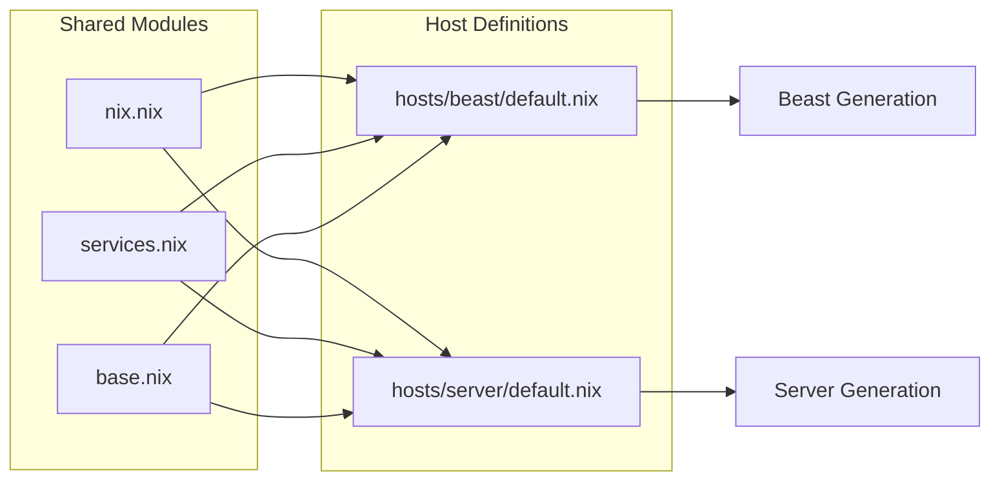

# System Modules
Relevant source files
- [modules/system/nix.nix](https://github.com/Cody-W-Tucker/nix-config/blob/5a76c557/modules/system/nix.nix)
- [modules/system/services.nix](https://github.com/Cody-W-Tucker/nix-config/blob/5a76c557/modules/system/services.nix)

The `modules/system/` directory contains the shared NixOS configurations applied across all hosts in the CodyOS ecosystem. These modules define the foundational environment, including package manager behavior, core services, security, and networking.

## Overview of System Architecture

The system configuration is designed to be modular, separating concerns like hardware firmware, Nix package manager settings, and background services. By centralizing these in `modules/system/`, the configuration ensures consistency between the `beast` workstation and the `server` host.

### Code-to-System Mapping

The following diagram illustrates how specific Nix files map to core system functionalities.

**System Module Entity Map**

```

```

**Sources:**[modules/system/base.nix1-15](https://github.com/Cody-W-Tucker/nix-config/blob/5a76c557/modules/system/base.nix#L1-L15)[modules/system/nix.nix1-43](https://github.com/Cody-W-Tucker/nix-config/blob/5a76c557/modules/system/nix.nix#L1-L43)[modules/system/services.nix1-46](https://github.com/Cody-W-Tucker/nix-config/blob/5a76c557/modules/system/services.nix#L1-L46)

---

## Nix Package Manager Configuration

The `nix.nix` module manages the behavior of the Nix daemon and package fetching. It enforces the use of **Flakes** and ensures the system remains performant through automated maintenance.

| Feature | Implementation | Purpose |
| --- | --- | --- |
| **Experimental Features** | `nix-command`, `flakes` | Enables modern Nix workflows. |
| **Optimization** | `auto-optimise-store` | Hardlinks identical files in the store to save space. |
| **Garbage Collection** | `gc.automatic = true` | Weekly cleanup of generations older than 7 days. |
| **Binary Caches** | `extra-substituters` | Uses Numtide and Nix-community caches for faster builds. |
| **Secrets** | `github-nix-secrets-read` | Injects GitHub tokens for private flake access. |

**Sources:**[modules/system/nix.nix18-42](https://github.com/Cody-W-Tucker/nix-config/blob/5a76c557/modules/system/nix.nix#L18-L42)[modules/system/nix.nix8-16](https://github.com/Cody-W-Tucker/nix-config/blob/5a76c557/modules/system/nix.nix#L8-L16)

---

## Core System Services

Shared services are defined in `services.nix`, focusing on hardware health, firmware integrity, and CLI usability.

- **Firmware Management**: The system enables `hardware.enableRedistributableFirmware` and utilizes `fwupd` for device firmware updates. The `fwupd-refresh` service is specifically configured to run as `root` to bypass interactive authentication during background updates.
- **Hardware Monitoring**: The `prometheus.exporters.smartctl` service is enabled globally to expose storage health metrics for the monitoring stack.
- **CLI UX**: Integration with `flake-programs-sqlite` allows the `command-not-found` utility to suggest packages from a pre-indexed database when a command is missing.

**Sources:**[modules/system/services.nix12-17](https://github.com/Cody-W-Tucker/nix-config/blob/5a76c557/modules/system/services.nix#L12-L17)[modules/system/services.nix23-31](https://github.com/Cody-W-Tucker/nix-config/blob/5a76c557/modules/system/services.nix#L23-L31)[modules/system/services.nix34-45](https://github.com/Cody-W-Tucker/nix-config/blob/5a76c557/modules/system/services.nix#L34-L45)

---

## Child Pages

The system configuration is further divided into specialized areas covered in the following sub-pages:

### [Base System Configuration](/Cody-W-Tucker/nix-config/3.1-base-system-configuration)

Covers the fundamental environment setup defined in `modules/system/base.nix`. This includes locale settings, system fonts, the global `zsh` shell configuration, and the integration of `sops-nix` for system-level secret decryption. It also details how `home-manager` is wired into the system flake to manage user environments.

### [Networking and VPN](/Cody-W-Tucker/nix-config/3.2-networking-and-vpn)

Details the networking stack, including the global `Tailscale` mesh VPN for inter-host communication. It covers the `vpn-confinement` architecture, which uses Wireguard network namespaces to isolate specific services (such as the `Transmission` torrent client) from the main system network interface.

---

## System Integration Flow

The following diagram demonstrates how shared modules are aggregated and applied to host definitions.

**Module Inheritance Diagram**



**Sources:**[modules/system/nix.nix1-5](https://github.com/Cody-W-Tucker/nix-config/blob/5a76c557/modules/system/nix.nix#L1-L5)[modules/system/services.nix1-8](https://github.com/Cody-W-Tucker/nix-config/blob/5a76c557/modules/system/services.nix#L1-L8)[modules/system/base.nix1-10](https://github.com/Cody-W-Tucker/nix-config/blob/5a76c557/modules/system/base.nix#L1-L10)