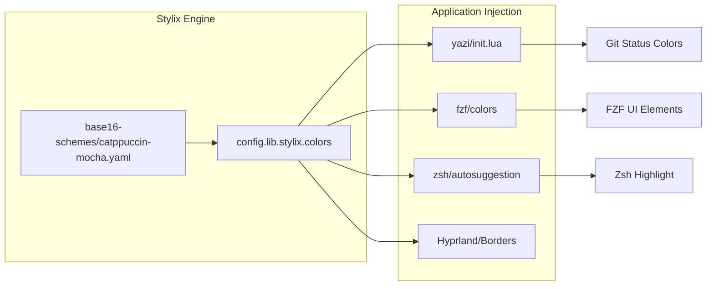
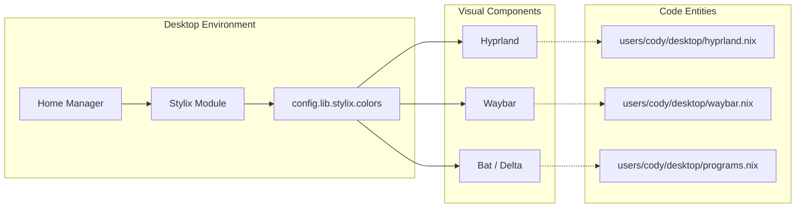

# Theming and Styling (Stylix)
Relevant source files
- [modules/server/actual-budget.nix](https://github.com/Cody-W-Tucker/nix-config/blob/5a76c557/modules/server/actual-budget.nix)
- [modules/system/fonts.nix](https://github.com/Cody-W-Tucker/nix-config/blob/5a76c557/modules/system/fonts.nix)
- [users/cody/core.nix](https://github.com/Cody-W-Tucker/nix-config/blob/5a76c557/users/cody/core.nix)
- [users/cody/desktop.nix](https://github.com/Cody-W-Tucker/nix-config/blob/5a76c557/users/cody/desktop.nix)
- [users/cody/desktop/default.nix](https://github.com/Cody-W-Tucker/nix-config/blob/5a76c557/users/cody/desktop/default.nix)
- [users/cody/desktop/editor/nixvim/plugins/99.nix](https://github.com/Cody-W-Tucker/nix-config/blob/5a76c557/users/cody/desktop/editor/nixvim/plugins/99.nix)
- [users/cody/desktop/harness/mcp.nix](https://github.com/Cody-W-Tucker/nix-config/blob/5a76c557/users/cody/desktop/harness/mcp.nix)
- [users/cody/desktop/hyprland.nix](https://github.com/Cody-W-Tucker/nix-config/blob/5a76c557/users/cody/desktop/hyprland.nix)
- [users/cody/desktop/programs.nix](https://github.com/Cody-W-Tucker/nix-config/blob/5a76c557/users/cody/desktop/programs.nix)
- [users/cody/desktop/xdg.nix](https://github.com/Cody-W-Tucker/nix-config/blob/5a76c557/users/cody/desktop/xdg.nix)
- [wallpapers/defaultWallpaper.jpg](https://github.com/Cody-W-Tucker/nix-config/blob/5a76c557/wallpapers/defaultWallpaper.jpg)

The CodyOS theming architecture is powered by **Stylix**, a declarative system-wide theming engine for NixOS. Stylix acts as a central source of truth for colors, fonts, and opacity settings, propagating these values into various application configurations including Hyprland, Waybar, Kitty, and terminal utilities.

## Core Configuration and Color Scheme

The system utilizes the **Catppuccin Mocha** base16 color scheme [users/cody/desktop/default.nix29](https://github.com/Cody-W-Tucker/nix-config/blob/5a76c557/users/cody/desktop/default.nix#L29-L29) The configuration is primarily defined within the user-level desktop module, where Stylix is enabled and global parameters are established.

### Global Stylix Settings

- **Polarity**: Set to `dark`[users/cody/desktop.nix20](https://github.com/Cody-W-Tucker/nix-config/blob/5a76c557/users/cody/desktop.nix#L20-L20)
- **Base Scheme**: Catppuccin Mocha YAML via `base16-schemes`[users/cody/desktop/default.nix29](https://github.com/Cody-W-Tucker/nix-config/blob/5a76c557/users/cody/desktop/default.nix#L29-L29)
- **Wallpaper**: A custom image located at `../../wallpapers/galaxy-waves.jpg`[users/cody/desktop.nix58](https://github.com/Cody-W-Tucker/nix-config/blob/5a76c557/users/cody/desktop.nix#L58-L58)
- **Cursor**: Bibata Modern Classic (size 24) [users/cody/desktop.nix34-38](https://github.com/Cody-W-Tucker/nix-config/blob/5a76c557/users/cody/desktop.nix#L34-L38)

### Opacity Model

Stylix manages window and UI transparency across the desktop environment:

| Target | Opacity Value |
| --- | --- |
| Applications | 0.9 |
| Terminal | 0.8 |
| Desktop | 1.0 |
| Popups | 1.0 |

*Sources: [users/cody/desktop.nix28-33](https://github.com/Cody-W-Tucker/nix-config/blob/5a76c557/users/cody/desktop.nix#L28-L33)*

## Font Architecture

CodyOS defines a tiered font system that ensures consistent typography across terminal emulators, GUI applications, and web browsers.

| Category | Font Name | Package |
| --- | --- | --- |
| **Monospace** | JetBrainsMono Nerd Font Mono | `pkgs.nerd-fonts.jetbrains-mono` |
| **Serif** | DejaVu Serif | `pkgs.dejavu_fonts` |
| **Sans Serif** | DejaVu Sans | `pkgs.dejavu_fonts` |
| **Emoji** | Noto Color Emoji | `pkgs.noto-fonts-color-emoji` |

### Font Implementation

- **System Level**: Fonts are registered globally in `modules/system/fonts.nix` to ensure availability during boot and in the display manager [modules/system/fonts.nix6-17](https://github.com/Cody-W-Tucker/nix-config/blob/5a76c557/modules/system/fonts.nix#L6-L17)
- **User Level**: Stylix overrides specific font sizes, such as setting the Kitty terminal font to size 16 [users/cody/desktop.nix24-26](https://github.com/Cody-W-Tucker/nix-config/blob/5a76c557/users/cody/desktop.nix#L24-L26)

*Sources: [users/cody/desktop.nix39-56](https://github.com/Cody-W-Tucker/nix-config/blob/5a76c557/users/cody/desktop.nix#L39-L56)[modules/system/fonts.nix1-18](https://github.com/Cody-W-Tucker/nix-config/blob/5a76c557/modules/system/fonts.nix#L1-L18)*

## Application Integration and Data Flow

Stylix values are injected into application configurations through the `config.lib.stylix.colors` attribute set. This allows for dynamic theming of tools that do not natively support Stylix or require custom logic.

### Implementation Diagram: Color Injection

The following diagram illustrates how the `base16Scheme` is processed by Stylix and distributed to specific application configurations.

Title: Stylix Color Distribution Flow

*Sources: [users/cody/desktop/programs.nix64-73](https://github.com/Cody-W-Tucker/nix-config/blob/5a76c557/users/cody/desktop/programs.nix#L64-L73)[users/cody/desktop/programs.nix114-122](https://github.com/Cody-W-Tucker/nix-config/blob/5a76c557/users/cody/desktop/programs.nix#L114-L122)[users/cody/desktop.nix15](https://github.com/Cody-W-Tucker/nix-config/blob/5a76c557/users/cody/desktop.nix#L15-L15)*

### Specific Integrations

#### 1. Yazi (File Manager)

Yazi uses Stylix colors to theme its Git integration via custom Lua initialization. Colors are mapped from the base16 palette to specific Git states:

- **Modified**: `base0A` (Yellow) [users/cody/desktop/programs.nix66](https://github.com/Cody-W-Tucker/nix-config/blob/5a76c557/users/cody/desktop/programs.nix#L66-L66)
- **Added**: `base0B` (Green) [users/cody/desktop/programs.nix67](https://github.com/Cody-W-Tucker/nix-config/blob/5a76c557/users/cody/desktop/programs.nix#L67-L67)
- **Deleted**: `base08` (Red) [users/cody/desktop/programs.nix68](https://github.com/Cody-W-Tucker/nix-config/blob/5a76c557/users/cody/desktop/programs.nix#L68-L68)
- **Untracked**: `base0C` (Cyan) [users/cody/desktop/programs.nix70](https://github.com/Cody-W-Tucker/nix-config/blob/5a76c557/users/cody/desktop/programs.nix#L70-L70)

#### 2. FZF (Fuzzy Finder)

The `fzf` module uses `lib.mkForce` to override default Stylix behavior for high-contrast UI elements:

- `fg+` (Current match) and `pointer` use `base0D`[users/cody/desktop/programs.nix116-121](https://github.com/Cody-W-Tucker/nix-config/blob/5a76c557/users/cody/desktop/programs.nix#L116-L121)
- `prompt` uses `base03`[users/cody/desktop/programs.nix120](https://github.com/Cody-W-Tucker/nix-config/blob/5a76c557/users/cody/desktop/programs.nix#L120-L120)

#### 3. Terminal and Shell

- **Kitty**: Automatically themed by Stylix, with a specific override for font size [users/cody/desktop.nix24-26](https://github.com/Cody-W-Tucker/nix-config/blob/5a76c557/users/cody/desktop.nix#L24-L26)
- **Zsh**: The `autosuggestion.highlight` is explicitly set to `base04`[users/cody/desktop.nix15](https://github.com/Cody-W-Tucker/nix-config/blob/5a76c557/users/cody/desktop.nix#L15-L15)

## UI Component Configuration

Title: Desktop UI Component Mapping

*Sources: [users/cody/desktop.nix9-13](https://github.com/Cody-W-Tucker/nix-config/blob/5a76c557/users/cody/desktop.nix#L9-L13)[users/cody/desktop/hyprland.nix1-10](https://github.com/Cody-W-Tucker/nix-config/blob/5a76c557/users/cody/desktop/hyprland.nix#L1-L10)[users/cody/desktop/programs.nix31-43](https://github.com/Cody-W-Tucker/nix-config/blob/5a76c557/users/cody/desktop/programs.nix#L31-L43)*

### Manual Overrides and Exceptions

While Stylix manages most of the environment, certain applications are excluded or handled manually:

- **NixVim**: Stylix integration is disabled (`nixvim.enable = false`) to allow the editor's internal Catppuccin theme to handle specialized syntax highlighting [users/cody/desktop.nix22](https://github.com/Cody-W-Tucker/nix-config/blob/5a76c557/users/cody/desktop.nix#L22-L22)
- **GTK**: Icons are manually set to the Adwaita theme rather than letting Stylix determine the icon pack [users/cody/desktop/default.nix34-40](https://github.com/Cody-W-Tucker/nix-config/blob/5a76c557/users/cody/desktop/default.nix#L34-L40)
- **Dconf**: Enabled to allow Stylix to manage GSettings for GNOME-adjacent applications [users/cody/desktop/default.nix32](https://github.com/Cody-W-Tucker/nix-config/blob/5a76c557/users/cody/desktop/default.nix#L32-L32)

*Sources: [users/cody/desktop.nix18-27](https://github.com/Cody-W-Tucker/nix-config/blob/5a76c557/users/cody/desktop.nix#L18-L27)[users/cody/desktop/default.nix28-40](https://github.com/Cody-W-Tucker/nix-config/blob/5a76c557/users/cody/desktop/default.nix#L28-L40)*