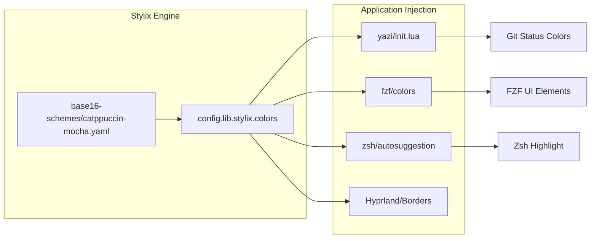
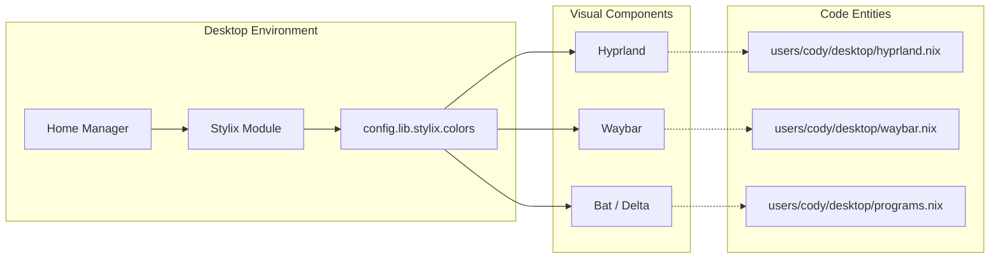

# Theming and Styling (Stylix)

The CodyOS theming architecture is powered by **Stylix**, a declarative theming layer that feeds colors, fonts, cursor settings, and related desktop styling into Home Manager applications and desktop configuration.

## Where To Look

- `users/cody/desktop.nix`: top-level Stylix enablement and shared desktop theme settings such as polarity, opacity, cursor, fonts, wallpaper, and target overrides [users/cody/desktop.nix18-59](../users/cody/desktop.nix#L18-L59)
- `users/cody/desktop/default.nix`: desktop role module imports plus the base16 scheme, GTK icon override, and `dconf` enablement [users/cody/desktop/default.nix8-40](../users/cody/desktop/default.nix#L8-L40)
- `modules/system/fonts.nix`: system-level font availability during boot and login [modules/system/fonts.nix6-17](../modules/system/fonts.nix#L6-L17)

## Configuration Split

The main thing to know is that the desktop theming surface is split across two layers:

- `users/cody/desktop.nix` is the Home Manager desktop role entrypoint and owns the shared Stylix settings.
- `users/cody/desktop/default.nix` is the imported desktop module surface where desktop-specific modules and a few theme-adjacent overrides live.

## Application Integration and Data Flow

Stylix values are injected into application configurations through the `config.lib.stylix.colors` attribute set. This allows for dynamic theming of tools that do not natively support Stylix or require custom logic.

### Implementation Diagram: Color Injection

The following diagram illustrates how the `base16Scheme` is processed by Stylix and distributed to specific application configurations.

Title: Stylix Color Distribution Flow

### Specific Integrations

#### 1. Yazi (File Manager)

Yazi uses Stylix colors to theme its Git integration via custom Lua initialization. Colors are mapped from the base16 palette to specific Git states:

- **Modified**: `base0A` (Yellow) [users/cody/desktop/programs.nix66](../users/cody/desktop/programs.nix#L66-L66)
- **Added**: `base0B` (Green) [users/cody/desktop/programs.nix67](../users/cody/desktop/programs.nix#L67-L67)
- **Deleted**: `base08` (Red) [users/cody/desktop/programs.nix68](../users/cody/desktop/programs.nix#L68-L68)
- **Untracked**: `base0C` (Cyan) [users/cody/desktop/programs.nix70](../users/cody/desktop/programs.nix#L70-L70)

#### 2. FZF (Fuzzy Finder)

The `fzf` module uses `lib.mkForce` to override default Stylix behavior for high-contrast UI elements:

- `fg+` (Current match) and `pointer` use `base0D`[users/cody/desktop/programs.nix116-121](../users/cody/desktop/programs.nix#L116-L121)
- `prompt` uses `base03`[users/cody/desktop/programs.nix120](../users/cody/desktop/programs.nix#L120-L120)

#### 3. Terminal and Shell

- **Kitty**: Automatically themed by Stylix, with a specific override in the desktop role [users/cody/desktop.nix21-27](../users/cody/desktop.nix#L21-L27)
- **Zsh**: The `autosuggestion.highlight` uses the Stylix palette directly [users/cody/desktop.nix15](../users/cody/desktop.nix#L15-L15)

## UI Component Configuration

Title: Desktop UI Component Mapping

### Manual Overrides and Exceptions

While Stylix manages most of the environment, certain applications are excluded or handled manually:

- **NixVim**: Stylix integration is disabled (`nixvim.enable = false`) to allow the editor's internal Catppuccin theme to handle specialized syntax highlighting [users/cody/desktop.nix22](../users/cody/desktop.nix#L22-L22)
- **GTK**: Icons are manually set to the Adwaita theme rather than letting Stylix determine the icon pack [users/cody/desktop/default.nix34-40](../users/cody/desktop/default.nix#L34-L40)
- **Dconf**: Enabled to allow Stylix to manage GSettings for GNOME-adjacent applications [users/cody/desktop/default.nix32](../users/cody/desktop/default.nix#L32-L32)
