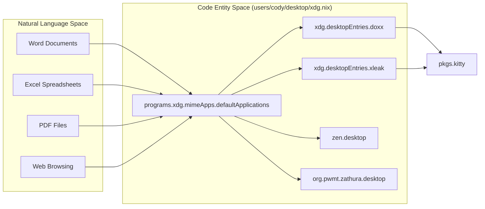
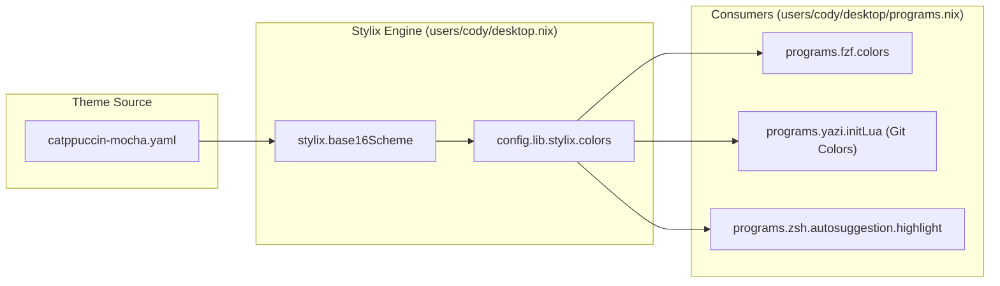

# User Programs and Shell Environment
Relevant source files
- [users/cody/core.nix](https://github.com/Cody-W-Tucker/nix-config/blob/5a76c557/users/cody/core.nix)
- [users/cody/desktop.nix](https://github.com/Cody-W-Tucker/nix-config/blob/5a76c557/users/cody/desktop.nix)
- [users/cody/desktop/default.nix](https://github.com/Cody-W-Tucker/nix-config/blob/5a76c557/users/cody/desktop/default.nix)
- [users/cody/desktop/editor/nixvim/plugins/99.nix](https://github.com/Cody-W-Tucker/nix-config/blob/5a76c557/users/cody/desktop/editor/nixvim/plugins/99.nix)
- [users/cody/desktop/harness/mcp.nix](https://github.com/Cody-W-Tucker/nix-config/blob/5a76c557/users/cody/desktop/harness/mcp.nix)
- [users/cody/desktop/hyprland.nix](https://github.com/Cody-W-Tucker/nix-config/blob/5a76c557/users/cody/desktop/hyprland.nix)
- [users/cody/desktop/packages/scripts/focus-or-run.nix](https://github.com/Cody-W-Tucker/nix-config/blob/5a76c557/users/cody/desktop/packages/scripts/focus-or-run.nix)
- [users/cody/desktop/packages/scripts/project.nix](https://github.com/Cody-W-Tucker/nix-config/blob/5a76c557/users/cody/desktop/packages/scripts/project.nix)
- [users/cody/desktop/programs.nix](https://github.com/Cody-W-Tucker/nix-config/blob/5a76c557/users/cody/desktop/programs.nix)
- [users/cody/desktop/xdg.nix](https://github.com/Cody-W-Tucker/nix-config/blob/5a76c557/users/cody/desktop/xdg.nix)

This section covers the user-level configuration for the desktop environment, focusing on the shell, terminal, file management, and browser stack. The configuration is primarily managed through Home Manager modules, integrating system-wide theming via Stylix and specialized CLI tools for development and knowledge management.

## Shell and Terminal Environment

The primary interactive environment is built on **Zsh** and the **Kitty** terminal emulator.

### Zsh Configuration

The Zsh environment is configured in `users/cody/core.nix` for base functionality and extended in `users/cody/desktop/programs.nix`. It features:

- **Vi Mode**: Enabled via `zsh-vi-mode` plugin [users/cody/desktop/programs.nix96-102](https://github.com/Cody-W-Tucker/nix-config/blob/5a76c557/users/cody/desktop/programs.nix#L96-L102)
- **Integrations**: Automated initialization of `fzf` keybindings and completions after `vi-mode` loads to prevent conflicts [users/cody/desktop/programs.nix103-112](https://github.com/Cody-W-Tucker/nix-config/blob/5a76c557/users/cody/desktop/programs.nix#L103-L112)
- **History**: Persistent history stored at `~/.local/share/zsh/zsh_history` with a 10,000 entry limit [users/cody/core.nix85-86](https://github.com/Cody-W-Tucker/nix-config/blob/5a76c557/users/cody/core.nix#L85-L86)

### Shell Aliases

The system defines several critical aliases for maintenance and navigation:

| Alias | Command | Description |
| --- | --- | --- |
| `upgrade` | `nix flake update && nixos-rebuild switch` | Updates flake inputs and rebuilds system [users/cody/core.nix95-99](https://github.com/Cody-W-Tucker/nix-config/blob/5a76c557/users/cody/core.nix#L95-L99) |
| `gcCleanup` | `nix-collect-garbage -d ...` | Deep garbage collection and boot profile sync [users/cody/core.nix100](https://github.com/Cody-W-Tucker/nix-config/blob/5a76c557/users/cody/core.nix#L100-L100) |
| `pullUpdate` | `git pull && nixos-rebuild switch` | Pulls repo changes and applies configuration [users/cody/core.nix94](https://github.com/Cody-W-Tucker/nix-config/blob/5a76c557/users/cody/core.nix#L94-L94) |
| `rr` | `yazi` | Quick access to Yazi file manager [users/cody/desktop/programs.nix93](https://github.com/Cody-W-Tucker/nix-config/blob/5a76c557/users/cody/desktop/programs.nix#L93-L93) |
| `op` | `opencode` | Entry point for AI coding assistant [users/cody/core.nix93](https://github.com/Cody-W-Tucker/nix-config/blob/5a76c557/users/cody/core.nix#L93-L93) |

### Kitty Terminal

Kitty serves as the default terminal [users/cody/desktop/default.nix25](https://github.com/Cody-W-Tucker/nix-config/blob/5a76c557/users/cody/desktop/default.nix#L25-L25) It is configured with:

- **Stylix Integration**: Terminal opacity is set to 0.8 [users/cody/desktop.nix30](https://github.com/Cody-W-Tucker/nix-config/blob/5a76c557/users/cody/desktop.nix#L30-L30)
- **Visuals**: Powerline tab bar style and cursor trails for improved tracking [users/cody/desktop/programs.nix25-28](https://github.com/Cody-W-Tucker/nix-config/blob/5a76c557/users/cody/desktop/programs.nix#L25-L28)
- **SSH Integration**: `ssh-` alias uses the Kitty kitten for enhanced terminal support over remote connections [users/cody/desktop/programs.nix92](https://github.com/Cody-W-Tucker/nix-config/blob/5a76c557/users/cody/desktop/programs.nix#L92-L92)

**Sources:**[users/cody/core.nix80-102](https://github.com/Cody-W-Tucker/nix-config/blob/5a76c557/users/cody/core.nix#L80-L102)[users/cody/desktop/programs.nix15-30](https://github.com/Cody-W-Tucker/nix-config/blob/5a76c557/users/cody/desktop/programs.nix#L15-L30)[users/cody/desktop/programs.nix90-113](https://github.com/Cody-W-Tucker/nix-config/blob/5a76c557/users/cody/desktop/programs.nix#L90-L113)[users/cody/desktop.nix24-33](https://github.com/Cody-W-Tucker/nix-config/blob/5a76c557/users/cody/desktop.nix#L24-L33)

---

## Navigation and File Management

The environment uses a combination of `yazi`, `fzf`, and `bat` to provide a fast, preview-heavy navigation experience.

### Yazi File Manager

`yazi` is the primary terminal file manager, featuring:

- **Git Integration**: Visual indicators for file status (modified, added, deleted) using Stylix-provided colors [users/cody/desktop/programs.nix64-73](https://github.com/Cody-W-Tucker/nix-config/blob/5a76c557/users/cody/desktop/programs.nix#L64-L73)
- **Shell Wrapper**: Aliased to `y` for quick directory hopping [users/cody/desktop/programs.nix48](https://github.com/Cody-W-Tucker/nix-config/blob/5a76c557/users/cody/desktop/programs.nix#L48-L48)

### FZF and Bat Integration

`fzf` is configured as a fuzzy finder with a live preview window powered by `bat`.

- **Preview**: Automatically shows the first 500 lines of a file with syntax highlighting using `bat`[users/cody/desktop/programs.nix132](https://github.com/Cody-W-Tucker/nix-config/blob/5a76c557/users/cody/desktop/programs.nix#L132-L132)
- **Stylix Colors**: FZF colors are force-mapped to the Catppuccin Mocha palette (base0D for pointers/foreground+) [users/cody/desktop/programs.nix114-122](https://github.com/Cody-W-Tucker/nix-config/blob/5a76c557/users/cody/desktop/programs.nix#L114-L122)

### CRM-CLI Virtual Filesystem

The `crm-cli` program mounts a CRM database as a virtual filesystem, allowing leads and contacts to be browsed as standard files [users/cody/desktop/programs.nix75-82](https://github.com/Cody-W-Tucker/nix-config/blob/5a76c557/users/cody/desktop/programs.nix#L75-L82)

- **Database Path**: `~/.crm/crm.db`[users/cody/desktop/programs.nix10](https://github.com/Cody-W-Tucker/nix-config/blob/5a76c557/users/cody/desktop/programs.nix#L10-L10)
- **Mount Point**: `~/Knowledge/CRM`[users/cody/desktop/programs.nix80](https://github.com/Cody-W-Tucker/nix-config/blob/5a76c557/users/cody/desktop/programs.nix#L80-L80)

**Sources:**[users/cody/desktop/programs.nix44-74](https://github.com/Cody-W-Tucker/nix-config/blob/5a76c557/users/cody/desktop/programs.nix#L44-L74)[users/cody/desktop/programs.nix114-135](https://github.com/Cody-W-Tucker/nix-config/blob/5a76c557/users/cody/desktop/programs.nix#L114-L135)[users/cody/desktop/programs.nix75-82](https://github.com/Cody-W-Tucker/nix-config/blob/5a76c557/users/cody/desktop/programs.nix#L75-L82)

---

## Browser Stack: Zen and Chromium

The system defaults to the **Zen Browser** (a Firefox fork) for primary web tasks, with Chromium as a secondary for specific media needs.

### Zen Browser (Firefox)

Zen is configured via the Home Manager `programs.firefox` module [users/cody/desktop/programs.nix145-150](https://github.com/Cody-W-Tucker/nix-config/blob/5a76c557/users/cody/desktop/programs.nix#L145-L150)

- **Hardware Acceleration**: Extensive VA-API and WebRender settings are applied to ensure GPU-accelerated video decoding [users/cody/desktop/programs.nix153-166](https://github.com/Cody-W-Tucker/nix-config/blob/5a76c557/users/cody/desktop/programs.nix#L153-L166)
- **Wayland**: Forced via `MOZ_ENABLE_WAYLAND = "1"` session variable [users/cody/desktop.nix75](https://github.com/Cody-W-Tucker/nix-config/blob/5a76c557/users/cody/desktop.nix#L75-L75)

### Chromium

Chromium is included primarily for Chromecast support, with the `load-media-router-component-extension` flag enabled [users/cody/desktop/programs.nix136-140](https://github.com/Cody-W-Tucker/nix-config/blob/5a76c557/users/cody/desktop/programs.nix#L136-L140)

**Sources:**[users/cody/desktop/programs.nix145-168](https://github.com/Cody-W-Tucker/nix-config/blob/5a76c557/users/cody/desktop/programs.nix#L145-L168)[users/cody/desktop.nix74-75](https://github.com/Cody-W-Tucker/nix-config/blob/5a76c557/users/cody/desktop.nix#L74-L75)

---

## XDG Routing and MIME Handling

XDG user directories and MIME associations ensure that files are opened with the correct terminal-based or GUI utilities.

### Custom User Directories

The configuration defines non-standard XDG directories for the knowledge base and projects [users/cody/desktop/xdg.nix9-14](https://github.com/Cody-W-Tucker/nix-config/blob/5a76c557/users/cody/desktop/xdg.nix#L9-L14):

- `PROJECTS`: `~/Projects`
- `KNOWLEDGE`: `~/Knowledge`
- `KNOWLEDGE_PERSONAL`: `~/Knowledge/Personal`

### MIME Associations

Terminal-based viewers are prioritized for office documents and code.

| MIME Type | Application | Command |
| --- | --- | --- |
| `text/*`, `application/json` | Neovim | `nvim.desktop`[users/cody/desktop/xdg.nix80-82](https://github.com/Cody-W-Tucker/nix-config/blob/5a76c557/users/cody/desktop/xdg.nix#L80-L82) |
| `application/pdf` | Zathura | `org.pwmt.zathura.desktop`[users/cody/desktop/xdg.nix62](https://github.com/Cody-W-Tucker/nix-config/blob/5a76c557/users/cody/desktop/xdg.nix#L62-L62) |
| `application/msword` | Doxx | `kitty -e doxx %f`[users/cody/desktop/xdg.nix20](https://github.com/Cody-W-Tucker/nix-config/blob/5a76c557/users/cody/desktop/xdg.nix#L20-L20) |
| `application/vnd.ms-excel` | Xleak | `kitty -e xleak -i --wrap -H %f`[users/cody/desktop/xdg.nix32](https://github.com/Cody-W-Tucker/nix-config/blob/5a76c557/users/cody/desktop/xdg.nix#L32-L32) |

### Code-to-System Mapping: MIME and Utilities

This diagram maps the logical MIME handling to the specific Nix code entities that define them.

Title: MIME Handling Architecture

**Sources:**[users/cody/desktop/xdg.nix17-41](https://github.com/Cody-W-Tucker/nix-config/blob/5a76c557/users/cody/desktop/xdg.nix#L17-L41)[users/cody/desktop/xdg.nix49-90](https://github.com/Cody-W-Tucker/nix-config/blob/5a76c557/users/cody/desktop/xdg.nix#L49-L90)

---

## Utilities and Custom Scripts

The environment includes several custom shell applications to bridge the gap between the window manager and CLI.

### Key Utilities

- **screenshot-ocr**: Uses `grim`, `slurp`, and `tesseract4` to capture a screen region and copy the recognized text to the Wayland clipboard [users/cody/desktop/default.nix48-56](https://github.com/Cody-W-Tucker/nix-config/blob/5a76c557/users/cody/desktop/default.nix#L48-L56)
- **focus-or-run**: A Hyprland utility that checks if a window class exists; if so, it focuses it; otherwise, it launches the application [users/cody/desktop/packages/scripts/focus-or-run.nix12-66](https://github.com/Cody-W-Tucker/nix-config/blob/5a76c557/users/cody/desktop/packages/scripts/focus-or-run.nix#L12-L66)
- **project**: A wrapper for `nix flake init/new` using a custom template base at FlakeHub [users/cody/desktop/packages/scripts/project.nix3-66](https://github.com/Cody-W-Tucker/nix-config/blob/5a76c557/users/cody/desktop/packages/scripts/project.nix#L3-L66)

### Theming Data Flow

Stylix acts as the central provider for styling variables across different applications.

Title: Stylix Theming Data Flow

**Sources:**[users/cody/desktop.nix29-59](https://github.com/Cody-W-Tucker/nix-config/blob/5a76c557/users/cody/desktop.nix#L29-L59)[users/cody/desktop/programs.nix64-70](https://github.com/Cody-W-Tucker/nix-config/blob/5a76c557/users/cody/desktop/programs.nix#L64-L70)[users/cody/desktop/programs.nix114-122](https://github.com/Cody-W-Tucker/nix-config/blob/5a76c557/users/cody/desktop/programs.nix#L114-L122)[users/cody/desktop.nix15](https://github.com/Cody-W-Tucker/nix-config/blob/5a76c557/users/cody/desktop.nix#L15-L15)