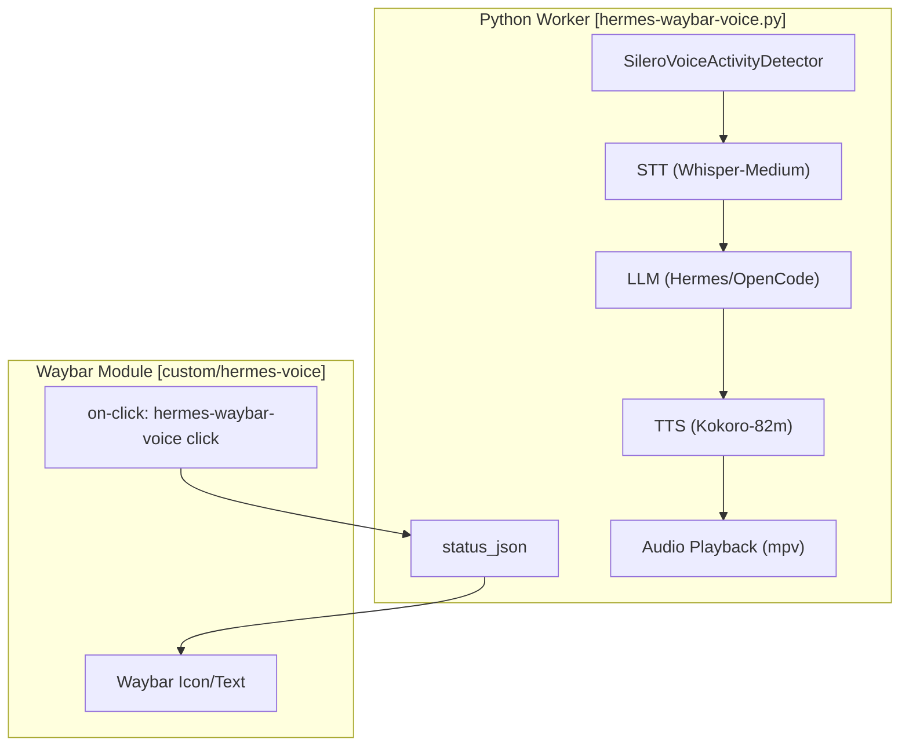
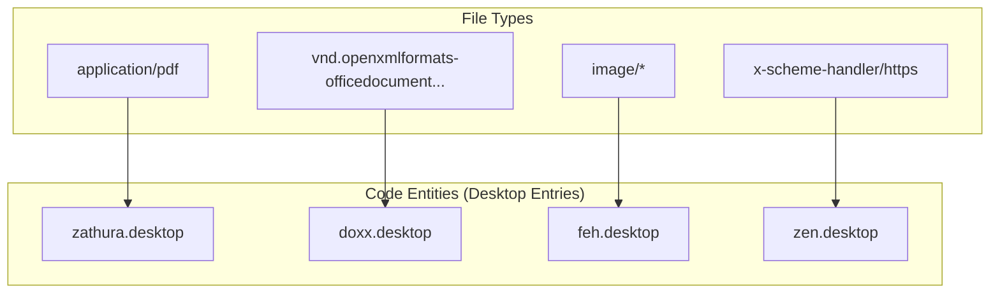

# Waybar and Desktop Utilities
Relevant source files
- [users/cody/desktop/default.nix](https://github.com/Cody-W-Tucker/nix-config/blob/5a76c557/users/cody/desktop/default.nix)
- [users/cody/desktop/editor/nixvim/plugins/99.nix](https://github.com/Cody-W-Tucker/nix-config/blob/5a76c557/users/cody/desktop/editor/nixvim/plugins/99.nix)
- [users/cody/desktop/harness/mcp.nix](https://github.com/Cody-W-Tucker/nix-config/blob/5a76c557/users/cody/desktop/harness/mcp.nix)
- [users/cody/desktop/hermes-waybar-voice.py](https://github.com/Cody-W-Tucker/nix-config/blob/5a76c557/users/cody/desktop/hermes-waybar-voice.py)
- [users/cody/desktop/hyprland.nix](https://github.com/Cody-W-Tucker/nix-config/blob/5a76c557/users/cody/desktop/hyprland.nix)
- [users/cody/desktop/hyprland/autostart.nix](https://github.com/Cody-W-Tucker/nix-config/blob/5a76c557/users/cody/desktop/hyprland/autostart.nix)
- [users/cody/desktop/notifications.nix](https://github.com/Cody-W-Tucker/nix-config/blob/5a76c557/users/cody/desktop/notifications.nix)
- [users/cody/desktop/packages/scripts/rofi-launcher.nix](https://github.com/Cody-W-Tucker/nix-config/blob/5a76c557/users/cody/desktop/packages/scripts/rofi-launcher.nix)
- [users/cody/desktop/packages/scripts/rofi-web-launcher.nix](https://github.com/Cody-W-Tucker/nix-config/blob/5a76c557/users/cody/desktop/packages/scripts/rofi-web-launcher.nix)
- [users/cody/desktop/waybar.nix](https://github.com/Cody-W-Tucker/nix-config/blob/5a76c557/users/cody/desktop/waybar.nix)
- [users/cody/desktop/xdg.nix](https://github.com/Cody-W-Tucker/nix-config/blob/5a76c557/users/cody/desktop/xdg.nix)

This section details the user-level desktop environment utilities and status bar configuration for CodyOS. The stack is built on **Waybar**, **SwayNC**, **Rofi**, and a custom voice-activated LLM interface named **Hermes**.

## Waybar Configuration

Waybar serves as the primary status bar, integrated via Home Manager [users/cody/desktop/waybar.nix52-53](https://github.com/Cody-W-Tucker/nix-config/blob/5a76c557/users/cody/desktop/waybar.nix#L52-L53) It is managed as a systemd service targeting `graphical-session.target`[users/cody/desktop/waybar.nix54-57](https://github.com/Cody-W-Tucker/nix-config/blob/5a76c557/users/cody/desktop/waybar.nix#L54-L57)

### Module Layout

The bar is positioned at the top of the screen [users/cody/desktop/waybar.nix60](https://github.com/Cody-W-Tucker/nix-config/blob/5a76c557/users/cody/desktop/waybar.nix#L60-L60) and organized into three primary sections:

- **Left**: Workspaces and Agenda [users/cody/desktop/waybar.nix63-66](https://github.com/Cody-W-Tucker/nix-config/blob/5a76c557/users/cody/desktop/waybar.nix#L63-L66)
- **Center**: Notifications, Clock, and Weather [users/cody/desktop/waybar.nix67-71](https://github.com/Cody-W-Tucker/nix-config/blob/5a76c557/users/cody/desktop/waybar.nix#L67-L71)
- **Right**: Privacy indicators, Hermes Voice assistant, MPRIS media controls, Audio, and Hardware stats [users/cody/desktop/waybar.nix72-78](https://github.com/Cody-W-Tucker/nix-config/blob/5a76c557/users/cody/desktop/waybar.nix#L72-L78)

### Custom Modules

| Module | Implementation | Functionality |
| --- | --- | --- |
| `custom/agenda` | `nextmeeting`[users/cody/desktop/waybar.nix162-183](https://github.com/Cody-W-Tucker/nix-config/blob/5a76c557/users/cody/desktop/waybar.nix#L162-L183) | Fetches Google Calendar events via `gcalcli`; opens meeting URLs on click. |
| `custom/weather` | `wttrbar`[users/cody/desktop/waybar.nix203-209](https://github.com/Cody-W-Tucker/nix-config/blob/5a76c557/users/cody/desktop/waybar.nix#L203-L209) | Displays local weather for Kearney, Nebraska. |
| `custom/hermes-voice` | `hermes-waybar-voice`[users/cody/desktop/waybar.nix147-157](https://github.com/Cody-W-Tucker/nix-config/blob/5a76c557/users/cody/desktop/waybar.nix#L147-L157) | Interface for the voice-activated LLM worker. |
| `hyprland/workspaces` | `favorite_apps`[users/cody/desktop/waybar.nix79-85](https://github.com/Cody-W-Tucker/nix-config/blob/5a76c557/users/cody/desktop/waybar.nix#L79-L85) | Dynamic workspace icons based on active window class (e.g.,  for Spotify). |

**Sources:**[users/cody/desktop/waybar.nix1-210](https://github.com/Cody-W-Tucker/nix-config/blob/5a76c557/users/cody/desktop/waybar.nix#L1-L210)

---

## Hermes Voice Assistant

`hermes-voice` is a custom voice-activated LLM interface implemented as a Python worker script [users/cody/desktop/hermes-waybar-voice.py1](https://github.com/Cody-W-Tucker/nix-config/blob/5a76c557/users/cody/desktop/hermes-waybar-voice.py#L1-L1) It orchestrates a pipeline involving Voice Activity Detection (VAD), Speech-to-Text (STT), LLM inference, and Text-to-Speech (TTS).

### Voice Pipeline Architecture

The worker utilizes `pysilero-vad` for local silence detection [users/cody/desktop/hermes-waybar-voice.py19-37](https://github.com/Cody-W-Tucker/nix-config/blob/5a76c557/users/cody/desktop/hermes-waybar-voice.py#L19-L37)

### Data Flow: Voice-to-Action

The following diagram illustrates the interaction between the Waybar module and the Python worker process.

**Hermes Voice Control Flow**

**Sources:**[users/cody/desktop/hermes-waybar-voice.py1-60](https://github.com/Cody-W-Tucker/nix-config/blob/5a76c557/users/cody/desktop/hermes-waybar-voice.py#L1-L60)[users/cody/desktop/waybar.nix11-28](https://github.com/Cody-W-Tucker/nix-config/blob/5a76c557/users/cody/desktop/waybar.nix#L11-L28)

### State Management

The worker maintains state in `$XDG_RUNTIME_DIR/hermes-waybar-voice/`[users/cody/desktop/hermes-waybar-voice.py54](https://github.com/Cody-W-Tucker/nix-config/blob/5a76c557/users/cody/desktop/hermes-waybar-voice.py#L54-L54)

- `status.json`: Current state (`listening`, `recording`, `speaking`, `idle`) [users/cody/desktop/hermes-waybar-voice.py85-89](https://github.com/Cody-W-Tucker/nix-config/blob/5a76c557/users/cody/desktop/hermes-waybar-voice.py#L85-L89)
- `session.json`: History of the current conversation [users/cody/desktop/hermes-waybar-voice.py57](https://github.com/Cody-W-Tucker/nix-config/blob/5a76c557/users/cody/desktop/hermes-waybar-voice.py#L57-L57)
- `worker.pid`: Used to ensure only one instance runs and to handle signals [users/cody/desktop/hermes-waybar-voice.py55](https://github.com/Cody-W-Tucker/nix-config/blob/5a76c557/users/cody/desktop/hermes-waybar-voice.py#L55-L55)

**Sources:**[users/cody/desktop/hermes-waybar-voice.py54-94](https://github.com/Cody-W-Tucker/nix-config/blob/5a76c557/users/cody/desktop/hermes-waybar-voice.py#L54-L94)

---

## Desktop Utilities

CodyOS includes several integrated utilities for productivity and system interaction.

### Rofi Launchers

Two specialized Rofi launchers are provided:

1. **Application Launcher**: Uses `rofi-launcher` to focus or run applications via `uwsm-app`[users/cody/desktop/packages/scripts/rofi-launcher.nix18](https://github.com/Cody-W-Tucker/nix-config/blob/5a76c557/users/cody/desktop/packages/scripts/rofi-launcher.nix#L18-L18)
2. **Web Search**: `web-search` provides a quick interface for Nix Options and GitHub code search [users/cody/desktop/packages/scripts/rofi-web-launcher.nix20-30](https://github.com/Cody-W-Tucker/nix-config/blob/5a76c557/users/cody/desktop/packages/scripts/rofi-web-launcher.nix#L20-L30)

### Clipboard and OCR

- **Cliphist**: Clipboard history management with image support, limited to 50 items [users/cody/desktop/default.nix85-96](https://github.com/Cody-W-Tucker/nix-config/blob/5a76c557/users/cody/desktop/default.nix#L85-L96)
- **Screenshot OCR**: A custom script `screenshot-ocr` that combines `grim`, `slurp`, and `tesseract` to extract text from a screen selection directly into the Wayland clipboard [users/cody/desktop/default.nix48-56](https://github.com/Cody-W-Tucker/nix-config/blob/5a76c557/users/cody/desktop/default.nix#L48-L56)

### Notifications (SwayNC)

SwayNC handles system notifications with specific rules:

- **Voice Input Suppression**: Notifications with the summary "Voice Input" are ignored to prevent feedback loops during STT [users/cody/desktop/notifications.nix77-81](https://github.com/Cody-W-Tucker/nix-config/blob/5a76c557/users/cody/desktop/notifications.nix#L77-L81)
- **KDE Connect**: SMS notifications are pinned for 60 seconds [users/cody/desktop/notifications.nix82-87](https://github.com/Cody-W-Tucker/nix-config/blob/5a76c557/users/cody/desktop/notifications.nix#L82-L87)

**Sources:**[users/cody/desktop/default.nix42-97](https://github.com/Cody-W-Tucker/nix-config/blob/5a76c557/users/cody/desktop/default.nix#L42-L97)[users/cody/desktop/notifications.nix1-101](https://github.com/Cody-W-Tucker/nix-config/blob/5a76c557/users/cody/desktop/notifications.nix#L1-L101)

---

## XDG and Mime Routing

The system strictly defines how file types are handled through `xdg.mimeApps`[users/cody/desktop/xdg.nix49-90](https://github.com/Cody-W-Tucker/nix-config/blob/5a76c557/users/cody/desktop/xdg.nix#L49-L90)

**Mime Association Mapping**

**Sources:**[users/cody/desktop/xdg.nix51-89](https://github.com/Cody-W-Tucker/nix-config/blob/5a76c557/users/cody/desktop/xdg.nix#L51-L89)

Specialized terminal-based viewers are configured for office documents:

- **doxx**: Word document viewer running in `kitty`[users/cody/desktop/xdg.nix17-20](https://github.com/Cody-W-Tucker/nix-config/blob/5a76c557/users/cody/desktop/xdg.nix#L17-L20)
- **xleak**: Excel spreadsheet viewer running in `kitty` with a Dracula theme [users/cody/desktop/xdg.nix29-48](https://github.com/Cody-W-Tucker/nix-config/blob/5a76c557/users/cody/desktop/xdg.nix#L29-L48)

**Sources:**[users/cody/desktop/xdg.nix17-48](https://github.com/Cody-W-Tucker/nix-config/blob/5a76c557/users/cody/desktop/xdg.nix#L17-L48)