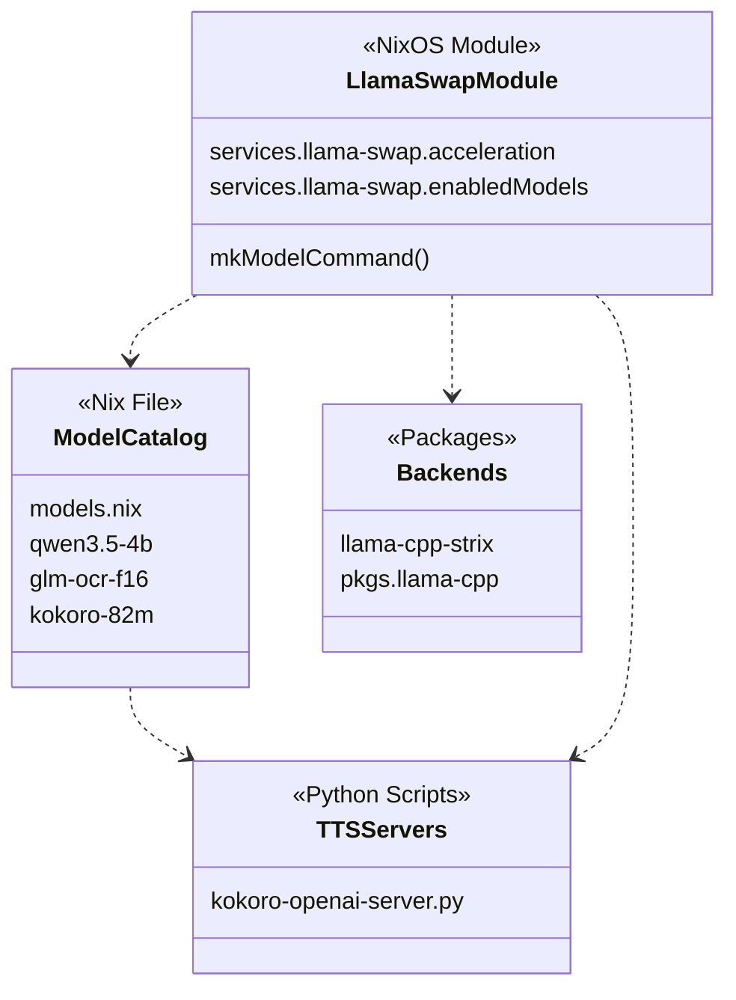

# llama-swap: LLM Orchestration Service

The `llama-swap` service is a specialized NixOS module designed to manage local LLM (Large Language Model) inference with dynamic resource allocation. It acts as an orchestration layer that allows multiple models to share a single GPU or CPU pool by swapping them in and out of memory based on demand and a Time-To-Live (TTL) mechanism.

## Service Architecture and Implementation

`llama-swap` provides a unified OpenAI-compatible API endpoint that abstracts away the complexities of model loading, backend selection (CUDA vs ROCm), and specific model types (Chat, Embedding, Vision, TTS).

### Core Components and Logic

The service is defined in `modules/services/llama-swap/default.nix`. It uses a submodule system to define a structured model catalog where each model can specify its own hardware requirements and runtime parameters [modules/services/llama-swap/default.nix11-88](../modules/services/llama-swap/default.nix#L11-L88)

Key features include:

- **TTL-based Swapping**: Models are kept alive for a specified duration after their last request. This is configured via the `ttl` option [modules/services/llama-swap/default.nix33-37](../modules/services/llama-swap/default.nix#L33-L37)
- **Hardware Acceleration**: The service supports `cpu`, `cuda`, and `rocm` backends. It automatically selects the appropriate `llama-cpp` package and sets necessary environment variables (e.g., `HSA_OVERRIDE_GFX_VERSION` for ROCm) based on the `acceleration` setting [modules/services/llama-swap/default.nix94-110](../modules/services/llama-swap/default.nix#L94-L110)
- **Command Generation**: The `mkModelCommand` function dynamically builds the `llama-server` CLI string, incorporating parameters like context size, batch size, and GPU layers [modules/services/llama-swap/default.nix128-162](../modules/services/llama-swap/default.nix#L128-L162)

## Model Catalog and Types

The model catalog is centralized in `modules/services/llama-swap/models.nix`. This file defines the hardware "footprint" for each model, ensuring they fit within the host's VRAM constraints [modules/services/llama-swap/models.nix1-5](../modules/services/llama-swap/models.nix#L1-L5)

### Supported Model Categories

| Type           | Example Model          | Key Configuration                | Purpose                                |
| -------------- | ---------------------- | -------------------------------- | -------------------------------------- |
| **Chat**       | `qwen3.5-4b`           | `gpuLayers = 999`                | General reasoning and conversation.    |
| **Embedding**  | `qwen3-embedding-0.6b` | `--embeddings`, `--pooling last` | Vector generation for RAG (Qdrant).    |
| **Vision/OCR** | `glm-ocr-f16`          | `mmprojFile`                     | Extracting text from images/documents. |
| **TTS**        | `kokoro-82m`           | `ttl = 0`                        | Text-to-Speech generation.             |

Sources: [modules/services/llama-swap/models.nix15-66](../modules/services/llama-swap/models.nix#L15-L66)

### Multimodal and Projector Support

For models with vision capabilities, such as `glm-ocr-f16`, the catalog must specify an `mmprojFile`[modules/services/llama-swap/models.nix58](../modules/services/llama-swap/models.nix#L58-L58) This projector file is passed to `llama-server` via the `--mmproj` flag [modules/services/llama-swap/default.nix157-160](../modules/services/llama-swap/default.nix#L157-L160)

## Hardware Acceleration Backends

`llama-swap` abstracts the underlying hardware through the `acceleration` option.

- **CUDA**: Used on the `beast` host (NVIDIA 3070). It overrides `llama-cpp` with `cudaSupport = true`[modules/services/llama-swap/default.nix97-98](../modules/services/llama-swap/default.nix#L97-L98)

## Specialized TTS Wrappers

Some models do not run directly in `llama-server` but instead use Python-based OpenAI-compatible wrappers. These are defined in the catalog by omitting the `file` attribute and providing a custom `upstream.cmd`[modules/services/llama-swap/default.nix166-168](../modules/services/llama-swap/default.nix#L166-L168)

### Kokoro TTS Server

The `kokoro-openai-server.py` script provides an OpenAI-compatible `/v1/audio/speech` endpoint for the Kokoro model. It includes:

- **Voice Mapping**: Maps standard OpenAI voice names (e.g., `alloy`, `echo`) to Kokoro-specific voices [modules/services/llama-swap/kokoro-openai-server.py17-26](../modules/services/llama-swap/kokoro-openai-server.py#L17-L26)
- **Offline Support**: Patches `huggingface_hub` to serve model weights and voices from local Nix store paths rather than downloading them at runtime [modules/services/llama-swap/kokoro-openai-server.py38-62](../modules/services/llama-swap/kokoro-openai-server.py#L38-L62)

## Integration and Usage

Services within the NixOS configuration consume `llama-swap` by pointing their API base URLs to the service port (typically `8081`).

**Example: Karakeep Integration**
The Karakeep bookmark service is configured to use `llama-swap` for summarization, embedding, and OCR:

- **Base URL**: `http://beast:8081/v1`[modules/server/karakeep.nix11](../modules/server/karakeep.nix#L11-L11)
- **Chat Model**: `qwen3.5-4b`[modules/server/karakeep.nix12](../modules/server/karakeep.nix#L12-L12)
- **OCR Model**: `glm-ocr-f16`[modules/server/karakeep.nix16](../modules/server/karakeep.nix#L16-L16)
- **Embedding Model**: `qwen3-embedding-0.6b`[modules/server/karakeep.nix17](../modules/server/karakeep.nix#L17-L17)

### Code Entity Mapping

The following diagram bridges the high-level service concepts to the specific Nix and Python entities that implement them.

**Diagram: llama-swap Code Entity Map**

